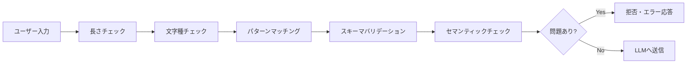

## 概要

安全なAIアプリケーションの実装には、ユーザー入力の厳密なバリデーションとLLM出力の適切なサニタイズが不可欠です。このレッスンでは、実務で使える具体的な実装パターンを学びます。

## 本文

### 入力バリデーションの設計



### 入力バリデーションの実装

```python
from pydantic import BaseModel, validator, Field
from typing import Literal
import re

class UserMessage(BaseModel):
    """構造化されたユーザーメッセージのバリデーション"""

    content: str = Field(..., min_length=1, max_length=4000)
    language: Literal["ja", "en"] = "ja"
    session_id: str = Field(..., min_length=8, max_length=64)

    @validator("content")
    def validate_content(cls, v: str) -> str:
        # 制御文字の除去（改行・タブは除く）
        cleaned = re.sub(r'[\x00-\x08\x0B\x0C\x0E-\x1F\x7F]', '', v)

        # Null バイトの除去
        cleaned = cleaned.replace('\x00', '')

        # 過度な繰り返しパターンの検出（DoS対策）
        if re.search(r'(.{10,})\1{5,}', cleaned):
            raise ValueError("繰り返しパターンが検出されました")

        return cleaned

    @validator("session_id")
    def validate_session_id(cls, v: str) -> str:
        # セッションIDは英数字・ハイフン・アンダースコアのみ
        if not re.match(r'^[a-zA-Z0-9_-]+$', v):
            raise ValueError("無効なセッションIDです")
        return v


class InputValidator:
    """AIアプリケーション向け入力バリデーター"""

    def __init__(self):
        self.max_tokens_estimate = 8000  # 最大トークン数の概算
        self.chars_per_token = 4  # 日本語は約4文字/トークン
        self.max_chars = self.max_tokens_estimate * self.chars_per_token

    def validate_length(self, text: str) -> tuple[bool, str]:
        """文字数・推定トークン数のチェック"""
        char_count = len(text)
        estimated_tokens = char_count // self.chars_per_token

        if char_count > self.max_chars:
            return False, f"入力が長すぎます（{char_count}文字、最大{self.max_chars}文字）"
        if estimated_tokens > self.max_tokens_estimate:
            return False, f"推定トークン数が多すぎます（{estimated_tokens}）"

        return True, "OK"

    def validate_content_type(
        self,
        text: str,
        allowed_types: list[str] = ["text"]
    ) -> tuple[bool, str]:
        """コンテンツタイプのチェック"""
        # データURIの検出（画像埋め込み等）
        if re.search(r'data:[a-zA-Z]+/[a-zA-Z]+;base64,', text):
            if "base64" not in allowed_types:
                return False, "Base64エンコードデータは許可されていません"

        # スクリプトタグの検出
        if re.search(r'<script[^>]*>', text, re.IGNORECASE):
            return False, "スクリプトタグは許可されていません"

        return True, "OK"

    def full_validate(self, text: str) -> dict:
        """フルバリデーションの実行"""
        results = {}

        checks = [
            ("length", self.validate_length),
            ("content_type", self.validate_content_type),
        ]

        all_passed = True
        for check_name, check_fn in checks:
            passed, message = check_fn(text)
            results[check_name] = {"passed": passed, "message": message}
            if not passed:
                all_passed = False

        results["overall_passed"] = all_passed
        return results
```

### 出力サニタイズの実装

```python
import html
import json
import re
from typing import Any

class OutputSanitizer:
    """LLM出力のサニタイズクラス"""

    def sanitize_for_html(self, text: str) -> str:
        """HTML挿入を防ぐサニタイズ"""
        # HTMLエスケープ
        sanitized = html.escape(text)

        # Markdownのリンクに潜む危険なURLの除去
        sanitized = re.sub(
            r'\[([^\]]+)\]\(javascript:[^\)]*\)',
            r'\1',
            sanitized
        )

        return sanitized

    def sanitize_json_output(self, raw_output: str, schema: dict) -> dict | None:
        """LLMのJSON出力をバリデーション"""
        # コードブロックの除去
        cleaned = re.sub(r'```json?\s*', '', raw_output)
        cleaned = re.sub(r'```\s*', '', cleaned)
        cleaned = cleaned.strip()

        try:
            parsed = json.loads(cleaned)
        except json.JSONDecodeError:
            # JSON修復を試みる（簡易版）
            # 末尾のカンマを除去
            cleaned = re.sub(r',\s*}', '}', cleaned)
            cleaned = re.sub(r',\s*]', ']', cleaned)
            try:
                parsed = json.loads(cleaned)
            except:
                return None

        # スキーマバリデーション（簡易版）
        for required_key in schema.get("required", []):
            if required_key not in parsed:
                return None

        return parsed

    def sanitize_code_output(self, code: str, language: str = "python") -> str:
        """コード出力から危険なコードを検出・警告"""
        dangerous_patterns = {
            "python": [
                r'import\s+os\s*;\s*os\.system',
                r'subprocess\.(?:call|run|Popen)',
                r'eval\s*\(',
                r'exec\s*\(',
                r'__import__\s*\(',
                r'open\s*\(.*[\'"]w[\'"]',  # ファイル書き込み
            ],
            "javascript": [
                r'eval\s*\(',
                r'document\.write\s*\(',
                r'innerHTML\s*=',
                r'fetch\s*\(\s*[\'"]http',
            ]
        }

        warnings = []
        for pattern in dangerous_patterns.get(language, []):
            if re.search(pattern, code):
                warnings.append(f"潜在的に危険なパターンを検出: {pattern}")

        if warnings:
            warning_header = "# ⚠️ セキュリティ警告:\n" + "\n".join(f"# {w}" for w in warnings) + "\n\n"
            return warning_header + code

        return code


# 使用例
sanitizer = OutputSanitizer()

# HTML出力のサニタイズ
html_output = '<script>alert("XSS")</script>こんにちは'
safe_html = sanitizer.sanitize_for_html(html_output)
print(f"HTML サニタイズ: {safe_html}")

# JSON出力のバリデーション
json_output = '```json\n{"name": "テスト", "value": 42}\n```'
schema = {"required": ["name", "value"]}
parsed = sanitizer.sanitize_json_output(json_output, schema)
print(f"JSON パース結果: {parsed}")
```

## ハンズオン

エンドツーエンドの安全なAI呼び出しラッパーを実装してみましょう。

### ステップ1：安全なAIクライアントラッパー

```python
import anthropic
from dataclasses import dataclass

@dataclass
class SafeAIResponse:
    success: bool
    content: str | None
    error: str | None
    sanitized: bool

class SafeAIClient:
    """バリデーション・サニタイズ組み込みのAIクライアント"""

    def __init__(self):
        self.client = anthropic.Anthropic()
        self.validator = InputValidator()
        self.sanitizer = OutputSanitizer()

    def chat(
        self,
        user_input: str,
        system_prompt: str = "",
        output_format: str = "text"  # text / html / json / code
    ) -> SafeAIResponse:
        """バリデーション・サニタイズ付きのAI呼び出し"""

        # Step 1: 入力バリデーション
        validation_result = self.validator.full_validate(user_input)
        if not validation_result["overall_passed"]:
            failed = {k: v for k, v in validation_result.items()
                     if k != "overall_passed" and not v.get("passed", True)}
            error_msg = "; ".join(v["message"] for v in failed.values())
            return SafeAIResponse(
                success=False,
                content=None,
                error=f"入力バリデーション失敗: {error_msg}",
                sanitized=False
            )

        # Step 2: LLM呼び出し
        try:
            messages = [{"role": "user", "content": user_input}]
            kwargs = {
                "model": "claude-opus-4-5",
                "max_tokens": 1024,
                "messages": messages
            }
            if system_prompt:
                kwargs["system"] = system_prompt

            response = self.client.messages.create(**kwargs)
            raw_output = response.content[0].text

        except Exception as e:
            return SafeAIResponse(
                success=False,
                content=None,
                error=f"API呼び出しエラー: {str(e)}",
                sanitized=False
            )

        # Step 3: 出力サニタイズ
        sanitized_output = raw_output
        if output_format == "html":
            sanitized_output = self.sanitizer.sanitize_for_html(raw_output)
        elif output_format == "code":
            sanitized_output = self.sanitizer.sanitize_code_output(raw_output)

        return SafeAIResponse(
            success=True,
            content=sanitized_output,
            error=None,
            sanitized=output_format != "text"
        )


# 使用例
client = SafeAIClient()

result = client.chat(
    user_input="Pythonでファイルを読み込む方法を教えてください",
    output_format="code"
)

if result.success:
    print("レスポンス（サニタイズ済み）:")
    print(result.content)
else:
    print(f"エラー: {result.error}")
```

## クイズ

<!-- QUIZ:START -->
**Q1. LLMの出力をWebページに表示する場合、最優先で行うべき処理はどれですか？**

- A) 出力を短くトリミングする
- B) HTMLエスケープ処理（`<` → `&lt;` など）を行う
- C) 出力を大文字に変換する
- D) 出力をBase64エンコードする

**正解: B**
**解説:** LLMの出力をHTMLに直接埋め込むとXSS（クロスサイトスクリプティング）攻撃のリスクがあります。`<script>`タグなどが含まれる可能性があるため、HTMLエスケープは必須です。

**Q2. Pydanticを使った入力バリデーションの主な利点はどれですか？**

- A) LLMの回答速度が向上する
- B) 型安全なバリデーションとエラーメッセージの自動生成
- C) APIコストが削減される
- D) System Promptが不要になる

**正解: B**
**解説:** PydanticはPythonの型アノテーションを使ったデータバリデーションライブラリです。`validator`デコレータでカスタムバリデーションを定義でき、型安全な入力検証とわかりやすいエラーメッセージを自動生成できます。

**Q3. LLMがJSON形式で出力を返すよう指示した場合でも、そのまま`json.loads()`を呼ぶことが危険な理由はどれですか？**

- A) JSONのパースが遅いため
- B) LLMはコードブロックや余分なテキストを含む場合があり、パースに失敗する可能性がある
- C) JSONは暗号化されていないため
- D) LLMはJSONを返さないため

**正解: B**
**解説:** LLMは```json...```のコードブロックや解説文を含む場合があり、そのままjson.loads()に渡すとエラーになります。事前にコードブロックの除去・余分なテキストのトリミングなど前処理が必要です。
<!-- QUIZ:END -->

## まとめ

- 入力バリデーションは長さ・文字種・パターン・セマンティックの多段階で実施する
- Pydanticを使うと型安全なバリデーションを宣言的に記述できる
- LLMの出力はHTML挿入・危険なコード・不正なJSON形式などのリスクがある
- 入力と出力の両方でバリデーション・サニタイズを行う安全なラッパーを設計する

## 次のレッスン

次のレッスンでは、組織としてAIシステムの脆弱性を発見する「レッドチーム」の進め方を学びます。
