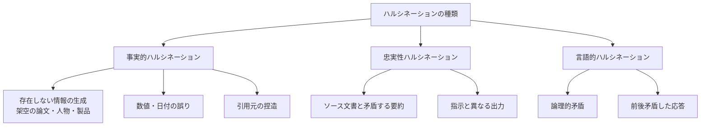

## 概要

ハルシネーション（幻覚）は、LLMが事実と異なる情報を自信をもって生成する現象です。医療・法律・金融など高精度が求められる場面では深刻なリスクとなります。このレッスンでは、ハルシネーションの種類・検出手法・軽減策を学びます。

## 本文

### ハルシネーションの種類



### ハルシネーションが発生する原因

- **分布外の質問**: 学習データにない専門的・最新の情報
- **曖昧な質問**: 確信がない際に「それらしい」情報を生成
- **長文生成**: 文章が長くなるほど前後の矛盾が増える
- **プレッシャー**: 「具体的に教えて」と強く求められると捏造しやすい

### 検出手法

**1. 一貫性チェック（複数回生成して比較）**

```python
import anthropic
from collections import Counter

def consistency_check(
    question: str,
    num_samples: int = 5,
    temperature: float = 0.7
) -> dict:
    """同じ質問を複数回生成して一貫性を確認"""
    client = anthropic.Anthropic()
    responses = []

    for _ in range(num_samples):
        response = client.messages.create(
            model="claude-opus-4-5",
            max_tokens=200,
            temperature=temperature,
            messages=[{"role": "user", "content": question}]
        )
        responses.append(response.content[0].text)

    # 簡易的な一貫性スコア（実際はより高度なNLPが必要）
    # 共通フレーズの出現頻度で代替
    words_in_common = []
    for resp in responses:
        words_in_common.extend(resp.lower().split())

    word_freq = Counter(words_in_common)
    top_words = [w for w, c in word_freq.most_common(20) if len(w) > 3]

    consistency_score = len(set(top_words)) / max(len(top_words), 1)

    return {
        "responses": responses,
        "consistency_score": 1 - consistency_score,  # 高いほど一貫性が高い
        "sample_count": num_samples,
    }
```

**2. RAGによる事実確認**

```python
def fact_check_with_rag(
    claim: str,
    knowledge_base: list[str],
    client: anthropic.Anthropic
) -> dict:
    """知識ベースを使った事実確認"""

    # 実際のRAGシステムではベクトル検索を使うが
    # ここでは簡略化してすべての知識を渡す
    knowledge_text = "\n\n".join(knowledge_base)

    fact_check_prompt = f"""以下の「主張」が「知識ベース」に照らして正確かどうかを確認してください。

知識ベース:
<knowledge>
{knowledge_text}
</knowledge>

確認する主張:
<claim>
{claim}
</claim>

以下のJSON形式で返答してください：
{{
  "is_accurate": true/false/null,
  "confidence": 0.0〜1.0,
  "explanation": "判定理由",
  "supporting_evidence": "知識ベース内の根拠テキスト（ある場合）",
  "contradicting_evidence": "矛盾する情報（ある場合）"
}}

知識ベースに情報がない場合は is_accurate を null にしてください。"""

    response = client.messages.create(
        model="claude-opus-4-5",
        max_tokens=500,
        messages=[{"role": "user", "content": fact_check_prompt}]
    )

    import json
    try:
        return json.loads(response.content[0].text)
    except:
        return {"is_accurate": None, "confidence": 0, "explanation": "パースエラー"}
```

### 軽減策

**1. 不確実性の明示（プロンプト設計）**

```python
UNCERTAINTY_AWARE_PROMPT = """
以下のルールに従って回答してください：

1. 確信できる情報のみ回答する
2. 不確実な場合は「〜かもしれません」「〜と聞いています」と明示する
3. 情報がない場合は「その情報を持っていません」と正直に言う
4. 具体的な数値・日付・引用は、確認できる場合のみ使う
5. 重要な情報は「公式サイトや専門家への確認をお勧めします」と添える
"""

def create_uncertainty_aware_message(user_input: str) -> list[dict]:
    return [{"role": "user", "content": user_input}]
```

**2. 引用付き回答の要求**

```python
def ask_with_citations(
    question: str,
    context_documents: list[str],
    client: anthropic.Anthropic
) -> str:
    """引用付きの回答を要求する"""
    docs_text = "\n\n---\n\n".join(
        f"[文書{i+1}] {doc}"
        for i, doc in enumerate(context_documents)
    )

    prompt = f"""以下の文書のみを参考に質問に答えてください。
必ず引用元の文書番号（例：[文書1]）を明示してください。
文書に記載がない情報は「文書に記載がありません」と答えてください。

参考文書:
{docs_text}

質問: {question}"""

    response = client.messages.create(
        model="claude-opus-4-5",
        max_tokens=1024,
        messages=[{"role": "user", "content": prompt}]
    )
    return response.content[0].text
```

## ハンズオン

ハルシネーション検出パイプラインを実装してみましょう。

### ステップ1：自己整合性チェッカー

```python
import anthropic
import json

class HallucinationDetector:
    """ハルシネーション検出器"""

    def __init__(self):
        self.client = anthropic.Anthropic()

    def self_consistency_check(
        self,
        answer: str,
        question: str
    ) -> dict:
        """LLMを使って回答の一貫性・正確性を自己評価"""
        check_prompt = f"""以下の質問と回答を評価してください。

質問: {question}
回答: {answer}

以下の観点で評価してJSON形式で返してください：
1. 内部矛盾の有無
2. 過度な具体性（検証困難な数値・引用・固有名詞）
3. 不確実性の適切な表現
4. ハルシネーションの疑いがある箇所

{{
  "has_internal_contradiction": true/false,
  "suspicious_specifics": ["疑わしい具体的情報のリスト"],
  "uncertainty_well_expressed": true/false,
  "hallucination_risk": "low/medium/high",
  "risk_explanation": "リスクの説明",
  "recommendations": ["改善提案"]
}}"""

        response = self.client.messages.create(
            model="claude-opus-4-5",
            max_tokens=500,
            messages=[{"role": "user", "content": check_prompt}]
        )

        try:
            return json.loads(response.content[0].text)
        except:
            return {"hallucination_risk": "unknown", "risk_explanation": "評価失敗"}

    def detect_in_pipeline(
        self,
        question: str,
        generate_fn  # 回答生成関数
    ) -> dict:
        """回答生成→ハルシネーション検出のパイプライン"""
        # 回答を生成
        answer = generate_fn(question)

        # ハルシネーションチェック
        check_result = self.self_consistency_check(answer, question)

        return {
            "question": question,
            "answer": answer,
            "hallucination_check": check_result,
            "should_review": check_result.get("hallucination_risk") in ["medium", "high"]
        }


# 使用例
detector = HallucinationDetector()

def simple_generate(question: str) -> str:
    client = anthropic.Anthropic()
    response = client.messages.create(
        model="claude-opus-4-5",
        max_tokens=300,
        messages=[{"role": "user", "content": question}]
    )
    return response.content[0].text

result = detector.detect_in_pipeline(
    question="量子コンピュータの最新の実用化事例を3つ教えてください",
    generate_fn=simple_generate
)

print(f"質問: {result['question']}")
print(f"ハルシネーションリスク: {result['hallucination_check'].get('hallucination_risk')}")
print(f"要レビュー: {result['should_review']}")
if result['hallucination_check'].get('suspicious_specifics'):
    print(f"疑わしい具体情報: {result['hallucination_check']['suspicious_specifics']}")
```

## クイズ

<!-- QUIZ:START -->
**Q1. ハルシネーションの「一貫性チェック」手法の説明として正しいものはどれですか？**

- A) 1つの回答を人間が手動でチェックする
- B) 同じ質問を複数回生成し、回答間の一貫性を確認することで信頼性を評価する
- C) 回答の文字数をチェックする
- D) APIのレスポンス速度を計測する

**正解: B**
**解説:** 一貫性チェック（Self-Consistency）は、同じ質問を複数回生成し、回答が安定しているかを確認する手法です。ハルシネーションが含まれる場合は回答のバリエーションが大きくなりやすいという特性を利用します。

**Q2. ハルシネーションを軽減する最も効果的なアーキテクチャはどれですか？**

- A) より大きなモデルを使う
- B) Temperatureを上げる
- C) RAGで検索した信頼できるソースに基づいた回答を生成させる
- D) より長いプロンプトを使う

**正解: C**
**解説:** RAG（Retrieval Augmented Generation）は信頼できる知識ベースから関連情報を検索し、それに基づいてのみ回答を生成させることでハルシネーションを大幅に軽減します。モデルの「想像」ではなく、実際のドキュメントに基づいた回答ができます。

**Q3. 引用付き回答を要求する際にプロンプトに含めるべき重要な指示はどれですか？**

- A) できるだけ長く回答すること
- B) 文書に記載がない情報は「文書に記載がありません」と答えること
- C) 複数のソースから情報を統合すること
- D) 常に3つ以上の引用を含めること

**正解: B**
**解説:** 引用付き回答で最重要なのは「情報がない場合は正直に述べる」という指示です。この指示がないと、LLMは知識ベースにない情報を捏造して引用する可能性があります。「文書に記載がありません」という正直な回答を促すことがハルシネーション軽減の核心です。
<!-- QUIZ:END -->

## まとめ

- ハルシネーションには事実的・忠実性・言語的の3種類がある
- 検出手法として一貫性チェック・RAGによる事実確認・LLMによる自己評価がある
- System Promptで不確実性を明示するよう指示し、引用付き回答を要求することで軽減できる
- 高精度が求められる用途（医療・法律・金融）では人間によるレビューも組み合わせる

## 次のレッスン

次のレッスンでは、AIシステムにおけるアクセス制御と権限設計（最小権限の原則）を学びます。
