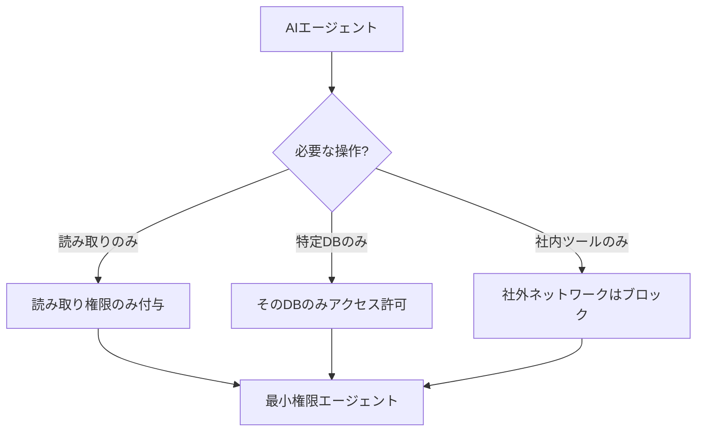

## 概要

AIエージェントに与える権限の設計は、セキュリティの根幹をなします。最小権限の原則を軸に、ツール使用・データアクセス・外部連携の権限を適切に設計する方法を学びます。

## 本文

### 最小権限の原則（Principle of Least Privilege）

AIエージェントには、タスクを完了するために**必要最小限の権限のみ**を付与します。



### 権限設計のレベル

**レベル1: ツールアクセス制御**

```python
from enum import Enum
from dataclasses import dataclass
from typing import Callable, Any

class Permission(Enum):
    READ = "read"
    WRITE = "write"
    DELETE = "delete"
    EXECUTE = "execute"
    NETWORK = "network"

@dataclass
class Tool:
    name: str
    description: str
    required_permissions: list[Permission]
    handler: Callable

class PermissionGuard:
    """ツール実行前に権限を確認するガード"""

    def __init__(self, granted_permissions: list[Permission]):
        self.granted = set(granted_permissions)

    def check(self, tool: Tool) -> tuple[bool, str]:
        """必要な権限がすべて付与されているか確認"""
        required = set(tool.required_permissions)
        missing = required - self.granted

        if missing:
            missing_names = [p.value for p in missing]
            return False, f"権限不足: {missing_names} が必要です"

        return True, "OK"

    def execute_with_guard(self, tool: Tool, **kwargs) -> Any:
        """権限チェック付きでツールを実行"""
        can_execute, reason = self.check(tool)
        if not can_execute:
            raise PermissionError(f"ツール '{tool.name}' の実行が拒否されました: {reason}")

        return tool.handler(**kwargs)


# ツールの定義
file_reader_tool = Tool(
    name="read_file",
    description="ファイルを読み取る",
    required_permissions=[Permission.READ],
    handler=lambda path: f"ファイル内容: {path}"
)

file_writer_tool = Tool(
    name="write_file",
    description="ファイルに書き込む",
    required_permissions=[Permission.READ, Permission.WRITE],
    handler=lambda path, content: f"書き込み成功: {path}"
)

db_delete_tool = Tool(
    name="delete_record",
    description="DBレコードを削除する",
    required_permissions=[Permission.READ, Permission.WRITE, Permission.DELETE],
    handler=lambda id: f"削除成功: {id}"
)

# 読み取り専用エージェント
read_only_guard = PermissionGuard(
    granted_permissions=[Permission.READ]
)

print("権限チェックテスト:")
print(f"ファイル読み取り: {read_only_guard.check(file_reader_tool)}")
print(f"ファイル書き込み: {read_only_guard.check(file_writer_tool)}")
print(f"レコード削除: {read_only_guard.check(db_delete_tool)}")
```

**レベル2: リソーススコープ制限**

```python
import re
from urllib.parse import urlparse

class ResourceScopeGuard:
    """アクセスできるリソースの範囲を制限"""

    def __init__(
        self,
        allowed_file_paths: list[str],
        allowed_domains: list[str],
        allowed_db_tables: list[str]
    ):
        self.allowed_file_paths = allowed_file_paths
        self.allowed_domains = allowed_domains
        self.allowed_db_tables = allowed_db_tables

    def can_access_file(self, file_path: str) -> tuple[bool, str]:
        """ファイルパスのアクセス可否"""
        # パストラバーサル防止
        if ".." in file_path:
            return False, "パストラバーサルは許可されていません"

        for allowed in self.allowed_file_paths:
            if file_path.startswith(allowed):
                return True, "OK"

        return False, f"アクセス不可: {file_path} は許可されたパス外です"

    def can_access_url(self, url: str) -> tuple[bool, str]:
        """URLのアクセス可否"""
        try:
            parsed = urlparse(url)
            domain = parsed.netloc
        except:
            return False, "無効なURL"

        # プライベートIPのブロック
        private_patterns = [
            r'^localhost',
            r'^127\.',
            r'^192\.168\.',
            r'^10\.',
            r'^172\.(1[6-9]|2\d|3[01])\.',
        ]
        for pattern in private_patterns:
            if re.match(pattern, domain):
                return False, f"内部ネットワークへのアクセスは禁止: {domain}"

        if domain in self.allowed_domains:
            return True, "OK"

        return False, f"許可されていないドメイン: {domain}"

    def can_access_table(self, table_name: str) -> tuple[bool, str]:
        """DBテーブルのアクセス可否"""
        if table_name in self.allowed_db_tables:
            return True, "OK"
        return False, f"アクセス不可: テーブル '{table_name}' へのアクセス権がありません"


# 使用例：カスタマーサポートエージェントのスコープ
cs_agent_scope = ResourceScopeGuard(
    allowed_file_paths=["/app/templates/", "/app/faqs/"],
    allowed_domains=["api.company.com", "docs.company.com"],
    allowed_db_tables=["orders", "products", "faqs"]
)

print("スコープチェック:")
print(f"FAQ読み取り: {cs_agent_scope.can_access_file('/app/faqs/returns.md')}")
print(f"システムファイル: {cs_agent_scope.can_access_file('/etc/passwd')}")
print(f"パストラバーサル: {cs_agent_scope.can_access_file('/app/../../etc/passwd')}")
print(f"社内API: {cs_agent_scope.can_access_url('https://api.company.com/orders')}")
print(f"外部サイト: {cs_agent_scope.can_access_url('https://attacker.com/steal')}")
print(f"localhost: {cs_agent_scope.can_access_url('http://localhost:8080/admin')}")
print(f"注文テーブル: {cs_agent_scope.can_access_table('orders')}")
print(f"ユーザーテーブル: {cs_agent_scope.can_access_table('users')}")
```

### 確認ゲートの実装

重要な操作は人間の確認を必須にします。

```python
from typing import Literal

class HumanInTheLoop:
    """重要な操作に人間の確認ゲートを実装"""

    HIGH_RISK_OPERATIONS = [
        "delete", "send_email", "make_payment",
        "update_user", "change_permission"
    ]

    def requires_confirmation(self, operation: str, context: dict) -> bool:
        """確認が必要かどうかを判定"""
        # 高リスク操作は常に確認
        if any(risk_op in operation.lower() for risk_op in self.HIGH_RISK_OPERATIONS):
            return True

        # 大量の影響を及ぼす操作
        if context.get("affected_records", 0) > 10:
            return True

        # 金額が一定以上
        if context.get("amount", 0) > 10000:
            return True

        return False

    def request_confirmation(
        self,
        operation: str,
        context: dict,
        get_confirmation_fn  # 実際の確認UIや通知の実装
    ) -> Literal["approved", "rejected"]:
        """確認を要求する"""
        if not self.requires_confirmation(operation, context):
            return "approved"

        print(f"\n[人間の確認が必要]")
        print(f"操作: {operation}")
        print(f"内容: {context}")
        return get_confirmation_fn(operation, context)
```

## ハンズオン

権限管理付きのAIエージェントを実装してみましょう。

### ステップ1：安全なエージェントフレームワーク

```python
import anthropic
import json
from dataclasses import dataclass

@dataclass
class AgentConfig:
    name: str
    granted_permissions: list[Permission]
    allowed_file_paths: list[str]
    allowed_domains: list[str]
    allowed_db_tables: list[str]
    max_operations_per_session: int = 50

class SecureAgent:
    """権限管理・スコープ制限付きの安全なエージェント"""

    def __init__(self, config: AgentConfig):
        self.config = config
        self.client = anthropic.Anthropic()
        self.permission_guard = PermissionGuard(config.granted_permissions)
        self.scope_guard = ResourceScopeGuard(
            allowed_file_paths=config.allowed_file_paths,
            allowed_domains=config.allowed_domains,
            allowed_db_tables=config.allowed_db_tables
        )
        self.human_loop = HumanInTheLoop()
        self.operation_count = 0

    def safe_tool_call(self, tool_name: str, parameters: dict) -> dict:
        """権限・スコープチェック付きのツール呼び出し"""
        # セッションあたりの操作数制限
        self.operation_count += 1
        if self.operation_count > self.config.max_operations_per_session:
            return {"error": "セッションの操作上限を超えました"}

        # URLアクセスのスコープチェック
        if "url" in parameters:
            can_access, reason = self.scope_guard.can_access_url(parameters["url"])
            if not can_access:
                return {"error": f"URLアクセス拒否: {reason}"}

        # ファイルアクセスのスコープチェック
        if "path" in parameters:
            can_access, reason = self.scope_guard.can_access_file(parameters["path"])
            if not can_access:
                return {"error": f"ファイルアクセス拒否: {reason}"}

        # テーブルアクセスのスコープチェック
        if "table" in parameters:
            can_access, reason = self.scope_guard.can_access_table(parameters["table"])
            if not can_access:
                return {"error": f"DBアクセス拒否: {reason}"}

        return {"success": True, "result": f"[{tool_name}] 実行完了"}


# 設定例：読み取り専用のカスタマーサポートエージェント
cs_config = AgentConfig(
    name="カスタマーサポートエージェント",
    granted_permissions=[Permission.READ],
    allowed_file_paths=["/app/faqs/", "/app/templates/"],
    allowed_domains=["api.company.com"],
    allowed_db_tables=["orders", "products", "faqs"],
    max_operations_per_session=20
)

agent = SecureAgent(cs_config)

# テスト
operations = [
    ("read_db", {"table": "orders", "id": 123}),
    ("read_db", {"table": "users", "id": 456}),  # 禁止テーブル
    ("fetch_url", {"url": "https://api.company.com/v1/products"}),
    ("fetch_url", {"url": "https://attacker.com/steal"}),
]

for tool_name, params in operations:
    result = agent.safe_tool_call(tool_name, params)
    print(f"{tool_name}({params}): {result}")
```

## クイズ

<!-- QUIZ:START -->
**Q1. 最小権限の原則をAIエージェントに適用する主な目的はどれですか？**

- A) エージェントの実行速度を向上させる
- B) 攻撃やバグによる被害範囲を最小限に抑える
- C) APIコストを削減する
- D) エージェントの会話を自然にする

**正解: B**
**解説:** 最小権限の原則は、エージェントが侵害された場合や誤動作した場合に、与えられた権限の範囲内でしか被害を与えられないようにするための原則です。例えば読み取り専用の権限しか持たないエージェントは、データを削除することができません。

**Q2. AIエージェントがWebリクエストを行う際、内部ネットワーク（localhost等）へのアクセスをブロックすべき理由はどれですか？**

- A) 内部ネットワークは低速なため
- B) 間接プロンプトインジェクションによって内部サービスへの不正アクセス（SSRF）が発生する可能性があるため
- C) 外部APIの方が高機能なため
- D) 規制上の理由

**正解: B**
**解説:** SSRF（Server Side Request Forgery）攻撃により、攻撃者が外部データを通じてエージェントに内部サービス（管理画面・メタデータエンドポイント等）へのリクエストを実行させる可能性があります。localhostや内部IPレンジへのアクセスをブロックすることが重要です。

**Q3. 「Human in the Loop（人間の確認ゲート）」が特に重要な操作はどれですか？**

- A) テキストの読み取りと表示
- B) 情報の検索・取得
- C) 大量のデータ削除・送金・権限変更などの不可逆的な操作
- D) ログの記録

**正解: C**
**解説:** 不可逆的な操作（削除・支払い・権限変更）や影響範囲が大きい操作は、AIが誤判断した場合のリスクが高いため、人間の確認を必須にします。読み取りや検索は低リスクなため確認不要です。
<!-- QUIZ:END -->

## まとめ

- AIエージェントには最小権限の原則を適用し、必要最小限の権限のみを付与する
- ファイルパス・URL・DBテーブルなどリソースのスコープを明示的に制限する
- 内部ネットワーク（localhost・プライベートIP）へのアクセスをブロックしてSSRFを防ぐ
- 重要な操作には人間の確認ゲートを実装する

## 次のレッスン

次のレッスンでは、AIシステムでインシデントが発生した際の対応フロー（インシデントレスポンス）を学びます。
