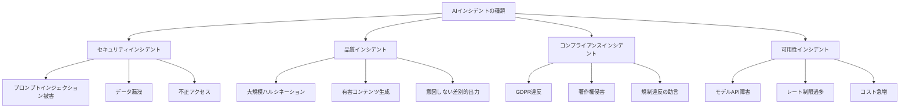
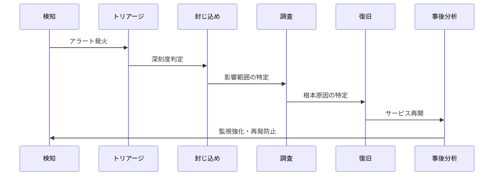

## 概要

AIシステムでインシデントが発生した場合、迅速かつ適切に対応するためのプロセスが必要です。このレッスンでは、AI固有のインシデントタイプと対応フロー、事後分析の方法を学びます。

## 本文

### AI固有のインシデントタイプ



### インシデント対応フロー



### インシデント深刻度の定義

```python
from enum import Enum
from dataclasses import dataclass, field
from datetime import datetime

class IncidentSeverity(Enum):
    P1 = "P1_CRITICAL"   # 即時対応（15分以内）
    P2 = "P2_HIGH"       # 1時間以内
    P3 = "P3_MEDIUM"     # 4時間以内
    P4 = "P4_LOW"        # 翌営業日

SEVERITY_CRITERIA = {
    IncidentSeverity.P1: [
        "個人情報の大規模漏洩",
        "有害コンテンツの大規模生成・拡散",
        "システム全体の停止",
        "金銭的損害の発生",
    ],
    IncidentSeverity.P2: [
        "System Promptの漏洩",
        "特定ユーザーへの不適切な回答",
        "部分的な機能停止",
    ],
    IncidentSeverity.P3: [
        "散発的なハルシネーション",
        "パフォーマンスの低下",
        "特定のユースケースでの品質低下",
    ],
    IncidentSeverity.P4: [
        "UIの軽微なバグ",
        "ログの欠損",
        "非クリティカルな機能の不具合",
    ],
}

@dataclass
class AIIncident:
    id: str
    title: str
    description: str
    severity: IncidentSeverity
    category: str
    detected_at: datetime
    affected_users: int
    affected_systems: list[str]
    timeline: list[dict] = field(default_factory=list)
    status: str = "open"  # open / investigating / resolved / closed

    def add_timeline_entry(self, action: str, actor: str):
        self.timeline.append({
            "timestamp": datetime.utcnow().isoformat(),
            "action": action,
            "actor": actor,
        })

    def to_report(self) -> str:
        """インシデントレポートを生成"""
        lines = [
            f"# インシデントレポート: {self.id}",
            f"**タイトル**: {self.title}",
            f"**深刻度**: {self.severity.value}",
            f"**カテゴリ**: {self.category}",
            f"**検出日時**: {self.detected_at.isoformat()}",
            f"**影響ユーザー数**: {self.affected_users}",
            f"**影響システム**: {', '.join(self.affected_systems)}",
            f"**ステータス**: {self.status}",
            "",
            "## 概要",
            self.description,
            "",
            "## タイムライン",
        ]
        for entry in self.timeline:
            lines.append(f"- {entry['timestamp']} [{entry['actor']}] {entry['action']}")

        return "\n".join(lines)
```

### 封じ込め戦略

```python
class IncidentContainment:
    """インシデント封じ込め手順"""

    def contain_data_leakage(self, incident: AIIncident) -> list[str]:
        """データ漏洩インシデントの封じ込め"""
        actions = []

        # 即時対応
        actions.append("影響を受けたAPIエンドポイントのアクセス遮断")
        actions.append("関連するAPIキーの無効化")
        actions.append("セッショントークンの強制無効化")

        if incident.affected_users > 100:
            actions.append("サービス全体の一時停止を検討")
            actions.append("法務チームへの即時通知")

        # 証拠保全
        actions.append("影響を受けた期間のログを保全（変更禁止）")
        actions.append("スナップショットの取得")

        return actions

    def contain_harmful_content(self, incident: AIIncident) -> list[str]:
        """有害コンテンツ生成インシデントの封じ込め"""
        actions = [
            "問題のあるSystem Promptの即時変更または削除",
            "入力フィルタリングの強化（問題のパターンをブロック）",
            "出力フィルタリングの即時適用",
            "モデルのロールバック（前バージョンへの切り戻し）を検討",
            "生成されたコンテンツのキャッシュのパージ",
        ]
        return actions

    def contain_availability_issue(self, incident: AIIncident) -> list[str]:
        """可用性インシデントの封じ込め"""
        return [
            "フォールバックモデルへの切り替え",
            "レートリミットの一時的な引き下げ",
            "キャッシュの有効化（キャッシュヒット率の向上）",
            "非クリティカルなリクエストのキュー化",
        ]
```

## ハンズオン

インシデント管理システムの基礎を実装してみましょう。

### ステップ1：インシデントトラッカーの実装

```python
import uuid
from datetime import datetime

class IncidentTracker:
    """AIインシデント管理システム"""

    def __init__(self):
        self.incidents: dict[str, AIIncident] = {}
        self.containment = IncidentContainment()

    def create_incident(
        self,
        title: str,
        description: str,
        severity: IncidentSeverity,
        category: str,
        affected_users: int,
        affected_systems: list[str],
        reporter: str
    ) -> AIIncident:
        """新しいインシデントを作成"""
        incident_id = f"INC-{datetime.utcnow().strftime('%Y%m%d')}-{uuid.uuid4().hex[:6].upper()}"

        incident = AIIncident(
            id=incident_id,
            title=title,
            description=description,
            severity=severity,
            category=category,
            detected_at=datetime.utcnow(),
            affected_users=affected_users,
            affected_systems=affected_systems,
        )

        incident.add_timeline_entry(
            f"インシデント作成: {description[:100]}",
            reporter
        )

        # SLAに基づく対応期限を計算
        sla_minutes = {
            IncidentSeverity.P1: 15,
            IncidentSeverity.P2: 60,
            IncidentSeverity.P3: 240,
            IncidentSeverity.P4: 1440,
        }

        print(f"\n[インシデント作成] {incident_id}")
        print(f"深刻度: {severity.value}")
        print(f"対応期限: {sla_minutes[severity]} 分以内")

        # 封じ込め推奨アクションを表示
        if category == "data_leakage":
            actions = self.containment.contain_data_leakage(incident)
        elif category == "harmful_content":
            actions = self.containment.contain_harmful_content(incident)
        else:
            actions = self.containment.contain_availability_issue(incident)

        print("\n推奨される封じ込めアクション:")
        for i, action in enumerate(actions, 1):
            print(f"  {i}. {action}")

        self.incidents[incident_id] = incident
        return incident

    def resolve_incident(
        self,
        incident_id: str,
        resolution: str,
        resolver: str
    ) -> str:
        """インシデントを解決済みにする"""
        if incident_id not in self.incidents:
            return f"インシデント {incident_id} が見つかりません"

        incident = self.incidents[incident_id]
        incident.status = "resolved"
        incident.add_timeline_entry(f"解決: {resolution}", resolver)

        return incident.to_report()


# 使用例
tracker = IncidentTracker()

# データ漏洩インシデントの作成
incident = tracker.create_incident(
    title="System Promptのユーザーへの部分的な露出",
    description="特定の入力パターンによりSystem Promptの一部がユーザーに表示される問題が確認された",
    severity=IncidentSeverity.P2,
    category="data_leakage",
    affected_users=5,
    affected_systems=["chat-api-prod", "customer-support-bot"],
    reporter="セキュリティチーム"
)

# 解決
print("\n" + "="*50)
report = tracker.resolve_incident(
    incident.id,
    resolution="System Promptの開示防止ルールを強化し、影響を受けた入力パターンをブロックリストに追加",
    resolver="エンジニアチーム"
)
print(report)
```

## クイズ

<!-- QUIZ:START -->
**Q1. P1（CRITICAL）インシデントの対応時間の目安はどれですか？**

- A) 翌営業日
- B) 4時間以内
- C) 15分以内
- D) 1週間以内

**正解: C**
**解説:** P1インシデントは大規模データ漏洩・サービス全体の停止・金銭的損害など最も深刻な問題で、通常15分以内の初動対応が求められます。適切なSLA（Service Level Agreement）を定義してエスカレーションパスを事前に整備しておくことが重要です。

**Q2. データ漏洩インシデントで最初に行うべき「封じ込め」アクションはどれですか？**

- A) 事後分析レポートの作成
- B) 影響を受けたAPIエンドポイントのアクセス遮断とAPIキーの無効化
- C) 全ユーザーへのメール通知
- D) 新しいセキュリティ機能の開発

**正解: B**
**解説:** 封じ込めの最初のステップは被害の拡大を止めることです。影響を受けたエンドポイントのアクセス遮断・APIキーの無効化・セッションの強制無効化を行い、それから調査・通知・復旧・事後分析を行います。

**Q3. インシデント対応において「証拠保全」が重要な理由はどれですか？**

- A) ストレージコストを削減するため
- B) 根本原因の特定・法的対応・規制報告のためにログやスナップショットを変更前の状態で保存するため
- C) パフォーマンスを向上させるため
- D) ユーザーへの補償金を計算するため

**正解: B**
**解説:** インシデント調査・法的対応・GDPRなどの規制報告に備え、影響を受けた期間のログ・データベーススナップショットなどを変更禁止状態で保全することが重要です。証拠が改ざんされると根本原因の特定が困難になります。
<!-- QUIZ:END -->

## まとめ

- AIインシデントはセキュリティ・品質・コンプライアンス・可用性の4カテゴリに分類できる
- 深刻度（P1〜P4）に応じたSLAと対応手順を事前に定義しておく
- 封じ込め（被害拡大防止）→調査→復旧→事後分析の順で対応する
- 証拠保全は法的対応・規制報告・再発防止のために必須

## 次のレッスン

次のレッスンでは、OWASP LLM Top 10を使ったセキュリティ評価フレームワークとチェックリストの作成方法を学びます。
