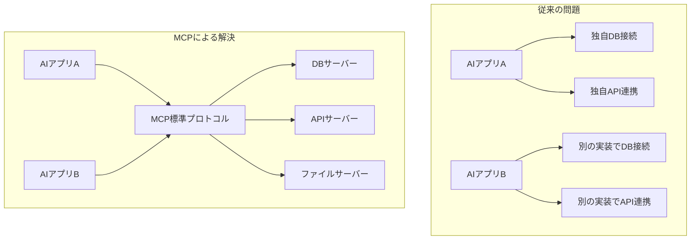
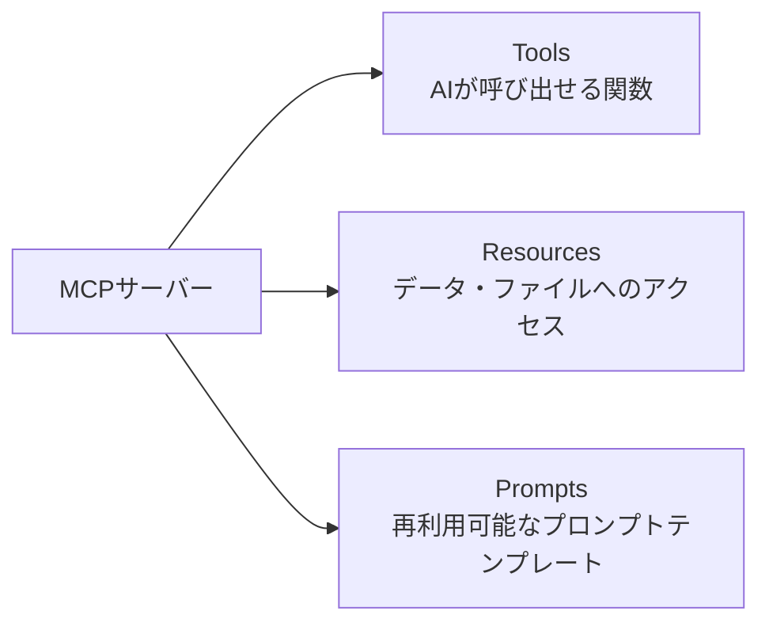

## 概要

Model Context Protocol（MCP）は、AIモデルと外部ツール・データソースを標準化されたインターフェースで接続するオープンプロトコルです。このレッスンでは、MCPが生まれた背景・何を解決するのか・全体像を学びます。

## 本文

### MCPが生まれた背景

AIエージェントが実世界と連携するには、ファイル・データベース・API・ツールなどへのアクセスが必要です。しかし従来はそれぞれのAIアプリケーションが独自の方法でツールを統合していました。



### MCPとは

**Model Context Protocol（MCP）** は、Anthropicが2024年11月に公開したオープンプロトコルです。

| 項目 | 説明 |
|------|------|
| 目的 | AIとツール・データソースの標準接続インターフェース |
| 公開元 | Anthropic（オープン仕様） |
| 通信方式 | JSON-RPC 2.0 over stdio または HTTP/SSE |
| 対応クライアント | Claude Desktop, Claude Code, その他MCP対応クライアント |
| サーバー言語 | TypeScript/JavaScript, Python（公式SDK），その他 |

### MCPの3つの核心機能



**1. Tools（ツール）**

AIが能動的に呼び出せる関数です。

```json
{
  "name": "search_database",
  "description": "データベースから顧客情報を検索する",
  "inputSchema": {
    "type": "object",
    "properties": {
      "query": {"type": "string", "description": "検索クエリ"},
      "limit": {"type": "number", "description": "最大件数"}
    },
    "required": ["query"]
  }
}
```

**2. Resources（リソース）**

AIが参照できるデータ・ファイルです。

```json
{
  "uri": "file:///app/data/products.json",
  "name": "製品カタログ",
  "mimeType": "application/json"
}
```

**3. Prompts（プロンプト）**

再利用可能なプロンプトテンプレートです。

```json
{
  "name": "summarize_document",
  "description": "文書を要約するプロンプト",
  "arguments": [
    {"name": "document", "required": true},
    {"name": "max_length", "required": false}
  ]
}
```

### MCPがもたらす価値

```
Before MCP:
- 各AIアプリがツール統合を独自実装
- 同じSlack連携を10社が別々に実装
- セキュリティの品質がまちまち

After MCP:
- 1つのMCPサーバーを多くのAIアプリが共有
- コミュニティが高品質なサーバーを共同メンテナンス
- 標準化されたセキュリティモデル
```

## ハンズオン

TypeScript SDK を使って最小限のMCPサーバーを動作確認してみましょう。

### ステップ1：環境準備

```bash
mkdir mcp-hello && cd mcp-hello
npm init -y
npm install @modelcontextprotocol/sdk zod
npm install -D typescript @types/node
npx tsc --init
```

### ステップ2：最小限のMCPサーバー実装

```typescript
// src/index.ts
import { McpServer } from "@modelcontextprotocol/sdk/server/mcp.js";
import { StdioServerTransport } from "@modelcontextprotocol/sdk/server/stdio.js";
import { z } from "zod";

// MCPサーバーの作成
const server = new McpServer({
  name: "hello-mcp",
  version: "1.0.0",
});

// Toolの登録（AIが呼び出せる関数）
server.tool(
  "greet",
  "ユーザーに挨拶する",
  {
    name: z.string().describe("挨拶する相手の名前"),
    language: z.enum(["ja", "en"]).optional().default("ja").describe("言語"),
  },
  async ({ name, language }) => {
    const greeting = language === "en"
      ? `Hello, ${name}! Nice to meet you.`
      : `こんにちは、${name}さん！よろしくお願いします。`;

    return {
      content: [{ type: "text", text: greeting }],
    };
  }
);

// サーバーの起動
async function main() {
  const transport = new StdioServerTransport();
  await server.connect(transport);
  console.error("Hello MCP Server started!");
}

main().catch(console.error);
```

### ステップ3：ビルドと動作確認

```bash
# ビルド
npx tsc

# Claude Desktop の設定ファイルに追加（macOS）
# ~/Library/Application Support/Claude/claude_desktop_config.json
```

```json
{
  "mcpServers": {
    "hello-mcp": {
      "command": "node",
      "args": ["/path/to/mcp-hello/dist/index.js"]
    }
  }
}
```

## クイズ

<!-- QUIZ:START -->
**Q1. MCPが解決する主な問題はどれですか？**

- A) AIモデルの学習速度を向上させる
- B) 各AIアプリが外部ツールをバラバラに実装する非効率を、標準プロトコルで解消する
- C) テキスト生成の品質を向上させる
- D) AIモデルのコストを削減する

**正解: B**
**解説:** MCPが登場する前は、各AIアプリケーションがSlack・GitHub・DBなどのツール統合を独自に実装していました。MCPは標準プロトコルを定義することで、1つのサーバー実装を多くのAIアプリが共有できるようにします。

**Q2. MCPの3つの核心機能として正しい組み合わせはどれですか？**

- A) Tools・Models・Datasets
- B) Tools・Resources・Prompts
- C) Functions・Storage・Templates
- D) APIs・Files・Agents

**正解: B**
**解説:** MCPは「Tools（AIが呼び出せる関数）」「Resources（データ・ファイルへのアクセス）」「Prompts（再利用可能なプロンプトテンプレート）」の3つを提供します。

**Q3. MCPの通信プロトコルとして使われているものはどれですか？**

- A) GraphQL
- B) gRPC
- C) JSON-RPC 2.0
- D) SOAP

**正解: C**
**解説:** MCPはJSON-RPC 2.0プロトコルを使い、標準入出力（stdio）またはHTTP/SSE（Server-Sent Events）経由で通信します。
<!-- QUIZ:END -->

## まとめ

- MCPはAIと外部ツール・データソースを標準化されたプロトコルで接続する仕組み
- Anthropicが2024年11月に公開したオープン仕様で、業界標準になりつつある
- Tools・Resources・Promptsの3要素でAIの能力を拡張できる
- 1つのMCPサーバーを多くのAIクライアントが共有できるエコシステムを形成する

## 次のレッスン

次のレッスンでは、MCPのアーキテクチャ（Host・Client・Serverの関係と通信の仕組み）を詳しく学びます。
