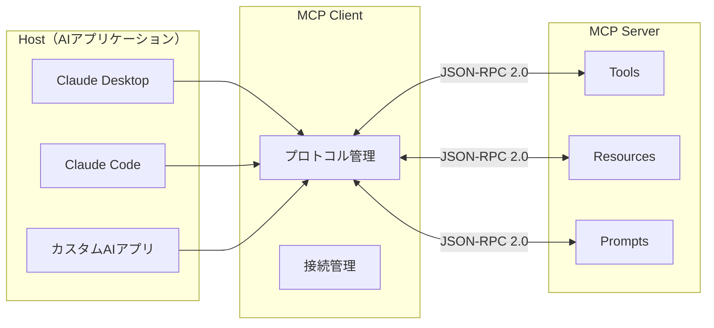
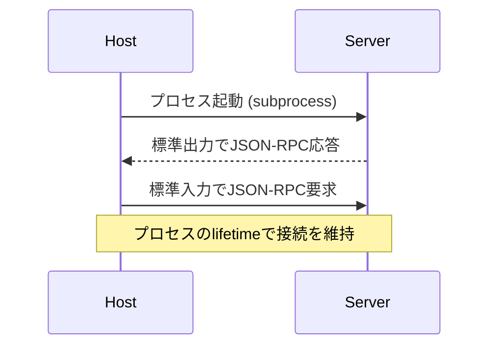
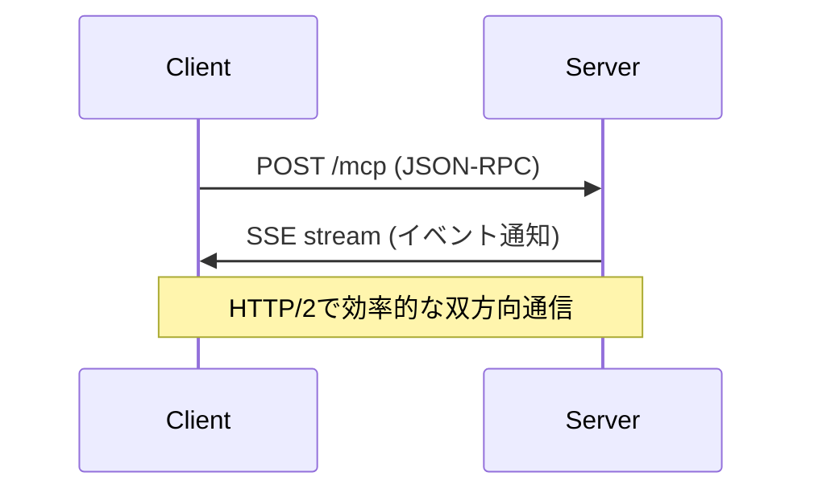
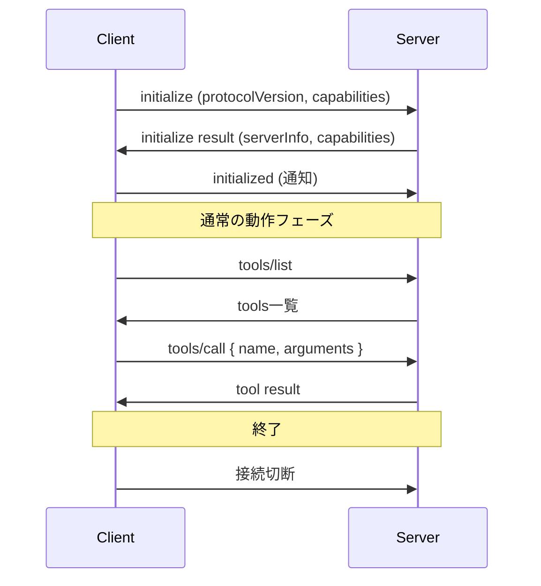

## 概要

MCPのアーキテクチャはHost・Client・Serverの3層構造で成り立っています。このレッスンでは、各コンポーネントの役割・通信プロトコル・ライフサイクルを理解し、実際の接続フローを実装します。

## 本文

### MCPの3層アーキテクチャ



**Host（ホスト）**: ユーザーが直接操作するAIアプリケーション（Claude Desktop等）。複数のMCP Clientを管理し、AIモデルとのやり取りを担当します。

**Client（クライアント）**: HostとServerを接続するプロトコル層。各サーバーとの接続を管理します。通常Hostに組み込まれています。

**Server（サーバー）**: ツール・リソース・プロンプトを提供するプロセス。独立したプロセスとして動作します。

### 通信トランスポート

**1. stdio（標準入出力）**

ローカルで動作するサーバーとの接続に最適です。



**2. HTTP + SSE（Server-Sent Events）**

リモートサーバーや複数クライアントからの接続に適します。



### 接続ライフサイクル



### Capabilitiesネゴシエーション

```typescript
// クライアントがサポートする機能を宣言
const clientCapabilities = {
  roots: {
    listChanged: true  // ルートリストの変更通知を受け取る
  },
  sampling: {}  // サンプリング機能（将来の拡張）
};

// サーバーがサポートする機能を宣言
const serverCapabilities = {
  tools: {},           // ツール機能を提供
  resources: {
    subscribe: true,   // リソース変更の購読をサポート
    listChanged: true
  },
  prompts: {
    listChanged: true
  },
  logging: {}          // ログ機能を提供
};
```

### JSON-RPC 2.0メッセージ形式

```json
// リクエスト
{
  "jsonrpc": "2.0",
  "id": 1,
  "method": "tools/call",
  "params": {
    "name": "search_database",
    "arguments": {
      "query": "田中",
      "limit": 10
    }
  }
}

// レスポンス（成功）
{
  "jsonrpc": "2.0",
  "id": 1,
  "result": {
    "content": [
      {
        "type": "text",
        "text": "検索結果: 田中太郎（ID: 123）..."
      }
    ],
    "isError": false
  }
}

// エラーレスポンス
{
  "jsonrpc": "2.0",
  "id": 1,
  "error": {
    "code": -32601,
    "message": "Method not found",
    "data": "tools/unknown_tool"
  }
}
```

## ハンズオン

MCPクライアントを実装してサーバーと通信してみましょう。

### ステップ1：Python SDK でのMCPサーバー実装

```python
# server.py
from mcp.server.fastmcp import FastMCP

mcp = FastMCP("calc-server")

@mcp.tool()
def add(a: float, b: float) -> float:
    """2つの数値を足し算する"""
    return a + b

@mcp.tool()
def multiply(a: float, b: float) -> float:
    """2つの数値を掛け算する"""
    return a * b

@mcp.resource("data://constants")
def get_constants() -> str:
    """数学定数を返す"""
    import json
    return json.dumps({"pi": 3.14159, "e": 2.71828})

if __name__ == "__main__":
    mcp.run()
```

### ステップ2：Claude APIとMCPツールを組み合わせる

```python
import anthropic
import json

# MCPツールをClaude APIのtool形式に変換
def mcp_tool_to_claude_tool(mcp_tool: dict) -> dict:
    """MCPのtool定義をClaude APIのtool形式に変換"""
    return {
        "name": mcp_tool["name"],
        "description": mcp_tool.get("description", ""),
        "input_schema": mcp_tool.get("inputSchema", {
            "type": "object",
            "properties": {}
        })
    }

# 簡易MCPクライアントのシミュレーション
class SimpleMCPClient:
    def __init__(self):
        # 実際はstdioまたはHTTP経由でサーバーに接続
        self.tools = {
            "add": lambda a, b: a + b,
            "multiply": lambda a, b: a * b,
            "get_time": lambda: "2026-03-14 12:00:00 UTC",
        }

    def list_tools(self) -> list[dict]:
        return [
            {
                "name": "add",
                "description": "2つの数値を足し算する",
                "inputSchema": {
                    "type": "object",
                    "properties": {
                        "a": {"type": "number", "description": "1つ目の数値"},
                        "b": {"type": "number", "description": "2つ目の数値"}
                    },
                    "required": ["a", "b"]
                }
            },
            {
                "name": "get_time",
                "description": "現在時刻を取得する",
                "inputSchema": {"type": "object", "properties": {}}
            }
        ]

    def call_tool(self, name: str, arguments: dict) -> str:
        if name not in self.tools:
            return json.dumps({"error": f"Tool '{name}' not found"})
        try:
            result = self.tools[name](**arguments)
            return json.dumps({"result": result})
        except Exception as e:
            return json.dumps({"error": str(e)})


def run_with_mcp_tools(user_message: str):
    """MCPツールを使ったClaude呼び出し"""
    mcp_client = SimpleMCPClient()
    claude_client = anthropic.Anthropic()

    # MCPからツール一覧を取得してClaude用に変換
    mcp_tools = mcp_client.list_tools()
    claude_tools = [mcp_tool_to_claude_tool(t) for t in mcp_tools]

    messages = [{"role": "user", "content": user_message}]

    while True:
        response = claude_client.messages.create(
            model="claude-opus-4-5",
            max_tokens=1024,
            tools=claude_tools,
            messages=messages
        )

        if response.stop_reason == "end_turn":
            # テキスト応答のみを取得
            text_blocks = [b for b in response.content if b.type == "text"]
            return text_blocks[0].text if text_blocks else ""

        if response.stop_reason == "tool_use":
            # ツール呼び出し結果の処理
            tool_results = []
            for block in response.content:
                if block.type == "tool_use":
                    result = mcp_client.call_tool(block.name, block.input)
                    tool_results.append({
                        "type": "tool_result",
                        "tool_use_id": block.id,
                        "content": result
                    })

            # 会話履歴に追加
            messages.append({"role": "assistant", "content": response.content})
            messages.append({"role": "user", "content": tool_results})
        else:
            break

    return "応答を取得できませんでした"


result = run_with_mcp_tools("123と456を足した結果を教えてください")
print(f"応答: {result}")
```

## クイズ

<!-- QUIZ:START -->
**Q1. MCPアーキテクチャにおける「Host」の役割はどれですか？**

- A) ツール・リソースを提供するバックエンドサーバー
- B) ユーザーが直接操作するAIアプリケーションで、複数のMCP Clientを管理する
- C) JSON-RPCの通信プロトコルを定義するライブラリ
- D) データベースへのアクセスを提供するプロセス

**正解: B**
**解説:** HostはClaude DesktopやClaude Codeのように、ユーザーが直接操作するAIアプリケーションです。複数のMCP Clientを管理し、AIモデルとのやり取りと各MCPサーバーへの接続を統括します。

**Q2. stdioトランスポートとHTTP+SSEトランスポートの使い分けとして正しいものはどれですか？**

- A) stdioはリモートサーバー、HTTP+SSEはローカルサーバーに使う
- B) stdioはローカルプロセスとの接続に最適で、HTTP+SSEはリモートや複数クライアントに適する
- C) stdioはセキュリティが高く、HTTP+SSEは低い
- D) 両者は完全に同等で使い分け不要

**正解: B**
**解説:** stdioはサブプロセスとして起動するローカルサーバーに最適（シンプルで低レイテンシ）です。HTTP+SSEはリモートサーバーや複数のクライアントから共有するサーバーに適しています。

**Q3. MCPの「Capabilitiesネゴシエーション」の目的はどれですか？**

- A) サーバーのパフォーマンスを最適化する
- B) ClientとServerが互いにサポートする機能を宣言し合い、互換性を確認する
- C) 認証情報を交換する
- D) データの暗号化方式を決める

**正解: B**
**解説:** Initializeフェーズで、ClientとServerが互いのCapabilities（サポートする機能）を宣言します。これによりクライアントはサーバーがどの機能（tools/resources/prompts等）をサポートするかを知り、サポートされていない機能を呼ばないようにできます。
<!-- QUIZ:END -->

## まとめ

- MCPはHost・Client・Serverの3層アーキテクチャで構成される
- 通信にはJSON-RPC 2.0を使い、stdioまたはHTTP+SSEのトランスポートを選択できる
- 接続時にCapabilitiesネゴシエーションで互いのサポート機能を確認する
- Serverは独立したプロセスとして動作し、複数のHostから共有できる

## 次のレッスン

次のレッスンでは、GitHub・Slack・データベースなど既存の公開MCPサーバーを活用する方法を学びます。
