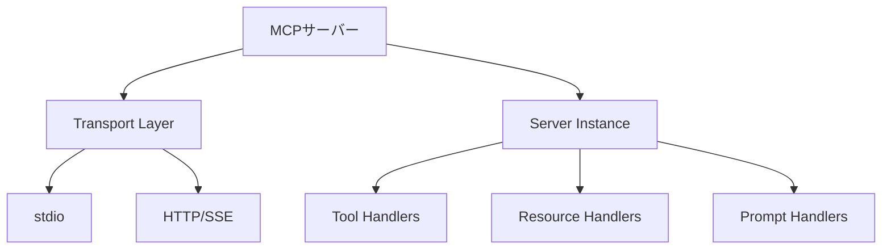

## 概要

TypeScript SDKを使ってMCPサーバーを自作する基礎を学びます。プロジェクトのセットアップからツール・リソース・プロンプトの実装まで、ゼロから動作するサーバーを作成します。

## 本文

### MCPサーバーの構成要素



### プロジェクトセットアップ

```bash
mkdir my-mcp-server && cd my-mcp-server
npm init -y
npm install @modelcontextprotocol/sdk zod
npm install -D typescript @types/node tsx

# tsconfig.json を作成
cat > tsconfig.json << 'EOF'
{
  "compilerOptions": {
    "target": "ES2022",
    "module": "Node16",
    "moduleResolution": "Node16",
    "outDir": "./dist",
    "rootDir": "./src",
    "strict": true,
    "esModuleInterop": true
  },
  "include": ["src/**/*"]
}
EOF
```

### package.json の設定

```json
{
  "name": "my-mcp-server",
  "version": "1.0.0",
  "type": "module",
  "main": "./dist/index.js",
  "scripts": {
    "build": "tsc",
    "dev": "tsx src/index.ts",
    "start": "node dist/index.js"
  }
}
```

### 基本的なサーバーの実装

```typescript
// src/index.ts
import { McpServer } from "@modelcontextprotocol/sdk/server/mcp.js";
import { StdioServerTransport } from "@modelcontextprotocol/sdk/server/stdio.js";
import { z } from "zod";

// サーバーインスタンスの作成
const server = new McpServer({
  name: "my-first-mcp-server",
  version: "1.0.0",
});

// ===== Tools =====
server.tool(
  "get_weather",
  "指定した都市の天気情報を取得する（モック）",
  {
    city: z.string().describe("都市名（例: Tokyo, Osaka）"),
    unit: z.enum(["celsius", "fahrenheit"]).optional().default("celsius"),
  },
  async ({ city, unit }) => {
    // 実際のAPIを呼ぶ代わりにモックデータを返す
    const mockWeather = {
      city,
      temperature: unit === "celsius" ? 22 : 72,
      unit,
      condition: "晴れ",
      humidity: 65,
    };

    return {
      content: [
        {
          type: "text",
          text: JSON.stringify(mockWeather, null, 2),
        },
      ],
    };
  }
);

server.tool(
  "calculate_bmi",
  "BMIを計算する",
  {
    weight_kg: z.number().positive().describe("体重（kg）"),
    height_cm: z.number().positive().describe("身長（cm）"),
  },
  async ({ weight_kg, height_cm }) => {
    const height_m = height_cm / 100;
    const bmi = weight_kg / (height_m * height_m);
    const rounded = Math.round(bmi * 10) / 10;

    let category: string;
    if (bmi < 18.5) category = "低体重";
    else if (bmi < 25) category = "普通体重";
    else if (bmi < 30) category = "過体重";
    else category = "肥満";

    return {
      content: [
        {
          type: "text",
          text: `BMI: ${rounded}（${category}）\n体重: ${weight_kg}kg, 身長: ${height_cm}cm`,
        },
      ],
    };
  }
);

// ===== Resources =====
server.resource(
  "config://app",
  "アプリケーション設定",
  async (uri) => {
    const config = {
      version: "1.0.0",
      environment: "development",
      features: {
        weather: true,
        bmi: true,
      },
    };
    return {
      contents: [
        {
          uri: uri.href,
          mimeType: "application/json",
          text: JSON.stringify(config, null, 2),
        },
      ],
    };
  }
);

// ===== Prompts =====
server.prompt(
  "analyze_health",
  "健康状態を分析するプロンプト",
  {
    age: z.string().describe("年齢"),
    bmi: z.string().describe("BMI値"),
  },
  ({ age, bmi }) => ({
    messages: [
      {
        role: "user",
        content: {
          type: "text",
          text: `年齢${age}歳、BMI${bmi}の人の健康状態を分析してください。
以下の観点で回答してください：
1. 現在の健康リスク
2. 推奨される生活習慣の改善点
3. 定期的に受けるべき健康診断`,
        },
      },
    ],
  })
);

// サーバー起動
async function main() {
  const transport = new StdioServerTransport();
  await server.connect(transport);
  console.error("My MCP Server is running!");
}

main().catch((error) => {
  console.error("Fatal error:", error);
  process.exit(1);
});
```

### エラーハンドリング

```typescript
server.tool(
  "safe_divide",
  "安全に除算を行う",
  {
    dividend: z.number().describe("割られる数"),
    divisor: z.number().describe("割る数"),
  },
  async ({ dividend, divisor }) => {
    // エラーはisError: trueで返す
    if (divisor === 0) {
      return {
        content: [
          {
            type: "text",
            text: "エラー: 0で割ることはできません",
          },
        ],
        isError: true,
      };
    }

    return {
      content: [
        {
          type: "text",
          text: `${dividend} ÷ ${divisor} = ${dividend / divisor}`,
        },
      ],
    };
  }
);
```

## ハンズオン

タスク管理MCPサーバーを作ってみましょう。

### ステップ1：タスク管理サーバーの実装

```typescript
// src/task-server.ts
import { McpServer } from "@modelcontextprotocol/sdk/server/mcp.js";
import { StdioServerTransport } from "@modelcontextprotocol/sdk/server/stdio.js";
import { z } from "zod";

interface Task {
  id: string;
  title: string;
  status: "todo" | "in_progress" | "done";
  createdAt: string;
}

// インメモリのタスクストア
const tasks: Map<string, Task> = new Map();
let nextId = 1;

const server = new McpServer({
  name: "task-manager",
  version: "1.0.0",
});

// タスク追加
server.tool(
  "add_task",
  "新しいタスクを追加する",
  {
    title: z.string().min(1).describe("タスクのタイトル"),
  },
  async ({ title }) => {
    const task: Task = {
      id: String(nextId++),
      title,
      status: "todo",
      createdAt: new Date().toISOString(),
    };
    tasks.set(task.id, task);
    return {
      content: [{ type: "text", text: `タスク追加完了: [${task.id}] ${task.title}` }],
    };
  }
);

// タスク一覧
server.tool(
  "list_tasks",
  "タスク一覧を取得する",
  {
    status: z.enum(["all", "todo", "in_progress", "done"]).optional().default("all"),
  },
  async ({ status }) => {
    const allTasks = Array.from(tasks.values());
    const filtered = status === "all" ? allTasks : allTasks.filter(t => t.status === status);

    if (filtered.length === 0) {
      return { content: [{ type: "text", text: "タスクがありません" }] };
    }

    const list = filtered.map(t =>
      `[${t.id}] ${t.status === "done" ? "✓" : "○"} ${t.title} (${t.status})`
    ).join("\n");

    return {
      content: [{ type: "text", text: `タスク一覧:\n${list}` }],
    };
  }
);

// ステータス更新
server.tool(
  "update_task_status",
  "タスクのステータスを更新する",
  {
    id: z.string().describe("タスクID"),
    status: z.enum(["todo", "in_progress", "done"]).describe("新しいステータス"),
  },
  async ({ id, status }) => {
    const task = tasks.get(id);
    if (!task) {
      return {
        content: [{ type: "text", text: `タスクID ${id} が見つかりません` }],
        isError: true,
      };
    }
    task.status = status;
    return {
      content: [{ type: "text", text: `タスク更新: [${id}] ${task.title} → ${status}` }],
    };
  }
);

async function main() {
  const transport = new StdioServerTransport();
  await server.connect(transport);
  console.error("Task Manager MCP Server started!");
}

main().catch(console.error);
```

### ステップ2：Claude Desktop で動作確認

```json
{
  "mcpServers": {
    "task-manager": {
      "command": "node",
      "args": ["/path/to/my-mcp-server/dist/task-server.js"]
    }
  }
}
```

Claude Desktopで試してみましょう:

```
「買い物に行く」というタスクを追加してください
全タスクの一覧を見せてください
タスクID 1 を in_progress に更新してください
```

## クイズ

<!-- QUIZ:START -->
**Q1. MCPサーバーでツールがエラーになった場合の正しい返し方はどれですか？**

- A) 例外（throw new Error）を発生させる
- B) `isError: true` を含むレスポンスを返す
- C) 空のレスポンスを返す
- D) null を返す

**正解: B**
**解説:** MCPのツールハンドラーでエラーを表現する際は、`isError: true` フラグを含むレスポンスを返します。これにより、クライアント（Claudeなど）はエラーが発生したことを認識できます。例外をスローするとサーバーがクラッシュするリスクがあります。

**Q2. `zod` ライブラリをMCPサーバーで使う主な目的はどれですか？**

- A) データベース接続の管理
- B) HTTPリクエストの送信
- C) ツールの入力パラメータのスキーマ定義とバリデーション
- D) ファイルの読み書き

**正解: C**
**解説:** `zod` はTypeScriptのランタイムスキーマバリデーションライブラリです。MCPのSDKと組み合わせて、ツールの入力パラメータの型定義・バリデーション・JSONスキーマの自動生成に使います。

**Q3. MCPサーバーの `console.error()` と `console.log()` の使い分けはどれですか？**

- A) エラーは console.error、通常ログは console.log を使う（区別は任意）
- B) stdio トランスポートでは、stdout はJSON-RPCの通信に使われるため、ログは console.error（stderr）を使う必要がある
- C) console.log のみを使う
- D) どちらも使わない

**正解: B**
**解説:** stdioトランスポートでは、MCPのJSON-RPC通信はstdoutを使います。そのため、ログやデバッグ出力をconsole.log（stdout）で出力するとJSON-RPC通信が壊れます。ログはconsole.error（stderr）を使う必要があります。
<!-- QUIZ:END -->

## まとめ

- MCPサーバーは TypeScript SDKと `zod` を組み合わせて実装する
- `server.tool()` でツール、`server.resource()` でリソース、`server.prompt()` でプロンプトを登録する
- エラーはthrowではなく `isError: true` で返す
- stdioトランスポートではログに `console.error`（stderr）を使う

## 次のレッスン

次のレッスンでは、MCPのTools機能の高度な実装パターン（非同期処理・長時間実行・進捗通知）を学びます。
