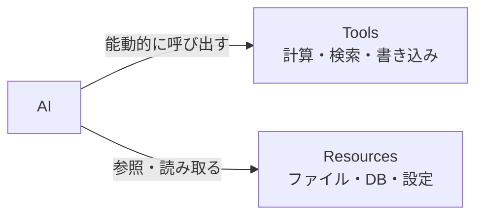

## 概要

MCPのResources機能は、ファイル・データベース・APIデータなどをAIが参照できるリソースとして公開します。ToolsがAIの「行動」であるのに対し、Resourcesは「情報の参照」です。このレッスンでは、静的・動的リソースの実装と変更通知を学びます。

## 本文

### ToolsとResourcesの違い



| | Tools | Resources |
|--|-------|-----------|
| 用途 | 関数の実行 | データの参照 |
| 方向性 | AIが呼び出す | AIが読み込む |
| 例 | 検索・計算・送信 | ファイル・設定・一覧 |
| URI | なし | `scheme://path` |

### ResourceのURI設計

```
リソースURIの形式: scheme://authority/path

例:
file:///app/data/config.json     - ローカルファイル
postgres://localhost/mydb/users  - DBテーブル
https://api.example.com/v1/docs  - リモートAPI
github://owner/repo/README.md    - GitHubファイル
custom://myapp/config            - カスタムスキーマ
```

### 静的リソースの実装

```typescript
import { McpServer } from "@modelcontextprotocol/sdk/server/mcp.js";
import { StdioServerTransport } from "@modelcontextprotocol/sdk/server/stdio.js";

const server = new McpServer({ name: "resource-demo", version: "1.0.0" });

// 静的なJSONリソース
server.resource(
  "config://app/settings",
  "アプリケーション設定",
  async (uri) => ({
    contents: [{
      uri: uri.href,
      mimeType: "application/json",
      text: JSON.stringify({
        name: "MyApp",
        version: "2.0.0",
        features: ["auth", "analytics", "notifications"],
        maxUsers: 10000,
      }, null, 2),
    }],
  })
);

// テキストドキュメントリソース
server.resource(
  "docs://api/overview",
  "APIドキュメントの概要",
  async (uri) => ({
    contents: [{
      uri: uri.href,
      mimeType: "text/markdown",
      text: `# API Overview

## Authentication
すべてのAPIリクエストにはBearerトークンが必要です。

## Rate Limits
- 認証済みユーザー: 1000リクエスト/時間
- 未認証: 60リクエスト/時間

## Endpoints
- GET /api/users - ユーザー一覧
- POST /api/users - ユーザー作成
- GET /api/products - 製品一覧
`,
    }],
  })
);
```

### 動的リソース（ResourceTemplate）

```typescript
import { ResourceTemplate } from "@modelcontextprotocol/sdk/server/mcp.js";

// ユーザーIDに基づく動的リソース
server.resource(
  new ResourceTemplate("users://{userId}/profile", { list: undefined }),
  "ユーザープロフィール",
  async (uri, { userId }) => {
    // 実際はDBから取得
    const users: Record<string, object> = {
      "123": { id: "123", name: "田中太郎", email: "tanaka@example.com", role: "admin" },
      "456": { id: "456", name: "鈴木花子", email: "suzuki@example.com", role: "user" },
    };

    const user = users[userId];
    if (!user) {
      return {
        contents: [{
          uri: uri.href,
          mimeType: "application/json",
          text: JSON.stringify({ error: `ユーザー ${userId} が見つかりません` }),
        }],
      };
    }

    return {
      contents: [{
        uri: uri.href,
        mimeType: "application/json",
        text: JSON.stringify(user, null, 2),
      }],
    };
  }
);
```

### ファイルシステムのリソース化

```typescript
import { readFile, readdir, stat } from "fs/promises";
import { join, extname, basename } from "path";

const ALLOWED_BASE_DIR = "/app/documents";

server.resource(
  new ResourceTemplate("file://{path}", { list: undefined }),
  "ドキュメントファイル",
  async (uri, { path }) => {
    // セキュリティ: ベースディレクトリ外へのアクセスを禁止
    const fullPath = join(ALLOWED_BASE_DIR, decodeURIComponent(path));
    const resolved = require("path").resolve(fullPath);
    if (!resolved.startsWith(ALLOWED_BASE_DIR)) {
      return {
        contents: [{
          uri: uri.href,
          mimeType: "text/plain",
          text: "エラー: アクセス禁止のパスです",
        }],
      };
    }

    try {
      const content = await readFile(resolved, "utf-8");
      const ext = extname(resolved).toLowerCase();

      const mimeTypes: Record<string, string> = {
        ".md": "text/markdown",
        ".txt": "text/plain",
        ".json": "application/json",
        ".yaml": "text/yaml",
        ".yml": "text/yaml",
      };

      return {
        contents: [{
          uri: uri.href,
          mimeType: mimeTypes[ext] || "text/plain",
          text: content,
        }],
      };
    } catch (error) {
      return {
        contents: [{
          uri: uri.href,
          mimeType: "text/plain",
          text: `エラー: ${(error as Error).message}`,
        }],
      };
    }
  }
);
```

### リソース変更通知

```typescript
import { McpServer } from "@modelcontextprotocol/sdk/server/mcp.js";

const server = new McpServer({
  name: "live-data",
  version: "1.0.0",
});

// リソース変更を通知する
let currentData = { timestamp: new Date().toISOString(), value: 0 };

// データを定期的に更新してクライアントに通知
setInterval(() => {
  currentData = {
    timestamp: new Date().toISOString(),
    value: Math.random() * 100,
  };
  // リソース変更を通知
  server.server.notification({
    method: "notifications/resources/updated",
    params: { uri: "live://sensor/data" },
  });
}, 5000);

server.resource(
  "live://sensor/data",
  "リアルタイムセンサーデータ",
  async (uri) => ({
    contents: [{
      uri: uri.href,
      mimeType: "application/json",
      text: JSON.stringify(currentData, null, 2),
    }],
  })
);
```

## ハンズオン

ナレッジベースのリソースサーバーを実装してみましょう。

### ステップ1：マークダウンドキュメントサーバー

```typescript
import { McpServer, ResourceTemplate } from "@modelcontextprotocol/sdk/server/mcp.js";
import { StdioServerTransport } from "@modelcontextprotocol/sdk/server/stdio.js";
import { readFile, readdir } from "fs/promises";
import { join, extname } from "path";

const DOCS_DIR = "/tmp/mcp-docs";
const server = new McpServer({ name: "knowledge-base", version: "1.0.0" });

// 全ドキュメントの一覧リソース
server.resource(
  "docs://index",
  "ドキュメント一覧",
  async (uri) => {
    try {
      const files = await readdir(DOCS_DIR);
      const mdFiles = files.filter(f => extname(f) === ".md");

      const index = mdFiles.map(f => ({
        name: f,
        uri: `docs://articles/${f.replace(".md", "")}`,
      }));

      return {
        contents: [{
          uri: uri.href,
          mimeType: "application/json",
          text: JSON.stringify({ documents: index }, null, 2),
        }],
      };
    } catch {
      return {
        contents: [{
          uri: uri.href,
          mimeType: "application/json",
          text: JSON.stringify({ error: "ドキュメントディレクトリが見つかりません" }),
        }],
      };
    }
  }
);

// 個別ドキュメントリソース
server.resource(
  new ResourceTemplate("docs://articles/{slug}", { list: undefined }),
  "ドキュメント記事",
  async (uri, { slug }) => {
    const filePath = join(DOCS_DIR, `${slug}.md`);
    try {
      const content = await readFile(filePath, "utf-8");
      return {
        contents: [{
          uri: uri.href,
          mimeType: "text/markdown",
          text: content,
        }],
      };
    } catch {
      return {
        contents: [{
          uri: uri.href,
          mimeType: "text/plain",
          text: `ドキュメント '${slug}' が見つかりません`,
        }],
      };
    }
  }
);

// テスト用ドキュメントの作成スクリプト
async function setupDocs() {
  const { mkdir, writeFile } = await import("fs/promises");
  await mkdir(DOCS_DIR, { recursive: true });

  const docs = {
    "getting-started.md": "# Getting Started\n\nMCPの使い方...",
    "api-reference.md": "# API Reference\n\n## Tools\n...",
    "security.md": "# セキュリティガイド\n\n重要なセキュリティ設定...",
  };

  for (const [filename, content] of Object.entries(docs)) {
    await writeFile(join(DOCS_DIR, filename), content);
  }

  console.error("テストドキュメントを作成しました");
}

async function main() {
  await setupDocs();
  const transport = new StdioServerTransport();
  await server.connect(transport);
  console.error("Knowledge Base MCP Server started!");
}

main().catch(console.error);
```

## クイズ

<!-- QUIZ:START -->
**Q1. MCPにおけるResourcesとToolsの主な違いはどれですか？**

- A) ResourcesはPythonで、ToolsはTypeScriptで実装する
- B) ResourcesはデータのURIベースの読み取りアクセスを提供し、ToolsはAIが能動的に実行できる関数を提供する
- C) ResourcesはサーバーからAIへのプッシュ通知、ToolsはAIからサーバーへのリクエスト
- D) 違いはなく、どちらも同じ機能を提供する

**正解: B**
**解説:** ResourcesはファイルやDBなどのデータをURIで識別してAIが「読み取る」ためのものです。ToolsはAIが「呼び出して実行できる関数」です。Resourcesは`resources/read`で取得し、ToolsはAIの判断で`tools/call`を実行します。

**Q2. ResourceTemplateを使う目的はどれですか？**

- A) リソースのパフォーマンスを向上させる
- B) `{userId}` のようなパラメータを含む動的なURIパターンを定義する
- C) リソースのキャッシュを管理する
- D) リソースの権限設定を行う

**正解: B**
**解説:** ResourceTemplateは`users://{userId}/profile`のようにパラメータ化されたURIパターンを定義します。これによりIDや名前が変わる動的なリソース（ユーザープロフィール・特定のDB行など）を柔軟に提供できます。

**Q3. ファイルシステムリソースでパストラバーサル攻撃を防ぐために必須な処理はどれですか？**

- A) ファイルサイズの制限
- B) `path.resolve()` で正規化したパスがベースディレクトリで始まるかを確認する
- C) ファイルの拡張子チェック
- D) ファイルの最終更新日時の確認

**正解: B**
**解説:** `../../etc/passwd` のようなパストラバーサル攻撃を防ぐには、`path.resolve()` でパスを正規化した後、その結果がベースディレクトリで始まるかを確認します。単純な `startsWith` チェックだけでは `../` を含むパスに対して不完全です。
<!-- QUIZ:END -->

## まとめ

- ResourcesはURIでデータを公開する仕組みで、静的・動的（ResourceTemplate）の2種類がある
- ファイルシステムリソースではパストラバーサル防止が必須
- リソースの変更通知（`notifications/resources/updated`）でリアルタイムデータを提供できる
- mimeTypeを正しく設定することでAIがコンテンツタイプを理解できる

## 次のレッスン

次のレッスンでは、MCPのPrompts機能（再利用可能なプロンプトテンプレートの実装）を学びます。
