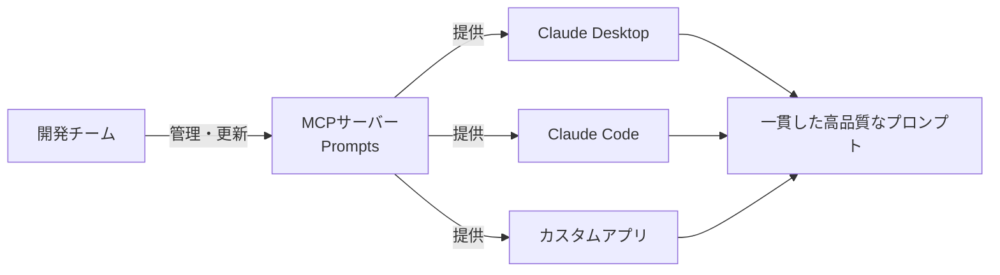

## 概要

MCPのPrompts機能は、再利用可能なプロンプトテンプレートを提供します。チームで共有できる標準プロンプトをMCPサーバーで一元管理することで、一貫性のある高品質なAI活用が実現できます。

## 本文

### Promptsの役割



Promptsの主な使いどころ:
- コードレビューの標準プロンプト
- バグレポートのテンプレート
- 特定ドメインの分析フォーマット
- チーム固有のワークフロープロンプト

### Promptsの実装

```typescript
import { McpServer } from "@modelcontextprotocol/sdk/server/mcp.js";
import { StdioServerTransport } from "@modelcontextprotocol/sdk/server/stdio.js";
import { z } from "zod";

const server = new McpServer({ name: "prompt-library", version: "1.0.0" });

// 引数なしのシンプルなプロンプト
server.prompt(
  "daily_standup",
  "日次スタンドアップミーティングのファシリテートプロンプト",
  {},
  () => ({
    messages: [
      {
        role: "user",
        content: {
          type: "text",
          text: `日次スタンドアップをファシリテートしてください。
各チームメンバーに以下の3点を確認してください：
1. 昨日何をしましたか？
2. 今日何をしますか？
3. 何かブロッカーはありますか？

終了後、今日のアクションアイテムをMarkdownのリスト形式でまとめてください。`,
        },
      },
    ],
  })
);

// 引数ありのプロンプト
server.prompt(
  "code_review",
  "コードレビュー用の標準プロンプト",
  {
    language: z.string().describe("プログラミング言語（例: TypeScript, Python）"),
    focus: z.enum(["security", "performance", "readability", "all"])
      .optional()
      .default("all")
      .describe("レビューの焦点"),
    severity_threshold: z.enum(["all", "medium_and_above", "critical_only"])
      .optional()
      .default("all")
      .describe("指摘する深刻度の閾値"),
  },
  ({ language, focus, severity_threshold }) => {
    const focusInstructions: Record<string, string> = {
      security: "セキュリティの脆弱性（SQLインジェクション・XSS・認証漏れ等）に重点を置いてください",
      performance: "パフォーマンスボトルネック（N+1クエリ・不要な計算・メモリリーク等）に重点を置いてください",
      readability: "可読性・命名・コメント・設計の明確さに重点を置いてください",
      all: "セキュリティ・パフォーマンス・可読性・設計を総合的にレビューしてください",
    };

    const severityNote = severity_threshold === "critical_only"
      ? "CRITICALな問題のみ指摘してください。"
      : severity_threshold === "medium_and_above"
      ? "MEDIUM以上の問題を指摘してください。"
      : "";

    return {
      messages: [
        {
          role: "user",
          content: {
            type: "text",
            text: `以下の${language}コードをレビューしてください。

## レビュー方針
- ${focusInstructions[focus]}
- ${severityNote}

## 出力形式
各指摘は以下の形式で記載してください：

### [CRITICAL/HIGH/MEDIUM/LOW] 問題のタイトル
- **場所**: ファイル名/行番号（わかる場合）
- **問題**: 何が問題か
- **理由**: なぜ問題なのか
- **修正案**: 改善したコードまたは具体的な修正手順

最後に「総評」セクションでコード全体の印象を3〜5文でまとめてください。

コードを貼り付けてください：`,
          },
        },
      ],
    };
  }
);

// マルチターンのプロンプト（会話形式）
server.prompt(
  "technical_interview",
  "技術面接のシミュレーションプロンプト",
  {
    role: z.string().describe("面接する職種（例: バックエンドエンジニア）"),
    level: z.enum(["junior", "mid", "senior", "staff"]).describe("レベル"),
    focus_area: z.string().describe("重点スキルエリア（例: システム設計、アルゴリズム）"),
  },
  ({ role, level, focus_area }) => ({
    messages: [
      {
        role: "user",
        content: {
          type: "text",
          text: `技術面接官の役割を演じてください。

## 設定
- 対象職種: ${role}
- レベル: ${level}
- 重点エリア: ${focus_area}

## 進め方
1. まず自己紹介と役割の説明をしてください
2. 技術的な質問を1問ずつ出し、回答を評価してください
3. 5問終了後、総評とフィードバックをしてください

面接を開始してください。`,
        },
      },
    ],
  })
);
```

### Embedded Resourcesを使ったプロンプト

```typescript
// リソースのコンテンツをプロンプトに埋め込む
server.prompt(
  "analyze_with_context",
  "コンテキストファイルを使った分析プロンプト",
  {
    topic: z.string().describe("分析するトピック"),
    context_file: z.string().describe("参考にするリソースのURI（例: docs://api/overview）"),
  },
  ({ topic, context_file }) => ({
    messages: [
      {
        role: "user",
        content: [
          {
            type: "text",
            text: `以下のドキュメントを参照して、「${topic}」について分析してください。`,
          },
          {
            type: "resource",
            resource: {
              uri: context_file,
              text: `[${context_file} の内容をここに挿入]`,
              mimeType: "text/markdown",
            },
          },
          {
            type: "text",
            text: `上記のドキュメントを踏まえて、「${topic}」に関する課題・改善点・推奨アクションを提示してください。`,
          },
        ],
      },
    ],
  })
);
```

## ハンズオン

チームの開発ワークフロー用プロンプトライブラリを実装してみましょう。

### ステップ1：開発支援プロンプトライブラリ

```typescript
import { McpServer } from "@modelcontextprotocol/sdk/server/mcp.js";
import { StdioServerTransport } from "@modelcontextprotocol/sdk/server/stdio.js";
import { z } from "zod";

const server = new McpServer({ name: "dev-prompts", version: "1.0.0" });

// バグレポート生成
server.prompt(
  "bug_report",
  "バグレポートのテンプレートを生成する",
  {
    component: z.string().describe("バグが発生したコンポーネント"),
    severity: z.enum(["critical", "high", "medium", "low"]).describe("深刻度"),
  },
  ({ component, severity }) => ({
    messages: [{
      role: "user",
      content: {
        type: "text",
        text: `「${component}」コンポーネントの${severity}深刻度のバグレポートを作成してください。

以下の情報を収集してフォーマットを整えてください：
1. バグの概要（1文）
2. 再現手順（ステップバイステップ）
3. 期待される動作
4. 実際の動作
5. 環境情報（OS・ブラウザ・バージョン）
6. エラーログ（ある場合）
7. 想定される原因（わかれば）
8. 暫定対応策（わかれば）

今、バグの詳細を教えてください：`,
      },
    }],
  })
);

// プルリクエスト説明文
server.prompt(
  "pr_description",
  "プルリクエストの説明文を生成する",
  {
    type: z.enum(["feature", "bugfix", "refactor", "docs", "chore"]).describe("変更の種類"),
    ticket_id: z.string().optional().describe("チケットID（例: JIRA-1234）"),
  },
  ({ type, ticket_id }) => ({
    messages: [{
      role: "user",
      content: {
        type: "text",
        text: `${type}タイプのプルリクエスト説明文を作成してください。${ticket_id ? `\n関連チケット: ${ticket_id}` : ""}

以下の変更内容を教えてください。それを元に以下の形式でPR説明文を作成します：

## 変更内容
（何を変更したかを簡潔に）

## なぜこの変更が必要か
（背景・課題・目的）

## 変更の詳細
（技術的な変更点の箇条書き）

## テスト方法
（変更をどのようにテストしたか）

## スクリーンショット/デモ
（UI変更がある場合）

## 注意事項
（レビュワーに特に確認してほしいこと）

変更の内容を教えてください：`,
      },
    }],
  })
);

async function main() {
  const transport = new StdioServerTransport();
  await server.connect(transport);
  console.error("Dev Prompts MCP Server started!");
}

main().catch(console.error);
```

## クイズ

<!-- QUIZ:START -->
**Q1. MCPのPromptsをToolsではなく使うべきケースはどれですか？**

- A) データベースにレコードを追加する
- B) 特定のフォーマットで出力を生成するための標準的な指示テンプレートを提供する
- C) 外部APIを呼び出して結果を返す
- D) ファイルの内容を読み取る

**正解: B**
**解説:** Promptsはコードレビューテンプレート・バグレポートフォーマットなど、繰り返し使われる標準的なプロンプトを定義するものです。データの操作や取得にはTools/Resourcesを使います。

**Q2. Promptsに引数（parameters）を定義する利点はどれですか？**

- A) プロンプトの実行速度が向上する
- B) 同じ構造で動的なコンテンツを挿入でき、特定の文脈に応じたプロンプトを生成できる
- C) セキュリティが向上する
- D) モデルのコストが削減される

**正解: B**
**解説:** 引数を使うことで「言語: TypeScript」「レビュー焦点: セキュリティ」のようにパラメータを変えながら同じプロンプト構造を再利用できます。チームで共有するプロンプトの品質を一定に保ちながら柔軟に使い回せます。

**Q3. MCPのPrompts機能でチームに提供できる価値として最も適切なものはどれですか？**

- A) モデルの学習データを更新できる
- B) AIの応答速度を向上させる
- C) 高品質なプロンプトを一元管理し、チーム全員が一貫して使えるようにする
- D) 個人の使用量を追跡する

**正解: C**
**解説:** Promptsの最大の価値は「プロンプトのバージョン管理・一元管理」です。プロンプトエンジニアが磨いた高品質なテンプレートをMCPサーバーで公開することで、チーム全員が同じ品質のプロンプトを使えます。
<!-- QUIZ:END -->

## まとめ

- Promptsは再利用可能なプロンプトテンプレートをMCPサーバーで一元管理する機能
- 引数を使って動的なコンテンツを挿入できる
- Embedded Resourcesでリソースのコンテンツをプロンプトに組み込める
- チームの標準プロンプトをMCPで管理することでプロンプトの品質を統一できる

## 次のレッスン

次のレッスンでは、Claude DesktopにカスタムのMCPサーバーを統合して、ローカル環境でAIエージェントのフルサイクルを動かす方法を学びます。
