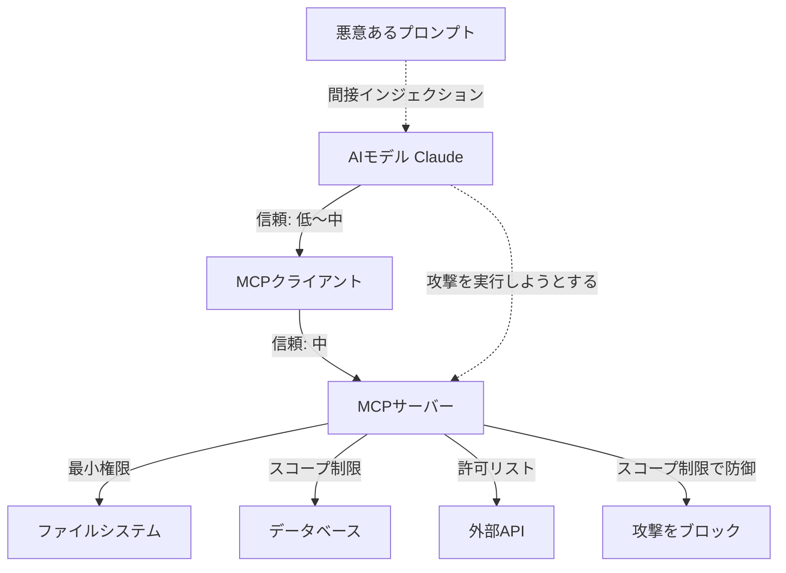

## 概要

MCPサーバーはAIエージェントにシステムへのアクセスを提供するため、セキュリティ設計が重要です。信頼境界の定義・権限スコープの最小化・認証・入力バリデーションの実装方法を学びます。

## 本文

### MCPのセキュリティモデル



### 信頼境界の設計

MCPには3つの信頼境界があります：

```
信頼レベル（高い順）:
1. MCPサーバー自体のコード（完全信頼）
2. MCPクライアント（Hostアプリ）（高信頼）
3. AIモデルの判断（中信頼）
4. ユーザーの入力（低信頼）
5. 外部データ（最低信頼）
```

### 認証の実装

```typescript
import { McpServer } from "@modelcontextprotocol/sdk/server/mcp.js";
import { StdioServerTransport } from "@modelcontextprotocol/sdk/server/stdio.js";
import { z } from "zod";
import * as crypto from "crypto";

// APIキー認証の実装
class AuthenticatedMcpServer {
  private server: McpServer;
  private validApiKeys: Set<string>;

  constructor(apiKeys: string[]) {
    this.server = new McpServer({ name: "secure-server", version: "1.0.0" });
    // APIキーはハッシュ化して保存
    this.validApiKeys = new Set(
      apiKeys.map(key => crypto.createHash("sha256").update(key).digest("hex"))
    );
    this.setupTools();
  }

  private verifyApiKey(providedKey: string): boolean {
    const hashedKey = crypto.createHash("sha256").update(providedKey).digest("hex");
    return this.validApiKeys.has(hashedKey);
  }

  private setupTools() {
    this.server.tool(
      "get_sensitive_data",
      "認証が必要なデータを取得する",
      {
        api_key: z.string().describe("APIキー"),
        resource_id: z.string().describe("リソースID"),
      },
      async ({ api_key, resource_id }) => {
        if (!this.verifyApiKey(api_key)) {
          return {
            content: [{ type: "text", text: "エラー: 無効なAPIキーです" }],
            isError: true,
          };
        }

        // 認証成功後の処理
        return {
          content: [{
            type: "text",
            text: `認証成功。リソース ${resource_id} のデータ: {...}`,
          }],
        };
      }
    );
  }

  async start() {
    const transport = new StdioServerTransport();
    await this.server.connect(transport);
  }
}
```

### スコープ制限の実装

```typescript
interface ToolPermission {
  allowed: boolean;
  reason?: string;
}

class ScopedMcpServer {
  private server: McpServer;
  private scope: {
    allowedPaths: string[];
    allowedDomains: string[];
    allowedDbTables: string[];
    maxFileSize: number;
    readOnly: boolean;
  };

  constructor(scope: ScopedMcpServer["scope"]) {
    this.server = new McpServer({ name: "scoped-server", version: "1.0.0" });
    this.scope = scope;
    this.setupTools();
  }

  private checkFileAccess(path: string): ToolPermission {
    const { resolve, normalize } = require("path");
    const normalized = normalize(resolve(path));

    if (normalized.includes("..")) {
      return { allowed: false, reason: "パストラバーサルは禁止" };
    }

    const isAllowed = this.scope.allowedPaths.some(p =>
      normalized.startsWith(normalize(resolve(p)))
    );

    return isAllowed
      ? { allowed: true }
      : { allowed: false, reason: `パス '${path}' はスコープ外` };
  }

  private checkUrlAccess(url: string): ToolPermission {
    try {
      const parsed = new URL(url);
      const domain = parsed.hostname;

      // 内部IPのブロック
      const internalPatterns = [
        /^localhost$/,
        /^127\./,
        /^192\.168\./,
        /^10\./,
        /^172\.(1[6-9]|2[0-9]|3[01])\./,
        /^169\.254\./,
      ];

      if (internalPatterns.some(p => p.test(domain))) {
        return { allowed: false, reason: "内部ネットワークへのアクセスは禁止" };
      }

      const isAllowed = this.scope.allowedDomains.some(d =>
        domain === d || domain.endsWith(`.${d}`)
      );

      return isAllowed
        ? { allowed: true }
        : { allowed: false, reason: `ドメイン '${domain}' はスコープ外` };
    } catch {
      return { allowed: false, reason: "無効なURL" };
    }
  }

  private setupTools() {
    const { readFile, writeFile, stat } = require("fs/promises");

    this.server.tool(
      "read_file",
      "ファイルを読み取る",
      { path: z.string().describe("ファイルパス") },
      async ({ path }) => {
        const permission = this.checkFileAccess(path);
        if (!permission.allowed) {
          return { content: [{ type: "text", text: `アクセス拒否: ${permission.reason}` }], isError: true };
        }

        try {
          const stats = await stat(path);
          if (stats.size > this.scope.maxFileSize) {
            return { content: [{ type: "text", text: `エラー: ファイルサイズ制限超過 (${stats.size} bytes)` }], isError: true };
          }

          const content = await readFile(path, "utf-8");
          return { content: [{ type: "text", text: content }] };
        } catch (e) {
          return { content: [{ type: "text", text: `エラー: ${(e as Error).message}` }], isError: true };
        }
      }
    );

    if (!this.scope.readOnly) {
      this.server.tool(
        "write_file",
        "ファイルに書き込む",
        {
          path: z.string().describe("ファイルパス"),
          content: z.string().describe("書き込む内容"),
        },
        async ({ path, content }) => {
          const permission = this.checkFileAccess(path);
          if (!permission.allowed) {
            return { content: [{ type: "text", text: `アクセス拒否: ${permission.reason}` }], isError: true };
          }

          try {
            await writeFile(path, content, "utf-8");
            return { content: [{ type: "text", text: `書き込み成功: ${path}` }] };
          } catch (e) {
            return { content: [{ type: "text", text: `エラー: ${(e as Error).message}` }], isError: true };
          }
        }
      );
    }
  }
}
```

### 入力サニタイズとSQLインジェクション対策

```typescript
import { z } from "zod";

// 危険な文字のサニタイズ
function sanitizeForShell(input: string): string {
  // シェルインジェクション対策：特殊文字をエスケープ
  return input.replace(/[;&|`$\\'"]/g, "");
}

// SQLインジェクション対策（パラメタライズドクエリを使う）
server.tool(
  "search_users",
  "ユーザーを検索する",
  {
    name: z.string().max(100).describe("検索するユーザー名"),
  },
  async ({ name }) => {
    // ❌ 危険: SQLインジェクションの脆弱性
    // const query = `SELECT * FROM users WHERE name = '${name}'`;

    // ✅ 安全: パラメタライズドクエリ
    const query = "SELECT id, name, email FROM users WHERE name ILIKE $1 LIMIT 10";
    const params = [`%${name}%`];

    // DBクエリの実行（例: pg ライブラリ）
    // const result = await pool.query(query, params);
    const mockResult = [{ id: 1, name: "田中太郎", email: "tanaka@example.com" }];

    return {
      content: [{
        type: "text",
        text: JSON.stringify(mockResult, null, 2),
      }],
    };
  }
);
```

## ハンズオン

監査ログ付きのセキュアMCPサーバーを実装してみましょう。

### ステップ1：監査ログの実装

```typescript
import { McpServer } from "@modelcontextprotocol/sdk/server/mcp.js";
import { StdioServerTransport } from "@modelcontextprotocol/sdk/server/stdio.js";
import { z } from "zod";
import { appendFile } from "fs/promises";

interface AuditLog {
  timestamp: string;
  tool: string;
  input: object;
  success: boolean;
  error?: string;
  duration_ms: number;
}

async function writeAuditLog(log: AuditLog) {
  const logLine = JSON.stringify(log) + "\n";
  await appendFile("/tmp/mcp-audit.log", logLine).catch(console.error);
}

function withAudit<T extends object>(
  toolName: string,
  handler: (input: T) => Promise<{ content: Array<{ type: string; text: string }>; isError?: boolean }>
) {
  return async (input: T) => {
    const start = Date.now();
    try {
      const result = await handler(input);
      await writeAuditLog({
        timestamp: new Date().toISOString(),
        tool: toolName,
        input,
        success: !result.isError,
        duration_ms: Date.now() - start,
      });
      return result;
    } catch (error) {
      await writeAuditLog({
        timestamp: new Date().toISOString(),
        tool: toolName,
        input,
        success: false,
        error: (error as Error).message,
        duration_ms: Date.now() - start,
      });
      return {
        content: [{ type: "text", text: `エラー: ${(error as Error).message}` }],
        isError: true as const,
      };
    }
  };
}

const server = new McpServer({ name: "audited-server", version: "1.0.0" });

server.tool(
  "get_record",
  "レコードを取得する（監査ログ付き）",
  { id: z.string().describe("レコードID") },
  withAudit("get_record", async ({ id }) => {
    const mockData = { id, name: "サンプルデータ", value: 42 };
    return {
      content: [{ type: "text", text: JSON.stringify(mockData, null, 2) }],
    };
  })
);

async function main() {
  const transport = new StdioServerTransport();
  await server.connect(transport);
  console.error("Audited MCP Server started! Logs: /tmp/mcp-audit.log");
}

main().catch(console.error);
```

## クイズ

<!-- QUIZ:START -->
**Q1. MCPサーバーでSQLインジェクションを防ぐための最も効果的な方法はどれですか？**

- A) 入力文字数を制限する
- B) ユーザー入力を大文字に変換する
- C) パラメタライズドクエリ（プリペアドステートメント）を使う
- D) SQLクエリをBase64エンコードする

**正解: C**
**解説:** SQLインジェクションの最も確実な防御はパラメタライズドクエリです。`WHERE name = $1` のようにプレースホルダーを使い、ユーザー入力を文字列結合でSQLに埋め込まないことが重要です。

**Q2. MCPサーバーにAPIキー認証を実装する場合、APIキーをサーバー内でどのように保存すべきですか？**

- A) 平文のまま配列に保存する
- B) SHA-256等でハッシュ化して保存し、照合時も入力をハッシュ化して比較する
- C) Base64でエンコードして保存する
- D) ファイルに書き出して比較する

**正解: B**
**解説:** APIキーはSHA-256などの一方向ハッシュ関数でハッシュ化して保存します。これにより、サーバーのメモリがダンプされても生のAPIキーが漏洩しません。照合時は入力値を同じアルゴリズムでハッシュ化して比較します。

**Q3. 監査ログに記録すべき情報として最も適切なものはどれですか？**

- A) ユーザーの氏名・住所などの個人情報
- B) 実行したツール名・タイムスタンプ・成否・処理時間（PIIは除く）
- C) APIキーの全体値
- D) データベースの接続パスワード

**正解: B**
**解説:** 監査ログには「何のツールが」「いつ」「成功/失敗したか」「どのくらい時間がかかったか」を記録します。氏名・メールアドレスなどのPII・APIキー・パスワードなどの機密情報は監査ログに含めてはいけません。
<!-- QUIZ:END -->

## まとめ

- MCPのセキュリティは信頼境界の明確化・最小権限・入力バリデーション・監査ログの4要素
- 認証はAPIキーをハッシュ化して管理し、スコープで許可パス・ドメイン・テーブルを制限する
- 外部データを処理する際は内部ネットワークへのSSRFとSQLインジェクションを防ぐ
- 全ツール呼び出しを監査ログに記録して不正利用を追跡できるようにする

## 次のレッスン

次のレッスンでは、MCPを使った実際のワークフロー自動化・業務連携の事例を学びます。
