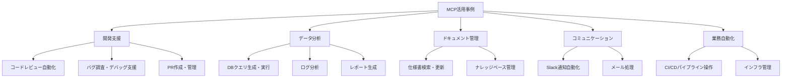

## 概要

MCPを使った実際のワークフロー自動化・業務連携の事例を学びます。開発支援・データ分析・ドキュメント管理など、実務で直接使えるパターンを紹介します。

## 本文

### MCP活用の主要カテゴリ



### 事例1: 開発支援ワークフロー

```
シナリオ: 「このPRのバグ調査を手伝って」

1. Claude → GitHub MCP → PR変更差分を取得
2. Claude → filesystem MCP → 関連ファイルを読み込む
3. Claude → brave-search MCP → エラーメッセージを検索
4. Claude がバグの原因を特定してレポートを生成
5. Claude → GitHub MCP → Issueにコメントを投稿
```

```python
# Python で MCP ツール群を直接統合する例（本番用途）
import anthropic
import json

client = anthropic.Anthropic()

# 開発支援ツール（MCPサーバーの代わりに直接実装）
def get_github_pr_diff(repo: str, pr_number: int) -> str:
    """GitHub PR の差分を取得（モック）"""
    return f"""
--- a/src/utils/calculate.py
+++ b/src/utils/calculate.py
@@ -10,7 +10,7 @@ def calculate_tax(price: float, rate: float) -> float:
-    return price * rate
+    return price * (1 + rate)  # バグ: rate が 0.1 のとき 1.1 倍になる
"""

def search_related_code(query: str, directory: str) -> str:
    """関連コードを検索（モック）"""
    return f"検索結果: {query} に関連するファイル: src/utils/calculate.py, tests/test_calculate.py"

def create_issue_comment(repo: str, issue_number: int, comment: str) -> str:
    """Issue にコメントを投稿（モック）"""
    return f"コメントを投稿しました: {comment[:50]}..."

tools = [
    {
        "name": "get_github_pr_diff",
        "description": "GitHub Pull Requestの差分を取得する",
        "input_schema": {
            "type": "object",
            "properties": {
                "repo": {"type": "string"},
                "pr_number": {"type": "integer"}
            },
            "required": ["repo", "pr_number"]
        }
    },
    {
        "name": "search_related_code",
        "description": "コードベースから関連コードを検索する",
        "input_schema": {
            "type": "object",
            "properties": {
                "query": {"type": "string"},
                "directory": {"type": "string"}
            },
            "required": ["query"]
        }
    },
]

def run_dev_assistant(user_request: str):
    """開発支援エージェントの実行"""
    messages = [{"role": "user", "content": user_request}]

    while True:
        response = client.messages.create(
            model="claude-opus-4-5",
            max_tokens=2048,
            tools=tools,
            messages=messages
        )

        if response.stop_reason == "end_turn":
            return next((b.text for b in response.content if hasattr(b, "text")), "")

        if response.stop_reason == "tool_use":
            tool_results = []
            for block in response.content:
                if block.type == "tool_use":
                    # ツールの実行
                    if block.name == "get_github_pr_diff":
                        result = get_github_pr_diff(**block.input)
                    elif block.name == "search_related_code":
                        result = search_related_code(**block.input)
                    else:
                        result = "Unknown tool"

                    tool_results.append({
                        "type": "tool_result",
                        "tool_use_id": block.id,
                        "content": result
                    })

            messages.append({"role": "assistant", "content": response.content})
            messages.append({"role": "user", "content": tool_results})
        else:
            break

    return "エラー: 予期しない終了"

result = run_dev_assistant(
    "リポジトリ 'myorg/myapp' の PR #42 のバグを調査して、原因と修正提案をまとめてください"
)
print(result)
```

### 事例2: データ分析ワークフロー

```python
# テキストからSQLを生成してDBで実行する
def text_to_sql_workflow(natural_language_query: str) -> dict:
    """自然言語をSQLに変換して実行するワークフロー"""

    # スキーマ情報（実際はDBから取得）
    schema = """
    テーブル: orders
    - id (INTEGER, 主キー)
    - customer_id (INTEGER)
    - amount (DECIMAL)
    - status (VARCHAR: pending/completed/cancelled)
    - created_at (TIMESTAMP)

    テーブル: customers
    - id (INTEGER, 主キー)
    - name (VARCHAR)
    - email (VARCHAR)
    - tier (VARCHAR: bronze/silver/gold)
    """

    # SQL生成
    response = client.messages.create(
        model="claude-opus-4-5",
        max_tokens=500,
        system="""あなたはSQLの専門家です。
スキーマに基づいて安全なSELECT文のみを生成してください。
INSERT/UPDATE/DELETE/DROPは絶対に生成しないでください。
クエリのみをコードブロックなしで返してください。""",
        messages=[{
            "role": "user",
            "content": f"スキーマ:\n{schema}\n\n質問: {natural_language_query}"
        }]
    )

    generated_sql = response.content[0].text.strip()

    # 安全チェック（SELECTのみ許可）
    if not generated_sql.upper().startswith("SELECT"):
        return {"error": "SELECTクエリのみ許可されています"}

    # モックのDB実行結果
    mock_result = [
        {"customer_name": "田中太郎", "total_orders": 15, "total_amount": 150000},
        {"customer_name": "鈴木花子", "total_orders": 8, "total_amount": 85000},
    ]

    return {
        "query": generated_sql,
        "result": mock_result,
        "row_count": len(mock_result)
    }

result = text_to_sql_workflow("ゴールドティアの顧客の注文件数と合計金額を多い順に見せて")
print(f"生成SQL: {result.get('query')}")
print(f"結果件数: {result.get('row_count')}")
```

### 事例3: ドキュメント検索・更新

```python
# ナレッジベースの自動更新
def update_knowledge_base(new_info: str, kb_path: str):
    """新しい情報をナレッジベースに統合する"""

    # 既存のナレッジを読む（モック）
    existing_kb = "現在の製品バージョン: v1.9\n機能一覧: ..."

    response = client.messages.create(
        model="claude-opus-4-5",
        max_tokens=1000,
        messages=[{
            "role": "user",
            "content": f"""以下の新しい情報を既存のナレッジベースに統合して、
更新されたMarkdown形式のドキュメントを生成してください。

既存のナレッジ:
{existing_kb}

新しい情報:
{new_info}

更新されたドキュメントのみを返してください。"""
        }]
    )

    updated_content = response.content[0].text

    # ファイルに書き出す（実際の実装）
    # with open(kb_path, 'w') as f:
    #     f.write(updated_content)

    return updated_content

result = update_knowledge_base(
    "v2.0リリース: マルチモーダル対応・レスポンス速度30%改善",
    "/app/docs/product-kb.md"
)
print(f"更新されたナレッジベース（抜粋）: {result[:200]}")
```

## ハンズオン

全ツールを統合した業務自動化エージェントを作成してみましょう。

### ステップ1：日次レポート生成エージェント

```python
import anthropic
from datetime import datetime, timedelta

def daily_report_agent() -> str:
    """日次レポートを自動生成するエージェント"""
    client = anthropic.Anthropic()

    today = datetime.now().strftime("%Y-%m-%d")
    yesterday = (datetime.now() - timedelta(days=1)).strftime("%Y-%m-%d")

    # 各ツールのモックデータ
    mock_metrics = {
        "api_calls": 12453,
        "errors": 23,
        "avg_latency_ms": 342,
        "active_users": 891,
    }

    mock_alerts = [
        "14:23 - API レイテンシが500msを超えた（5分間）",
        "18:45 - エラー率が1%を超えた（10分間）",
    ]

    prompt = f"""以下のデータを使って{today}の日次レポートを生成してください。

## 昨日（{yesterday}）のメトリクス
{mock_metrics}

## アラート履歴
{chr(10).join(mock_alerts)}

以下の形式でMarkdownレポートを生成してください：
1. エグゼクティブサマリー（3文）
2. 主要KPIの評価（良好/要注意/要対応）
3. インシデントの概要と影響
4. 今日のアクション推奨事項
"""

    response = client.messages.create(
        model="claude-opus-4-5",
        max_tokens=1024,
        messages=[{"role": "user", "content": prompt}]
    )

    return response.content[0].text

report = daily_report_agent()
print("生成された日次レポート:")
print(report)
```

## クイズ

<!-- QUIZ:START -->
**Q1. MCPを使ったワークフロー自動化で特に効果が高い用途はどれですか？**

- A) AIモデルの学習
- B) 複数のシステム（GitHub・DB・Slack等）を横断する複雑な業務フローの自動化
- C) 静的なWebページの表示
- D) 画像ファイルの圧縮

**正解: B**
**解説:** MCPの真価は複数のサーバーを組み合わせて、単一のAIエージェントがGitHub・DB・Slackなど複数システムを横断して作業できることです。例えば「PRをレビュー→DBの影響を確認→Slackに報告」のような複合ワークフローを自動化できます。

**Q2. Text-to-SQLワークフローでセキュリティ上最重要な対策はどれですか？**

- A) 生成されたSQLの文字数制限
- B) SELECT文のみを許可し、INSERT/UPDATE/DELETE/DROPを生成・実行しないようにする
- C) SQLをBase64エンコードして実行する
- D) クエリ結果を暗号化する

**正解: B**
**解説:** Text-to-SQLでは、LLMが悪意あるSQL（DROP TABLE等）を生成する可能性があります。生成されたSQLがSELECT文で始まることを確認し、データ変更・削除系のDML/DDLをブロックすることが最重要のセキュリティ対策です。

**Q3. MCPを使ったナレッジベース更新で、AIが既存情報を削除しないようにするために有効な対策はどれですか？**

- A) より大きなAIモデルを使う
- B) 既存のドキュメントと新情報を提示し「統合」を指示する（「削除」ではなく）
- C) ドキュメントをロック状態にする
- D) AIの出力を無視して手動で更新する

**正解: B**
**解説:** ナレッジベース更新では「新しい情報を既存内容に統合してください」という指示が効果的です。「書き直してください」のような指示では既存情報が削除される可能性があります。また、重要なドキュメントは更新前にバックアップを取ることも重要です。
<!-- QUIZ:END -->

## まとめ

- MCPの活用事例は開発支援・データ分析・ドキュメント管理・業務自動化など多岐にわたる
- 複数のMCPサーバーを組み合わせることで、複雑な複数システムを横断するワークフローが自動化できる
- Text-to-SQLではSELECT限定・SQLインジェクション対策などのセキュリティが重要
- 業務で使う場合は監査ログ・スコープ制限・人間の確認ゲートを適切に設計する

## 次のレッスン

Chapter 8では、プロンプトと出力の品質を測定・改善するための評価手法を学びます。なぜ評価が必要かから始めて、LLM-as-a-Judge・Evalsフレームワークまでを習得します。
