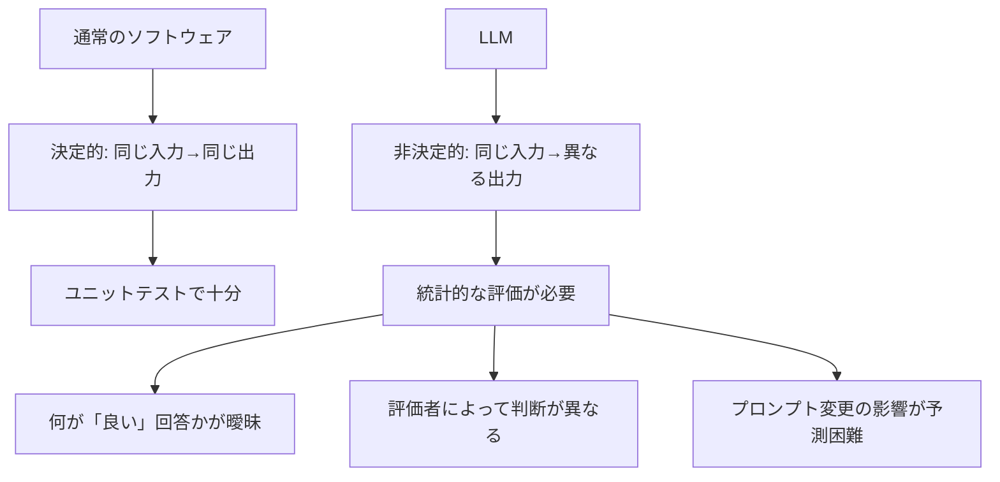
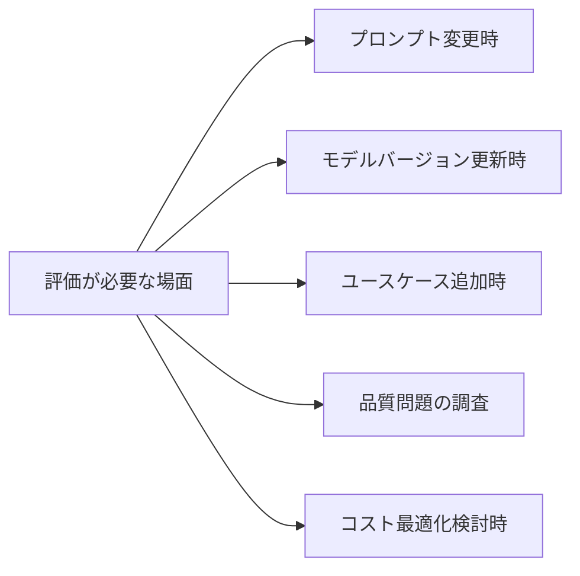

## 概要

LLMの出力は非決定的で評価が難しいため、従来のソフトウェアテストとは異なるアプローチが必要です。このレッスンでは、評価の重要性・何を評価するのか・評価がないと何が起きるかを学びます。

## 本文

### LLMが評価を難しくする理由



### 評価がないと何が起きるか

**1. サイレントデグレード（気づかない品質劣化）**

プロンプトを「改善」したつもりが、他の側面で品質が下がっていても気づけません。

```
変更前のプロンプト:
「要約してください」
→ 出力: 適度に詳細な要約

変更後のプロンプト:
「3文以内で要約してください」
→ 出力: 短くはなったが重要情報が欠落

評価なしでは→「文字数が減った！改善した！」と誤認
評価ありでは→「情報量スコアが20%低下」と検出
```

**2. モデル更新による予期せぬ変化**

LLMのモデルバージョンが更新されると、同じプロンプトで異なる出力が得られることがあります。

```python
# モデルバージョンごとの出力比較
def compare_model_versions(prompt: str, models: list[str]) -> dict:
    import anthropic
    client = anthropic.Anthropic()
    results = {}

    for model in models:
        response = client.messages.create(
            model=model,
            max_tokens=500,
            messages=[{"role": "user", "content": prompt}]
        )
        results[model] = response.content[0].text

    return results

# 評価なし → モデル更新後に本番で初めて品質低下に気づく
# 評価あり → デプロイ前に自動テストで検出
```

**3. A/Bテストの根拠が曖昧になる**

「プロンプトAとBのどちらが良いか」を主観で判断していると、プロンプトの改善が属人化します。

### 評価が必要な5つのシナリオ



### 何を評価するか（評価の指標）

| 評価軸 | 説明 | 例 |
|--------|------|-----|
| 正確性 | 事実・数値の正確さ | 「2024年のGDP」の正確性 |
| 関連性 | 質問に対する回答の適切さ | 「今日の天気」に対して天気を答えているか |
| 完全性 | 必要な情報がすべて含まれるか | 要約に主要ポイントがすべてあるか |
| 形式 | 指定フォーマットへの準拠 | JSONスキーマの正確さ |
| 有害性 | 不適切コンテンツの有無 | ヘイトスピーチ・暴力的表現がないか |
| 効率性 | トークン数・レイテンシ | コスト効率 |

## ハンズオン

簡単な評価フレームワークを実装してみましょう。

### ステップ1：評価のベースラインを測定する

```python
import anthropic
from dataclasses import dataclass, field
from datetime import datetime

@dataclass
class EvalResult:
    prompt_version: str
    test_case_id: str
    input: str
    expected: str
    actual: str
    score: float  # 0.0 〜 1.0
    passed: bool
    evaluator: str
    evaluated_at: str = field(default_factory=lambda: datetime.utcnow().isoformat())

@dataclass
class TestCase:
    id: str
    input: str
    expected: str
    evaluation_criteria: str

class SimpleEvalFramework:
    """シンプルな評価フレームワーク"""

    def __init__(self, model: str = "claude-opus-4-5"):
        self.client = anthropic.Anthropic()
        self.model = model
        self.results: list[EvalResult] = []

    def generate(self, prompt_template: str, input_text: str) -> str:
        """プロンプトで出力を生成"""
        response = self.client.messages.create(
            model=self.model,
            max_tokens=1024,
            messages=[{"role": "user", "content": prompt_template.format(input=input_text)}]
        )
        return response.content[0].text

    def exact_match(self, actual: str, expected: str) -> float:
        """完全一致の評価"""
        return 1.0 if actual.strip() == expected.strip() else 0.0

    def contains_check(self, actual: str, expected_keywords: list[str]) -> float:
        """キーワード含有チェック"""
        found = sum(1 for kw in expected_keywords if kw.lower() in actual.lower())
        return found / len(expected_keywords) if expected_keywords else 0.0

    def run_eval(
        self,
        prompt_version: str,
        prompt_template: str,
        test_cases: list[TestCase],
        evaluator: str = "contains_check"
    ) -> dict:
        """評価を実行してレポートを生成"""
        for tc in test_cases:
            actual = self.generate(prompt_template, tc.input)

            if evaluator == "exact_match":
                score = self.exact_match(actual, tc.expected)
            else:
                # キーワード含有チェック
                keywords = tc.expected.split(",")
                score = self.contains_check(actual, keywords)

            result = EvalResult(
                prompt_version=prompt_version,
                test_case_id=tc.id,
                input=tc.input,
                expected=tc.expected,
                actual=actual,
                score=score,
                passed=score >= 0.7,
                evaluator=evaluator
            )
            self.results.append(result)

        return self.generate_summary(prompt_version)

    def generate_summary(self, version: str) -> dict:
        version_results = [r for r in self.results if r.prompt_version == version]
        if not version_results:
            return {}

        scores = [r.score for r in version_results]
        passed = [r for r in version_results if r.passed]

        return {
            "version": version,
            "total_cases": len(version_results),
            "passed": len(passed),
            "pass_rate": len(passed) / len(version_results),
            "avg_score": sum(scores) / len(scores),
            "min_score": min(scores),
            "max_score": max(scores),
        }


# テスト用データセット
test_cases = [
    TestCase(
        id="TC-001",
        input="機械学習とは何ですか？",
        expected="機械学習,データ,モデル,学習,予測",
        evaluation_criteria="機械学習の基本概念を含むこと"
    ),
    TestCase(
        id="TC-002",
        input="Pythonのリスト内包表記を説明してください",
        expected="リスト内包表記,for,条件,シンプル",
        evaluation_criteria="構文と利点を説明すること"
    ),
]

# プロンプトのバージョン比較
eval_framework = SimpleEvalFramework()

# バージョン1: シンプルなプロンプト
v1_template = "以下の質問に答えてください：{input}"

# バージョン2: 構造化されたプロンプト
v2_template = """以下の質問に対して、初心者にもわかりやすく説明してください。
具体例を含め、300文字以内で回答してください。

質問: {input}"""

print("バージョン1の評価:")
result_v1 = eval_framework.run_eval("v1", v1_template, test_cases)
print(result_v1)

print("\nバージョン2の評価:")
result_v2 = eval_framework.run_eval("v2", v2_template, test_cases)
print(result_v2)
```

## クイズ

<!-- QUIZ:START -->
**Q1. LLMの評価が通常のソフトウェアテストと異なる主な理由はどれですか？**

- A) LLMの方がテストが簡単だから
- B) LLMは非決定的で「正解」が一意に決まらないため、統計的な評価アプローチが必要
- C) LLMはユニットテストで完全にテストできるから
- D) LLMのテストにはAIが不要だから

**正解: B**
**解説:** 通常のソフトウェアは「同じ入力→同じ出力」ですがLLMは非決定的です。さらに「何が良い回答か」が主観的であることが多く、ユニットテストの概念が直接適用できません。統計的な評価と複数の評価軸を組み合わせるアプローチが必要です。

**Q2. 「サイレントデグレード」とは何ですか？**

- A) AIシステムが突然停止すること
- B) プロンプト変更後、気づかないうちに出力品質が下がること
- C) APIのレート制限に達すること
- D) モデルのダウンタイム

**正解: B**
**解説:** サイレントデグレードは、プロンプト変更やモデル更新後に、表面上は動いているが品質が低下している状態です。評価（Eval）を定期実行することで、品質低下をいち早く検出できます。

**Q3. 評価において「pass_rate」（合格率）が高くても、品質の問題を見逃す可能性があるのはなぜですか？**

- A) pass_rateは計算が難しいから
- B) 合格基準（閾値）が甘い場合や、評価していない重要な軸（例: 有害性）がある場合
- C) テストケース数が多すぎるから
- D) APIコストが高いから

**正解: B**
**解説:** pass_rateが高くても、合格基準の閾値が低ければ低品質な回答も「合格」になります。また、正確性のみを評価して有害性・関連性などの軸を評価していない場合、見えない品質問題が残ります。多角的な評価軸を設定することが重要です。
<!-- QUIZ:END -->

## まとめ

- LLMは非決定的で「正解」が一意でないため、統計的な評価アプローチが必要
- 評価なしではサイレントデグレード・モデル更新の影響・プロンプト改善の効果を把握できない
- 正確性・関連性・完全性・形式・有害性・効率性の6軸で評価する
- プロンプト変更・モデル更新・定期レビューのタイミングで評価を実行する

## 次のレッスン

次のレッスンでは、自動評価・人手評価・LLM-as-a-Judgeの3種類の評価手法の特徴と使い分けを学びます。
