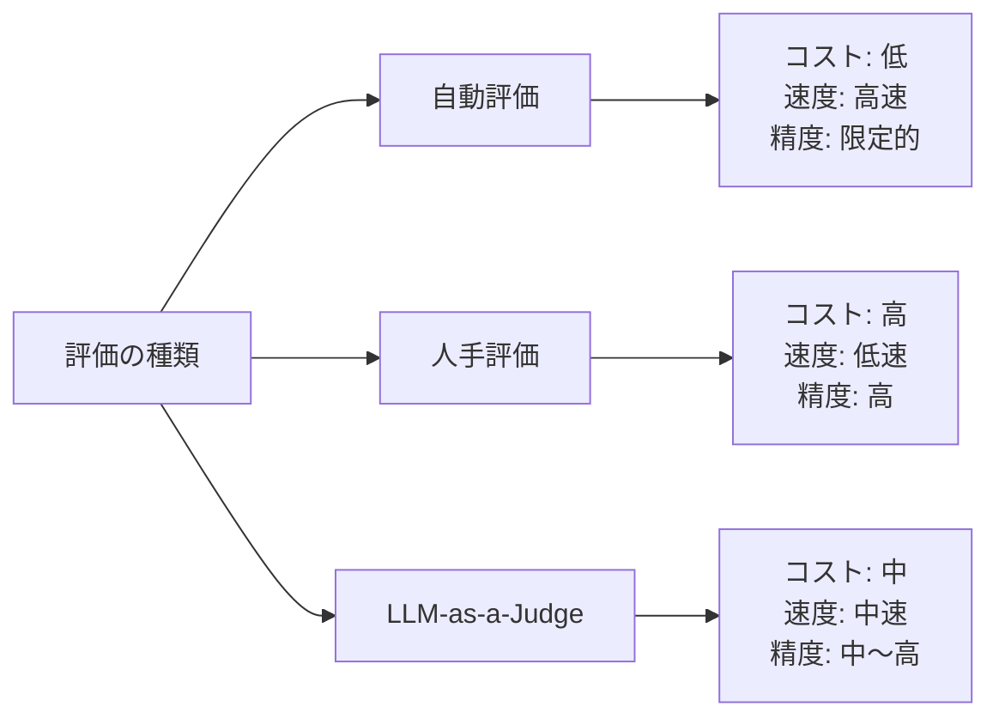

## 概要

LLMの評価方法は「自動評価」「人手評価」「LLM-as-a-Judge」の3種類に大別されます。それぞれの特徴・コスト・精度・使いどころを理解して、用途に応じた評価戦略を設計できるようになります。

## 本文

### 3種類の評価方法の比較



| 評価方法 | コスト | 速度 | 精度 | 適した用途 |
|---------|--------|------|------|-----------|
| 自動評価 | 低 | 高速（ms〜秒） | 限定的 | CI/CD・回帰テスト |
| 人手評価 | 高 | 低速（日〜週） | 高（ゴールドスタンダード） | ベンチマーク作成・最終評価 |
| LLM-as-a-Judge | 中 | 中速（秒〜分） | 中〜高 | 定期的な品質モニタリング |

### 1. 自動評価

**特徴**: プログラムで計算可能なメトリクスを使う

```python
# 自動評価の例
def evaluate_json_format(output: str, schema: dict) -> float:
    """JSON形式の正確性を評価"""
    import json
    try:
        parsed = json.loads(output)
        # 必須キーのチェック
        for key in schema.get("required", []):
            if key not in parsed:
                return 0.0
        return 1.0
    except json.JSONDecodeError:
        return 0.0

def evaluate_length(output: str, min_len: int, max_len: int) -> float:
    """出力長の評価"""
    length = len(output)
    if length < min_len:
        return length / min_len  # 短すぎる場合は比率
    if length > max_len:
        return max_len / length  # 長すぎる場合は比率
    return 1.0

def evaluate_keyword_presence(output: str, required_keywords: list[str]) -> float:
    """必須キーワードの含有率"""
    found = sum(1 for kw in required_keywords if kw.lower() in output.lower())
    return found / len(required_keywords) if required_keywords else 0.0

# 使用例
output = '{"name": "田中太郎", "age": 30}'
schema = {"required": ["name", "age"]}
print(f"JSON評価: {evaluate_json_format(output, schema)}")
```

**自動評価の限界:**
- 文法的に正しくても意味が間違っている場合を検出できない
- 創造性・ニュアンス・文脈の適切さを評価できない
- 新しい問題パターンに自動では対応できない

### 2. 人手評価

**特徴**: 人間が実際に出力を読んで評価する

```python
from dataclasses import dataclass
from typing import Literal

@dataclass
class HumanEvalTask:
    output_id: str
    prompt: str
    output: str
    evaluation_criteria: list[str]
    rating: int | None = None  # 1-5
    feedback: str | None = None
    rater_id: str | None = None

class HumanEvalInterface:
    """人手評価のインターフェース（実際はWebUIやスプレッドシート）"""

    def create_eval_batch(
        self,
        outputs: list[dict],
        criteria: list[str]
    ) -> list[HumanEvalTask]:
        """評価タスクのバッチを作成"""
        tasks = []
        for i, item in enumerate(outputs):
            task = HumanEvalTask(
                output_id=f"eval-{i:04d}",
                prompt=item["prompt"],
                output=item["output"],
                evaluation_criteria=criteria,
            )
            tasks.append(task)
        return tasks

    def calculate_inter_rater_agreement(
        self,
        ratings_a: list[int],
        ratings_b: list[int]
    ) -> float:
        """2人の評価者間の一致率を計算（Cohen's Kappa の簡易版）"""
        if len(ratings_a) != len(ratings_b):
            raise ValueError("評価数が一致しません")

        agreements = sum(1 for a, b in zip(ratings_a, ratings_b) if a == b)
        return agreements / len(ratings_a)
```

**人手評価のベストプラクティス:**
- ルーブリック（評価基準）を事前に明確化する
- 複数の評価者（最低2名）を使ってバイアスを減らす
- 評価者間一致率（Inter-rater Agreement）を測定する
- ゴールドスタンダードデータセットを人手評価で構築してLLM評価のキャリブレーションに使う

### 3. LLM-as-a-Judge

**特徴**: LLMが別のLLMの出力を評価する

```python
import anthropic
import json

def llm_judge(
    question: str,
    response: str,
    criteria: str,
    judge_model: str = "claude-opus-4-5"
) -> dict:
    """LLMを審判として使う評価"""
    client = anthropic.Anthropic()

    judge_prompt = f"""あなたは公正なAI出力の評価者です。以下の質問に対する回答を評価してください。

質問: {question}

回答: {response}

評価基準: {criteria}

以下のJSON形式のみで評価結果を返してください：
{{
  "score": 1〜5の整数（5が最高）,
  "reasoning": "評価の理由（2〜3文）",
  "strengths": ["良い点1", "良い点2"],
  "weaknesses": ["改善点1", "改善点2"],
  "overall": "excellent/good/acceptable/poor"
}}"""

    response_obj = client.messages.create(
        model=judge_model,
        max_tokens=500,
        messages=[{"role": "user", "content": judge_prompt}]
    )

    try:
        return json.loads(response_obj.content[0].text)
    except json.JSONDecodeError:
        return {"error": "評価結果のパース失敗", "raw": response_obj.content[0].text}


# 使用例
result = llm_judge(
    question="Pythonの辞書内包表記を説明してください",
    response="辞書内包表記は{key: value for item in iterable}の形式で辞書を作成する方法です。",
    criteria="正確性・わかりやすさ・具体例の有無"
)

print(f"スコア: {result.get('score')}/5")
print(f"理由: {result.get('reasoning')}")
print(f"良い点: {result.get('strengths')}")
print(f"改善点: {result.get('weaknesses')}")
```

## ハンズオン

3種類の評価を組み合わせた評価パイプラインを実装してみましょう。

### ステップ1：ハイブリッド評価パイプライン

```python
import anthropic
import json

class HybridEvaluator:
    """自動評価 + LLM-as-a-Judge の組み合わせ"""

    def __init__(self):
        self.client = anthropic.Anthropic()

    def auto_checks(self, output: str, expected_format: str) -> dict:
        """自動チェック（高速・低コスト）"""
        checks = {}

        # 長さチェック
        checks["length_ok"] = 50 <= len(output) <= 2000

        # JSON形式チェック（期待フォーマットがJSONの場合）
        if expected_format == "json":
            try:
                json.loads(output)
                checks["valid_json"] = True
            except:
                checks["valid_json"] = False

        # 基本的なコンテンツチェック
        checks["not_empty"] = bool(output.strip())
        checks["no_error_msg"] = "エラー" not in output and "error" not in output.lower()

        auto_score = sum(checks.values()) / len(checks)
        return {"checks": checks, "auto_score": auto_score}

    def llm_judge_eval(self, question: str, answer: str) -> dict:
        """LLM-as-a-Judge評価（中コスト・中精度）"""
        return llm_judge(question, answer, "正確性・完全性・明確さ")

    def evaluate(
        self,
        question: str,
        answer: str,
        expected_format: str = "text",
        use_llm_judge: bool = True
    ) -> dict:
        """ハイブリッド評価の実行"""
        # 1. 自動チェック（常に実行）
        auto_result = self.auto_checks(answer, expected_format)

        # 2. 自動チェックが全て通過した場合のみLLM評価
        llm_result = None
        if use_llm_judge and auto_result["auto_score"] > 0.5:
            llm_result = self.llm_judge_eval(question, answer)

        # 総合スコアの計算
        if llm_result and "score" in llm_result:
            final_score = (auto_result["auto_score"] + llm_result["score"] / 5) / 2
        else:
            final_score = auto_result["auto_score"]

        return {
            "final_score": round(final_score, 2),
            "auto_evaluation": auto_result,
            "llm_evaluation": llm_result,
            "recommendation": "合格" if final_score >= 0.7 else "要改善"
        }


# テスト
evaluator = HybridEvaluator()

result = evaluator.evaluate(
    question="Pythonのデコレータとは何ですか？",
    answer="デコレータは関数を装飾するための構文です。@マークと関数名で表記し、別の関数の前後に処理を追加できます。例えば@loginrequiredで認証チェックを追加できます。",
    use_llm_judge=False  # APIキーなしでテスト
)

print(f"総合スコア: {result['final_score']}")
print(f"自動評価: {result['auto_evaluation']}")
print(f"推奨: {result['recommendation']}")
```

## クイズ

<!-- QUIZ:START -->
**Q1. CI/CDパイプラインに組み込むのに最も適した評価方法はどれですか？**

- A) 人手評価（ヒューマンレビュー）
- B) 自動評価（JSONバリデーション・キーワードチェック等）
- C) LLM-as-a-Judge（高精度な評価）
- D) 評価は本番環境のみで行う

**正解: B**
**解説:** CI/CDパイプラインには高速・低コスト・自動実行できる「自動評価」が最適です。人手評価は数日かかり、LLM-as-a-JudgeはAPI呼び出しのコストと遅延があります。自動評価で基本チェックを通過したものだけをLLM評価に回すハイブリッドアプローチが効率的です。

**Q2. 人手評価における「評価者間一致率（Inter-rater Agreement）」を測定する目的はどれですか？**

- A) 評価者の給与を決定する
- B) 評価基準の明確さと評価の信頼性を測る
- C) 評価に要した時間を計測する
- D) 評価者の数を減らす

**正解: B**
**解説:** 評価者間一致率が低い（例: 0.5以下）場合、評価基準（ルーブリック）が不明確か、評価が主観的すぎることを示します。高い一致率（0.8以上）は評価の信頼性を示します。一致率を測定して評価の品質自体を管理することが重要です。

**Q3. LLM-as-a-Judgeの主なリスクはどれですか？**

- A) 実行速度が遅い
- B) 審判AIと被評価AIが同じモデルの場合、同じバイアスを持ち評価が偏る可能性がある
- C) JSONで結果を返せない
- D) 英語にしか対応していない

**正解: B**
**解説:** LLM-as-a-Judgeでは、特に審判と被評価が同じモデルの場合、そのモデルに共通するバイアス（長い回答を好む・特定の文体を好む等）が評価に影響します。異なるモデルを審判として使うか、複数のモデルで審判の多数決を取るアプローチが有効です。
<!-- QUIZ:END -->

## まとめ

- 評価には自動評価（高速・低コスト）・人手評価（高精度）・LLM-as-a-Judge（中間）の3種類がある
- CI/CDには自動評価、品質保証には人手評価、定常モニタリングにはLLM-as-a-Judgeが適している
- ハイブリッドアプローチ（自動評価でフィルタリング→LLM評価）でコストと精度を両立できる
- 人手評価は評価者間一致率を測定して評価品質自体を管理する

## 次のレッスン

次のレッスンでは、LLM-as-a-Judgeの実践的な実装パターン（バイアス対策・スコアリング設計・キャリブレーション）を詳しく学びます。
