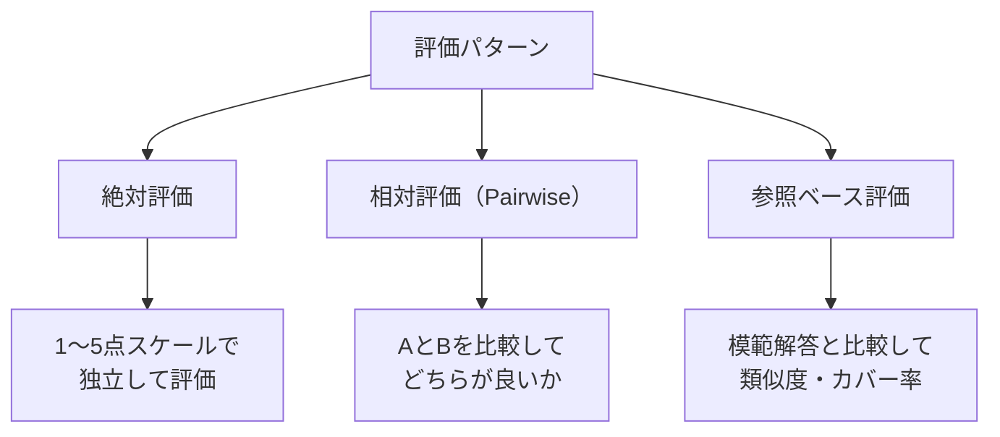

## 概要

LLM-as-a-JudgeはAIがAIの出力を評価する手法です。このレッスンでは、効果的な評価プロンプトの設計・バイアス対策・信頼性の高いスコアリングシステムの実装を学びます。

## 本文

### LLM-as-a-Judgeの評価パターン



### 評価プロンプトの設計

**1. 絶対評価プロンプト**

```python
import anthropic
import json

client = anthropic.Anthropic()

def absolute_judge(
    question: str,
    answer: str,
    rubric: dict[str, str]
) -> dict:
    """ルーブリックベースの絶対評価"""

    rubric_text = "\n".join([f"- {criterion}: {description}"
                             for criterion, description in rubric.items()])

    prompt = f"""以下のルーブリックに基づいてAIの回答を評価してください。

## 評価するAIの回答
質問: {question}
回答: {answer}

## 評価ルーブリック
{rubric_text}

## 評価スケール
1 = 全く満たしていない
2 = 部分的に満たしている
3 = ある程度満たしている
4 = 良く満たしている
5 = 完全に満たしている

## 評価手順
1. 各評価軸を独立して評価してください
2. 根拠を具体的に述べてください
3. 最後に総合評価を出してください

以下のJSONのみで返答してください：
{{
  "scores": {{
    "正確性": {{"score": 1-5, "reason": "理由"}},
    "完全性": {{"score": 1-5, "reason": "理由"}},
    "明確さ": {{"score": 1-5, "reason": "理由"}}
  }},
  "overall_score": 1-5,
  "overall_feedback": "総合コメント",
  "improvement_suggestions": ["改善提案1", "改善提案2"]
}}"""

    response = client.messages.create(
        model="claude-opus-4-5",
        max_tokens=800,
        messages=[{"role": "user", "content": prompt}]
    )

    try:
        return json.loads(response.content[0].text)
    except:
        return {"error": "評価結果のパース失敗"}
```

**2. 相対評価（Pairwise Comparison）**

```python
def pairwise_judge(
    question: str,
    response_a: str,
    response_b: str,
    criteria: str = "正確性・完全性・明確さ"
) -> dict:
    """2つの回答を比較して優れている方を選ぶ"""

    # バイアス対策: AとBをランダムに入れ替えて2回評価
    import random

    def single_comparison(resp1: str, resp2: str, label1: str, label2: str) -> dict:
        prompt = f"""2つのAI回答を比較して、どちらが優れているかを評価してください。

質問: {question}

--- {label1} ---
{resp1}

--- {label2} ---
{resp2}

評価基準: {criteria}

以下のJSONのみで返答してください：
{{
  "winner": "{label1}" または "{label2}" または "tie",
  "confidence": "high/medium/low",
  "reasoning": "判定理由（2〜3文）",
  "strength_of_{label1}": "Aの強み",
  "strength_of_{label2}": "Bの強み"
}}"""

        response = client.messages.create(
            model="claude-opus-4-5",
            max_tokens=400,
            messages=[{"role": "user", "content": prompt}]
        )

        try:
            return json.loads(response.content[0].text)
        except:
            return {"winner": "unknown"}

    # 1回目: A vs B
    result1 = single_comparison(response_a, response_b, "A", "B")
    # 2回目: B vs A (順序を逆にしてポジションバイアスをチェック)
    result2 = single_comparison(response_b, response_a, "B", "A")

    # 両評価の一致を確認
    winner1 = result1.get("winner", "unknown")
    winner2_raw = result2.get("winner", "unknown")
    # result2はB vs A なので、勝者を正規化
    winner2 = winner2_raw

    consistent = (winner1 == winner2) or (winner1 == "tie" and winner2 == "tie")

    return {
        "final_winner": winner1 if consistent else "inconsistent",
        "consistent": consistent,
        "result1": result1,
        "result2": result2,
    }
```

**3. 参照ベース評価**

```python
def reference_based_judge(
    question: str,
    model_answer: str,
    reference_answer: str
) -> dict:
    """模範解答との比較評価"""

    prompt = f"""模範解答と比較してAIの回答を評価してください。

質問: {question}

模範解答（正解）:
{reference_answer}

評価対象のAI回答:
{model_answer}

以下の観点で評価し、JSONで返してください：
{{
  "factual_consistency": 0.0〜1.0（事実の一致度）,
  "coverage": 0.0〜1.0（模範解答のカバー率）,
  "extra_info": "模範解答にない追加情報（ある場合）",
  "missing_info": ["見落とした重要な情報"],
  "hallucinations": ["模範解答と矛盾する情報"],
  "overall_score": 0.0〜1.0
}}"""

    response = client.messages.create(
        model="claude-opus-4-5",
        max_tokens=500,
        messages=[{"role": "user", "content": prompt}]
    )

    try:
        return json.loads(response.content[0].text)
    except:
        return {"error": "評価失敗"}
```

### バイアス対策

LLM-as-a-Judge の主なバイアスと対策:

```python
class BiasReducedJudge:
    """バイアス軽減を組み込んだ評価クラス"""

    def __init__(self):
        self.client = anthropic.Anthropic()

    def evaluate_with_debiasing(
        self,
        question: str,
        answer: str,
        n_samples: int = 3
    ) -> dict:
        """複数回評価して平均を取る（ランダム性のバイアスを軽減）"""
        scores = []

        for _ in range(n_samples):
            result = absolute_judge(
                question, answer,
                {"正確性": "事実が正確か", "完全性": "必要な情報が含まれるか"}
            )
            if "overall_score" in result:
                scores.append(result["overall_score"])

        if not scores:
            return {"error": "評価失敗"}

        return {
            "mean_score": sum(scores) / len(scores),
            "min_score": min(scores),
            "max_score": max(scores),
            "variance": max(scores) - min(scores),
            "samples": n_samples,
            "reliable": (max(scores) - min(scores)) <= 1.0  # スコアのばらつきが1以内
        }
```

## ハンズオン

評価パイプラインとスコアリングシステムを実装してみましょう。

### ステップ1：評価データセットのスコアリング

```python
from dataclasses import dataclass
import anthropic
import json

@dataclass
class EvalCase:
    id: str
    question: str
    answer: str
    reference: str | None = None

def batch_evaluate(
    eval_cases: list[EvalCase],
    judge_model: str = "claude-opus-4-5"
) -> list[dict]:
    """バッチ評価の実行"""
    client = anthropic.Anthropic()
    results = []

    for case in eval_cases:
        rubric = {
            "正確性": "事実として正確かどうか",
            "完全性": "質問に対して必要な情報が揃っているか",
            "明確さ": "わかりやすく説明されているか"
        }

        eval_result = absolute_judge(case.question, case.answer, rubric)

        results.append({
            "id": case.id,
            "question": case.question,
            "scores": eval_result.get("scores", {}),
            "overall": eval_result.get("overall_score"),
            "feedback": eval_result.get("overall_feedback"),
        })

    return results

def generate_eval_report(results: list[dict]) -> str:
    """評価レポートの生成"""
    if not results:
        return "評価結果なし"

    valid = [r for r in results if r.get("overall") is not None]
    if not valid:
        return "有効な評価結果なし"

    scores = [r["overall"] for r in valid]
    avg = sum(scores) / len(scores)
    passed = sum(1 for s in scores if s >= 3.5)

    lines = [
        "# LLM評価レポート",
        f"- 総ケース数: {len(results)}",
        f"- 有効評価数: {len(valid)}",
        f"- 平均スコア: {avg:.2f}/5",
        f"- 合格率（3.5以上）: {passed}/{len(valid)} ({passed/len(valid)*100:.1f}%)",
        "",
        "## 詳細結果",
    ]

    for r in results:
        status = "✓" if r.get("overall", 0) >= 3.5 else "✗"
        lines.append(f"{status} [{r['id']}] スコア: {r.get('overall', 'N/A')}/5")
        if r.get("feedback"):
            lines.append(f"   フィードバック: {r['feedback'][:80]}...")

    return "\n".join(lines)


# テスト（APIなしのモックで動作確認）
mock_cases = [
    EvalCase("Q1", "Pythonとは何ですか？",
             "Pythonはインタープリタ型の汎用プログラミング言語です。読みやすい構文と豊富なライブラリが特徴で、Web開発・データ分析・AIなど幅広い用途に使われています。"),
    EvalCase("Q2", "機械学習とは？",
             "データを使って学習するアルゴリズムです。"),
]

print("評価対象:")
for case in mock_cases:
    print(f"  [{case.id}] Q: {case.question}")
    print(f"       A: {case.answer[:60]}...")
```

## クイズ

<!-- QUIZ:START -->
**Q1. Pairwise Comparison評価でA→BとB→Aの順序を逆にして2回評価する目的はどれですか？**

- A) コストを2倍にするため
- B) ポジションバイアス（先に提示された回答を好む傾向）を検出・軽減するため
- C) より多くの評価データを集めるため
- D) APIの信頼性を確認するため

**正解: B**
**解説:** LLMには「最初に提示された選択肢を好む」ポジションバイアスがあります。AとBを提示する順序を逆にして評価し、両方で同じ勝者が選ばれた場合のみ信頼性が高い評価とみなします。順序を変えると結果が変わる場合は「inconsistent」として処理します。

**Q2. 参照ベース評価（Reference-based Evaluation）の主な活用場面はどれですか？**

- A) 創造的な文章生成の評価
- B) 事実を問う質問（FAQ・知識ベース回答）の正確性評価
- C) 翻訳品質の評価
- D) ユーザーの好みの評価

**正解: B**
**解説:** 参照ベース評価は模範解答（reference）が存在する場合に有効です。FAQの回答・技術的な説明・事実確認など、「正解が明確に存在する」タスクに特に適しています。創造的タスクは正解が存在しないため不向きです。

**Q3. LLM-as-a-Judgeの信頼性を高めるために複数回評価する際に注目すべき指標はどれですか？**

- A) 評価の実行時間
- B) APIのレスポンスサイズ
- C) スコアのばらつき（variance）：評価間でスコアが安定しているかどうか
- D) 使用したトークン数

**正解: C**
**解説:** 同じ入力に対して複数回評価を行い、スコアのばらつき（max - min）が小さければ評価の信頼性が高いと判断できます。ばらつきが大きい場合は評価基準が曖昧か、LLMの確率的な性質による不安定さを示しています。
<!-- QUIZ:END -->

## まとめ

- LLM-as-a-Judgeには絶対評価・相対評価（Pairwise）・参照ベース評価の3パターンがある
- ポジションバイアスを防ぐためにPairwiseでは順序を逆にして2回評価する
- スコアのばらつきを測定して評価の信頼性を定量化する
- 評価プロンプトのルーブリックを明確にすることが評価品質の核心

## 次のレッスン

次のレッスンでは、良い評価データセット（ベンチマーク）の設計原則を学びます。
