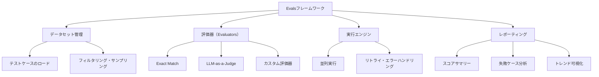

## 概要

Evalsフレームワークは、LLMの評価を体系化・自動化するための仕組みです。このレッスンでは、OpenAI Evalsの概念を参考にしながら、実務で使えるカスタム評価フレームワークを実装します。

## 本文

### Evalsフレームワークの全体像



### カスタムEvalsフレームワークの実装

```python
from abc import ABC, abstractmethod
from dataclasses import dataclass, field
from typing import Any, Callable
from concurrent.futures import ThreadPoolExecutor, as_completed
import anthropic
import json
import time

# --- 評価器の基底クラス ---
class Evaluator(ABC):
    """評価器の基底クラス"""

    @property
    @abstractmethod
    def name(self) -> str:
        pass

    @abstractmethod
    def evaluate(self, prediction: str, reference: str, context: dict) -> float:
        """スコア（0.0〜1.0）を返す"""
        pass

class ExactMatchEvaluator(Evaluator):
    @property
    def name(self):
        return "exact_match"

    def evaluate(self, prediction: str, reference: str, context: dict) -> float:
        return 1.0 if prediction.strip().lower() == reference.strip().lower() else 0.0

class KeywordEvaluator(Evaluator):
    def __init__(self, required_keywords: list[str] | None = None):
        self.required_keywords = required_keywords

    @property
    def name(self):
        return "keyword"

    def evaluate(self, prediction: str, reference: str, context: dict) -> float:
        # contextからキーワードを取得するか、初期化時のキーワードを使う
        keywords = context.get("required_keywords") or self.required_keywords or []
        if not keywords:
            return 1.0
        found = sum(1 for kw in keywords if kw.lower() in prediction.lower())
        return found / len(keywords)

class LLMJudgeEvaluator(Evaluator):
    def __init__(self, judge_model: str = "claude-opus-4-5"):
        self.judge_model = judge_model
        self.client = anthropic.Anthropic()

    @property
    def name(self):
        return "llm_judge"

    def evaluate(self, prediction: str, reference: str, context: dict) -> float:
        criteria = context.get("evaluation_criteria", "正確性・完全性・明確さ")
        question = context.get("input", "")

        prompt = f"""以下のAI回答を1〜5点で評価し、JSONで返してください。

質問: {question}
回答: {prediction}
評価基準: {criteria}

{{"score": 1-5}}"""

        try:
            response = self.client.messages.create(
                model=self.judge_model,
                max_tokens=50,
                messages=[{"role": "user", "content": prompt}]
            )
            result = json.loads(response.content[0].text)
            return result["score"] / 5.0
        except:
            return 0.5  # フォールバック

# --- テストケース ---
@dataclass
class EvalCase:
    id: str
    input: str
    reference: str
    metadata: dict = field(default_factory=dict)

# --- 評価結果 ---
@dataclass
class EvalResult:
    case_id: str
    input: str
    prediction: str
    reference: str
    scores: dict[str, float]
    overall_score: float
    passed: bool
    latency_ms: float
    error: str | None = None

# --- 評価実行エンジン ---
class EvalsRunner:
    """評価実行エンジン"""

    def __init__(
        self,
        generate_fn: Callable[[str], str],
        evaluators: list[Evaluator],
        pass_threshold: float = 0.7,
        max_workers: int = 4
    ):
        self.generate_fn = generate_fn
        self.evaluators = evaluators
        self.pass_threshold = pass_threshold
        self.max_workers = max_workers

    def run_single(self, case: EvalCase) -> EvalResult:
        """単一テストケースの評価"""
        start = time.time()
        try:
            prediction = self.generate_fn(case.input)
            error = None
        except Exception as e:
            prediction = ""
            error = str(e)

        latency_ms = (time.time() - start) * 1000

        # 各評価器でスコアを計算
        scores = {}
        context = {**case.metadata, "input": case.input}
        for evaluator in self.evaluators:
            try:
                scores[evaluator.name] = evaluator.evaluate(
                    prediction, case.reference, context
                )
            except Exception as e:
                scores[evaluator.name] = 0.0

        # 総合スコア（平均）
        overall = sum(scores.values()) / len(scores) if scores else 0.0

        return EvalResult(
            case_id=case.id,
            input=case.input,
            prediction=prediction,
            reference=case.reference,
            scores=scores,
            overall_score=overall,
            passed=overall >= self.pass_threshold,
            latency_ms=latency_ms,
            error=error
        )

    def run(self, cases: list[EvalCase]) -> list[EvalResult]:
        """全テストケースを並列実行"""
        results = []
        with ThreadPoolExecutor(max_workers=self.max_workers) as executor:
            futures = {executor.submit(self.run_single, case): case for case in cases}
            for future in as_completed(futures):
                results.append(future.result())
        return sorted(results, key=lambda r: r.case_id)

    def generate_report(self, results: list[EvalResult]) -> dict:
        """評価レポートの生成"""
        passed = [r for r in results if r.passed]
        failed = [r for r in results if not r.passed]
        errors = [r for r in results if r.error]

        avg_scores = {}
        for evaluator in self.evaluators:
            scores = [r.scores.get(evaluator.name, 0) for r in results]
            avg_scores[evaluator.name] = sum(scores) / len(scores) if scores else 0

        avg_latency = sum(r.latency_ms for r in results) / len(results) if results else 0

        return {
            "summary": {
                "total": len(results),
                "passed": len(passed),
                "failed": len(failed),
                "errors": len(errors),
                "pass_rate": len(passed) / len(results) if results else 0,
            },
            "scores": avg_scores,
            "avg_overall_score": sum(r.overall_score for r in results) / len(results) if results else 0,
            "avg_latency_ms": avg_latency,
            "failed_cases": [
                {"id": r.case_id, "score": r.overall_score, "prediction_preview": r.prediction[:100]}
                for r in failed
            ],
        }
```

## ハンズオン

カスタム評価フレームワークを使ってプロンプト評価を実行してみましょう。

### ステップ1：実際の評価パイプラインの構築

```python
import anthropic

client = anthropic.Anthropic()

def generate_response(user_input: str) -> str:
    """評価対象のLLM呼び出し"""
    response = client.messages.create(
        model="claude-opus-4-5",
        max_tokens=300,
        system="あなたは技術的な質問に答えるアシスタントです。簡潔・正確に回答してください。",
        messages=[{"role": "user", "content": user_input}]
    )
    return response.content[0].text

# テストケースの準備
test_cases = [
    EvalCase(
        id="TC-001",
        input="Pythonの辞書（dict）とは何ですか？",
        reference="キーと値のペアを格納するデータ構造",
        metadata={
            "required_keywords": ["キー", "値", "辞書"],
            "evaluation_criteria": "定義の正確さ・わかりやすさ"
        }
    ),
    EvalCase(
        id="TC-002",
        input="HTTPとHTTPSの違いを教えてください",
        reference="HTTPSはHTTPに暗号化（TLS/SSL）を追加したプロトコル",
        metadata={
            "required_keywords": ["暗号化", "セキュリティ", "SSL", "TLS"],
            "evaluation_criteria": "暗号化の概念と違いの説明"
        }
    ),
]

# 評価器の設定
evaluators = [
    KeywordEvaluator(),
    # LLMJudgeEvaluator(),  # APIコストがかかるため本番環境で使用
]

# 評価実行
runner = EvalsRunner(
    generate_fn=generate_response,
    evaluators=evaluators,
    pass_threshold=0.6,
    max_workers=2
)

print("評価を実行中...")
results = runner.run(test_cases)

# レポート生成
report = runner.generate_report(results)

print("\n=== 評価レポート ===")
print(f"合格率: {report['summary']['pass_rate']:.1%}")
print(f"総合スコア: {report['avg_overall_score']:.2f}")
print(f"平均レイテンシ: {report['avg_latency_ms']:.0f}ms")
print(f"\nスコア詳細: {report['scores']}")

if report["failed_cases"]:
    print("\n失敗したテストケース:")
    for fc in report["failed_cases"]:
        print(f"  [{fc['id']}] スコア: {fc['score']:.2f}")
        print(f"    回答: {fc['prediction_preview']}...")
```

## クイズ

<!-- QUIZ:START -->
**Q1. Evalsフレームワークで評価を並列実行する主な利点はどれですか？**

- A) 評価精度が向上する
- B) 評価の実行時間を大幅に短縮できる
- C) APIのレートリミットを回避できる
- D) メモリ使用量を削減できる

**正解: B**
**解説:** LLMの呼び出しはネットワーク待機時間が主なボトルネックです。ThreadPoolExecutorで並列実行することで、100ケースの評価時間を直列の1/4〜1/8程度に短縮できます。ただしAPIのレートリミットを超えないよう `max_workers` は適切に設定します。

**Q2. カスタム評価器（Evaluator）を基底クラスから継承して実装するメリットはどれですか？**

- A) 実行速度が向上する
- B) 評価器のインターフェースを統一してEvalsRunnerから一様に扱えるようにする
- C) APIコストが削減される
- D) LLMの精度が向上する

**正解: B**
**解説:** 基底クラスを継承することで、KeywordEvaluator・ExactMatchEvaluator・LLMJudgeEvaluatorなど異なる実装を統一インターフェース（`evaluate(prediction, reference, context) -> float`）で扱えます。新しい評価器を追加してもEvalsRunnerを変更する必要がありません。

**Q3. `pass_threshold`（合格閾値）を適切に設定するために必要なステップはどれですか？**

- A) 最初から1.0（完璧を要求）に設定する
- B) 人手評価で「合格」と判断した回答のスコア分布を分析して閾値を決定する
- C) 開発者の直感で設定する
- D) 業界標準の0.8を常に使う

**正解: B**
**解説:** 合格閾値は恣意的に設定するのではなく、人手評価で「合格」と「不合格」の境界を決め、その境界でのスコアを分析して設定します。例えば人間が「合格」と判断した回答の平均スコアが0.72なら閾値を0.7前後に設定します。
<!-- QUIZ:END -->

## まとめ

- Evalsフレームワークはデータセット管理・評価器・実行エンジン・レポーティングの4要素で構成される
- 評価器は基底クラスを継承して統一インターフェースで実装する
- 並列実行で評価時間を大幅に短縮できる
- 合格閾値は人手評価のデータに基づいて設定する

## 次のレッスン

次のレッスンでは、複数のプロンプトバージョンを比較するA/Bテストの設計と実装を学びます。
