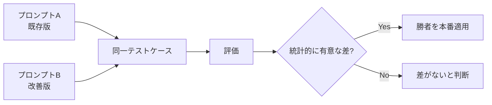

## 概要

プロンプトのA/Bテストは、2つ以上のプロンプトバージョンを比較して統計的に優れた方を選ぶ手法です。統計的有意性の判定・サンプルサイズの計算・偏りのないテスト設計を学びます。

## 本文

### A/Bテストの設計原則



**重要な注意点:**
- 必ず同一のテストデータセットで比較する（異なるデータでは公平な比較にならない）
- 同じ評価指標を使う
- 十分なサンプル数を確保する（統計的有意性のため）

### サンプルサイズの計算

```python
import math

def calculate_sample_size(
    baseline_score: float,
    expected_improvement: float,
    alpha: float = 0.05,  # 有意水準（第一種の誤り）
    power: float = 0.80   # 検出力（1 - 第二種の誤り）
) -> int:
    """必要なサンプルサイズを概算する"""
    # Z値（両側検定）
    z_alpha = 1.96  # α = 0.05
    z_beta = 0.842  # power = 0.80

    p1 = baseline_score
    p2 = baseline_score + expected_improvement

    # プール標準偏差（二項分布近似）
    p_pool = (p1 + p2) / 2
    std = math.sqrt(2 * p_pool * (1 - p_pool))

    # Cohen's d（効果量）
    effect_size = abs(p2 - p1) / std if std > 0 else 0

    if effect_size == 0:
        return float('inf')

    # サンプルサイズの計算（各グループ）
    n = ((z_alpha + z_beta) / effect_size) ** 2

    return math.ceil(n)

# 使用例
baseline = 0.70  # 現在のパス率 70%
improvement = 0.05  # 5%ポイントの改善を検出したい

n = calculate_sample_size(baseline, improvement)
print(f"必要サンプルサイズ（各グループ）: {n}")
print(f"合計テストケース数: {n * 2}")
```

### A/Bテストの実装

```python
import anthropic
import json
import random
from dataclasses import dataclass, field
from typing import Callable

@dataclass
class ABTestResult:
    test_name: str
    variant_a_name: str
    variant_b_name: str
    n_cases: int
    scores_a: list[float] = field(default_factory=list)
    scores_b: list[float] = field(default_factory=list)

    @property
    def mean_a(self) -> float:
        return sum(self.scores_a) / len(self.scores_a) if self.scores_a else 0

    @property
    def mean_b(self) -> float:
        return sum(self.scores_b) / len(self.scores_b) if self.scores_b else 0

    @property
    def winner(self) -> str:
        if self.mean_b > self.mean_a:
            return self.variant_b_name
        elif self.mean_a > self.mean_b:
            return self.variant_a_name
        return "tie"

    @property
    def improvement(self) -> float:
        return self.mean_b - self.mean_a

    def is_significant(self, threshold: float = 0.01) -> bool:
        """スコアの差が有意かどうかを簡易判定"""
        return abs(self.improvement) > threshold

class PromptABTester:
    """プロンプトA/Bテスター"""

    def __init__(self):
        self.client = anthropic.Anthropic()

    def evaluate_response(
        self,
        question: str,
        response: str,
        keywords: list[str]
    ) -> float:
        """レスポンスのスコアを計算（キーワードベース）"""
        if not keywords:
            return 1.0 if len(response) > 50 else 0.5
        found = sum(1 for kw in keywords if kw.lower() in response.lower())
        return found / len(keywords)

    def run_ab_test(
        self,
        test_name: str,
        variant_a: dict,  # {"name": str, "template": str}
        variant_b: dict,
        test_cases: list[dict],
        shuffle: bool = True
    ) -> ABTestResult:
        """A/Bテストを実行"""
        if shuffle:
            test_cases = random.sample(test_cases, len(test_cases))

        result = ABTestResult(
            test_name=test_name,
            variant_a_name=variant_a["name"],
            variant_b_name=variant_b["name"],
            n_cases=len(test_cases),
        )

        for case in test_cases:
            for variant, scores in [(variant_a, result.scores_a), (variant_b, result.scores_b)]:
                prompt = variant["template"].format(**case)

                response = self.client.messages.create(
                    model="claude-opus-4-5",
                    max_tokens=300,
                    messages=[{"role": "user", "content": prompt}]
                ).content[0].text

                score = self.evaluate_response(
                    case.get("question", ""),
                    response,
                    case.get("keywords", [])
                )
                scores.append(score)

        return result

    def generate_report(self, result: ABTestResult) -> str:
        """A/Bテスト結果レポートを生成"""
        lines = [
            f"# A/Bテスト結果: {result.test_name}",
            "",
            f"## 概要",
            f"- テストケース数: {result.n_cases}",
            f"- バリアントA ({result.variant_a_name}): {result.mean_a:.3f}",
            f"- バリアントB ({result.variant_b_name}): {result.mean_b:.3f}",
            f"- 差分: {result.improvement:+.3f} ({result.improvement*100:+.1f}%)",
            "",
            f"## 判定",
            f"- 勝者: **{result.winner}**",
            f"- 統計的有意性: {'有意な差あり' if result.is_significant() else '有意な差なし'}",
        ]

        if result.winner == result.variant_b_name and result.is_significant():
            lines.append("\n**推奨**: バリアントBを本番に適用することを推奨します。")
        elif result.winner == result.variant_a_name:
            lines.append("\n**推奨**: バリアントAを継続使用することを推奨します。")
        else:
            lines.append("\n**推奨**: 有意な差がないため、より多くのデータを収集してください。")

        return "\n".join(lines)
```

## ハンズオン

実際にA/Bテストを設計・実行してみましょう。

### ステップ1：テストの設計と実行

```python
# テストケースの準備
test_cases = [
    {
        "question": "機械学習とは何ですか？",
        "keywords": ["データ", "学習", "アルゴリズム", "予測"]
    },
    {
        "question": "Webアプリケーションのセキュリティについて教えてください",
        "keywords": ["認証", "暗号化", "HTTPS", "XSS", "SQL"]
    },
    {
        "question": "クラウドコンピューティングの利点は？",
        "keywords": ["スケーラビリティ", "コスト", "可用性", "柔軟性"]
    },
]

# バリアントの定義
variant_a = {
    "name": "シンプルプロンプト",
    "template": "{question}"
}

variant_b = {
    "name": "構造化プロンプト",
    "template": """以下の質問に対して、エンジニア向けに具体的で実用的な回答をしてください。
重要な概念を3〜5個含め、可能であれば具体例も挙げてください。

質問: {question}"""
}

# サンプルサイズの事前計算
n_needed = calculate_sample_size(0.65, 0.10)
print(f"統計的有意性のために必要なサンプル数（各グループ）: {n_needed}")
print(f"現在のテストケース数: {len(test_cases)} （実際の評価には不足。概念確認用）")

# A/Bテストの実行（APIコストがかかるため、デモ用に小規模で実行）
tester = PromptABTester()

# モックの結果で説明
mock_result = ABTestResult(
    test_name="プロンプト構造化テスト",
    variant_a_name="シンプルプロンプト",
    variant_b_name="構造化プロンプト",
    n_cases=3,
    scores_a=[0.50, 0.60, 0.55],  # 平均 0.55
    scores_b=[0.80, 0.75, 0.85],  # 平均 0.80
)

print("\n" + "="*50)
print(tester.generate_report(mock_result))
```

## クイズ

<!-- QUIZ:START -->
**Q1. A/Bテストで「統計的有意性」が重要な理由はどれですか？**

- A) APIコストを削減するため
- B) 偶然の差と本当の改善を区別するため
- C) テスト速度を向上させるため
- D) バリアントの数を増やすため

**正解: B**
**解説:** 少ないサンプルでは偶然によってスコアが高くなることがあります（例: 3ケースで全てBが優れていても偶然の可能性が高い）。統計的有意性検定により、観測された差が偶然ではなく本当の改善であることを確認します。

**Q2. A/Bテストを実施する際に「同一のテストデータセット」を使う理由はどれですか？**

- A) 実装が簡単になるから
- B) テストデータの違いによる影響を排除して純粋にプロンプトの差を比較するため
- C) APIコストを削減するため
- D) 評価時間を短縮するため

**正解: B**
**解説:** 異なるデータセットで比較すると、データセットの難易度の差がスコアに影響してしまいます。同一のテストケースを両方のバリアントに適用することで、プロンプトの差だけを純粋に評価できます。

**Q3. サンプルサイズの計算で「期待する改善量」が小さいほど必要サンプル数が多くなる理由はどれですか？**

- A) 計算が複雑になるから
- B) 小さな差を偶然ではなく統計的に有意と判断するには、より多くのデータが必要だから
- C) APIのレートリミットがあるから
- D) 評価器の精度が低いから

**正解: B**
**解説:** 5%ポイントの改善（0.70→0.75）と1%ポイントの改善（0.70→0.71）では、1%の改善は偶然の揺れと区別するためにより多くのデータが必要です。効果量（effect size）が小さいほど必要サンプルサイズは指数的に増加します。
<!-- QUIZ:END -->

## まとめ

- A/Bテストはプロンプト改善を統計的に検証するための必須手法
- テスト前に必要サンプルサイズを計算して、十分なデータ量を確保する
- 必ず同一のテストデータで両バリアントを比較する
- 統計的有意性の判定で偶然の差と真の改善を区別する

## 次のレッスン

次のレッスンでは、プロンプト変更時に品質が劣化しないことを確認する回帰テストの設計方法を学びます。
