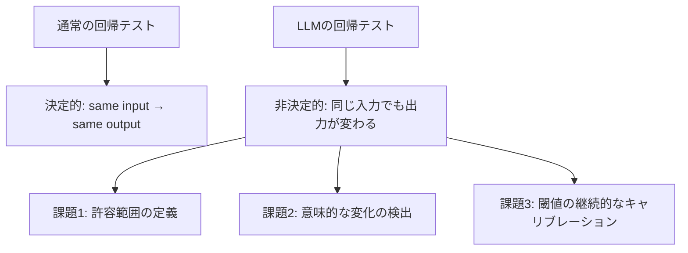

## 概要

プロンプトやモデルを変更した際に、既存の機能が壊れていないことを自動確認する回帰テストは、品質保証の要です。このレッスンでは、LLMに特化した回帰テストの設計とCI/CDへの組み込みを学びます。

## 本文

### LLMの回帰テストが難しい理由



### 回帰テストの設計パターン

**1. スコアベースの回帰テスト**

```python
from dataclasses import dataclass
import anthropic
import json

@dataclass
class RegressionBaseline:
    """回帰テストのベースライン"""
    test_id: str
    prompt_version: str
    model: str
    avg_score: float
    min_score: float
    pass_rate: float
    evaluated_at: str

class RegressionTestSuite:
    """LLM回帰テストスイート"""

    def __init__(
        self,
        test_cases: list[dict],
        evaluator,
        regression_threshold: float = 0.05  # 5%以上の低下を検出
    ):
        self.test_cases = test_cases
        self.evaluator = evaluator
        self.regression_threshold = regression_threshold
        self.baselines: dict[str, RegressionBaseline] = {}

    def run_and_score(self, prompt_fn, model: str = "claude-opus-4-5") -> dict:
        """テストを実行してスコアを計算"""
        client = anthropic.Anthropic()
        scores = []

        for case in self.test_cases:
            response = client.messages.create(
                model=model,
                max_tokens=300,
                messages=[{"role": "user", "content": prompt_fn(case["input"])}]
            ).content[0].text

            score = self.evaluator(response, case.get("reference", ""), case)
            scores.append(score)

        passed = sum(1 for s in scores if s >= 0.7)
        return {
            "scores": scores,
            "avg_score": sum(scores) / len(scores),
            "min_score": min(scores),
            "pass_rate": passed / len(scores),
        }

    def establish_baseline(
        self,
        baseline_id: str,
        prompt_fn,
        prompt_version: str,
        model: str = "claude-opus-4-5"
    ) -> RegressionBaseline:
        """ベースラインを確立する"""
        from datetime import datetime

        result = self.run_and_score(prompt_fn, model)
        baseline = RegressionBaseline(
            test_id=baseline_id,
            prompt_version=prompt_version,
            model=model,
            avg_score=result["avg_score"],
            min_score=result["min_score"],
            pass_rate=result["pass_rate"],
            evaluated_at=datetime.utcnow().isoformat(),
        )
        self.baselines[baseline_id] = baseline
        return baseline

    def run_regression_test(
        self,
        baseline_id: str,
        new_prompt_fn,
        new_version: str,
        model: str = "claude-opus-4-5"
    ) -> dict:
        """回帰テストを実行して比較"""
        if baseline_id not in self.baselines:
            return {"error": f"ベースライン '{baseline_id}' が見つかりません"}

        baseline = self.baselines[baseline_id]
        result = self.run_and_score(new_prompt_fn, model)

        # 回帰の検出
        score_regression = baseline.avg_score - result["avg_score"]
        pass_rate_regression = baseline.pass_rate - result["pass_rate"]

        regressions = []
        if score_regression > self.regression_threshold:
            regressions.append(
                f"平均スコアが {score_regression:.1%} 低下 "
                f"({baseline.avg_score:.2f} → {result['avg_score']:.2f})"
            )
        if pass_rate_regression > self.regression_threshold:
            regressions.append(
                f"合格率が {pass_rate_regression:.1%} 低下 "
                f"({baseline.pass_rate:.1%} → {result['pass_rate']:.1%})"
            )

        return {
            "baseline": {
                "version": baseline.prompt_version,
                "avg_score": baseline.avg_score,
                "pass_rate": baseline.pass_rate,
            },
            "current": {
                "version": new_version,
                "avg_score": result["avg_score"],
                "pass_rate": result["pass_rate"],
            },
            "regressions": regressions,
            "passed": len(regressions) == 0,
        }
```

**2. スナップショットテスト（クリティカルな動作の保護）**

```python
class SnapshotTester:
    """クリティカルな動作のスナップショットテスト"""

    def __init__(self):
        self.client = anthropic.Anthropic()
        self.snapshots: dict[str, dict] = {}

    def create_snapshot(self, test_id: str, system_prompt: str, test_input: str):
        """スナップショットを作成"""
        response = self.client.messages.create(
            model="claude-opus-4-5",
            max_tokens=200,
            system=system_prompt,
            messages=[{"role": "user", "content": test_input}]
        ).content[0].text

        # 重要な特性を記録（全文ではなく特性を保存）
        self.snapshots[test_id] = {
            "input": test_input,
            "characteristics": {
                "not_empty": len(response) > 0,
                "length_range": (50, 500),
                "no_refusal": "できません" not in response and "無理" not in response,
                "expected_keywords_present": [],  # 事後に設定
            },
            "sample_response": response[:200],
        }
        return self.snapshots[test_id]

    def verify_snapshot(
        self,
        test_id: str,
        system_prompt: str,
        critical_behaviors: dict[str, callable]
    ) -> dict:
        """スナップショットに対して重要な動作を検証"""
        if test_id not in self.snapshots:
            return {"error": "スナップショットが存在しません"}

        snapshot = self.snapshots[test_id]

        response = self.client.messages.create(
            model="claude-opus-4-5",
            max_tokens=200,
            system=system_prompt,
            messages=[{"role": "user", "content": snapshot["input"]}]
        ).content[0].text

        results = {}
        for behavior_name, check_fn in critical_behaviors.items():
            try:
                results[behavior_name] = check_fn(response)
            except Exception as e:
                results[behavior_name] = False

        all_passed = all(results.values())
        return {
            "test_id": test_id,
            "passed": all_passed,
            "results": results,
            "failed_behaviors": [k for k, v in results.items() if not v],
        }
```

**3. CI/CDへの組み込み**

```python
# ci_eval.py - CI/CDで実行するスクリプト
import sys

def run_ci_evaluation() -> bool:
    """CI/CD用の評価実行（失敗時はexit(1)）"""

    # テストケース
    test_cases = [
        {"input": "Pythonでリストを逆順にする方法は？",
         "reference": "reverse,reversed",
         "keywords": ["reverse", "[::-1]", "reversed"]},
        {"input": "SQLのJOINの種類を教えてください",
         "reference": "INNER,LEFT,RIGHT,FULL",
         "keywords": ["INNER JOIN", "LEFT JOIN", "OUTER"]},
    ]

    def keyword_evaluator(response: str, reference: str, case: dict) -> float:
        keywords = case.get("keywords", [])
        if not keywords:
            return 1.0
        found = sum(1 for kw in keywords if kw.lower() in response.lower())
        return found / len(keywords)

    def simple_prompt_fn(text: str) -> str:
        return text

    # テスト実行
    suite = RegressionTestSuite(test_cases, keyword_evaluator)

    # ベースラインがない場合は確立して終了
    if not suite.baselines:
        print("ベースラインを確立します...")
        baseline = suite.establish_baseline("v1", simple_prompt_fn, "v1.0")
        print(f"ベースライン確立: avg_score={baseline.avg_score:.2f}")
        print("ベースラインを保存して次回から比較します")
        return True  # 初回は常に成功

    # 回帰テスト実行
    result = suite.run_regression_test("v1", simple_prompt_fn, "v1.1")

    if not result.get("passed", False):
        print("❌ 回帰テスト失敗！")
        for regression in result.get("regressions", []):
            print(f"  - {regression}")
        return False

    print(f"✓ 回帰テスト通過")
    print(f"  avg_score: {result['current']['avg_score']:.2f}")
    print(f"  pass_rate: {result['current']['pass_rate']:.1%}")
    return True

if __name__ == "__main__":
    success = run_ci_evaluation()
    sys.exit(0 if success else 1)
```

## ハンズオン

GitHub Actionsに組み込む評価ワークフローを設計してみましょう。

### ステップ1：GitHub Actions ワークフローの設定

```yaml
# .github/workflows/prompt-eval.yml
name: Prompt Regression Test

on:
  pull_request:
    paths:
      - 'prompts/**'
      - 'src/ai/**'

jobs:
  eval:
    runs-on: ubuntu-latest
    steps:
      - uses: actions/checkout@v4

      - name: Set up Python
        uses: actions/setup-python@v5
        with:
          python-version: '3.11'

      - name: Install dependencies
        run: pip install anthropic

      - name: Run regression tests
        env:
          ANTHROPIC_API_KEY: ${{ secrets.ANTHROPIC_API_KEY }}
        run: python ci_eval.py

      - name: Upload eval results
        if: always()
        uses: actions/upload-artifact@v4
        with:
          name: eval-results
          path: eval_results.json
```

### ステップ2：評価結果のJSON出力

```python
import json
from datetime import datetime

def save_eval_results(results: dict, output_path: str = "eval_results.json"):
    """評価結果をJSONファイルに保存（CI/CDアーティファクト用）"""
    output = {
        "timestamp": datetime.utcnow().isoformat(),
        "results": results,
        "summary": {
            "passed": results.get("passed", False),
            "regressions": results.get("regressions", []),
        }
    }

    with open(output_path, "w") as f:
        json.dump(output, f, indent=2, ensure_ascii=False)

    print(f"評価結果を保存: {output_path}")
```

## クイズ

<!-- QUIZ:START -->
**Q1. LLMの回帰テストが通常のソフトウェアの回帰テストと異なる主な点はどれですか？**

- A) LLMのテストは不要
- B) 非決定的な出力のため、完全一致ではなくスコアと閾値で「回帰」を判定する
- C) LLMはバグが発生しないため
- D) LLMのテストは手動でのみ実施できる

**正解: B**
**解説:** 通常のソフトウェアはassert文で完全一致を確認できますが、LLMは同じ入力でも微妙に異なる出力をします。そのため「平均スコアが5%以上低下したら回帰」のように、スコアと閾値を使って意味的な変化を検出します。

**Q2. スナップショットテストでレスポンスの全文ではなく「特性」を保存する理由はどれですか？**

- A) ファイルサイズを小さくするため
- B) LLMの非決定性により全文一致は不可能で、重要な動作特性（拒否しない・特定キーワードを含む等）の保護が目的
- C) 保存コストを削減するため
- D) デバッグを困難にするため

**正解: B**
**解説:** LLMは同じ入力に毎回全く同じ文章を返しません。そのため「回答が空でない」「特定のキーワードを含む」「拒否メッセージを含まない」などの特性（behaviors）を保存して、次回も同じ特性を持つかを検証します。

**Q3. 回帰テストをGitHub Actionsに組み込む際、`paths` フィルターを設定する主な目的はどれですか？**

- A) リポジトリのセキュリティを向上させる
- B) プロンプト・AIコードの変更時のみ評価を実行して、無関係な変更でのAPIコスト消費を防ぐ
- C) テストの実行速度を向上させる
- D) 複数ブランチでの同時実行を防ぐ

**正解: B**
**解説:** LLMの評価はAPIコストが発生します。`paths` フィルターで `prompts/**` や `src/ai/**` の変更時のみ実行することで、ドキュメント変更やインフラ変更でも毎回評価が実行されるAPIコストの無駄を防ぎます。
<!-- QUIZ:END -->

## まとめ

- LLMの回帰テストはスコアと閾値を使って「有意な品質低下」を検出する
- スナップショットテストでクリティカルな動作特性（拒否・特定キーワード等）を保護する
- GitHub Actionsなどに組み込んでプロンプト変更のたびに自動実行する
- `paths` フィルターで関連ファイルの変更時のみ実行してコストを最適化する

## 次のレッスン

次のレッスンでは、RAGシステム固有の評価フレームワーク「RAGAS」を使った検索・回答品質の測定方法を学びます。
