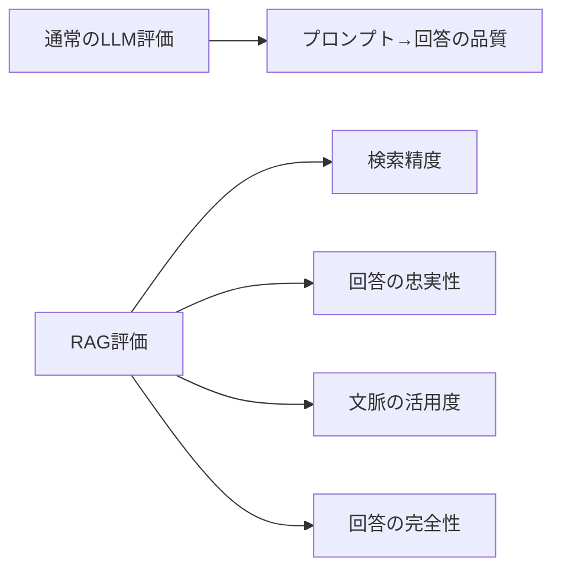

## 概要

RAGASはRAGシステムの品質を測定するフレームワークです。検索精度・回答の忠実性・文脈の活用度など、RAG固有の評価指標とその実装方法を学びます。

## 本文

### RAGシステムの評価課題

通常のLLM評価とRAG評価の違い：



RAGには「検索」と「生成」の2段階があるため、それぞれを評価する必要があります。

### RAGASの主要指標

**1. Faithfulness（忠実性）**

生成された回答が取得したコンテキストのみに基づいているかを測定します。

```python
import anthropic
import json

client = anthropic.Anthropic()

def measure_faithfulness(
    question: str,
    answer: str,
    contexts: list[str]
) -> float:
    """回答がコンテキストに忠実かを評価（0〜1）"""

    context_text = "\n\n---\n\n".join(contexts)

    prompt = f"""以下の回答が、提供されたコンテキストのみに基づいているかを評価してください。

コンテキスト:
{context_text}

質問: {question}

回答: {answer}

評価手順:
1. 回答の各文/主張を特定する
2. 各主張がコンテキストから支持されているかを確認する
3. コンテキストにない情報（ハルシネーション）を特定する

以下のJSONのみで返答してください：
{{
  "supported_claims": ["コンテキストで支持された主張"],
  "unsupported_claims": ["コンテキストに根拠のない主張"],
  "faithfulness_score": 0.0〜1.0,
  "reasoning": "評価理由"
}}"""

    response = client.messages.create(
        model="claude-opus-4-5",
        max_tokens=600,
        messages=[{"role": "user", "content": prompt}]
    )

    try:
        result = json.loads(response.content[0].text)
        return result.get("faithfulness_score", 0.0)
    except:
        return 0.0
```

**2. Answer Relevance（回答の関連性）**

回答が元の質問に答えているかを測定します。

```python
def measure_answer_relevance(question: str, answer: str) -> float:
    """回答が質問に関連しているかを評価（0〜1）"""

    prompt = f"""以下の回答が質問に対して適切に答えているかを評価してください。

質問: {question}

回答: {answer}

評価基準:
- 質問の意図を正確に理解して答えているか
- 直接的に質問に回答しているか（冗長または無関係な情報が少ないか）
- 必要な情報が含まれているか

以下のJSONのみで返答してください：
{{
  "relevance_score": 0.0〜1.0,
  "addresses_question": true/false,
  "irrelevant_content": "無関係な内容（ある場合）",
  "reasoning": "評価理由"
}}"""

    response = client.messages.create(
        model="claude-opus-4-5",
        max_tokens=300,
        messages=[{"role": "user", "content": prompt}]
    )

    try:
        result = json.loads(response.content[0].text)
        return result.get("relevance_score", 0.0)
    except:
        return 0.0
```

**3. Context Precision（コンテキスト精度）**

取得したコンテキストのうち、回答に実際に使われた有用なものの割合です。

```python
def measure_context_precision(
    question: str,
    answer: str,
    contexts: list[str]
) -> float:
    """取得したコンテキストの精度（不要なコンテキストが少ないか）を評価"""

    results = []
    for i, context in enumerate(contexts):
        prompt = f"""以下のコンテキストが、質問への回答に役立ったかを評価してください。

質問: {question}
回答: {answer}

コンテキスト {i+1}:
{context}

このコンテキストは回答に貢献しましたか？以下のJSONのみで返答：
{{"is_useful": true/false, "reasoning": "理由（1文）"}}"""

        response = client.messages.create(
            model="claude-opus-4-5",
            max_tokens=100,
            messages=[{"role": "user", "content": prompt}]
        )

        try:
            result = json.loads(response.content[0].text)
            results.append(1.0 if result.get("is_useful") else 0.0)
        except:
            results.append(0.5)

    return sum(results) / len(results) if results else 0.0
```

**4. Context Recall（コンテキスト再現率）**

回答に必要な情報が取得したコンテキストに含まれているかを測定します。

```python
def measure_context_recall(
    question: str,
    ground_truth: str,  # 正解の回答
    contexts: list[str]
) -> float:
    """正解回答の情報がコンテキストにどれだけ含まれているかを評価"""

    context_text = "\n\n---\n\n".join(contexts)

    prompt = f"""正解の回答と取得したコンテキストを比較して、
コンテキストが正解の情報をどれだけカバーしているかを評価してください。

正解の回答:
{ground_truth}

取得したコンテキスト:
{context_text}

以下のJSONのみで返答：
{{
  "covered_info": ["コンテキストでカバーされている情報"],
  "missing_info": ["コンテキストに含まれていない重要情報"],
  "recall_score": 0.0〜1.0
}}"""

    response = client.messages.create(
        model="claude-opus-4-5",
        max_tokens=400,
        messages=[{"role": "user", "content": prompt}]
    )

    try:
        result = json.loads(response.content[0].text)
        return result.get("recall_score", 0.0)
    except:
        return 0.0
```

### RAGAS総合スコアの計算

```python
from dataclasses import dataclass

@dataclass
class RAGASScore:
    faithfulness: float
    answer_relevance: float
    context_precision: float
    context_recall: float

    @property
    def overall(self) -> float:
        """総合スコア（4指標の平均）"""
        return (self.faithfulness + self.answer_relevance +
                self.context_precision + self.context_recall) / 4

    def to_report(self) -> str:
        return f"""RAGAS評価スコア:
- 忠実性 (Faithfulness):        {self.faithfulness:.2f}
- 回答関連性 (Answer Relevance): {self.answer_relevance:.2f}
- 文脈精度 (Context Precision):  {self.context_precision:.2f}
- 文脈再現率 (Context Recall):   {self.context_recall:.2f}
- 総合スコア:                    {self.overall:.2f}"""

def evaluate_rag(
    question: str,
    answer: str,
    contexts: list[str],
    ground_truth: str | None = None
) -> RAGASScore:
    """RAGシステムの総合評価"""
    faithfulness = measure_faithfulness(question, answer, contexts)
    relevance = measure_answer_relevance(question, answer)
    precision = measure_context_precision(question, answer, contexts)
    recall = measure_context_recall(question, ground_truth or answer, contexts) if ground_truth else 0.5

    return RAGASScore(
        faithfulness=faithfulness,
        answer_relevance=relevance,
        context_precision=precision,
        context_recall=recall,
    )
```

## ハンズオン

RAGシステムの評価パイプラインを実装してみましょう。

### ステップ1：RAG評価テストスイート

```python
def run_rag_evaluation(test_cases: list[dict]) -> dict:
    """RAGシステムの一括評価"""
    scores_list = []
    results = []

    for case in test_cases:
        print(f"評価中: {case['question'][:40]}...")

        score = evaluate_rag(
            question=case["question"],
            answer=case["answer"],
            contexts=case["contexts"],
            ground_truth=case.get("ground_truth")
        )

        scores_list.append(score)
        results.append({
            "question": case["question"],
            "score": score.overall,
            "details": {
                "faithfulness": score.faithfulness,
                "relevance": score.answer_relevance,
                "precision": score.context_precision,
                "recall": score.context_recall,
            }
        })

    # 集計
    avg_scores = {
        "faithfulness": sum(s.faithfulness for s in scores_list) / len(scores_list),
        "answer_relevance": sum(s.answer_relevance for s in scores_list) / len(scores_list),
        "context_precision": sum(s.context_precision for s in scores_list) / len(scores_list),
        "context_recall": sum(s.context_recall for s in scores_list) / len(scores_list),
        "overall": sum(s.overall for s in scores_list) / len(scores_list),
    }

    return {"average_scores": avg_scores, "details": results}

# テストデータ（モック）
test_cases = [
    {
        "question": "MCPとは何ですか？",
        "contexts": [
            "Model Context Protocol（MCP）はAIと外部ツールを接続する標準プロトコルです。",
            "MCPはAnthropic社が2024年11月に公開したオープン仕様です。",
        ],
        "answer": "MCPとはModel Context Protocolの略で、AIと外部ツールを標準化されたプロトコルで接続する仕組みです。",
        "ground_truth": "MCPはAIと外部ツール・データソースを接続する標準プロトコルです。",
    },
]

print("RAG評価を実行中...")
print("（実際のAPI呼び出しはコストがかかります。テスト用データのデモ）")

print(f"\nテストケース: {test_cases[0]['question']}")
print(f"回答: {test_cases[0]['answer'][:60]}...")
print(f"コンテキスト数: {len(test_cases[0]['contexts'])} 件")
print("\n評価指標: Faithfulness / Answer Relevance / Context Precision / Context Recall")
```

## クイズ

<!-- QUIZ:START -->
**Q1. RAGASの「Faithfulness（忠実性）」スコアが低い場合、何が問題と考えられますか？**

- A) 検索エンジンの速度が低い
- B) 生成されたAI回答がコンテキスト（取得文書）に含まれない情報を含んでいる（ハルシネーション）
- C) データベースのインデックスが壊れている
- D) プロンプトが長すぎる

**正解: B**
**解説:** FaithfulnessはAIの回答が取得したコンテキストのみに基づいているかを測定します。スコアが低い場合は、AIが「コンテキストにない情報」を生成（ハルシネーション）しています。解決策はプロンプトで「コンテキストに記載のない情報は答えない」と指示することです。

**Q2. Context Precision（文脈精度）とContext Recall（文脈再現率）の違いとして正しいものはどれですか？**

- A) Precisionは速度を、Recallは精度を測る
- B) Precisionは「取得したコンテキストのうち有用なものの割合」、Recallは「正解に必要な情報がコンテキストに含まれる割合」
- C) どちらも同じ指標の別名
- D) Precisionは検索段階、Recallは生成段階を評価する

**正解: B**
**解説:** Context Precisionは「取得した文書のうちどれだけが実際に役立ったか」（不要な文書が少ないか）を測ります。Context Recallは「正解に必要な情報が取得できているか」を測ります。Precision↑はノイズが少ない、Recall↑は必要情報の取得漏れが少ないことを意味します。

**Q3. RAGシステムでContext Recallが低い場合の最初の改善策はどれですか？**

- A) LLMをより大きなモデルに変更する
- B) チャンキング戦略や検索アルゴリズムを改善して必要な文書を確実に取得する
- C) プロンプトを短くする
- D) データベースのストレージを増やす

**正解: B**
**解説:** Context Recallが低い（必要な情報がコンテキストに含まれていない）場合、問題は検索段階にあります。チャンキングサイズ・埋め込みモデル・検索アルゴリズム（ベクトル検索・キーワード検索・ハイブリッド検索）を見直すことが先決です。
<!-- QUIZ:END -->

## まとめ

- RAGASはRAGシステム固有の4指標（忠実性・回答関連性・文脈精度・文脈再現率）で評価する
- 忠実性が低い場合はプロンプト改善、文脈再現率が低い場合は検索改善が先決
- LLM-as-a-Judgeで各指標を自動評価できるが、APIコストを考慮した実行頻度の設計が重要
- 4指標を総合した評価スコアでRAGシステムの継続的改善を追跡する

## 次のレッスン

次のレッスンでは、本番環境でのAIシステムの品質モニタリングと継続的改善サイクルの設計を学びます。
