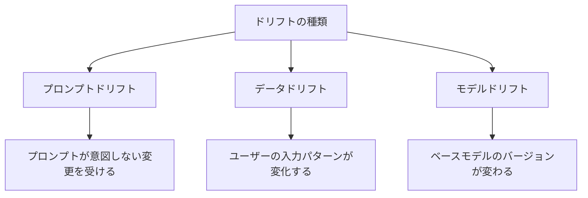

## 概要

本番環境でのAIシステムは、時間の経過とともに品質が変化します。プロンプトドリフト・データドリフトを検出し、継続的に品質を改善するモニタリングシステムの設計を学びます。

## 本文

### AIシステムのドリフトとは



### 本番モニタリングの設計

```python
from dataclasses import dataclass, field
from datetime import datetime, timedelta
from collections import deque
import statistics
import json

@dataclass
class ProductionMetric:
    """本番環境のメトリクス"""
    timestamp: str
    request_id: str
    input_length: int
    output_length: int
    latency_ms: float
    quality_score: float | None  # サンプリングで評価
    user_feedback: int | None  # 1=良い, -1=悪い, None=未評価
    error: bool = False

class ProductionMonitor:
    """本番AIシステムのモニタリング"""

    def __init__(self, window_size: int = 1000):
        self.window_size = window_size
        self.metrics: deque[ProductionMetric] = deque(maxlen=window_size)
        self.alerts: list[dict] = []

    def record(self, metric: ProductionMetric):
        """メトリクスを記録"""
        self.metrics.append(metric)
        self._check_alerts()

    def _check_alerts(self):
        """アラート条件のチェック"""
        if len(self.metrics) < 10:
            return

        recent = list(self.metrics)[-50:]  # 直近50件

        # エラー率のチェック
        error_rate = sum(1 for m in recent if m.error) / len(recent)
        if error_rate > 0.05:  # 5%以上
            self._fire_alert("error_rate", f"エラー率が高い: {error_rate:.1%}")

        # レイテンシのチェック
        latencies = [m.latency_ms for m in recent]
        avg_latency = statistics.mean(latencies)
        if avg_latency > 5000:  # 5秒以上
            self._fire_alert("high_latency", f"平均レイテンシが高い: {avg_latency:.0f}ms")

        # 品質スコアの低下チェック
        quality_scores = [m.quality_score for m in recent if m.quality_score is not None]
        if len(quality_scores) >= 5:
            avg_quality = statistics.mean(quality_scores)
            if avg_quality < 0.6:
                self._fire_alert("low_quality", f"品質スコアが低下: {avg_quality:.2f}")

    def _fire_alert(self, alert_type: str, message: str):
        """アラートを発火"""
        alert = {
            "type": alert_type,
            "message": message,
            "timestamp": datetime.utcnow().isoformat(),
        }
        self.alerts.append(alert)
        print(f"[ALERT] {message}")

    def get_statistics(self, hours: int = 24) -> dict:
        """指定時間のシステム統計を取得"""
        if not self.metrics:
            return {}

        all_metrics = list(self.metrics)

        return {
            "total_requests": len(all_metrics),
            "error_rate": sum(1 for m in all_metrics if m.error) / len(all_metrics),
            "avg_latency_ms": statistics.mean(m.latency_ms for m in all_metrics),
            "p95_latency_ms": sorted(m.latency_ms for m in all_metrics)[int(len(all_metrics) * 0.95)],
            "avg_quality_score": statistics.mean(
                m.quality_score for m in all_metrics if m.quality_score is not None
            ) if any(m.quality_score for m in all_metrics) else None,
            "positive_feedback_rate": sum(
                1 for m in all_metrics if m.user_feedback == 1
            ) / max(sum(1 for m in all_metrics if m.user_feedback is not None), 1),
        }
```

### サンプリングベースの品質評価

```python
import random
import anthropic

class SamplingEvaluator:
    """本番リクエストのサンプリング評価"""

    def __init__(self, sample_rate: float = 0.1):
        self.sample_rate = sample_rate
        self.client = anthropic.Anthropic()

    def should_evaluate(self) -> bool:
        """評価するかどうかをサンプリングで決定"""
        return random.random() < self.sample_rate

    def evaluate_production_response(
        self,
        question: str,
        response: str
    ) -> float | None:
        """本番レスポンスの品質を評価（サンプリング）"""
        if not self.should_evaluate():
            return None

        prompt = f"""以下のAI応答を評価してください（1〜5点）。

質問: {question}
回答: {response}

{{"score": 1-5}}"""

        try:
            result = self.client.messages.create(
                model="claude-opus-4-5",  # 安価な評価用モデル
                max_tokens=30,
                messages=[{"role": "user", "content": prompt}]
            )
            parsed = json.loads(result.content[0].text)
            return parsed["score"] / 5.0
        except:
            return None
```

### 継続的改善サイクル

```python
class ContinuousImprovementCycle:
    """継続的改善サイクルの管理"""

    IMPROVEMENT_CYCLE = """
    継続的改善サイクル:

    1. モニタリング（常時）
       - エラー率・レイテンシ・品質スコアを追跡
       - アラートで問題を早期検出

    2. 分析（週次）
       - 失敗パターンを分析
       - 品質が低いカテゴリを特定
       - ユーザーフィードバックを集計

    3. 改善（必要時）
       - プロンプトの改善
       - システム設計の見直し

    4. 評価（改善後）
       - A/Bテストで改善効果を検証
       - 回帰テストで既存機能の劣化がないことを確認

    5. デプロイ（検証後）
       - 段階的ロールアウト
       - 本番モニタリング継続

    → 1に戻る
    """

    def analyze_failures(
        self,
        failed_cases: list[dict]
    ) -> dict:
        """失敗パターンを分析"""
        if not failed_cases:
            return {"patterns": [], "recommendations": []}

        client = anthropic.Anthropic()

        cases_text = "\n".join([
            f"Q: {case.get('question', '')} | Score: {case.get('score', 'N/A')}"
            for case in failed_cases[:20]
        ])

        response = client.messages.create(
            model="claude-opus-4-5",
            max_tokens=500,
            messages=[{"role": "user", "content": f"""以下の失敗したAI回答のパターンを分析してください。

失敗ケース:
{cases_text}

以下のJSONで分析結果を返してください：
{{
  "common_patterns": ["共通パターン1", "共通パターン2"],
  "root_causes": ["根本原因"],
  "recommendations": ["改善提案1", "改善提案2"]
}}"""}]
        )

        try:
            return json.loads(response.content[0].text)
        except:
            return {"patterns": [], "recommendations": []}
```

## ハンズオン

モニタリングダッシュボードのデータ生成を実装してみましょう。

### ステップ1：シミュレートされた本番データの生成と分析

```python
import random
from datetime import datetime, timedelta

def simulate_production_data(n_requests: int = 100) -> list[ProductionMetric]:
    """本番データをシミュレート"""
    metrics = []
    base_time = datetime.utcnow() - timedelta(hours=24)

    for i in range(n_requests):
        # 品質低下のシミュレーション（後半20%はスコアが低下）
        if i > n_requests * 0.8:
            quality = random.gauss(0.55, 0.1)  # 品質低下期間
        else:
            quality = random.gauss(0.75, 0.1)  # 通常期間

        metric = ProductionMetric(
            timestamp=(base_time + timedelta(minutes=i*15)).isoformat(),
            request_id=f"req-{i:04d}",
            input_length=random.randint(20, 500),
            output_length=random.randint(100, 800),
            latency_ms=random.gauss(800, 200),
            quality_score=max(0, min(1, quality)) if random.random() < 0.1 else None,
            user_feedback=random.choice([1, None, None, None, -1]),
            error=random.random() < 0.02,
        )
        metrics.append(metric)

    return metrics

# データの生成と分析
monitor = ProductionMonitor(window_size=1000)
metrics = simulate_production_data(100)

for metric in metrics:
    monitor.record(metric)

stats = monitor.get_statistics()
print("本番モニタリング統計:")
print(f"  総リクエスト数: {stats['total_requests']}")
print(f"  エラー率: {stats['error_rate']:.1%}")
print(f"  平均レイテンシ: {stats['avg_latency_ms']:.0f}ms")
print(f"  P95レイテンシ: {stats['p95_latency_ms']:.0f}ms")
if stats.get('avg_quality_score'):
    print(f"  平均品質スコア: {stats['avg_quality_score']:.2f}")
print(f"  ポジティブフィードバック率: {stats['positive_feedback_rate']:.1%}")

if monitor.alerts:
    print(f"\n発生したアラート: {len(monitor.alerts)} 件")
    for alert in monitor.alerts[-3:]:
        print(f"  [{alert['type']}] {alert['message']}")
```

## クイズ

<!-- QUIZ:START -->
**Q1. 「ドリフト検出」が本番AIシステムで重要な理由はどれですか？**

- A) サーバーのCPU使用率を最適化するため
- B) ユーザーの入力パターン変化・モデル更新・プロンプト変更による品質低下を早期に検出するため
- C) APIのレートリミットを管理するため
- D) ストレージコストを削減するため

**正解: B**
**解説:** 本番環境のAIシステムは時間とともに品質が変化します（ドリフト）。ユーザー入力パターンの変化・モデルバージョン更新・意図しないプロンプト変更が原因です。モニタリングでドリフトを早期検出して改善サイクルを回すことが品質を維持する唯一の方法です。

**Q2. 全リクエストを評価せずに「サンプリング評価」を使う主な理由はどれですか？**

- A) 評価の精度を向上させるため
- B) APIコストとレイテンシへの影響を最小化しながら品質を継続的に計測するため
- C) システムの複雑さを減らすため
- D) ユーザープライバシーを保護するため

**正解: B**
**解説:** 全リクエストに対してLLM-as-a-Judgeを実行するとAPIコストが2倍以上になります。10%程度のサンプリングで統計的に十分な品質傾向を把握できます。ただしサンプルは偏りなくランダムに選択することが重要です。

**Q3. 継続的改善サイクルで「段階的ロールアウト」を行う目的はどれですか？**

- A) デプロイを遅くするため
- B) 問題が発生した場合の影響範囲を限定して、迅速にロールバックできるようにするため
- C) チームの作業を分散するため
- D) 評価コストを削減するため

**正解: B**
**解説:** 段階的ロールアウト（5%→20%→50%→100%）により、新しいプロンプト/モデルを全ユーザーに展開する前に小規模で問題を検出できます。問題発見時に即座にロールバックできるため、全体への影響を最小限に抑えられます。
<!-- QUIZ:END -->

## まとめ

- 本番AIシステムはドリフト（品質変化）が発生するため継続的なモニタリングが必要
- エラー率・レイテンシ・品質スコアをリアルタイムで追跡してアラートを設定する
- サンプリング評価でコストを抑えながら品質を継続的に計測する
- モニタリング→分析→改善→評価→デプロイの継続的改善サイクルを確立する

## 次のレッスン

次のレッスンでは、評価結果をチームと共有するための可視化・レポーティングの設計を学びます。
