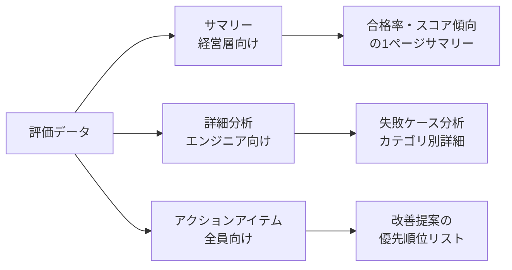

## 概要

評価結果をチームと効果的に共有するための可視化・レポーティング設計を学びます。ダッシュボードの構成・マークダウンレポートの自動生成・トレンド分析の実装を扱います。

## 本文

### 評価レポートの設計原則



### マークダウンレポートの自動生成

```python
from dataclasses import dataclass, field
from datetime import datetime
from typing import Any
import json

@dataclass
class EvalReport:
    """評価レポートのデータ構造"""
    run_id: str
    timestamp: str
    model: str
    prompt_version: str
    total_cases: int
    passed_cases: int
    scores_by_category: dict[str, float]
    failed_cases: list[dict]
    trends: dict[str, list[float]]  # バージョンごとのスコア推移

    @property
    def pass_rate(self) -> float:
        return self.passed_cases / self.total_cases if self.total_cases > 0 else 0

    @property
    def overall_score(self) -> float:
        if not self.scores_by_category:
            return 0.0
        return sum(self.scores_by_category.values()) / len(self.scores_by_category)


def generate_markdown_report(report: EvalReport) -> str:
    """マークダウン形式の評価レポートを生成"""

    # スコアに応じた絵文字
    def score_emoji(score: float) -> str:
        if score >= 0.85:
            return "✅"
        elif score >= 0.70:
            return "⚠️"
        else:
            return "❌"

    lines = [
        f"# 評価レポート: {report.run_id}",
        f"",
        f"**実行日時**: {report.timestamp}",
        f"**モデル**: {report.model}",
        f"**プロンプトバージョン**: {report.prompt_version}",
        f"",
        f"---",
        f"",
        f"## サマリー",
        f"",
        f"| 指標 | 値 | ステータス |",
        f"|------|----|----|",
        f"| 合格率 | {report.pass_rate:.1%} | {score_emoji(report.pass_rate)} |",
        f"| 総合スコア | {report.overall_score:.2f} | {score_emoji(report.overall_score)} |",
        f"| テストケース数 | {report.total_cases} | - |",
        f"| 合格数 | {report.passed_cases} | - |",
        f"| 失敗数 | {report.total_cases - report.passed_cases} | - |",
        f"",
    ]

    # カテゴリ別スコア
    if report.scores_by_category:
        lines.extend([
            "## カテゴリ別スコア",
            "",
            "| カテゴリ | スコア | ステータス |",
            "|---------|-------|-------|",
        ])
        for cat, score in sorted(report.scores_by_category.items(), key=lambda x: x[1]):
            lines.append(f"| {cat} | {score:.2f} | {score_emoji(score)} |")
        lines.append("")

    # トレンド（テキストグラフ）
    if report.trends:
        lines.extend([
            "## スコアトレンド",
            "",
        ])
        for metric, values in report.trends.items():
            bars = "".join(
                "█" * int(v * 10) + "░" * (10 - int(v * 10))
                for v in values[-5:]  # 直近5バージョン
            )
            lines.append(f"**{metric}**: {bars} ({values[-1]:.2f})")
        lines.append("")

    # 失敗ケース分析
    if report.failed_cases:
        lines.extend([
            "## 失敗ケース分析",
            f"（{len(report.failed_cases)} 件）",
            "",
        ])
        for i, case in enumerate(report.failed_cases[:5], 1):
            lines.extend([
                f"### 失敗 {i}: [{case.get('id', 'N/A')}]",
                f"- **入力**: {case.get('input', '')[:80]}...",
                f"- **スコア**: {case.get('score', 'N/A'):.2f}",
                f"- **問題**: {case.get('issue', '未特定')}",
                "",
            ])

    # アクションアイテム
    lines.extend([
        "## アクションアイテム",
        "",
    ])

    # 自動的な推奨事項を生成
    if report.pass_rate < 0.7:
        lines.append("- 🔴 **即時対応**: 合格率が70%を下回っています。プロンプトの根本的な見直しが必要")
    elif report.pass_rate < 0.85:
        lines.append("- 🟡 **要改善**: 合格率を85%以上に向上させることを推奨")

    for cat, score in report.scores_by_category.items():
        if score < 0.6:
            lines.append(f"- 🔴 カテゴリ「{cat}」のスコアが低い（{score:.2f}）。専用のテストケースと改善が必要")

    return "\n".join(lines)
```

### JSON出力（機械可読な結果）

```python
def export_eval_results_json(report: EvalReport, path: str):
    """評価結果をJSONで出力（CI/CDや他ツールとの連携用）"""
    data = {
        "run_id": report.run_id,
        "timestamp": report.timestamp,
        "model": report.model,
        "prompt_version": report.prompt_version,
        "summary": {
            "total_cases": report.total_cases,
            "passed_cases": report.passed_cases,
            "pass_rate": report.pass_rate,
            "overall_score": report.overall_score,
        },
        "scores_by_category": report.scores_by_category,
        "failed_cases": report.failed_cases,
        "trends": report.trends,
        "metadata": {
            "generated_at": datetime.utcnow().isoformat(),
            "generator": "custom-evals-framework v1.0",
        }
    }

    with open(path, "w", encoding="utf-8") as f:
        json.dump(data, f, ensure_ascii=False, indent=2)

    print(f"JSON評価結果を保存: {path}")
```

### トレンド分析（バージョン間比較）

```python
class TrendAnalyzer:
    """バージョン間のスコアトレンド分析"""

    def __init__(self):
        self.history: list[dict] = []

    def add_result(self, version: str, scores: dict[str, float]):
        self.history.append({
            "version": version,
            "timestamp": datetime.utcnow().isoformat(),
            "scores": scores,
        })

    def get_trend(self, metric: str) -> list[tuple[str, float]]:
        """指定メトリクスのバージョン別トレンドを取得"""
        return [
            (h["version"], h["scores"].get(metric, 0))
            for h in self.history
        ]

    def detect_regression(
        self,
        metric: str,
        threshold: float = 0.05
    ) -> dict:
        """回帰（スコア低下）を検出"""
        trend = self.get_trend(metric)
        if len(trend) < 2:
            return {"regression": False, "message": "データ不足"}

        latest = trend[-1][1]
        previous = trend[-2][1]
        change = latest - previous

        return {
            "regression": change < -threshold,
            "change": change,
            "latest_version": trend[-1][0],
            "latest_score": latest,
            "previous_score": previous,
            "message": f"{metric}: {previous:.2f} → {latest:.2f} ({change:+.2f})"
        }

    def generate_trend_report(self) -> str:
        """トレンドレポートの生成"""
        if not self.history:
            return "評価履歴がありません"

        lines = ["# バージョン間トレンド分析", ""]

        # 全メトリクスのトレンド
        all_metrics = set()
        for h in self.history:
            all_metrics.update(h["scores"].keys())

        for metric in sorted(all_metrics):
            trend = self.get_trend(metric)
            regression_check = self.detect_regression(metric)

            status = "❌ 回帰" if regression_check["regression"] else "✅ 正常"
            lines.append(f"## {metric} ({status})")

            for version, score in trend[-5:]:
                bar = "█" * int(score * 20) + "░" * (20 - int(score * 20))
                lines.append(f"- {version}: [{bar}] {score:.2f}")

            lines.append(f"  {regression_check['message']}")
            lines.append("")

        return "\n".join(lines)
```

## ハンズオン

実際の評価パイプラインから自動レポートを生成してみましょう。

### ステップ1：評価→レポート生成のパイプライン

```python
import uuid

def run_and_report(
    test_cases: list[dict],
    prompt_version: str,
    model: str = "claude-opus-4-5"
) -> str:
    """評価を実行してレポートを生成する統合関数"""

    # モックの評価結果（実際はEvalsRunnerを使用）
    mock_results = {
        "factual": 0.82,
        "reasoning": 0.75,
        "safety": 0.95,
        "instruction": 0.68,
    }

    failed_cases = [
        {
            "id": "TC-003",
            "input": "量子コンピュータを使った計算の具体例を教えてください",
            "score": 0.45,
            "issue": "専門用語の説明が不足"
        }
    ]

    trend_data = {
        "overall": [0.70, 0.72, 0.75, 0.73, sum(mock_results.values()) / len(mock_results)],
        "safety": [0.90, 0.92, 0.94, 0.95, mock_results["safety"]],
    }

    report = EvalReport(
        run_id=f"eval-{uuid.uuid4().hex[:8]}",
        timestamp=datetime.utcnow().isoformat(),
        model=model,
        prompt_version=prompt_version,
        total_cases=len(test_cases),
        passed_cases=int(len(test_cases) * 0.78),
        scores_by_category=mock_results,
        failed_cases=failed_cases,
        trends=trend_data,
    )

    return generate_markdown_report(report)


# テスト用データ
test_cases = [{"id": f"TC-{i:03d}", "input": f"テスト質問{i}"} for i in range(1, 11)]

report_md = run_and_report(test_cases, "v2.1")
print(report_md[:1000])
print("...")
print(f"\n（レポート全体: {len(report_md)} 文字）")
```

## クイズ

<!-- QUIZ:START -->
**Q1. 評価レポートを「経営層向け」と「エンジニア向け」に分けて設計する理由はどれですか？**

- A) セキュリティ上の理由
- B) 受け取る側の関心事と技術的な詳細度が異なるため、効果的な意思決定に必要な情報が違う
- C) ファイルサイズを小さくするため
- D) レポート生成を高速化するため

**正解: B**
**解説:** 経営層は「合格率」「コスト」「リスク」のサマリーを必要とし、エンジニアは「失敗ケース」「カテゴリ別スコア」「根本原因」の詳細を必要とします。受け手に応じたレポートが意思決定の効率を高めます。

**Q2. 評価結果をJSONで出力する主な目的はどれですか？**

- A) ファイルを小さくするため
- B) CI/CDパイプライン・ダッシュボード・他ツールとの自動連携を可能にするため
- C) 読みやすいレポートを作るため
- D) 評価を高速化するため

**正解: B**
**解説:** JSONは機械可読なフォーマットです。評価結果をJSONで出力することで、GitHub Actionsでの合否判定・Grafana等のダッシュボードへの取り込み・スプレッドシートへの自動エクスポートなど、後続処理の自動化が容易になります。

**Q3. トレンド分析（バージョン間比較）で最も重要な情報はどれですか？**

- A) 最新バージョンの絶対スコア
- B) バージョン間のスコア変化（特に急激な低下）と長期的な傾向
- C) テストケースの実行時間
- D) APIの利用コスト

**正解: B**
**解説:** 絶対スコアは高くても低下傾向があれば問題です。また、急激な低下（回帰）は即時対応が必要です。長期トレンドを追うことで「じわじわとした品質劣化」も早期に検出できます。
<!-- QUIZ:END -->

## まとめ

- 評価レポートは受け取る側（経営層・エンジニア・全員）に応じて設計する
- マークダウン形式は人間可読、JSON形式はツール連携に使い分ける
- バージョン間トレンド分析で品質の変化傾向を追跡する
- アクションアイテムを自動生成して、評価結果を改善につなげる

## 次のレッスン

Chapter 9では、AI開発のアーキテクチャ設計を学びます。フロントエンド・API・LLM・DBの関係から、レイテンシ最適化・スケーリング・コスト管理まで体系的に習得します。
