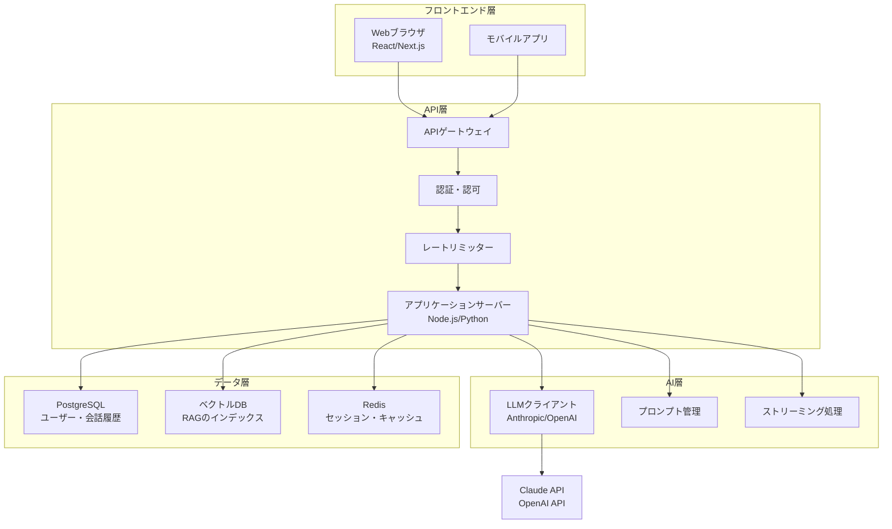
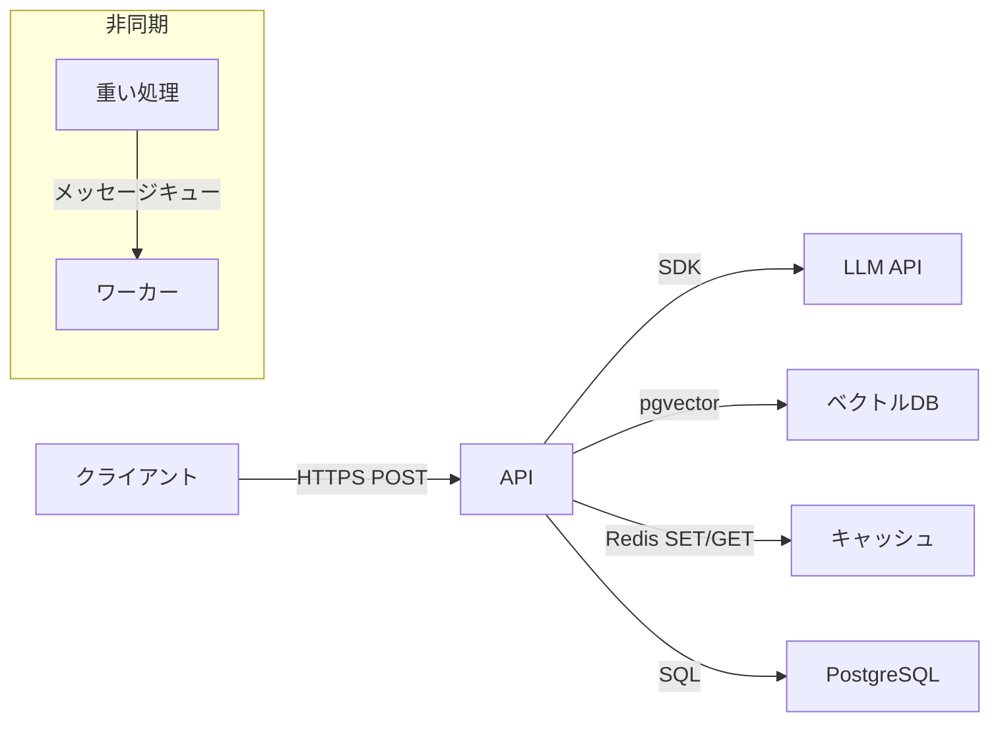

## 概要

AIアプリケーションのアーキテクチャはフロントエンド・API層・LLM・ベクトルDB・キャッシュなど多くのコンポーネントで構成されます。このレッスンでは全体像と各コンポーネントの役割・接続方法を学びます。

## 本文

### AIアプリケーションの全体アーキテクチャ



### コンポーネント別の役割

**1. APIゲートウェイ**

```
役割:
- ルーティング（/api/v1/chat → チャットサービス）
- レートリミット（ユーザーごとのリクエスト制限）
- 認証チェック（JWTの検証）
- ロギング・モニタリング

例: AWS API Gateway, Kong, Nginx
```

**2. アプリケーションサーバー**

```python
# FastAPIを使った基本的なAIアプリケーションの構造
from fastapi import FastAPI, HTTPException, Depends
from fastapi.responses import StreamingResponse
import anthropic

app = FastAPI()
ai_client = anthropic.Anthropic()

@app.post("/api/v1/chat")
async def chat(
    message: str,
    session_id: str,
    user_id: str = Depends(get_current_user)  # 認証
):
    """チャットエンドポイント"""
    # 会話履歴の取得（DBから）
    history = await get_conversation_history(session_id, limit=10)

    # プロンプトの構築
    messages = [
        *history,
        {"role": "user", "content": message}
    ]

    # LLMの呼び出し
    response = ai_client.messages.create(
        model="claude-opus-4-5",
        max_tokens=1024,
        system=get_system_prompt(),
        messages=messages
    )

    answer = response.content[0].text

    # 会話履歴の保存
    await save_conversation(session_id, message, answer)

    return {"answer": answer, "session_id": session_id}
```

**3. ストリーミングの実装**

```python
@app.post("/api/v1/chat/stream")
async def chat_stream(message: str, session_id: str):
    """ストリーミングレスポンスエンドポイント"""

    async def generate():
        with ai_client.messages.stream(
            model="claude-opus-4-5",
            max_tokens=1024,
            messages=[{"role": "user", "content": message}]
        ) as stream:
            for text in stream.text_stream:
                # Server-Sent Events形式
                yield f"data: {text}\n\n"
        yield "data: [DONE]\n\n"

    return StreamingResponse(
        generate(),
        media_type="text/event-stream"
    )
```

### コンポーネント間の通信パターン



### 設計の意思決定ポイント

| 要件 | 選択肢 | 判断基準 |
|------|--------|---------|
| DB | PostgreSQL vs MongoDB | 構造化データ→PG、柔軟スキーマ→Mongo |
| キャッシュ | Redis vs Memcached | セッション管理・Pub/Sub→Redis |
| ベクトルDB | pgvector vs Pinecone | 規模小→pgvector、大規模→専用DB |
| ホスティング | AWS vs GCP vs Azure | LLM APIとの近接性・既存インフラ |
| ストリーミング | SSE vs WebSocket | 単方向→SSE、双方向→WS |

## ハンズオン

基本的なAIアプリケーションサーバーを実装してみましょう。

### ステップ1：シンプルなチャットAPIの実装

```python
from fastapi import FastAPI
from pydantic import BaseModel
import anthropic
from typing import AsyncGenerator
from fastapi.responses import StreamingResponse

app = FastAPI(title="AI Chat API", version="1.0.0")
client = anthropic.Anthropic()

# 会話履歴のインメモリストア（本番はDBを使用）
conversations: dict[str, list[dict]] = {}

class ChatRequest(BaseModel):
    message: str
    session_id: str = "default"

class ChatResponse(BaseModel):
    answer: str
    session_id: str
    tokens_used: int

@app.post("/chat", response_model=ChatResponse)
async def chat(request: ChatRequest):
    """シンプルなチャットエンドポイント"""
    # セッションの初期化
    if request.session_id not in conversations:
        conversations[request.session_id] = []

    history = conversations[request.session_id]

    # LLM呼び出し
    response = client.messages.create(
        model="claude-opus-4-5",
        max_tokens=1024,
        system="あなたは親切なアシスタントです。",
        messages=[
            *history,
            {"role": "user", "content": request.message}
        ]
    )

    answer = response.content[0].text

    # 履歴を更新（最大20ターン保持）
    history.append({"role": "user", "content": request.message})
    history.append({"role": "assistant", "content": answer})
    if len(history) > 40:
        history = history[-40:]
    conversations[request.session_id] = history

    return ChatResponse(
        answer=answer,
        session_id=request.session_id,
        tokens_used=response.usage.input_tokens + response.usage.output_tokens
    )

@app.get("/sessions/{session_id}/history")
async def get_history(session_id: str):
    """会話履歴を取得"""
    return {"history": conversations.get(session_id, [])}

@app.delete("/sessions/{session_id}")
async def clear_session(session_id: str):
    """会話履歴をクリア"""
    if session_id in conversations:
        del conversations[session_id]
    return {"message": "セッションをクリアしました"}

# 起動コマンド: uvicorn app:app --reload
```

### ステップ2：ヘルスチェックと基本的な監視

```python
import time
from datetime import datetime

@app.get("/health")
async def health_check():
    """ヘルスチェックエンドポイント"""
    return {
        "status": "healthy",
        "timestamp": datetime.utcnow().isoformat(),
        "active_sessions": len(conversations),
        "version": "1.0.0"
    }

@app.middleware("http")
async def add_timing_header(request, call_next):
    """リクエスト時間を計測するミドルウェア"""
    start_time = time.time()
    response = await call_next(request)
    process_time = (time.time() - start_time) * 1000
    response.headers["X-Process-Time"] = f"{process_time:.2f}ms"
    return response
```

## クイズ

<!-- QUIZ:START -->
**Q1. AIアプリケーションでAPIゲートウェイを設ける主な理由はどれですか？**

- A) LLMの精度を向上させるため
- B) ルーティング・レートリミット・認証・モニタリングを一元管理するため
- C) データベースの速度を向上させるため
- D) ストリーミングを実現するため

**正解: B**
**解説:** APIゲートウェイはリクエストの入り口として、ルーティング・レートリミット・JWT認証・アクセスログなどを一元的に処理します。これらをアプリケーションサーバーに分散させるよりも、ゲートウェイで集中管理する方が保守性が高まります。

**Q2. チャットアプリケーションでServer-Sent Events（SSE）を使うメリットはどれですか？**

- A) クライアントからサーバーへの双方向通信が可能になる
- B) LLMのトークン生成をリアルタイムに表示でき、ユーザーの体感速度が向上する
- C) データベースの負荷が減る
- D) APIコストが削減される

**正解: B**
**解説:** LLMは回答全体が生成される前から部分的なトークンを返せます。SSEを使って部分的なテキストをリアルタイムにクライアントに送ることで、ユーザーは「考えている」感覚を得られ、体感的な応答速度が大幅に向上します。

**Q3. 本番AIアプリケーションで小規模ならベクトルDBに「pgvector」を選ぶ理由はどれですか？**

- A) pgvectorはPineconeより高速だから
- B) 既存のPostgreSQLインフラを活用でき、管理の複雑さを最小化できるから
- C) pgvectorはオープンソースだから
- D) pgvectorは無料だから

**正解: B**
**解説:** pgvectorはPostgreSQLの拡張機能で、既存のPostgreSQLインフラにベクトル検索機能を追加できます。別のベクトルDB（Pinecone等）を新たに管理する必要がなく、運用の複雑さを最小化できます。小〜中規模（数百万ベクトルまで）なら十分な性能があります。
<!-- QUIZ:END -->

## まとめ

- AIアプリケーションはフロントエンド・API・LLM・DB・キャッシュの多層構成
- APIゲートウェイで認証・レートリミット・ルーティングを一元管理する
- ストリーミングはSSEで実装してユーザー体験を向上させる
- 規模・要件・既存インフラに応じてコンポーネントを選択する

## 次のレッスン

次のレッスンでは、AIアプリケーションのレイテンシとスループットを最適化するアーキテクチャパターンを学びます。
