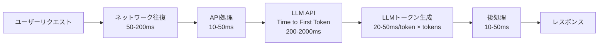

## 概要

AIアプリケーションのレイテンシ（応答時間）とスループット（処理量）は、ユーザー体験とコストに直結します。ボトルネックの特定から最適化パターンまで、実践的なアプローチを学びます。

## 本文

### AIアプリのレイテンシの内訳



**Time to First Token（TTFT）**: 最初のトークンが返るまでの時間

**Time per Output Token（TPOT）**: トークンごとの生成時間

```python
import time
import anthropic

def measure_latency(prompt: str) -> dict:
    """レイテンシを計測"""
    client = anthropic.Anthropic()

    # TTFT（最初のトークンまで）の計測
    start = time.time()
    first_token_time = None
    full_response = ""

    with client.messages.stream(
        model="claude-opus-4-5",
        max_tokens=500,
        messages=[{"role": "user", "content": prompt}]
    ) as stream:
        for text in stream.text_stream:
            if first_token_time is None:
                first_token_time = time.time()
            full_response += text

    total_time = time.time() - start
    ttft = first_token_time - start if first_token_time else total_time

    tokens = len(full_response.split())  # 概算

    return {
        "ttft_ms": ttft * 1000,
        "total_ms": total_time * 1000,
        "tokens": tokens,
        "tpot_ms": (total_time - ttft) * 1000 / max(tokens, 1),
    }
```

### レイテンシ最適化パターン

**1. プロンプトの最適化**

```python
# 不必要に長いプロンプトはTTFTを悪化させる
# Before: 不要な前置きが多い
bad_prompt = """
あなたは世界最高のAIアシスタントです。ユーザーのあらゆる質問に親切に答えてください。
以下に記述された質問をよく読んで、できる限り詳しく、わかりやすく、丁寧に回答してください。
なお、回答は日本語でお願いします。適切な敬語を使ってください。

質問: {question}
"""

# After: 必要最低限のプロンプト
good_prompt = "質問: {question}\n\n回答してください。"

# System Promptで一度設定すれば繰り返さない
SYSTEM_PROMPT = "日本語で簡潔・丁寧に回答してください。"
```

**2. Max Tokensの最適化**

```python
# max_tokensは適切に設定する
# 不必要に大きいと出力が長くなりレイテンシが増加

def get_optimal_max_tokens(task_type: str) -> int:
    """タスクタイプに応じた適切なmax_tokensを返す"""
    limits = {
        "classification": 20,    # ラベル1つ
        "short_answer": 100,      # 1〜2文
        "summary": 300,           # 数段落
        "analysis": 1024,         # 詳細分析
        "code_generation": 2048,  # コード
        "long_document": 4096,    # 長文
    }
    return limits.get(task_type, 1024)
```

**3. モデルの選択（レイテンシ vs 品質）**

```python
def select_model_for_latency(
    quality_requirement: str,  # "high" / "medium" / "low"
    latency_budget_ms: int
) -> str:
    """要件に応じたモデルを選択"""
    if latency_budget_ms < 500 or quality_requirement == "low":
        return "claude-haiku-4-5"   # 最速・最安価
    elif latency_budget_ms < 2000 or quality_requirement == "medium":
        return "claude-sonnet-4-5"   # バランス
    else:
        return "claude-opus-4-5"    # 最高品質

# ルーティング例
def smart_routing(user_request: str) -> str:
    """リクエストの複雑さに応じてモデルをルーティング"""
    word_count = len(user_request.split())

    if word_count < 20:
        return "claude-haiku-4-5"  # 短い質問
    elif word_count < 100:
        return "claude-sonnet-4-5"  # 中程度
    else:
        return "claude-opus-4-5"   # 複雑な質問
```

### スループット最適化

**バッチ処理**

```python
import asyncio
from concurrent.futures import ThreadPoolExecutor

async def process_batch(
    prompts: list[str],
    max_concurrency: int = 5
) -> list[str]:
    """バッチ処理で複数リクエストを並列実行"""
    client = anthropic.Anthropic()
    semaphore = asyncio.Semaphore(max_concurrency)

    async def single_request(prompt: str) -> str:
        async with semaphore:
            # 実際はasync APIを使う
            response = client.messages.create(
                model="claude-opus-4-5",
                max_tokens=300,
                messages=[{"role": "user", "content": prompt}]
            )
            return response.content[0].text

    tasks = [single_request(p) for p in prompts]
    return await asyncio.gather(*tasks)

# 使用例
async def main():
    prompts = [
        "Pythonとは何ですか？",
        "JavaScriptとは何ですか？",
        "Go言語の特徴は？",
    ]
    results = await process_batch(prompts)
    for prompt, result in zip(prompts, results):
        print(f"Q: {prompt}\nA: {result[:50]}...\n")
```

**レートリミットの管理**

```python
import time
from collections import deque
from threading import Lock

class RateLimiter:
    """トークンバケットアルゴリズムによるレートリミッター"""

    def __init__(self, requests_per_minute: int = 50):
        self.rpm = requests_per_minute
        self.request_times = deque()
        self.lock = Lock()

    def wait_if_needed(self):
        """必要であれば待機"""
        with self.lock:
            now = time.time()

            # 1分以上前のリクエストを削除
            while self.request_times and now - self.request_times[0] > 60:
                self.request_times.popleft()

            if len(self.request_times) >= self.rpm:
                # 最古のリクエストから1分経つまで待機
                wait_time = 60 - (now - self.request_times[0])
                if wait_time > 0:
                    time.sleep(wait_time)

            self.request_times.append(time.time())

rate_limiter = RateLimiter(requests_per_minute=50)
```

## ハンズオン

レイテンシ計測とモデルルーティングを実装してみましょう。

### ステップ1：レイテンシベンチマーク

```python
import anthropic
import time
import statistics

def benchmark_prompts(prompts: list[dict]) -> dict:
    """複数のプロンプトでレイテンシをベンチマーク"""
    client = anthropic.Anthropic()
    results = {}

    for test in prompts:
        latencies = []

        # 3回実行して平均を取る
        for _ in range(3):
            start = time.time()
            response = client.messages.create(
                model=test["model"],
                max_tokens=test["max_tokens"],
                messages=[{"role": "user", "content": test["prompt"]}]
            )
            elapsed_ms = (time.time() - start) * 1000
            latencies.append(elapsed_ms)

        results[test["name"]] = {
            "avg_ms": statistics.mean(latencies),
            "min_ms": min(latencies),
            "max_ms": max(latencies),
            "model": test["model"],
            "max_tokens": test["max_tokens"],
        }

    return results

# テスト設定（実際のAPIキーが必要）
test_configs = [
    {
        "name": "short_haiku",
        "prompt": "Pythonとは？",
        "model": "claude-haiku-4-5",
        "max_tokens": 50,
    },
    {
        "name": "long_opus",
        "prompt": "機械学習を初心者向けに詳しく説明してください。",
        "model": "claude-opus-4-5",
        "max_tokens": 500,
    },
]

print("レイテンシベンチマーク（実際のAPI呼び出しには認証が必要）:")
print("設定例:")
for config in test_configs:
    print(f"  {config['name']}: model={config['model']}, max_tokens={config['max_tokens']}")

# モックの結果
print("\nベンチマーク結果例（モック）:")
mock_results = {
    "short_haiku": {"avg_ms": 450, "min_ms": 380, "max_ms": 530},
    "long_opus": {"avg_ms": 3200, "min_ms": 2800, "max_ms": 3900},
}
for name, result in mock_results.items():
    print(f"  {name}: avg={result['avg_ms']:.0f}ms, min={result['min_ms']:.0f}ms, max={result['max_ms']:.0f}ms")
```

## クイズ

<!-- QUIZ:START -->
**Q1. AIアプリケーションの「Time to First Token（TTFT）」を短縮する最も効果的な方法はどれですか？**

- A) max_tokensを増やす
- B) プロンプトを短く・シンプルにし、不要なコンテキストを削除する
- C) より大きなモデルを使う
- D) タイムアウトを長く設定する

**正解: B**
**解説:** TTFTはLLMが最初のトークンを生成するまでの時間で、プロンプトの長さに比例して増加します。不要な前置き・冗長な説明を削除してプロンプトを短くすることが最も直接的なTTFT削減策です。また、より軽量なモデル（Haiku等）に切り替えることも効果的です。

**Q2. 並列バッチ処理で `max_concurrency`（最大並列数）を制限する理由はどれですか？**

- A) 処理を遅くするため
- B) APIのレートリミット（1分あたりのリクエスト数）の上限を超えないようにするため
- C) メモリを節約するため
- D) 評価精度を向上させるため

**正解: B**
**解説:** LLM APIにはレートリミット（RPM: Requests per Minute）があります。Semaphoreで並列数を制限しないと、短時間に大量リクエストを送ってレートリミットエラーが発生します。適切な `max_concurrency` を設定することでレートリミット内に収めながら効率的に並列処理できます。

**Q3. 「スマートルーティング」（モデルの自動選択）の主な目的はどれですか？**

- A) 開発者の作業を減らすため
- B) タスクの複雑さに応じて最適なモデルを選択し、コストと品質のバランスを最適化するため
- C) 認証を自動化するため
- D) データベースの負荷を減らすため

**正解: B**
**解説:** 短い質問にOpusを使うのはコストの無駄で、複雑な分析にHaikuを使うのは品質の問題です。リクエストの複雑さを自動判定して適切なモデルに振り分けるスマートルーティングにより、コスト効率と回答品質の両方を最適化できます。
<!-- QUIZ:END -->

## まとめ

- AIのレイテンシはTTFT（最初のトークンまで）とTPOT（トークンごとの生成時間）に分解して分析する
- プロンプトを短くし、max_tokensを適切に設定してレイテンシを削減する
- タスクの複雑さに応じてモデルをルーティングしてコストと品質を最適化する
- 並列処理とレートリミット管理でスループットを最大化する

## 次のレッスン

次のレッスンでは、セマンティックキャッシュ・プロンプトキャッシュを活用してAIシステムのコストとレイテンシを削減する戦略を学びます。
