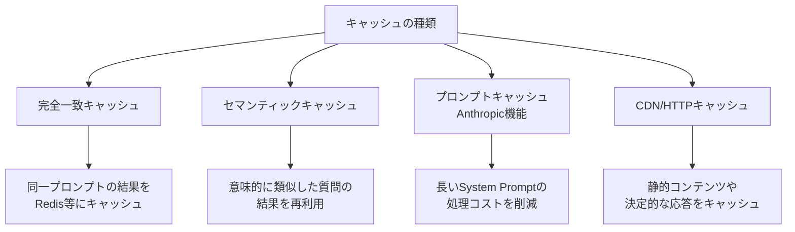

## 概要

AIアプリケーションのキャッシュには、通常のHTTPキャッシュとは異なる「セマンティックキャッシュ」や「プロンプトキャッシュ」が活用できます。それぞれの仕組みと実装、適切な使い分けを学びます。

## 本文

### AIアプリケーションのキャッシュ種類



### 1. 完全一致キャッシュ

```python
import hashlib
import json
import redis
import anthropic

class ExactMatchCache:
    """完全一致による結果キャッシュ"""

    def __init__(self, redis_url: str = "redis://localhost:6379"):
        self.redis = redis.from_url(redis_url)
        self.client = anthropic.Anthropic()
        self.ttl_seconds = 3600  # 1時間

    def _cache_key(self, prompt: str, model: str, max_tokens: int) -> str:
        """キャッシュキーの生成"""
        content = f"{model}:{max_tokens}:{prompt}"
        return f"ai:cache:{hashlib.sha256(content.encode()).hexdigest()}"

    def get_or_generate(
        self,
        prompt: str,
        model: str = "claude-opus-4-5",
        max_tokens: int = 1024
    ) -> tuple[str, bool]:
        """キャッシュから取得、なければ生成してキャッシュ"""
        key = self._cache_key(prompt, model, max_tokens)

        # キャッシュチェック
        cached = self.redis.get(key)
        if cached:
            return json.loads(cached)["response"], True  # (response, cache_hit)

        # LLM呼び出し
        response = self.client.messages.create(
            model=model,
            max_tokens=max_tokens,
            messages=[{"role": "user", "content": prompt}]
        )
        result = response.content[0].text

        # キャッシュに保存
        self.redis.setex(
            key,
            self.ttl_seconds,
            json.dumps({"response": result, "model": model})
        )

        return result, False  # (response, cache_hit)
```

### 2. セマンティックキャッシュ

```python
import numpy as np

class SemanticCache:
    """意味的な類似度に基づくキャッシュ"""

    def __init__(self, similarity_threshold: float = 0.95):
        self.threshold = similarity_threshold
        self.cache_entries: list[dict] = []  # {embedding, response, query}
        self.client = anthropic.Anthropic()

    def get_embedding(self, text: str) -> list[float]:
        """テキストの埋め込みベクトルを取得（モック実装）"""
        # 実際はEmbedding APIを使用
        # response = openai_client.embeddings.create(input=text, model="text-embedding-3-small")
        # return response.data[0].embedding

        # モック: 単語の頻度ベースの簡易ベクトル
        import hashlib
        seed = int(hashlib.md5(text.encode()).hexdigest()[:8], 16)
        rng = np.random.default_rng(seed)
        return rng.random(1536).tolist()

    def cosine_similarity(self, vec1: list[float], vec2: list[float]) -> float:
        """コサイン類似度の計算"""
        v1, v2 = np.array(vec1), np.array(vec2)
        return float(np.dot(v1, v2) / (np.linalg.norm(v1) * np.linalg.norm(v2)))

    def get_or_generate(self, query: str) -> tuple[str, float]:
        """意味的に類似したキャッシュを検索"""
        query_embedding = self.get_embedding(query)

        # 最も類似したキャッシュエントリを検索
        best_similarity = 0.0
        best_response = None

        for entry in self.cache_entries:
            similarity = self.cosine_similarity(query_embedding, entry["embedding"])
            if similarity > best_similarity:
                best_similarity = similarity
                best_response = entry["response"]

        # 閾値以上なら再利用
        if best_similarity >= self.threshold and best_response:
            print(f"セマンティックキャッシュヒット (類似度: {best_similarity:.3f})")
            return best_response, best_similarity

        # LLM呼び出し
        response = self.client.messages.create(
            model="claude-opus-4-5",
            max_tokens=500,
            messages=[{"role": "user", "content": query}]
        ).content[0].text

        # キャッシュに追加
        self.cache_entries.append({
            "query": query,
            "embedding": query_embedding,
            "response": response,
        })

        return response, 0.0

# 使用例
semantic_cache = SemanticCache(similarity_threshold=0.90)

# 最初のクエリ（キャッシュミス）
r1, sim1 = semantic_cache.get_or_generate("Pythonとは何ですか？")
print(f"1回目: 類似度={sim1:.3f}")

# 類似クエリ（キャッシュヒットの可能性）
r2, sim2 = semantic_cache.get_or_generate("Pythonってどんな言語ですか？")
print(f"2回目: 類似度={sim2:.3f}")
```

### 3. Anthropicのプロンプトキャッシュ

```python
def create_with_prompt_caching(
    user_message: str,
    long_document: str
) -> str:
    """プロンプトキャッシュを使ったAPI呼び出し"""
    client = anthropic.Anthropic()

    # cache_control でキャッシュを有効化
    response = client.messages.create(
        model="claude-opus-4-5",
        max_tokens=1024,
        system=[
            {
                "type": "text",
                "text": "あなたは文書分析の専門家です。",
            },
            {
                "type": "text",
                "text": long_document,
                "cache_control": {"type": "ephemeral"}  # このブロックをキャッシュ
            }
        ],
        messages=[{"role": "user", "content": user_message}]
    )

    # キャッシュの使用状況を確認
    usage = response.usage
    print(f"入力トークン: {usage.input_tokens}")
    print(f"キャッシュ作成トークン: {getattr(usage, 'cache_creation_input_tokens', 0)}")
    print(f"キャッシュ読み取りトークン: {getattr(usage, 'cache_read_input_tokens', 0)}")

    return response.content[0].text
```

### キャッシュ戦略の選択

| ユースケース | 推奨キャッシュ | 理由 |
|------------|--------------|------|
| FAQの回答 | 完全一致 | 同一質問が多い |
| カスタマーサポート | セマンティック | 類似表現が多い |
| 長文書を参照するRAG | プロンプトキャッシュ | System Promptが長い |
| レポート生成 | 完全一致 + TTL | 同一パラメータで繰り返し実行 |

## ハンズオン

階層型キャッシュシステムを実装してみましょう。

### ステップ1：L1(完全一致) + L2(セマンティック)の2層キャッシュ

```python
import hashlib
import json
import time

class TieredCache:
    """2層キャッシュシステム"""

    def __init__(self, similarity_threshold: float = 0.93):
        self.l1_cache: dict[str, dict] = {}  # 完全一致（実際はRedis）
        self.l2_cache = SemanticCache(similarity_threshold)
        self.stats = {"l1_hits": 0, "l2_hits": 0, "misses": 0}

    def get_or_generate(self, query: str) -> dict:
        """2層キャッシュからレスポンスを取得"""
        # L1: 完全一致チェック
        key = hashlib.md5(query.encode()).hexdigest()
        if key in self.l1_cache:
            self.stats["l1_hits"] += 1
            return {"response": self.l1_cache[key]["response"], "cache_layer": "L1"}

        # L2: セマンティック類似度チェック
        response, similarity = self.l2_cache.get_or_generate(query)

        if similarity >= self.l2_cache.threshold:
            self.stats["l2_hits"] += 1
            # L1にも昇格（完全なクエリとして記録）
            self.l1_cache[key] = {"response": response, "query": query}
            return {"response": response, "cache_layer": "L2", "similarity": similarity}

        # キャッシュミス（LLMが呼び出された）
        self.stats["misses"] += 1
        self.l1_cache[key] = {"response": response, "query": query}
        return {"response": response, "cache_layer": "miss"}

    def get_stats(self) -> dict:
        total = sum(self.stats.values())
        return {
            **self.stats,
            "total": total,
            "l1_hit_rate": self.stats["l1_hits"] / max(total, 1),
            "l2_hit_rate": self.stats["l2_hits"] / max(total, 1),
        }


# テスト
cache = TieredCache()

queries = [
    "Pythonとは？",
    "Pythonとは？",        # L1ヒット
    "Pythonってどんな言語？",  # L2ヒットの可能性
]

for q in queries:
    result = cache.get_or_generate(q)
    print(f"Q: {q}")
    print(f"  レイヤー: {result['cache_layer']}")
    print()

print(f"キャッシュ統計: {cache.get_stats()}")
```

## クイズ

<!-- QUIZ:START -->
**Q1. セマンティックキャッシュが完全一致キャッシュと比べて有利な場面はどれですか？**

- A) 同じ文字列が繰り返し使われる場合
- B) ユーザーが同じ意図を異なる表現で質問する場合（例: 「Pythonとは？」と「Pythonってどんな言語？」）
- C) キャッシュの実装がシンプルなほうが良い場合
- D) キャッシュのTTLを長く設定したい場合

**正解: B**
**解説:** 完全一致キャッシュは文字が完全に同じ場合のみヒットしますが、セマンティックキャッシュは「Pythonとは？」と「Pythonの特徴は？」のように意味が似ていれば同じキャッシュを返せます。ユーザーの入力が多様なカスタマーサポートや検索に特に有効です。

**Q2. AnthropicのPrompt Cachingが最も効果的なユースケースはどれですか？**

- A) 短いSystem Promptを使う場合
- B) 長い文書やSystem Promptを含む複数のリクエストを連続して送る場合
- C) 異なる文書に対してそれぞれ1回だけ質問する場合
- D) ストリーミングを使う場合

**正解: B**
**解説:** Prompt Cachingは長い（1024トークン以上）System PromptやDocumentを含むリクエストで、同じContent Blockを複数回使う場合にコストを最大90%削減できます。1回しか使わない場合はキャッシュ作成コストが発生するため効果がありません。

**Q3. セマンティックキャッシュの`similarity_threshold`（類似度閾値）を低く設定しすぎる問題は何ですか？**

- A) キャッシュヒット率が低くなる
- B) 意味が異なる質問に誤った回答を返す可能性が高まる
- C) 実行速度が遅くなる
- D) APIコストが増加する

**正解: B**
**解説:** 閾値が低すぎると「Pythonとは？」と「Rubyとは？」のように意味が異なる質問に同じ回答を返す可能性があります。閾値は0.90〜0.95程度が実用的で、ドメインの特性に応じてキャリブレーションが必要です。
<!-- QUIZ:END -->

## まとめ

- AIキャッシュには完全一致・セマンティック・プロンプトキャッシュの3種類がある
- 完全一致は高速で実装がシンプル、セマンティックは類似表現に対応
- Anthropicのプロンプトキャッシュは長いSystem Promptのコストを最大90%削減
- 2層キャッシュ（L1: 完全一致、L2: セマンティック）で効率とカバー率を両立できる

## 次のレッスン

次のレッスンでは、AIの重い処理をバックグラウンドで実行する非同期処理とキュー設計を学びます。
