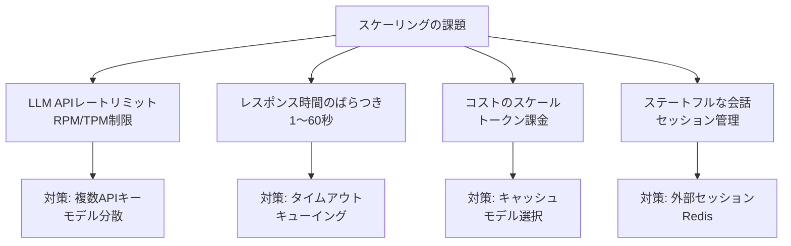
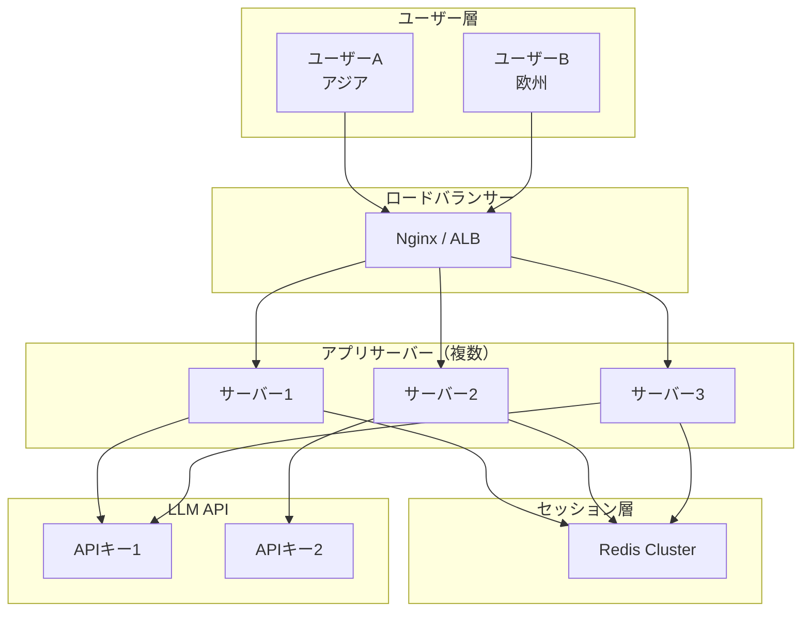

## 概要

AIアプリケーションのスケーリングは、従来のWebアプリと異なりLLM APIのレートリミットやコストが制約になります。水平スケール・ロードバランシング・マルチリージョン設計のパターンを学びます。

## 本文

### スケーリングの課題



### 水平スケーリングの実装

```python
import anthropic
import os
from itertools import cycle
from threading import Lock

class LoadBalancedAnthropicClient:
    """複数APIキーによるロードバランシング"""

    def __init__(self, api_keys: list[str]):
        self.clients = [anthropic.Anthropic(api_key=key) for key in api_keys]
        self._cycle = cycle(self.clients)
        self._lock = Lock()
        self.request_counts = [0] * len(api_keys)
        self.error_counts = [0] * len(api_keys)

    def get_client(self) -> tuple[anthropic.Anthropic, int]:
        """ラウンドロビンでクライアントを取得"""
        with self._lock:
            client = next(self._cycle)
            idx = self.clients.index(client)
            self.request_counts[idx] += 1
            return client, idx

    def create_message(self, **kwargs) -> anthropic.types.Message:
        """フォールバック付きメッセージ作成"""
        last_error = None

        for attempt in range(len(self.clients)):
            client, idx = self.get_client()
            try:
                return client.messages.create(**kwargs)
            except anthropic.RateLimitError as e:
                self.error_counts[idx] += 1
                last_error = e
                continue  # 次のクライアントを試す
            except anthropic.APIError as e:
                self.error_counts[idx] += 1
                last_error = e
                break  # リトライ不要なエラー

        raise last_error

    def get_stats(self) -> dict:
        return {
            "total_requests": sum(self.request_counts),
            "requests_per_key": self.request_counts,
            "errors_per_key": self.error_counts,
        }

# 使用例
# api_keys = [os.environ["ANTHROPIC_API_KEY_1"], os.environ["ANTHROPIC_API_KEY_2"]]
# client = LoadBalancedAnthropicClient(api_keys)
```

### マルチリージョン設計

```python
from dataclasses import dataclass
from enum import Enum

class Region(Enum):
    US_EAST = "us-east-1"
    EU_WEST = "eu-west-1"
    AP_NORTHEAST = "ap-northeast-1"

@dataclass
class RegionConfig:
    region: Region
    api_key: str
    latency_ms: int  # 推定レイテンシ
    weight: float    # トラフィック重み

class MultiRegionClient:
    """地理的ロードバランシング"""

    def __init__(self, regions: list[RegionConfig]):
        self.regions = regions
        self._clients = {
            r.region: anthropic.Anthropic(api_key=r.api_key)
            for r in regions
        }

    def get_nearest_region(self, user_region: str) -> Region:
        """ユーザーに最も近いリージョンを選択"""
        region_map = {
            "asia": Region.AP_NORTHEAST,
            "europe": Region.EU_WEST,
            "americas": Region.US_EAST,
        }
        return region_map.get(user_region, Region.US_EAST)

    def create_message(self, user_region: str, **kwargs):
        """最適リージョンでリクエスト実行"""
        region = self.get_nearest_region(user_region)
        client = self._clients[region]

        try:
            return client.messages.create(**kwargs)
        except Exception:
            # フォールバック: 別リージョンを試す
            fallback_regions = [r for r in self._clients if r != region]
            for fallback in fallback_regions:
                try:
                    return self._clients[fallback].messages.create(**kwargs)
                except Exception:
                    continue
            raise
```

### ステートレスサーバー設計

```python
import redis
import json
from typing import Optional

class SessionStore:
    """Redisを使ったステートレスセッション管理"""

    def __init__(self, redis_url: str = "redis://localhost:6379"):
        self.redis = redis.from_url(redis_url)
        self.ttl = 3600  # 1時間

    def get_history(self, session_id: str) -> list[dict]:
        """会話履歴を取得"""
        data = self.redis.get(f"session:{session_id}:history")
        if data:
            return json.loads(data)
        return []

    def save_history(self, session_id: str, history: list[dict]):
        """会話履歴を保存（最大20ターン）"""
        trimmed = history[-40:]  # 直近40メッセージ（20ターン）
        self.redis.setex(
            f"session:{session_id}:history",
            self.ttl,
            json.dumps(trimmed, ensure_ascii=False)
        )

    def extend_ttl(self, session_id: str):
        """アクティブセッションのTTLを延長"""
        self.redis.expire(f"session:{session_id}:history", self.ttl)

# FastAPIとの統合
from fastapi import FastAPI
from pydantic import BaseModel

app = FastAPI()
session_store = SessionStore()

class ChatRequest(BaseModel):
    message: str
    session_id: str

@app.post("/chat")
async def chat(request: ChatRequest):
    """ステートレスなチャットエンドポイント（複数インスタンスで動作）"""
    history = session_store.get_history(request.session_id)

    client = anthropic.Anthropic()
    response = client.messages.create(
        model="claude-opus-4-5",
        max_tokens=1024,
        messages=[
            *history,
            {"role": "user", "content": request.message}
        ]
    )

    answer = response.content[0].text

    # 履歴を更新
    history.append({"role": "user", "content": request.message})
    history.append({"role": "assistant", "content": answer})
    session_store.save_history(request.session_id, history)

    return {"answer": answer, "session_id": request.session_id}
```

### スケーリング設計のまとめ



## ハンズオン

スケーリングパターンを実装してみましょう。

### ステップ1：指数バックオフ付きリトライ

```python
import time
import anthropic

def create_with_retry(
    client: anthropic.Anthropic,
    max_retries: int = 3,
    **kwargs
) -> anthropic.types.Message:
    """指数バックオフ付きリトライ"""
    last_error = None

    for attempt in range(max_retries):
        try:
            return client.messages.create(**kwargs)

        except anthropic.RateLimitError as e:
            wait_time = (2 ** attempt) + 1  # 1, 3, 5秒...
            print(f"レートリミット。{wait_time}秒後にリトライ（{attempt+1}/{max_retries}）")
            time.sleep(wait_time)
            last_error = e

        except anthropic.APIStatusError as e:
            if e.status_code >= 500:  # サーバーエラーはリトライ
                wait_time = 2 ** attempt
                print(f"サーバーエラー{e.status_code}。{wait_time}秒後にリトライ")
                time.sleep(wait_time)
                last_error = e
            else:
                raise  # クライアントエラーはリトライしない

    raise last_error


# テスト（モック）
print("指数バックオフ付きリトライの実装例")
print("- RateLimitError: 1, 3, 5秒と指数的に待機")
print("- 5xx ServerError: リトライ")
print("- 4xx ClientError: 即座に例外送出")
```

## クイズ

<!-- QUIZ:START -->
**Q1. 複数のAPIキーを使ったロードバランシングの主な目的はどれですか？**

- A) APIキーを隠すため
- B) 単一APIキーのレートリミット（RPM/TPM）を超えないよう複数キーに分散させるため
- C) レスポンスの品質を向上させるため
- D) コストを削減するため

**正解: B**
**解説:** Anthropic APIには1つのAPIキーあたりのレートリミットがあります。トラフィックが増えると単一キーのRPM（Requests Per Minute）やTPM（Tokens Per Minute）を超えることがあります。複数キーにラウンドロビンで分散させることで、実質的なレートリミットを倍増できます。

**Q2. 水平スケーリングでアプリサーバーを複数台にする際、「ステートレス」設計が必要な理由はどれですか？**

- A) コードをシンプルにするため
- B) どのサーバーインスタンスが受け取っても同じ結果を返せるよう、会話履歴などの状態を外部（Redisなど）に持つため
- C) データベースへの負荷を減らすため
- D) セキュリティを向上させるため

**正解: B**
**解説:** ユーザーAのリクエストが最初はサーバー1に、次はサーバー2に届く場合、サーバー1にしか会話履歴がないと問題が発生します。RedisやDBに状態を外部化することで、どのサーバーインスタンスでもリクエストを処理できます。

**Q3. マルチリージョン設計の主なメリットはどれですか？**

- A) コストを大幅に削減できる
- B) ユーザーの地理的位置に近いリージョンで処理することでレイテンシを削減し、一つのリージョン障害時のフォールバックが可能になる
- C) モデルの精度が向上する
- D) APIキーの管理が簡単になる

**正解: B**
**解説:** アジアのユーザーが米国東部のAPIを経由すると往復200ms以上の余分なレイテンシが発生します。アジアリージョンのインフラを経由することで削減できます。また、一つのリージョンで障害が発生しても別リージョンにフォールバックできる可用性も得られます。
<!-- QUIZ:END -->

## まとめ

- 複数APIキーのラウンドロビンでRPM制限を分散させる
- アプリサーバーはステートレスに設計し、セッションをRedisに外部化する
- マルチリージョン設計でレイテンシ削減と可用性向上を両立する
- 指数バックオフ付きリトライでAPIエラーを自動回復する

## 次のレッスン

次のレッスンでは、AIシステムのオブザーバビリティ（ログ・トレース・メトリクス）設計を学びます。
