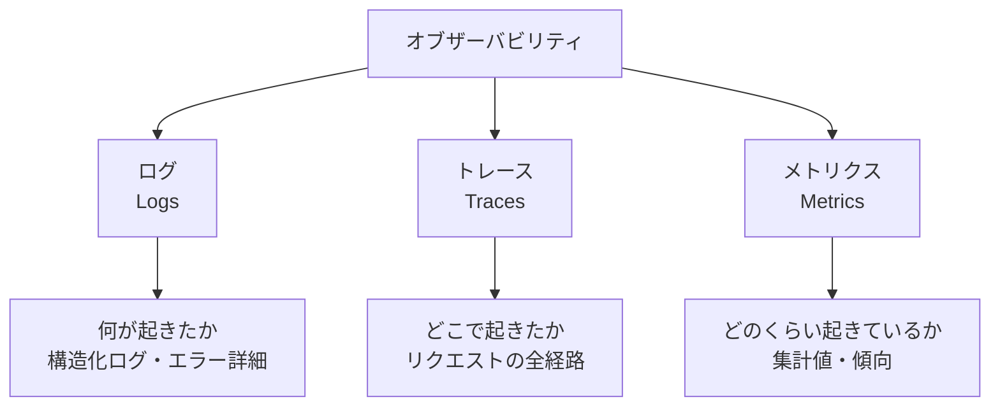

## 概要

AIシステムのオブザーバビリティは、ログ・トレース・メトリクスの3本柱で構成されます。LLMのトークン使用量・レイテンシ・エラー率など、AI固有の計測項目と実装パターンを学びます。

## 本文

### オブザーバビリティの3本柱



### 構造化ログの実装

```python
import logging
import json
import time
import uuid
from datetime import datetime
from typing import Any
import anthropic

class AILogger:
    """AI API呼び出しの構造化ロガー"""

    def __init__(self, service_name: str):
        self.service = service_name
        logging.basicConfig(level=logging.INFO)
        self.logger = logging.getLogger(service_name)

    def log_request(
        self,
        trace_id: str,
        model: str,
        input_tokens: int,
        output_tokens: int,
        latency_ms: float,
        success: bool,
        error: str | None = None,
        metadata: dict | None = None
    ):
        """LLMリクエストを構造化ログに記録"""
        log_entry = {
            "timestamp": datetime.utcnow().isoformat(),
            "service": self.service,
            "trace_id": trace_id,
            "event": "llm_request",
            "model": model,
            "tokens": {
                "input": input_tokens,
                "output": output_tokens,
                "total": input_tokens + output_tokens,
            },
            "latency_ms": latency_ms,
            "success": success,
            "error": error,
            **(metadata or {}),
        }

        if success:
            self.logger.info(json.dumps(log_entry, ensure_ascii=False))
        else:
            self.logger.error(json.dumps(log_entry, ensure_ascii=False))


class TracedAnthropicClient:
    """トレース機能付きAnthropicクライアント"""

    def __init__(self, service_name: str = "ai-service"):
        self.client = anthropic.Anthropic()
        self.logger = AILogger(service_name)

    def create_message(
        self,
        trace_id: str | None = None,
        **kwargs
    ) -> anthropic.types.Message:
        """トレース付きメッセージ作成"""
        trace_id = trace_id or str(uuid.uuid4())
        start = time.time()

        try:
            response = self.client.messages.create(**kwargs)
            latency_ms = (time.time() - start) * 1000

            self.logger.log_request(
                trace_id=trace_id,
                model=kwargs.get("model", "unknown"),
                input_tokens=response.usage.input_tokens,
                output_tokens=response.usage.output_tokens,
                latency_ms=latency_ms,
                success=True,
            )

            return response

        except Exception as e:
            latency_ms = (time.time() - start) * 1000

            self.logger.log_request(
                trace_id=trace_id,
                model=kwargs.get("model", "unknown"),
                input_tokens=0,
                output_tokens=0,
                latency_ms=latency_ms,
                success=False,
                error=str(e),
            )
            raise
```

### メトリクスの収集

```python
from collections import defaultdict, deque
from threading import Lock
import statistics

class MetricsCollector:
    """AIシステムのメトリクスを収集・集計"""

    def __init__(self, window_size: int = 1000):
        self._lock = Lock()
        self.window_size = window_size

        # 直近N件のデータを保持
        self.latencies: deque[float] = deque(maxlen=window_size)
        self.token_counts: deque[int] = deque(maxlen=window_size)
        self.error_counts: dict[str, int] = defaultdict(int)
        self.model_usage: dict[str, int] = defaultdict(int)
        self.request_count = 0

    def record(
        self,
        latency_ms: float,
        tokens: int,
        model: str,
        success: bool,
        error_type: str | None = None
    ):
        with self._lock:
            self.request_count += 1
            self.latencies.append(latency_ms)
            self.token_counts.append(tokens)
            self.model_usage[model] += 1
            if not success and error_type:
                self.error_counts[error_type] += 1

    def get_summary(self) -> dict:
        with self._lock:
            latencies = list(self.latencies)
            tokens = list(self.token_counts)

            if not latencies:
                return {"message": "データなし"}

            return {
                "request_count": self.request_count,
                "latency": {
                    "p50_ms": statistics.median(latencies),
                    "p95_ms": sorted(latencies)[int(len(latencies) * 0.95)],
                    "p99_ms": sorted(latencies)[int(len(latencies) * 0.99)],
                    "avg_ms": statistics.mean(latencies),
                },
                "tokens": {
                    "avg_per_request": statistics.mean(tokens),
                    "total": sum(tokens),
                },
                "error_rate": sum(self.error_counts.values()) / max(self.request_count, 1),
                "model_usage": dict(self.model_usage),
                "errors": dict(self.error_counts),
            }

# グローバルメトリクスコレクター
metrics = MetricsCollector()

# FastAPIエンドポイント例
from fastapi import FastAPI

app = FastAPI()

@app.get("/metrics")
async def get_metrics():
    """メトリクスエンドポイント（Prometheus等が収集）"""
    return metrics.get_summary()
```

### 分散トレーシング

```python
from contextlib import contextmanager

class Span:
    """トレースのスパン（処理の一区間）"""

    def __init__(self, name: str, trace_id: str, parent_id: str | None = None):
        self.name = name
        self.trace_id = trace_id
        self.span_id = str(uuid.uuid4())[:8]
        self.parent_id = parent_id
        self.start_time = time.time()
        self.attributes: dict = {}
        self.events: list[dict] = []

    def set_attribute(self, key: str, value: Any):
        self.attributes[key] = value

    def add_event(self, name: str, attributes: dict | None = None):
        self.events.append({
            "name": name,
            "timestamp": time.time() - self.start_time,
            "attributes": attributes or {},
        })

    def finish(self) -> dict:
        return {
            "trace_id": self.trace_id,
            "span_id": self.span_id,
            "parent_id": self.parent_id,
            "name": self.name,
            "duration_ms": (time.time() - self.start_time) * 1000,
            "attributes": self.attributes,
            "events": self.events,
        }


@contextmanager
def traced_operation(name: str, trace_id: str, parent_id: str | None = None):
    """トレース付き操作のコンテキストマネージャー"""
    span = Span(name, trace_id, parent_id)
    try:
        yield span
        span.add_event("completed")
    except Exception as e:
        span.add_event("error", {"error": str(e)})
        raise
    finally:
        result = span.finish()
        print(json.dumps(result))  # 実際はトレースバックエンドに送信


# 使用例
def process_with_rag(query: str, trace_id: str) -> str:
    """RAG処理のトレース例"""
    with traced_operation("rag_retrieval", trace_id) as span:
        span.set_attribute("query", query)
        # ベクトル検索...
        span.add_event("vector_search_complete", {"results": 5})
        documents = ["doc1", "doc2"]  # モック

    with traced_operation("llm_generation", trace_id) as span:
        span.set_attribute("model", "claude-opus-4-5")
        span.set_attribute("context_docs", len(documents))
        # LLM呼び出し...
        return "生成された回答"  # モック
```

## ハンズオン

オブザーバビリティパイプラインを実装してみましょう。

### ステップ1：統合オブザーバビリティクライアント

```python
import anthropic
import time
import uuid
import json

class ObservableClient:
    """ログ・メトリクス・トレースを統合したクライアント"""

    def __init__(self):
        self.client = anthropic.Anthropic()
        self.metrics = MetricsCollector()

    def chat(self, message: str, model: str = "claude-haiku-4-5") -> dict:
        """オブザーバビリティ付きチャット"""
        trace_id = str(uuid.uuid4())[:8]
        start = time.time()

        log_entry = {
            "trace_id": trace_id,
            "timestamp": time.strftime("%H:%M:%S"),
            "model": model,
            "input_length": len(message),
        }

        try:
            response = self.client.messages.create(
                model=model,
                max_tokens=200,
                messages=[{"role": "user", "content": message}]
            )

            latency_ms = (time.time() - start) * 1000
            tokens = response.usage.input_tokens + response.usage.output_tokens

            self.metrics.record(latency_ms, tokens, model, True)

            log_entry.update({
                "status": "success",
                "latency_ms": round(latency_ms, 1),
                "input_tokens": response.usage.input_tokens,
                "output_tokens": response.usage.output_tokens,
            })
            print(f"[LOG] {json.dumps(log_entry)}")

            return {
                "answer": response.content[0].text,
                "trace_id": trace_id,
                "latency_ms": round(latency_ms, 1),
            }

        except Exception as e:
            latency_ms = (time.time() - start) * 1000
            self.metrics.record(latency_ms, 0, model, False, type(e).__name__)
            log_entry.update({"status": "error", "error": str(e)})
            print(f"[ERROR] {json.dumps(log_entry)}")
            raise


# テスト
obs_client = ObservableClient()
questions = [
    "Pythonとは何ですか？（1文で）",
    "JavaScriptとPythonの違いを1文で",
]

for q in questions:
    result = obs_client.chat(q)
    print(f"  回答: {result['answer'][:50]}...")
    print()

print(f"\nメトリクスサマリー:")
print(json.dumps(obs_client.metrics.get_summary(), indent=2, ensure_ascii=False))
```

## クイズ

<!-- QUIZ:START -->
**Q1. オブザーバビリティの「3本柱」とは何ですか？**

- A) CPU・メモリ・ディスク
- B) ログ（何が起きたか）・トレース（どこで起きたか）・メトリクス（どのくらい起きているか）
- C) テスト・デプロイ・モニタリング
- D) 開発・ステージング・本番

**正解: B**
**解説:** 現代のオブザーバビリティはLogs・Traces・Metricsの3本柱で構成されます。ログは個々のイベントの詳細を記録し、トレースはリクエストの全経路を追跡し、メトリクスはシステムの状態を数値で集計します。AIシステムではトークン使用量やレイテンシなどAI固有の計測項目が追加されます。

**Q2. LLMシステムで特に計測すべき「AI固有のメトリクス」はどれですか？**

- A) CPUとメモリ使用率
- B) 入力/出力トークン数・TTFT（最初のトークンまでの時間）・モデル別リクエスト数
- C) データベースクエリ時間
- D) ネットワーク帯域幅

**正解: B**
**解説:** 一般的なWebメトリクスに加え、AIシステムではトークン数（コストに直結）・TTFT（体感速度）・モデル別の使用状況（コスト最適化）を計測することが重要です。これらがないとLLMコストの急増に気づけないことがあります。

**Q3. 分散トレーシングで「trace_id」を各リクエストに付与する理由はどれですか？**

- A) セキュリティを向上させるため
- B) フロントエンドからLLM呼び出しまでの全処理を1つのIDで追跡し、複数のログを関連付けるため
- C) レスポンスを高速化するため
- D) APIキーを保護するため

**正解: B**
**解説:** 一つのユーザーリクエストはAPI・キャッシュ・ベクトルDB・LLM APIなど複数のサービスを経由します。共通のtrace_idがないと、エラーが起きたときにどのコンポーネントが原因か特定できません。trace_idで全ログを横断的に検索できるのが分散トレーシングの本質です。
<!-- QUIZ:END -->

## まとめ

- オブザーバビリティはログ・トレース・メトリクスの3本柱で構成される
- AIシステムではトークン数・レイテンシ（TTFT/TPOT）・モデル別使用量を計測する
- trace_idで全処理を追跡し、問題発生時の根本原因特定を容易にする
- p50/p95/p99のパーセンタイルメトリクスでレイテンシの外れ値を把握する

## 次のレッスン

次のレッスンでは、APIエラーやレート制限に対するフォールバックと冗長化設計を学びます。
