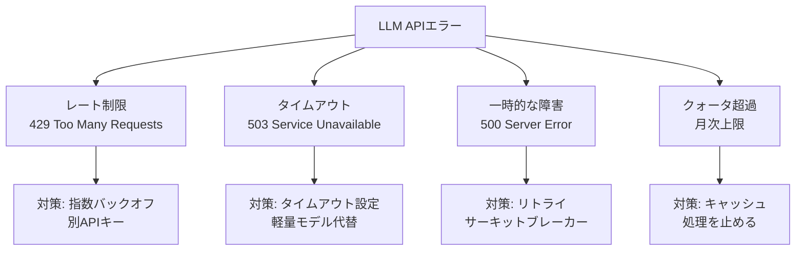

## 概要

LLM APIはレート制限・タイムアウト・一時的な障害が発生します。フォールバック戦略・サーキットブレーカー・グレースフルデグラデーションの実装で、堅牢なAIシステムを構築する方法を学びます。

## 本文

### 障害のパターンと対策



### フォールバックチェーンの実装

```python
import anthropic
import time
from dataclasses import dataclass, field
from typing import Callable

@dataclass
class ModelConfig:
    model: str
    max_tokens: int
    timeout: float = 30.0
    priority: int = 1  # 低い数字が優先

class FallbackChain:
    """モデルのフォールバックチェーン"""

    DEFAULT_CHAIN = [
        ModelConfig("claude-opus-4-5", max_tokens=4096, timeout=60.0, priority=1),
        ModelConfig("claude-sonnet-4-5", max_tokens=2048, timeout=30.0, priority=2),
        ModelConfig("claude-haiku-4-5", max_tokens=1024, timeout=15.0, priority=3),
    ]

    def __init__(self, chain: list[ModelConfig] | None = None):
        self.chain = sorted(chain or self.DEFAULT_CHAIN, key=lambda c: c.priority)
        self.client = anthropic.Anthropic()
        self._failure_counts: dict[str, int] = {}
        self._last_failure: dict[str, float] = {}
        self.CIRCUIT_OPEN_THRESHOLD = 3
        self.CIRCUIT_RESET_SECONDS = 60

    def _is_circuit_open(self, model: str) -> bool:
        """サーキットブレーカーが開いているか確認"""
        failures = self._failure_counts.get(model, 0)
        if failures < self.CIRCUIT_OPEN_THRESHOLD:
            return False
        last_fail = self._last_failure.get(model, 0)
        if time.time() - last_fail > self.CIRCUIT_RESET_SECONDS:
            self._failure_counts[model] = 0  # リセット
            return False
        return True

    def _record_failure(self, model: str):
        self._failure_counts[model] = self._failure_counts.get(model, 0) + 1
        self._last_failure[model] = time.time()

    def _record_success(self, model: str):
        self._failure_counts[model] = 0

    def create_message(self, messages: list[dict], system: str = "") -> dict:
        """フォールバック付きメッセージ作成"""
        last_error = None

        for config in self.chain:
            if self._is_circuit_open(config.model):
                print(f"  [{config.model}] サーキットブレーカーOpen - スキップ")
                continue

            try:
                print(f"  [{config.model}] 試行中...")
                response = self.client.messages.create(
                    model=config.model,
                    max_tokens=config.max_tokens,
                    system=system,
                    messages=messages,
                )
                self._record_success(config.model)
                return {
                    "content": response.content[0].text,
                    "model_used": config.model,
                    "input_tokens": response.usage.input_tokens,
                    "output_tokens": response.usage.output_tokens,
                }

            except anthropic.RateLimitError as e:
                self._record_failure(config.model)
                print(f"  [{config.model}] レートリミット - 次のモデルへ")
                last_error = e

            except anthropic.APITimeoutError as e:
                self._record_failure(config.model)
                print(f"  [{config.model}] タイムアウト - 次のモデルへ")
                last_error = e

            except anthropic.APIStatusError as e:
                if e.status_code >= 500:
                    self._record_failure(config.model)
                    print(f"  [{config.model}] サーバーエラー{e.status_code} - 次のモデルへ")
                    last_error = e
                else:
                    raise  # 4xxはフォールバック不要

        # すべてのモデルが失敗
        raise RuntimeError(f"すべてのモデルが失敗: {last_error}")


# テスト（モック）
chain = FallbackChain()
print("フォールバックチェーン設定:")
for config in chain.chain:
    print(f"  優先度{config.priority}: {config.model} (最大{config.max_tokens}トークン)")
```

### グレースフルデグラデーション

```python
class GracefulAIService:
    """段階的な品質低下で可用性を維持"""

    def __init__(self):
        self.client = anthropic.Anthropic()
        self.cache: dict[str, str] = {}  # シンプルなキャッシュ
        self.fallback_responses = {
            "greeting": "こんにちは！現在システムが混雑しています。少し後でお試しください。",
            "error": "申し訳ありません。現在回答を生成できません。後ほど再度お試しください。",
        }

    def answer(self, question: str) -> dict:
        """段階的フォールバックで回答"""

        # レベル1: キャッシュから即答
        cache_key = question.strip().lower()
        if cache_key in self.cache:
            return {"answer": self.cache[cache_key], "source": "cache", "quality": "full"}

        # レベル2: 高品質モデルで回答
        try:
            response = self.client.messages.create(
                model="claude-opus-4-5",
                max_tokens=1024,
                messages=[{"role": "user", "content": question}]
            )
            answer = response.content[0].text
            self.cache[cache_key] = answer
            return {"answer": answer, "source": "llm_primary", "quality": "full"}

        except anthropic.RateLimitError:
            pass  # レベル3へ

        # レベル3: 軽量モデルで簡易回答
        try:
            response = self.client.messages.create(
                model="claude-haiku-4-5",
                max_tokens=200,
                messages=[{"role": "user", "content": f"簡潔に回答してください: {question}"}]
            )
            return {
                "answer": response.content[0].text,
                "source": "llm_fallback",
                "quality": "reduced",
                "notice": "現在負荷が高いため簡易回答です"
            }

        except Exception:
            pass  # レベル4へ

        # レベル4: 静的フォールバックメッセージ
        return {
            "answer": self.fallback_responses["error"],
            "source": "static_fallback",
            "quality": "minimal"
        }
```

### タイムアウト設計

```python
import asyncio

async def with_timeout(coroutine, timeout_seconds: float, fallback_value=None):
    """タイムアウト付き非同期実行"""
    try:
        return await asyncio.wait_for(coroutine, timeout=timeout_seconds)
    except asyncio.TimeoutError:
        print(f"タイムアウト ({timeout_seconds}秒) - フォールバック値を返します")
        return fallback_value


# ユーザー向けのタイムアウト設定の目安
TIMEOUT_GUIDELINES = {
    "interactive_chat": 30,   # ユーザーが待てる最大時間
    "background_job": 300,    # バックグラウンドジョブ
    "batch_processing": 600,  # バッチ処理
}
```

## ハンズオン

フォールバック機能を持つサービスを実装してみましょう。

### ステップ1：サーキットブレーカーのデモ

```python
import anthropic
import time

class CircuitBreaker:
    """サーキットブレーカーの実装"""

    CLOSED = "closed"    # 正常（リクエストを通す）
    OPEN = "open"        # 障害（リクエストをブロック）
    HALF_OPEN = "half_open"  # 試験中

    def __init__(self, failure_threshold: int = 3, reset_timeout: float = 30.0):
        self.failure_threshold = failure_threshold
        self.reset_timeout = reset_timeout
        self.state = self.CLOSED
        self.failure_count = 0
        self.last_failure_time = 0.0

    def call(self, func, *args, **kwargs):
        """サーキットブレーカー経由で関数を呼び出す"""
        # OPEN状態のチェック
        if self.state == self.OPEN:
            if time.time() - self.last_failure_time > self.reset_timeout:
                self.state = self.HALF_OPEN
                print(f"  [CB] HALF-OPEN: 試験的にリクエストを通します")
            else:
                remaining = self.reset_timeout - (time.time() - self.last_failure_time)
                raise Exception(f"サーキットブレーカーOPEN: あと{remaining:.0f}秒")

        try:
            result = func(*args, **kwargs)
            # 成功: CLOSEDに戻す
            if self.state == self.HALF_OPEN:
                self.state = self.CLOSED
                self.failure_count = 0
                print(f"  [CB] CLOSED: 回復しました")
            return result

        except Exception as e:
            self.failure_count += 1
            self.last_failure_time = time.time()
            print(f"  [CB] 失敗 ({self.failure_count}/{self.failure_threshold}): {e}")

            if self.failure_count >= self.failure_threshold:
                self.state = self.OPEN
                print(f"  [CB] OPEN: サーキットブレーカー発動！{self.reset_timeout}秒間ブロック")
            raise

    def get_state(self) -> dict:
        return {
            "state": self.state,
            "failure_count": self.failure_count,
            "failure_threshold": self.failure_threshold,
        }


# テスト（失敗をシミュレート）
cb = CircuitBreaker(failure_threshold=3, reset_timeout=5.0)

def mock_api_call(succeed: bool):
    if not succeed:
        raise Exception("API呼び出し失敗")
    return "成功"

print("サーキットブレーカーのデモ:")
for i, succeed in enumerate([True, False, False, False, True]):
    try:
        result = cb.call(mock_api_call, succeed)
        print(f"  呼び出し{i+1}: {result}")
    except Exception as e:
        print(f"  呼び出し{i+1}: エラー - {e}")

print(f"\n最終状態: {cb.get_state()}")
```

## クイズ

<!-- QUIZ:START -->
**Q1. サーキットブレーカーパターンの目的はどれですか？**

- A) APIのレスポンスを高速化する
- B) 障害が発生したサービスへのリクエストを一時的に遮断し、復旧を待ちながら連鎖障害を防ぐ
- C) APIキーを保護する
- D) ログを削減する

**正解: B**
**解説:** サーキットブレーカーは電気回路の安全装置と同じ仕組みです。障害が連続して発生すると「Open」状態になりリクエストを即座に拒否します。これにより障害サービスへのリクエストが蓄積するのを防ぎ、一定時間後に「Half-Open」で復旧を確認します。タイムアウト待ちが積み重なる「カスケード障害」を防ぎます。

**Q2. グレースフルデグラデーション（段階的機能低下）の正しい説明はどれですか？**

- A) システムが完全に停止する前に警告を出す
- B) 障害時に品質を落としながらも動作を継続する（高品質モデル→軽量モデル→キャッシュ→静的メッセージ）
- C) データを自動的にバックアップする
- D) エラーログを管理者にメールで通知する

**正解: B**
**解説:** グレースフルデグラデーションは「最高品質」から「動作継続」を優先して段階的に品質を下げる設計です。プライマリLLMが失敗→軽量モデルで簡易回答→キャッシュから回答→定型文で対応、という段階でサービス継続性を確保します。

**Q3. LLM APIの`RateLimitError`に対して「指数バックオフ」リトライを使う理由はどれですか？**

- A) より速くリトライできる
- B) サーバーが回復するのに時間が必要なため、固定間隔より指数的に間隔を広げてサーバーへの負荷を軽減する
- C) エラーログが見やすくなる
- D) APIコストが削減される

**正解: B**
**解説:** レートリミットに達した際に即座にリトライすると、全クライアントが同時にリトライして「スタンピードヒード」を引き起こします。指数バックオフ（1秒→2秒→4秒...）でリトライ間隔を広げることで、サーバーの回復を待ちながら負荷を分散させます。
<!-- QUIZ:END -->

## まとめ

- フォールバックチェーンでOpus→Sonnet→Haikuと段階的に代替モデルを試す
- サーキットブレーカーで障害サービスへの連続リクエストを遮断して連鎖障害を防ぐ
- グレースフルデグラデーションで障害時も品質を落としながらサービス継続する
- 指数バックオフでレートリミット回復を待ちながらリトライする

## 次のレッスン

次のレッスンでは、個人情報・機密情報を扱うAIシステムのデータプライバシー設計を学びます。
