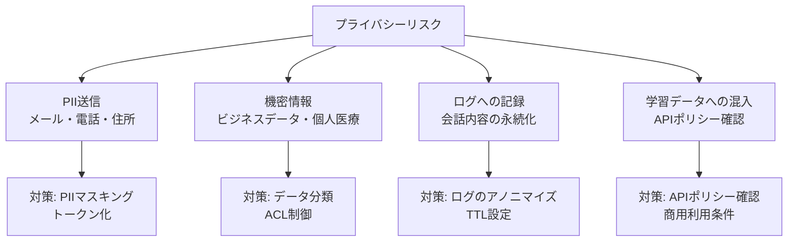

## 概要

AIシステムは個人情報・機密情報をLLMに送信するリスクがあります。PII（個人識別情報）の検出・マスキング・データ最小化・ログのプライバシー保護の設計パターンを学びます。

## 本文

### AIシステムのプライバシーリスク



### PIIの検出とマスキング

```python
import re
from dataclasses import dataclass

@dataclass
class PIIMatch:
    type: str
    original: str
    masked: str
    start: int
    end: int

class PIIMasker:
    """個人識別情報（PII）の検出・マスキング"""

    PATTERNS = {
        "email": (
            r'\b[A-Za-z0-9._%+-]+@[A-Za-z0-9.-]+\.[A-Z|a-z]{2,}\b',
            lambda m: f"[EMAIL:{hash(m.group()) % 10000:04d}]"
        ),
        "phone_jp": (
            r'0\d{1,4}[-\s]?\d{1,4}[-\s]?\d{4}',
            lambda m: "[PHONE:****]"
        ),
        "credit_card": (
            r'\b\d{4}[-\s]?\d{4}[-\s]?\d{4}[-\s]?\d{4}\b',
            lambda m: "[CARD:****-****-****-" + m.group()[-4:] + "]"
        ),
        "my_number": (  # マイナンバー
            r'\b\d{4}[-\s]?\d{4}[-\s]?\d{4}\b',
            lambda m: "[MYNUMBER:****]"
        ),
        "name_jp": (
            r'(?:氏名|名前|お名前)[：:]\s*([^\s、。\n]+)',
            lambda m: m.group().replace(m.group(1), "[NAME:****]")
        ),
    }

    def mask(self, text: str) -> tuple[str, list[PIIMatch]]:
        """テキスト中のPIIを検出してマスク"""
        matches = []
        masked_text = text

        for pii_type, (pattern, replacer) in self.PATTERNS.items():
            for match in re.finditer(pattern, masked_text):
                masked = replacer(match)
                matches.append(PIIMatch(
                    type=pii_type,
                    original=match.group(),
                    masked=masked,
                    start=match.start(),
                    end=match.end(),
                ))

        # 後ろから置換（インデックスがズレないように）
        for match in sorted(matches, key=lambda m: m.start, reverse=True):
            masked_text = (
                masked_text[:match.start] + match.masked + masked_text[match.end:]
            )

        return masked_text, matches

    def unmask(self, masked_text: str, matches: list[PIIMatch]) -> str:
        """マスクを元に戻す（必要な場合のみ）"""
        result = masked_text
        for match in matches:
            result = result.replace(match.masked, match.original, 1)
        return result


# 使用例
masker = PIIMasker()

sample_text = """
田中さんのメールアドレスはtanaka@example.comです。
電話番号は090-1234-5678で、
クレジットカードは4111-1111-1111-1111を使用しています。
"""

masked, pii_list = masker.mask(sample_text)
print("マスク後:")
print(masked)
print(f"\n検出したPII: {len(pii_list)}件")
for p in pii_list:
    print(f"  [{p.type}] {p.original[:20]}... → {p.masked}")
```

### LLMへの送信前の前処理

```python
import anthropic

class PrivacyAwareClient:
    """プライバシー保護付きLLMクライアント"""

    def __init__(self):
        self.client = anthropic.Anthropic()
        self.masker = PIIMasker()

    def create_message(
        self,
        user_message: str,
        system: str = "",
        mask_pii: bool = True,
        **kwargs
    ) -> dict:
        """PII保護付きメッセージ送信"""

        pii_matches = []
        safe_message = user_message

        if mask_pii:
            safe_message, pii_matches = self.masker.mask(user_message)
            if pii_matches:
                print(f"[プライバシー保護] {len(pii_matches)}件のPIIをマスクしました")

        # LLMにはマスク済みテキストを送信
        response = self.client.messages.create(
            model="claude-haiku-4-5",
            max_tokens=500,
            system=system,
            messages=[{"role": "user", "content": safe_message}],
            **kwargs
        )

        answer = response.content[0].text

        return {
            "answer": answer,
            "pii_detected": len(pii_matches) > 0,
            "pii_count": len(pii_matches),
            "pii_types": list({m.type for m in pii_matches}),
        }
```

### データ分類と最小化

```python
from enum import Enum

class DataSensitivity(Enum):
    PUBLIC = "public"          # 公開情報
    INTERNAL = "internal"      # 社内限定
    CONFIDENTIAL = "confidential"  # 機密
    RESTRICTED = "restricted"  # 最高機密

@dataclass
class DataPolicy:
    sensitivity: DataSensitivity
    can_send_to_llm: bool
    requires_masking: bool
    log_retention_days: int

DATA_POLICIES = {
    DataSensitivity.PUBLIC: DataPolicy(
        DataSensitivity.PUBLIC,
        can_send_to_llm=True,
        requires_masking=False,
        log_retention_days=365
    ),
    DataSensitivity.INTERNAL: DataPolicy(
        DataSensitivity.INTERNAL,
        can_send_to_llm=True,
        requires_masking=False,
        log_retention_days=90
    ),
    DataSensitivity.CONFIDENTIAL: DataPolicy(
        DataSensitivity.CONFIDENTIAL,
        can_send_to_llm=True,
        requires_masking=True,  # マスキング必須
        log_retention_days=30
    ),
    DataSensitivity.RESTRICTED: DataPolicy(
        DataSensitivity.RESTRICTED,
        can_send_to_llm=False,  # LLM送信不可
        requires_masking=True,
        log_retention_days=7
    ),
}


def process_with_policy(
    data: str,
    sensitivity: DataSensitivity,
    client: PrivacyAwareClient
) -> dict:
    """データ分類に基づいた処理"""
    policy = DATA_POLICIES[sensitivity]

    if not policy.can_send_to_llm:
        return {
            "error": f"{sensitivity.value}データはLLMに送信できません",
            "policy": "blocked"
        }

    return client.create_message(
        user_message=data,
        mask_pii=policy.requires_masking
    )
```

### プライバシーに配慮したログ設計

```python
import json
import hashlib

class PrivacyAwareLogger:
    """プライバシーに配慮した構造化ロガー"""

    def __init__(self, masker: PIIMasker):
        self.masker = masker

    def log_interaction(
        self,
        user_id: str,
        message: str,
        response: str,
        metadata: dict
    ):
        """会話ログをプライバシー保護して記録"""

        # ユーザーIDはハッシュ化（直接記録しない）
        hashed_user_id = hashlib.sha256(user_id.encode()).hexdigest()[:16]

        # メッセージ内のPIIをマスク
        safe_message, _ = self.masker.mask(message)
        safe_response, _ = self.masker.mask(response)

        log_entry = {
            "user_id_hash": hashed_user_id,  # 直接IDは記録しない
            "message_length": len(message),   # 内容は記録しない
            "message_masked": safe_message,   # マスク済みを記録
            "response_length": len(response),
            # response自体は記録しない（機密情報が含まれる可能性）
            **metadata
        }

        print(json.dumps(log_entry, ensure_ascii=False))
```

## ハンズオン

プライバシー保護パイプラインを実装してみましょう。

### ステップ1：PIIマスキングのテスト

```python
masker = PIIMasker()

# テストケース
test_cases = [
    "メールアドレスはuser@example.comです",
    "電話番号: 03-1234-5678",
    "カード番号: 4111-1111-1111-1111",
    "PIIのない通常のテキストです",
]

print("PIIマスキングのテスト:")
for text in test_cases:
    masked, matches = masker.mask(text)
    status = f"{len(matches)}件検出" if matches else "PII なし"
    print(f"  入力: {text}")
    print(f"  出力: {masked}")
    print(f"  結果: {status}")
    print()
```

## クイズ

<!-- QUIZ:START -->
**Q1. LLMにユーザーデータを送信する前にPIIをマスキングする理由はどれですか？**

- A) APIのレスポンスを高速化するため
- B) LLMプロバイダーのサーバーに個人情報が送信・記録されるリスクを低減するため
- C) トークン数を削減するため
- D) モデルの精度を向上させるため

**正解: B**
**解説:** LLM APIにデータを送信すると、プロバイダーのサーバーで処理されログに記録される可能性があります。特に医療・金融・法律などの規制業界では個人情報の第三者送信に厳しい制限があります。PIIをマスキング・トークン化してから送信することで、実際の個人情報がプロバイダーに渡るリスクを最小化できます。

**Q2. 「データ最小化」の原則とは何ですか？**

- A) できるだけ多くのデータを収集する
- B) 必要最小限のデータのみをLLMに送信し、不要な個人情報を含めない
- C) データを圧縮して保存する
- D) ログの保存期間を短くする

**正解: B**
**解説:** GDPRなどのプライバシー規制では「データ最小化原則」として、目的に必要なデータのみを処理することが求められます。AIシステムでは「この質問にこのデータは本当に必要か？」を問い、不要なフィールドをLLMプロンプトに含めないことが重要です。

**Q3. 会話ログのプライバシー保護で推奨される方法はどれですか？**

- A) ログは一切記録しない
- B) ユーザーIDをハッシュ化し、会話内容のPIIをマスクし、保存期間をデータ感度に応じて設定する
- C) 全データを暗号化してクラウドに保存する
- D) ログへのアクセスをエンジニアのみに制限する

**正解: B**
**解説:** ログは障害対応・品質改善に必要ですが、プライバシーを保護する必要があります。ユーザーIDを直接記録せずハッシュ値で代替し、会話内容のPIIはマスクし、医療情報は7日・一般情報は90日など感度に応じてTTLを設定することがバランスの良い設計です。
<!-- QUIZ:END -->

## まとめ

- LLMへの送信前にPIIを検出・マスキングして個人情報の流出リスクを低減する
- データを感度レベルで分類し、最高機密（RESTRICTED）はLLMに送信しない
- ユーザーIDはハッシュ化し、ログの保存期間をデータ感度に応じて設定する
- GDPRや個人情報保護法に準拠したデータ最小化原則を実装する

## 次のレッスン

次のレッスンでは、モデル選択・キャッシュ・バッチ処理を組み合わせたAIコスト管理の戦略を学びます。
