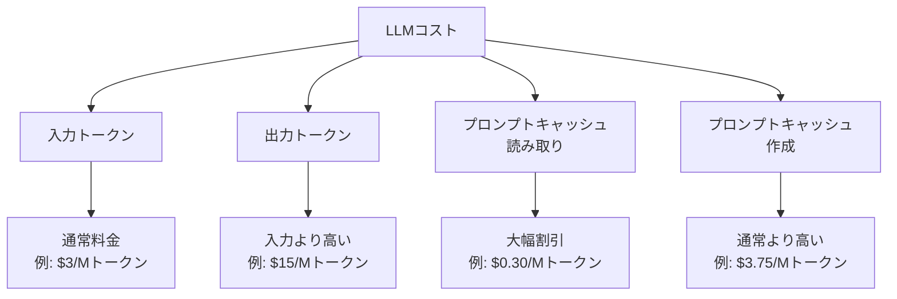

## 概要

LLM APIのコストはトークン単位で課金され、規模が大きくなると急増します。モデル選択・キャッシュ・バッチ処理・トークン最適化を組み合わせた包括的なコスト管理戦略を学びます。

## 本文

### コストの内訳と計算



### コスト計算ツール

```python
from dataclasses import dataclass

@dataclass
class ModelPricing:
    model: str
    input_per_million: float   # $/Mトークン
    output_per_million: float
    cache_write_per_million: float = 0.0
    cache_read_per_million: float = 0.0

# 参考料金（実際の最新料金はAnthropicのサイトを確認）
MODEL_PRICING = {
    "claude-opus-4-5": ModelPricing(
        "claude-opus-4-5",
        input_per_million=15.0,
        output_per_million=75.0,
        cache_write_per_million=18.75,
        cache_read_per_million=1.50,
    ),
    "claude-sonnet-4-5": ModelPricing(
        "claude-sonnet-4-5",
        input_per_million=3.0,
        output_per_million=15.0,
        cache_write_per_million=3.75,
        cache_read_per_million=0.30,
    ),
    "claude-haiku-4-5": ModelPricing(
        "claude-haiku-4-5",
        input_per_million=0.80,
        output_per_million=4.0,
        cache_write_per_million=1.0,
        cache_read_per_million=0.08,
    ),
}

class CostCalculator:
    """LLMコストの計算・追跡"""

    def __init__(self):
        self.total_cost_usd = 0.0
        self.usage_log: list[dict] = []

    def calculate_cost(
        self,
        model: str,
        input_tokens: int,
        output_tokens: int,
        cache_write_tokens: int = 0,
        cache_read_tokens: int = 0,
    ) -> float:
        """コストを計算してUSDで返す"""
        pricing = MODEL_PRICING.get(model)
        if not pricing:
            return 0.0

        cost = (
            input_tokens * pricing.input_per_million / 1_000_000
            + output_tokens * pricing.output_per_million / 1_000_000
            + cache_write_tokens * pricing.cache_write_per_million / 1_000_000
            + cache_read_tokens * pricing.cache_read_per_million / 1_000_000
        )
        return cost

    def record(self, model: str, input_tokens: int, output_tokens: int):
        """使用量を記録"""
        cost = self.calculate_cost(model, input_tokens, output_tokens)
        self.total_cost_usd += cost
        self.usage_log.append({
            "model": model,
            "input_tokens": input_tokens,
            "output_tokens": output_tokens,
            "cost_usd": cost,
        })

    def get_summary(self) -> dict:
        """コストサマリーを取得"""
        model_costs: dict[str, float] = {}
        for entry in self.usage_log:
            model = entry["model"]
            model_costs[model] = model_costs.get(model, 0) + entry["cost_usd"]

        return {
            "total_cost_usd": round(self.total_cost_usd, 4),
            "total_cost_jpy": round(self.total_cost_usd * 150, 0),  # 概算
            "by_model": {k: round(v, 4) for k, v in model_costs.items()},
            "request_count": len(self.usage_log),
        }


# コスト比較
print("モデル別コスト比較（1000トークン入力 + 500トークン出力）:")
calc = CostCalculator()
for model in MODEL_PRICING:
    cost = calc.calculate_cost(model, 1000, 500)
    print(f"  {model}: ${cost:.4f}")
```

### スマートモデルルーティングによるコスト削減

```python
import anthropic

class CostOptimizedRouter:
    """コスト最適化されたモデルルーター"""

    def __init__(self):
        self.client = anthropic.Anthropic()
        self.calculator = CostCalculator()

    def classify_task(self, message: str) -> str:
        """タスクの複雑さを分類"""
        word_count = len(message.split())

        # キーワードベースの分類
        complex_keywords = ["分析", "設計", "評価", "比較", "複雑", "詳細", "コード"]
        simple_keywords = ["とは", "何ですか", "教えて", "簡単に"]

        has_complex = any(kw in message for kw in complex_keywords)
        has_simple = any(kw in message for kw in simple_keywords)

        if has_complex or word_count > 100:
            return "complex"
        elif has_simple or word_count < 20:
            return "simple"
        else:
            return "medium"

    def select_model(self, task_complexity: str) -> tuple[str, int]:
        """複雑さに応じてモデルとmax_tokensを選択"""
        config = {
            "simple": ("claude-haiku-4-5", 200),
            "medium": ("claude-sonnet-4-5", 1024),
            "complex": ("claude-opus-4-5", 4096),
        }
        return config.get(task_complexity, ("claude-sonnet-4-5", 1024))

    def chat(self, message: str) -> dict:
        """コスト最適化されたチャット"""
        complexity = self.classify_task(message)
        model, max_tokens = self.select_model(complexity)

        response = self.client.messages.create(
            model=model,
            max_tokens=max_tokens,
            messages=[{"role": "user", "content": message}]
        )

        self.calculator.record(
            model,
            response.usage.input_tokens,
            response.usage.output_tokens
        )

        return {
            "answer": response.content[0].text,
            "model_used": model,
            "complexity": complexity,
            "cost_usd": self.calculator.usage_log[-1]["cost_usd"],
        }
```

### トークン最適化

```python
def optimize_prompt(system_prompt: str, user_message: str, history: list[dict]) -> dict:
    """トークン数を最小化したプロンプト設計"""

    # 1. System Promptは簡潔に
    optimized_system = system_prompt.strip()

    # 2. 会話履歴のトリミング（最近の10ターンのみ）
    max_history_turns = 10
    trimmed_history = history[-max_history_turns * 2:]  # user+assistantのペア

    # 3. 長すぎるメッセージはサマリーに（擬似コード）
    if len(trimmed_history) > 0:
        total_chars = sum(len(m["content"]) for m in trimmed_history)
        if total_chars > 10000:
            # 古いメッセージをサマリーに置き換え（実際はLLMで要約）
            summary = f"[以前の会話のサマリー: {total_chars}文字の会話]"
            trimmed_history = [
                {"role": "user", "content": summary},
                *trimmed_history[-4:]  # 直近2ターンのみ保持
            ]

    return {
        "system": optimized_system,
        "messages": [
            *trimmed_history,
            {"role": "user", "content": user_message}
        ],
        "estimated_input_tokens": (
            len(optimized_system + user_message) // 4  # 概算: 4文字≈1トークン
        )
    }
```

### コストアラートシステム

```python
class CostAlertSystem:
    """コスト超過アラートシステム"""

    def __init__(self, daily_limit_usd: float = 10.0, monthly_limit_usd: float = 200.0):
        self.daily_limit = daily_limit_usd
        self.monthly_limit = monthly_limit_usd
        self.daily_cost = 0.0
        self.monthly_cost = 0.0

    def add_cost(self, cost_usd: float):
        self.daily_cost += cost_usd
        self.monthly_cost += cost_usd

    def check_alerts(self) -> list[dict]:
        """アラートをチェック"""
        alerts = []

        if self.daily_cost > self.daily_limit * 0.8:
            alerts.append({
                "level": "warning",
                "message": f"日次コストが80%に到達: ${self.daily_cost:.2f}/${self.daily_limit:.2f}",
            })
        if self.daily_cost > self.daily_limit:
            alerts.append({
                "level": "critical",
                "message": f"日次コスト上限超過: ${self.daily_cost:.2f}",
                "action": "新規リクエストを一時停止"
            })
        if self.monthly_cost > self.monthly_limit * 0.9:
            alerts.append({
                "level": "warning",
                "message": f"月次コストが90%に到達: ${self.monthly_cost:.2f}/${self.monthly_limit:.2f}",
            })

        return alerts
```

## ハンズオン

コスト計算ツールを使ってみましょう。

### ステップ1：モデル別コスト比較

```python
# コスト比較シミュレーション
calc = CostCalculator()

scenarios = [
    {"name": "FAQチャットボット（月10万リクエスト）",
     "requests": 100_000, "input_tokens": 200, "output_tokens": 100,
     "model": "claude-haiku-4-5"},
    {"name": "ドキュメント分析（月1000リクエスト）",
     "requests": 1_000, "input_tokens": 5000, "output_tokens": 1000,
     "model": "claude-sonnet-4-5"},
    {"name": "複雑な分析（月100リクエスト）",
     "requests": 100, "input_tokens": 10000, "output_tokens": 4000,
     "model": "claude-opus-4-5"},
]

print("月間コスト試算:")
total_monthly = 0
for s in scenarios:
    cost_per_req = calc.calculate_cost(
        s["model"], s["input_tokens"], s["output_tokens"]
    )
    monthly_cost = cost_per_req * s["requests"]
    total_monthly += monthly_cost
    print(f"\n{s['name']}")
    print(f"  モデル: {s['model']}")
    print(f"  1リクエストあたり: ${cost_per_req:.4f}")
    print(f"  月間合計: ${monthly_cost:.2f} (約¥{monthly_cost * 150:.0f})")

print(f"\n月間合計コスト: ${total_monthly:.2f} (約¥{total_monthly * 150:.0f})")
```

## クイズ

<!-- QUIZ:START -->
**Q1. LLMコストの「出力トークン」が「入力トークン」より高い理由はどれですか？**

- A) 出力の品質が高いから
- B) 出力はリアルタイムで1トークンずつ逐次的に生成する計算が必要で、入力の並列処理より計算コストが高いから
- C) 出力はユーザーに見えるから
- D) 出力のトークン数が多いから

**正解: B**
**解説:** 入力トークンはバッチで並列処理できますが、出力は前のトークンに基づいて次のトークンを生成するため逐次的な処理が必要です。この「自己回帰的な生成」は計算コストが高く、多くのモデルで出力トークンは入力トークンの3〜5倍の価格に設定されています。

**Q2. 「スマートモデルルーティング」でコストを削減できる理由はどれですか？**

- A) より速いモデルを使うから
- B) タスクの複雑さに応じて最適なモデルを選択し、シンプルなタスクに高価なモデルを使わないようにするから
- C) リクエスト数を減らすから
- D) トークン数を削減するから

**正解: B**
**解説:** 「Pythonとは？」のような単純な質問にclaude-opus-4-5を使うのはコストの無駄です。Haikuはopusの約1/20のコストです。月10万リクエストをhaiku→opusに変えると月間コストが20倍になります。タスクの複雑さでモデルを切り替えることが最も効果的なコスト削減策の一つです。

**Q3. 会話履歴の「トークントリミング」が必要な理由はどれですか？**

- A) APIのレスポンスが速くなるから
- B) 会話が長くなるほど毎回送る入力トークンが増えコストが線形に増加するため、古い履歴を削除または要約する必要があるから
- C) モデルの精度が低下するから
- D) セキュリティ上の理由

**正解: B**
**解説:** 会話履歴をすべて毎回送ると、30ターンの会話で入力トークンが30倍になります。直近10ターンのみ保持する・古いメッセージを要約する・重要な情報のみ抽出するなどのトリミング戦略でコストを制御できます。
<!-- QUIZ:END -->

## まとめ

- LLMコストは入力・出力・キャッシュのトークン量で決まり、モデルにより大きく異なる
- スマートルーティングでシンプルなタスクにはHaiku、複雑なタスクにはOpusを使い分ける
- 会話履歴のトリミング・プロンプト最適化でトークン数を削減する
- コストアラートで日次・月次の上限を設定して予算超過を防ぐ

## 次のレッスン

次のレッスンでは、プロンプトをコードとして管理・デプロイするCI/CDパイプラインの設計を学びます。
