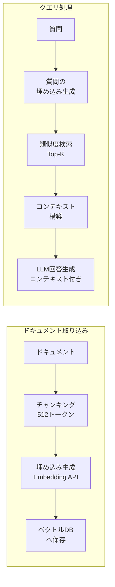
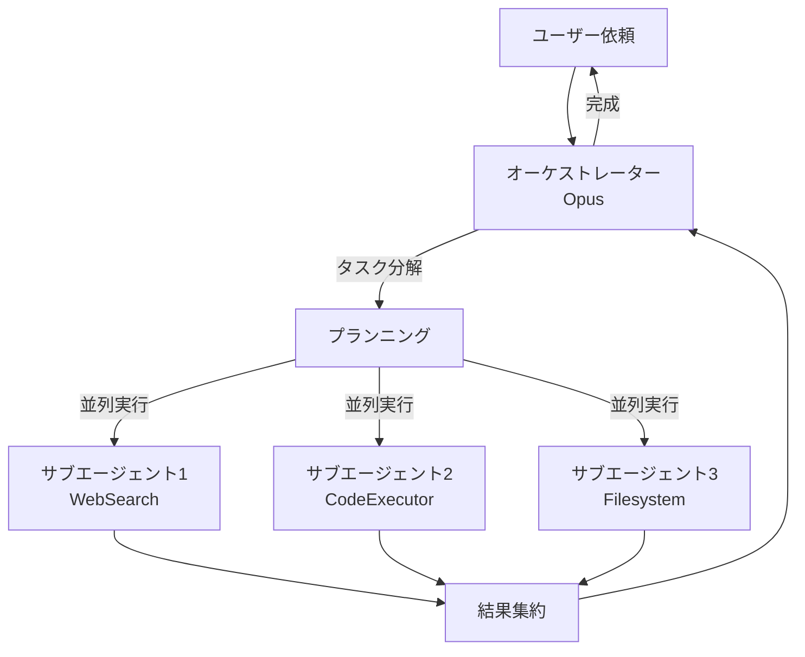

## 概要

実際の本番AIシステムが採用するアーキテクチャパターンを整理します。カスタマーサポートAI・RAGシステム・エージェントシステムの典型的な設計と、その選択理由を学びます。

## 本文

### パターン1：カスタマーサポートAI

```mermaid
graph TD
    U[ユーザー] --> GW[APIゲートウェイ\n認証・レート制限]
    GW --> CS[チャットサービス\nFastAPI]
    CS --> RC[Redisキャッシュ\nセッション・FAQ]
    CS --> CL[分類器\nHaiku]
    CL -->|FAQ| FC[FAQ検索\nElasticsearch]
    CL -->|複雑な質問| LLM[LLM回答生成\nSonnet/Opus]
    CL -->|エスカレーション| HM[人間エージェント\nSlack通知]
    LLM --> RAG[RAGパイプライン\n社内ドキュメント]
    FC --> DB[FAQ DB]
    RAG --> VDB[ベクトルDB\npgvector]
```



**主要な設計決定:**

| コンポーネント | 選択 | 理由 |
|-------------|------|------|
| 分類 | claude-haiku | 低コスト・高速・FAQ/複雑/エスカレーションの3分類 |
| FAQ回答 | Elasticsearch | LLMより速い・コストゼロ・正確 |
| 複雑な回答 | claude-sonnet | コスト・品質のバランス |
| セッション | Redis | 水平スケール対応・TTL管理 |
| ベクトルDB | pgvector | 既存PostgreSQLを活用 |

### パターン2：RAGシステム



```python
import anthropic
from dataclasses import dataclass

@dataclass
class Document:
    id: str
    content: str
    metadata: dict

@dataclass
class RetrievedContext:
    documents: list[Document]
    query: str

class ProductionRAGPipeline:
    """本番グレードのRAGパイプライン"""

    def __init__(self):
        self.client = anthropic.Anthropic()
        # 実際はpgvectorやPineconeに接続
        self._mock_docs = [
            Document("1", "Pythonは汎用プログラミング言語で、シンプルな構文が特徴です。", {"source": "python_intro.md"}),
            Document("2", "FastAPIはPythonの高性能WebフレームワークでOpenAPIを自動生成します。", {"source": "fastapi_docs.md"}),
        ]

    def retrieve(self, query: str, top_k: int = 3) -> list[Document]:
        """関連ドキュメントを取得（モック実装）"""
        # 実際はベクトル検索
        return self._mock_docs[:top_k]

    def generate(self, query: str, contexts: list[Document]) -> dict:
        """コンテキスト付きで回答生成"""
        context_text = "\n\n".join([
            f"[出典: {doc.metadata.get('source', 'unknown')}]\n{doc.content}"
            for doc in contexts
        ])

        response = self.client.messages.create(
            model="claude-sonnet-4-5",
            max_tokens=1024,
            system="""あなたは技術サポートエージェントです。
提供されたコンテキストのみを使って回答してください。
コンテキストに情報がない場合は「この情報は持ち合わせていません」と回答してください。""",
            messages=[{
                "role": "user",
                "content": f"コンテキスト:\n{context_text}\n\n質問: {query}"
            }]
        )

        return {
            "answer": response.content[0].text,
            "sources": [doc.metadata.get("source") for doc in contexts],
            "tokens_used": response.usage.input_tokens + response.usage.output_tokens,
        }

    def query(self, question: str) -> dict:
        """エンドツーエンドのRAGクエリ"""
        contexts = self.retrieve(question)
        return self.generate(question, contexts)
```

### パターン3：エージェントシステム



```python
from typing import Any

class AgentOrchestrator:
    """エージェントオーケストレーターの本番パターン"""

    def __init__(self):
        self.client = anthropic.Anthropic()
        self.tools = self._define_tools()

    def _define_tools(self) -> list[dict]:
        return [
            {
                "name": "search_web",
                "description": "Webを検索して最新情報を取得",
                "input_schema": {
                    "type": "object",
                    "properties": {
                        "query": {"type": "string", "description": "検索クエリ"}
                    },
                    "required": ["query"]
                }
            },
            {
                "name": "execute_python",
                "description": "Pythonコードを安全なサンドボックスで実行",
                "input_schema": {
                    "type": "object",
                    "properties": {
                        "code": {"type": "string", "description": "実行するコード"}
                    },
                    "required": ["code"]
                }
            },
        ]

    def _execute_tool(self, tool_name: str, tool_input: dict) -> str:
        """ツールを実行（モック）"""
        if tool_name == "search_web":
            return f"検索結果: '{tool_input['query']}' に関する情報..."
        elif tool_name == "execute_python":
            return f"実行結果: {tool_input['code'][:50]}..."
        return "Unknown tool"

    def run(self, task: str, max_iterations: int = 10) -> str:
        """エージェントループを実行"""
        messages = [{"role": "user", "content": task}]

        for iteration in range(max_iterations):
            response = self.client.messages.create(
                model="claude-opus-4-5",
                max_tokens=4096,
                tools=self.tools,
                messages=messages,
            )

            messages.append({"role": "assistant", "content": response.content})

            # ツール使用がなければ完了
            if response.stop_reason == "end_turn":
                text_blocks = [b for b in response.content if hasattr(b, "text")]
                return text_blocks[-1].text if text_blocks else ""

            # ツールを実行してメッセージを追加
            tool_results = []
            for block in response.content:
                if block.type == "tool_use":
                    result = self._execute_tool(block.name, block.input)
                    tool_results.append({
                        "type": "tool_result",
                        "tool_use_id": block.id,
                        "content": result,
                    })

            messages.append({"role": "user", "content": tool_results})

        return "最大イテレーション数に到達しました"
```

## ハンズオン

本番パターンを小規模で実装してみましょう。

### ステップ1：RAGパイプラインのデモ

```python
rag = ProductionRAGPipeline()

questions = [
    "Pythonについて教えてください",
    "FastAPIとは何ですか？",
]

print("RAGパイプラインのデモ:")
for q in questions:
    result = rag.query(q)
    print(f"\n質問: {q}")
    print(f"回答: {result['answer'][:100]}...")
    print(f"出典: {result['sources']}")
    print(f"トークン: {result['tokens_used']}")
```

## クイズ

<!-- QUIZ:START -->
**Q1. カスタマーサポートAIで「分類→FAQ検索→LLM回答→エスカレーション」という段階を設ける理由はどれですか？**

- A) 実装を複雑にするため
- B) 単純な質問はFAQ検索で即答してコスト削減し、複雑な質問のみLLMを使用し、解決不能なものを人間に渡すことで品質とコストを最適化するため
- C) セキュリティを向上させるため
- D) レスポンスを遅くするため

**正解: B**
**解説:** 全質問にLLMを使うと、「営業時間は？」のような単純なFAQにも高いコストがかかります。事前の分類で80%のFAQをElasticsearch等で即答し、残り20%のみLLMを使うことでコストを大幅削減できます。さらに「怒っているユーザー」などLLMが対応できないケースを人間に渡すエスカレーションも重要です。

**Q2. RAGシステムで「チャンキング（文書分割）」が必要な理由はどれですか？**

- A) データベースの容量を節約するため
- B) LLMのコンテキスト長制限への対応と、関連性の高い小さな断片を正確に取得するため
- C) 処理を高速化するため
- D) ライセンス上の理由

**正解: B**
**解説:** 1万ページのPDFをそのままベクトル化しても、「特定の質問に関連する箇所」の検索精度が低くなります。512〜1024トークンのチャンクに分割することで、質問に最も関連する特定のセクションを高精度で取得でき、LLMへの入力も適切なサイズに収められます。

**Q3. エージェントシステムで「最大イテレーション数」を設定する理由はどれですか？**

- A) APIコストを削減するため
- B) 無限ループや意図しない繰り返し実行を防ぎ、コストと時間を制御するため
- C) 回答品質を向上させるため
- D) セキュリティを確保するため

**正解: B**
**解説:** エージェントがツールを使いながらループすると、バグやエッジケースで無限に繰り返す可能性があります。max_iterations=10のような上限を設けることで、最悪でも10回のLLM呼び出しでタスクを終了させ、予期しないコスト増加や時間超過を防ぎます。
<!-- QUIZ:END -->

## まとめ

- カスタマーサポートAIは分類→FAQ→LLM→エスカレーションの段階で品質とコストを最適化する
- RAGシステムはチャンキング・ベクトル検索・コンテキスト付き生成の3段階で構成される
- エージェントシステムはオーケストレーターがツールを使いながらループして複雑なタスクを達成する
- 本番システムではどのパターンも監視・フォールバック・コスト管理が不可欠

## 次のレッスン

Chapter 10では、ハーネスエンジニアリングを学びます。CLAUDE.md・スキル・フック・オーケストレーターを組み合わせてAIの自律開発環境を構築します。
