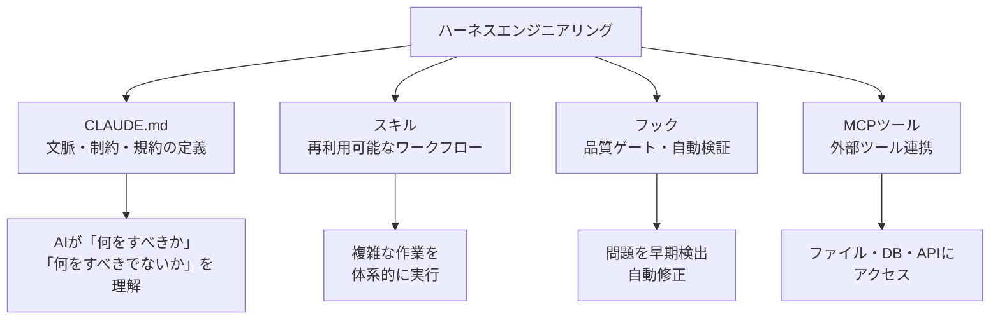
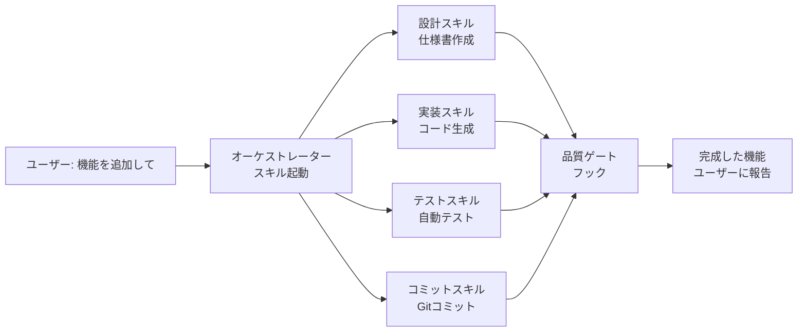

## 概要

ハーネスエンジニアリングとは、AIエージェントが自律的に高品質な作業を行えるよう環境・制約・ツールを整備する技術です。CLAUDE.md・スキル・フック・MCPツールの組み合わせで「AIが最大限の力を発揮できる場」を作ります。

## 本文

### ハーネスエンジニアリングの全体像



### なぜハーネスエンジニアリングが必要か

従来のAI活用では「プロンプトを工夫して良い回答を引き出す」ことが主流でした。しかしAIエージェントが複数ステップの作業を自律的に行う時代では、単発のプロンプト工夫では不十分です。

```
従来のアプローチ（プロンプトエンジニアリング）:
  ユーザー → 良いプロンプト → AI → 回答

ハーネスエンジニアリング:
  環境整備（CLAUDE.md + スキル + フック）
  ユーザー → 依頼 → AI → 自律的に複数ステップ実行 → 高品質な成果物
```

### 4つのコンポーネント

**1. CLAUDE.md**

プロジェクトの文脈・技術スタック・規約をAIに伝えるファイルです。「このプロジェクトではTypeScriptを使う」「コミットメッセージはConventional Commits形式」などを定義します。

```markdown
# CLAUDE.md の例

## プロジェクト概要
React + TypeScript + Tailwind CSSで作られたEコマースサイト

## 技術スタック
- Next.js 15 (App Router)
- TypeScript strict mode
- Tailwind CSS v4

## コーディング規約
- コンポーネントはServer Components優先
- 型定義はinterfaceよりtypeを使う
- テストはVitest + React Testing Library
```

**2. スキル（Skills）**

AIが実行できる再利用可能なワークフローです。「コミット」「設計」「デプロイ」などの複雑な作業をステップバイステップで定義します。

```markdown
# commit スキル の例

1. git statusで変更を確認
2. git diffで差分を分析
3. Conventional Commits形式でコミットメッセージを生成
4. git commitを実行
5. 結果を確認してユーザーに報告
```

**3. フック（Hooks）**

AIの作業前後に自動実行されるチェックです。「コミット前にESLintを実行」「TypeScriptの型チェックをパスしないと進まない」などの品質ゲートを設けます。

**4. MCPツール（Model Context Protocol）**

AIが使用できる外部ツールの拡張です。ファイル操作・データベースクエリ・Web検索・APIコールなどをAIが安全に利用できるようにします。

### ハーネスエンジニアリングの効果

| 指標 | ハーネスなし | ハーネスあり |
|-----|------------|------------|
| 一貫性 | 毎回異なる出力 | 規約に準拠した安定した出力 |
| 品質 | エラーが多い | 自動チェックで品質保証 |
| 速度 | 指示→確認→修正のループ | 自律的に完了まで実行 |
| 信頼性 | 人間が毎回監視 | 品質ゲートで自動検証 |

### 自律開発との関係

ハーネスエンジニアリングは「自律開発（Autonomous Development）」を可能にする基盤です。



## クイズ

<!-- QUIZ:START -->
**Q1. ハーネスエンジニアリングとプロンプトエンジニアリングの主な違いはどれですか？**

- A) ハーネスエンジニアリングは高コスト
- B) プロンプトエンジニアリングが単発の回答品質を高めるのに対し、ハーネスエンジニアリングはAIが複数ステップの作業を自律的に高品質で実行できる環境全体を整備する
- C) ハーネスエンジニアリングはツールを使わない
- D) プロンプトエンジニアリングの方が新しい技術

**正解: B**
**解説:** プロンプトエンジニアリングはAIへの質問の仕方を工夫する技術です。一方ハーネスエンジニアリングはCLAUDE.md（文脈）・スキル（ワークフロー）・フック（品質ゲート）・MCPツール（ツール連携）という環境全体を整備して、AIが複数ステップの複雑な作業を自律的に実行できるようにします。

**Q2. ハーネスエンジニアリングでフック（Hooks）を設ける主な目的はどれですか？**

- A) AIの実行速度を向上させる
- B) AIの作業前後に自動的に品質チェックを実行し、問題を早期発見・修正する品質ゲートとして機能させる
- C) APIコストを削減する
- D) ユーザーへの通知を送る

**正解: B**
**解説:** フックは「AIがコードを書いた後に自動でlintとテストを実行」「コミット前に型チェックをパスすること」のような品質ゲートです。AIの自律的な作業に対して人間が毎回確認しなくても、自動チェックで品質を保証できます。

**Q3. CLAUDE.mdの主な役割はどれですか？**

- A) AIのモデルバージョンを指定する
- B) プロジェクトの文脈・技術スタック・コーディング規約をAIに伝え、プロジェクト固有の作業ができるようにする
- C) APIキーを設定する
- D) データベース接続を管理する

**正解: B**
**解説:** CLAUDE.mdはAIへの「プロジェクト説明書」です。どのフレームワークを使うか・どんな規約があるか・何をすべきでないかなどをあらかじめ定義しておくことで、AIが毎回同じ文脈を理解しなくてもプロジェクトに合った作業ができます。
<!-- QUIZ:END -->

## まとめ

- ハーネスエンジニアリングはAIが自律的に高品質な作業ができる環境全体の整備
- CLAUDE.md・スキル・フック・MCPツールの4つのコンポーネントで構成される
- 単発のプロンプト工夫ではなく、環境設計によってAIの能力を最大化する
- 自律開発の基盤として、複数ステップの複雑な作業を品質保証しながら自動化できる

## 次のレッスン

次のレッスンでは、CLAUDE.mdの効果的な設計方法を深掘りして学びます。
