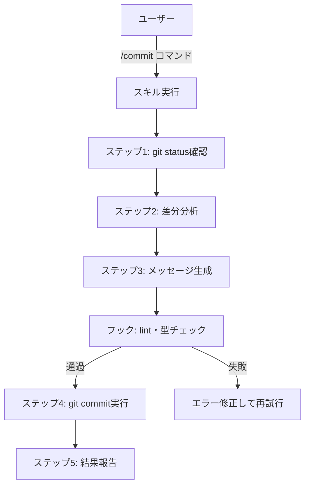

## 概要

スキルはAIが実行するワークフローの定義、コマンドはユーザーがAIを呼び出すインターフェース、フックはAIの作業前後に自動実行される品質チェックです。3つを組み合わせることでAIの自律作業の品質と一貫性が向上します。

## 本文

### スキル・コマンド・フックの関係



### スキルの構造

スキルはMarkdownファイルで定義します。AIはスキルファイルを読み込んで、その手順通りに作業を実行します。

```markdown
# commit スキル

## 目的
変更内容を分析して適切なgitコミットを作成する

## 手順

1. `git status` を実行して変更ファイルを確認する
2. `git diff --staged` と `git diff` で変更内容を確認する
3. `git log --oneline -5` で最近のコミットスタイルを確認する
4. 以下のルールでコミットメッセージを作成する：
   - Conventional Commits形式: `type(scope): description`
   - type: feat/fix/docs/style/refactor/test/chore
   - 日本語で説明する
5. `git add` で関連ファイルをステージング
6. `git commit -m "..."` でコミット
7. コミット内容をユーザーに報告する

## 制約
- secretsや.envファイルはコミットしない
- 無関係なファイルは含めない
- テストが失敗している場合はコミットしない

## 出力
コミットSHA・メッセージ・変更ファイル数を報告する
```

### コマンドの定義

コマンドはスキルへのショートカットです。ユーザーが `/commit` と入力するとコミットスキルが起動します。

```markdown
# .claude/commands/commit.md

以下のコミットスキルを実行してください：

@skills/commit.md

現在の変更内容を適切にコミットしてください。
```

### フックの実装

フックはJSON設定で定義します。Claude Codeは設定に従って自動的にフックを実行します。

```json
// .claude/hooks.json
{
  "hooks": {
    "pre-commit": {
      "description": "コミット前の品質チェック",
      "commands": [
        {
          "command": "npm run lint",
          "on_failure": "abort",
          "message": "ESLintエラーを修正してからコミットしてください"
        },
        {
          "command": "npx tsc --noEmit",
          "on_failure": "abort",
          "message": "TypeScriptの型エラーを修正してからコミットしてください"
        }
      ]
    },
    "post-edit": {
      "description": "ファイル編集後の自動チェック",
      "commands": [
        {
          "command": "npm run lint --fix",
          "on_failure": "warn",
          "message": "自動修正できないlintエラーがあります"
        }
      ]
    }
  }
}
```

### 実践的なスキルの例

```markdown
# develop スキル

## 目的
機能追加を設計から実装・テスト・コミットまで完結させる

## 前提条件
- docs/specs/ に仕様書があること
- テスト環境が動作すること

## 手順

### フェーズ1: 設計
1. docs/specs/ から関連する仕様書を読む
2. 実装計画（変更ファイル・主要な関数・型定義）を作成
3. ユーザーに計画を確認（承認なしに実装しない）

### フェーズ2: 実装
4. 型定義から先に実装する
5. コンポーネント/関数を実装する
6. エラーハンドリングを追加する

### フェーズ3: 検証
7. `npm run build` でビルドエラーがないか確認
8. `npx tsc --noEmit` で型エラーがないか確認
9. `npm test` でテストが通るか確認

### フェーズ4: コミット
10. /commit スキルを呼び出してコミット

## エラー時の対応
- ビルドエラー: エラーメッセージを解析して修正
- 型エラー: 型定義を見直す
- テスト失敗: 実装を確認して修正
- 3回試行しても解決しない場合はユーザーに報告
```

## ハンズオン

スキルの品質を評価するツールを作ってみましょう。

### ステップ1：スキル仕様のバリデーター

```python
from dataclasses import dataclass

@dataclass
class SkillSpec:
    name: str
    purpose: str
    steps: list[str]
    constraints: list[str]
    output: str

def validate_skill(skill_content: str) -> dict:
    """スキル定義の品質を評価"""

    checks = {
        "has_purpose": "## 目的" in skill_content or "## Purpose" in skill_content,
        "has_steps": "## 手順" in skill_content or "## Steps" in skill_content,
        "has_numbered_steps": any(f"{i}." in skill_content for i in range(1, 5)),
        "has_constraints": "## 制約" in skill_content or "制約" in skill_content,
        "has_output": "## 出力" in skill_content or "## Output" in skill_content,
        "has_error_handling": "エラー" in skill_content or "失敗" in skill_content,
        "reasonable_length": 200 < len(skill_content) < 3000,
    }

    score = sum(checks.values()) / len(checks)

    suggestions = []
    if not checks["has_constraints"]:
        suggestions.append("制約セクションを追加: AIがやってはいけないことを明記")
    if not checks["has_error_handling"]:
        suggestions.append("エラー時の対応を追加: 失敗時にどう行動するか")
    if not checks["has_output"]:
        suggestions.append("出力セクションを追加: 完了時に何を報告するか")

    return {
        "score": score,
        "checks": checks,
        "suggestions": suggestions,
        "quality": "高" if score >= 0.8 else "中" if score >= 0.6 else "低",
    }


# テスト
sample_skill = """
# sample スキル

## 目的
Gitコミットを作成する

## 手順
1. git statusを確認
2. git diffで差分確認
3. コミットメッセージを生成
4. git commitを実行

## 制約
- secretsはコミットしない

## 出力
コミットSHAを報告
"""

result = validate_skill(sample_skill)
print(f"スキル品質: {result['quality']} ({result['score']:.0%})")
for check, passed in result['checks'].items():
    status = "✓" if passed else "✗"
    print(f"  {status} {check}")
if result['suggestions']:
    print("\n改善提案:")
    for s in result['suggestions']:
        print(f"  - {s}")
```

## クイズ

<!-- QUIZ:START -->
**Q1. スキルをMarkdownで定義する利点はどれですか？**

- A) 実行速度が速い
- B) AIが自然言語で手順を理解でき、人間も読めるためレビュー・更新が容易で、スキルの動作が透明になる
- C) デバッグが容易
- D) 型安全性が保証される

**正解: B**
**解説:** コードで書かれた自動化スクリプトと違い、Markdownのスキル定義はAIが自然言語として理解できます。また人間も読めるため「このスキルは何をするのか」がすぐ分かり、レビューや改善も容易です。スキルの動作が「ブラックボックス」にならないことがハーネスエンジニアリングの重要な原則です。

**Q2. フックの`on_failure: "abort"`設定の意味はどれですか？**

- A) エラーを無視して続行する
- B) チェックが失敗した場合、AIの作業を中断してユーザーに報告する（例: lintエラーがあればコミットしない）
- C) ファイルを削除する
- D) 再起動する

**正解: B**
**解説:** `on_failure: "abort"`はチェックが失敗した場合に処理を中断するゲートです。コミット前にlintエラーがあれば`abort`でコミットを止め、エラーを修正させます。これにより「品質基準を満たさないコードが誤ってコミットされる」を自動的に防げます。

**Q3. スキルの「エラー時の対応」を定義する理由はどれですか？**

- A) エラーを非表示にするため
- B) AIが予期しない問題に遭遇した際にどう行動すべきかを明確にし、無限ループや誤った修正を防ぐため
- C) デバッグを容易にするため
- D) ユーザーへの通知を送るため

**正解: B**
**解説:** スキルが「3回試行しても解決しない場合はユーザーに報告」などのエラー対応を定義していないと、AIが同じ間違いを繰り返したり、問題が解決できないのに作業を続けたりすることがあります。明確なエラー対応でAIが適切に「助けを求める」ことができます。
<!-- QUIZ:END -->

## まとめ

- スキルはAIのワークフローをMarkdownで定義し、手順・制約・出力・エラー対応を含める
- コマンドはスキルへのショートカットで、ユーザーが簡単にスキルを起動できるようにする
- フックはlint・型チェック・テストなどの品質ゲートを自動化する
- 3つを組み合わせることでAIの自律作業の品質と一貫性が保証される

## 次のレッスン

次のレッスンでは、効果的なスキル設計のベストプラクティスを学びます。
