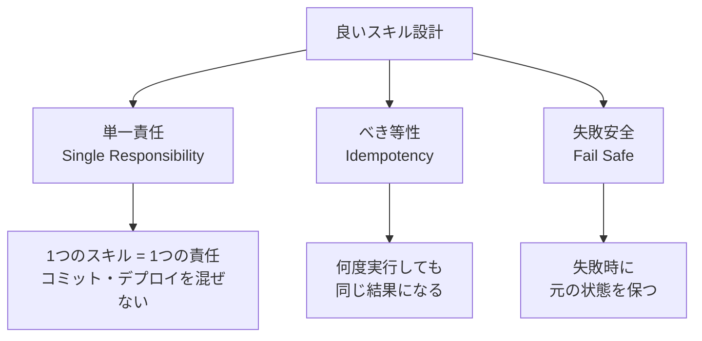

## 概要

良いスキルは「単一責任・べき等・失敗安全」の原則に従います。スキルのトリガー定義・他スキルとの連携・段階的な作業の分解など、実践的な設計パターンを学びます。

## 本文

### スキル設計の3原則



### 単一責任の原則

```markdown
# 悪い例: 何でもスキル（やりすぎ）

## 手順
1. コードを書く
2. テストを実行する
3. ドキュメントを更新する
4. コミットする
5. デプロイする
6. SlackでチームにDMする

---

# 良い例: 責任を分割

## develop スキル → コード実装
## test スキル → テスト実行
## commit スキル → コミット
## deploy スキル → デプロイ（別スキル）
```

### トリガーの設計

スキルはどのような依頼で起動するかを明確に定義します。

```markdown
# commit スキル

## トリガー（いつ使うか）

以下のような依頼があった場合に積極的に使う：
- 「コミットして」「変更をコミット」「git commit」
- 「変更を保存して」「コードを保存して」

以下の場合は使わない（別スキルを使う）：
- 「pushして」→ push スキルを使う
- 「デプロイして」→ deploy スキルを使う
```

### スキルのオーケストレーション

大きな作業は複数のスキルを組み合わせます。

```markdown
# develop スキル（オーケストレーター）

## 目的
機能追加を設計から実装・コミットまで完結させる

## 手順

### フェーズ1: 設計
1. /design スキルを呼び出して仕様を確認・設計する
2. ユーザーに設計を確認する（承認なしに実装しない）

### フェーズ2: 実装
3. 型定義から実装する
4. 実装する
5. ビルド・型チェックを実行する

### フェーズ3: 完了
6. /commit スキルを呼び出してコミットする
7. 完了をユーザーに報告する

## サブスキル
このスキルは以下のスキルを呼び出します：
- design スキル: 設計フェーズ
- commit スキル: コミットフェーズ
```

### 変数とパラメーターの使い方

```markdown
# deploy スキル

## 引数
- `env`: デプロイ先環境（staging | production）デフォルト: staging

## 手順

1. 引数で指定された環境を確認する
2. `{{env}}`が`production`の場合は必ずユーザーに確認を取る
3. ビルドを実行する: `npm run build`
4. `{{env}}`にデプロイ: `npm run deploy:{{env}}`
5. ヘルスチェックを実行する
```

### スキルのテスト設計

```python
from dataclasses import dataclass
from typing import Callable

@dataclass
class SkillTestCase:
    name: str
    input: str           # ユーザーの入力
    expected_actions: list[str]  # AIが取るべきアクション
    should_not_do: list[str]     # AIがやってはいけないアクション

def evaluate_skill_execution(
    test_case: SkillTestCase,
    actual_actions: list[str]
) -> dict:
    """スキル実行結果を評価"""

    required_done = [
        action for action in test_case.expected_actions
        if any(action.lower() in actual.lower() for actual in actual_actions)
    ]

    forbidden_done = [
        action for action in test_case.should_not_do
        if any(action.lower() in actual.lower() for actual in actual_actions)
    ]

    required_rate = len(required_done) / max(len(test_case.expected_actions), 1)
    passed = required_rate == 1.0 and len(forbidden_done) == 0

    return {
        "test_name": test_case.name,
        "passed": passed,
        "required_rate": required_rate,
        "required_done": required_done,
        "required_missing": [a for a in test_case.expected_actions if a not in required_done],
        "forbidden_violations": forbidden_done,
    }


# テストケース例
commit_test_cases = [
    SkillTestCase(
        name="通常のコミット",
        input="変更をコミットして",
        expected_actions=["git status実行", "git diff確認", "コミットメッセージ生成", "git commit実行"],
        should_not_do=["git push実行", ".envのコミット", "全ファイルのステージング"],
    ),
    SkillTestCase(
        name="テスト失敗時のブロック",
        input="コミットして",
        expected_actions=["テスト実行", "失敗を検出", "ユーザーに報告"],
        should_not_do=["テスト失敗のままコミット"],
    ),
]

# テスト実行（モック）
for test in commit_test_cases:
    mock_actions = ["git status実行", "git diff確認", "コミットメッセージ生成", "git commit実行"]
    result = evaluate_skill_execution(test, mock_actions)
    status = "PASS" if result["passed"] else "FAIL"
    print(f"[{status}] {result['test_name']}")
    if not result["passed"]:
        print(f"  未実行: {result['required_missing']}")
```

### スキルのバージョン管理

```
skills/
  commit/
    v1.md          # 古いバージョン
    v2.md          # 現行バージョン（シンボリックリンク: current.md）
    current.md → v2.md
  develop/
    current.md
  changelog.md     # バージョン変更履歴
```

```markdown
# skills/changelog.md

## commit スキル

### v2.0 (2026-03-01)
- コミット前にテスト実行を追加
- Conventional Commitsの強制
- secretsチェックを追加

### v1.0 (2026-01-15)
- 初期バージョン
```

## ハンズオン

スキルの設計品質を向上させてみましょう。

### ステップ1：スキルのリファクタリング

```python
# スキル定義の品質チェック
def analyze_skill_design(skill_markdown: str) -> dict:
    """スキル設計パターンを分析"""

    issues = []
    suggestions = []

    # 単一責任チェック
    action_count = skill_markdown.count("## 手順") + skill_markdown.count("## Steps")
    if len(skill_markdown) > 2000:
        issues.append("スキルが長すぎる可能性（複数の責任を持っていないか確認）")
        suggestions.append("大きなスキルは複数のサブスキルに分割することを検討")

    # ユーザー確認の有無
    has_user_confirm = "ユーザーに確認" in skill_markdown or "確認を取る" in skill_markdown
    if "本番" in skill_markdown or "production" in skill_markdown.lower():
        if not has_user_confirm:
            issues.append("本番環境への操作でユーザー確認がない")
            suggestions.append("本番環境への変更には必ずユーザー確認ステップを追加")

    # エラーハンドリング
    has_error_handling = "失敗" in skill_markdown or "エラー" in skill_markdown
    if not has_error_handling:
        issues.append("エラー時の対応が定義されていない")
        suggestions.append("「3回失敗した場合はユーザーに報告」などのエラー対応を追加")

    return {
        "issues": issues,
        "suggestions": suggestions,
        "quality_score": 1.0 - (len(issues) * 0.2),
    }


sample_skill = """
# deploy スキル

## 目的
本番にデプロイする

## 手順
1. ビルドする: npm run build
2. デプロイする: npm run deploy:production
3. 完了を報告

## 出力
デプロイURL
"""

result = analyze_skill_design(sample_skill)
print(f"品質スコア: {result['quality_score']:.0%}")
if result['issues']:
    print("問題点:")
    for issue in result['issues']:
        print(f"  ⚠ {issue}")
if result['suggestions']:
    print("改善提案:")
    for s in result['suggestions']:
        print(f"  → {s}")
```

## クイズ

<!-- QUIZ:START -->
**Q1. スキルの「単一責任原則」を守る理由はどれですか？**

- A) ファイルサイズを小さくするため
- B) 1スキル1責任にすることで再利用・テスト・デバッグが容易になり、変更の影響範囲が明確になるため
- C) 実行速度が向上するため
- D) セキュリティが向上するため

**正解: B**
**解説:** 「実装→テスト→コミット→デプロイ」を1つのスキルに詰め込むと、コミット部分だけ変更したいときもスキル全体を修正する必要があります。分割することで「commitスキルを改善する」「deployスキルを改善する」が独立してでき、それぞれを個別にテストできます。

**Q2. 本番環境への操作スキルで「ユーザー確認ステップ」を必須にする理由はどれですか？**

- A) 処理を遅くするため
- B) 取り返しのつかない操作（本番データベースの変更・本番サーバーへのデプロイ）をAIが自律的に実行することを防ぎ、人間が最終判断を下すため
- C) AIの判断を尊重するため
- D) ログを記録するため

**正解: B**
**解説:** AIが自律的に「本番にデプロイしておきました」とやってしまうのは危険です。本番環境への変更は取り返しがつかない場合があります。スキルに「productionの場合はユーザーに確認を取る」ステップを入れることで、最終決定権を人間が持つことを保証します。

**Q3. スキルに「エラー時のN回リトライ後にユーザーに報告」を定義する理由はどれですか？**

- A) APIコストを削減するため
- B) AIが解決できない問題で無限にリトライするのを防ぎ、適切なタイミングで人間に助けを求めるため
- C) 実行速度を向上させるため
- D) ログを管理するため

**正解: B**
**解説:** エラー対応を定義していないと、AIが同じエラーを何度も繰り返して時間とコストを浪費することがあります。「3回試行して失敗した場合はユーザーに状況を報告してアドバイスを求める」という定義で、AIが適切に「限界を認識してヘルプを求める」行動を促せます。
<!-- QUIZ:END -->

## まとめ

- スキルは単一責任・べき等性・失敗安全の原則で設計する
- 大きな作業は複数のスキルに分割して、オーケストレータースキルで組み合わせる
- 本番環境への操作は必ずユーザー確認ステップを含める
- エラー時のリトライ回数と「ユーザーへのエスカレーション」を明確に定義する

## 次のレッスン

次のレッスンでは、フックを使った品質ゲートの設計と自動化を学びます。
