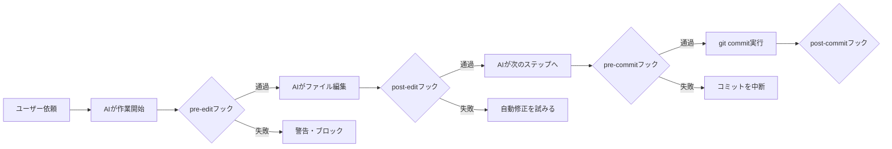

## 概要

フックはAIの作業前後に自動実行されるチェックで、コード品質・セキュリティ・テストを自動保証します。pre-commit・post-edit・pre-deployなどの具体的なフック設計パターンと実装を学びます。

## 本文

### フックの種類とタイミング



### フック設定ファイルの構造

```json
// .claude/settings.json
{
  "hooks": {
    "PostToolUse": [
      {
        "matcher": "Write|Edit",
        "hooks": [
          {
            "type": "command",
            "command": "npm run lint --fix 2>&1 | head -50"
          }
        ]
      }
    ],
    "PreToolUse": [
      {
        "matcher": "Bash",
        "hooks": [
          {
            "type": "command",
            "command": "echo 'Bash実行前チェック: 危険なコマンドでないか確認'"
          }
        ]
      }
    ]
  }
}
```

### 品質ゲートのパターン

**パターン1: 構文・型チェック**

```bash
#!/bin/bash
# .claude/hooks/post-edit.sh

# TypeScriptファイルが編集された場合のみ実行
if echo "$EDITED_FILES" | grep -q "\.tsx\?$"; then
    echo "TypeScriptの型チェックを実行中..."
    npx tsc --noEmit
    if [ $? -ne 0 ]; then
        echo "ERROR: 型エラーがあります。修正してください。"
        exit 1
    fi
    echo "型チェック: OK"
fi
```

**パターン2: セキュリティチェック**

```python
import re
import sys

def check_secrets(file_path: str) -> list[str]:
    """ファイル内のシークレットパターンを検出"""

    patterns = [
        (r'(?i)api[_-]?key\s*=\s*["\'](?!process\.env)[^\'"]{10,}', "APIキー"),
        (r'(?i)password\s*=\s*["\'][^\'"]{4,}', "パスワード"),
        (r'(?i)secret\s*=\s*["\'][^\'"]{8,}', "シークレット"),
        (r'sk-[a-zA-Z0-9]{48}', "OpenAI APIキー"),
        (r'ANTHROPIC_API_KEY\s*=\s*["\']sk-ant', "Anthropic APIキー（ハードコード）"),
    ]

    issues = []
    try:
        with open(file_path, 'r', encoding='utf-8') as f:
            content = f.read()

        for pattern, description in patterns:
            if re.search(pattern, content):
                issues.append(f"{file_path}: {description}が検出されました")
    except (FileNotFoundError, UnicodeDecodeError):
        pass

    return issues


# フックとして実行
if __name__ == "__main__":
    import sys
    files = sys.argv[1:]
    all_issues = []
    for f in files:
        all_issues.extend(check_secrets(f))

    if all_issues:
        print("セキュリティ警告:")
        for issue in all_issues:
            print(f"  ⚠ {issue}")
        sys.exit(1)
    else:
        print("セキュリティチェック: OK")
        sys.exit(0)
```

**パターン3: テスト自動実行**

```bash
#!/bin/bash
# .claude/hooks/pre-commit.sh

echo "コミット前チェックを開始..."

# 1. Lintチェック
echo "1/3 ESLintチェック..."
npm run lint
if [ $? -ne 0 ]; then
    echo "FAIL: ESLintエラーがあります"
    exit 1
fi

# 2. 型チェック
echo "2/3 TypeScript型チェック..."
npx tsc --noEmit
if [ $? -ne 0 ]; then
    echo "FAIL: 型エラーがあります"
    exit 1
fi

# 3. テスト（変更されたファイルに関連するテストのみ）
echo "3/3 関連テストを実行..."
npm test -- --passWithNoTests
if [ $? -ne 0 ]; then
    echo "FAIL: テストが失敗しています"
    exit 1
fi

echo "全チェック通過: コミットを続行します"
exit 0
```

### 段階的な品質ゲート

フックは「警告（warn）」と「ブロック（abort）」の2段階で設計します。

```
品質ゲートの段階:

1. warn（警告のみ）:
   - コードフォーマット（prettier）
   - 非推奨APIの使用
   → 修正を促すが、作業は継続

2. abort（ブロック）:
   - セキュリティ問題（APIキーのハードコード）
   - 型エラー
   - テスト失敗
   → 問題が解決するまで次のステップに進まない
```

### フックのデバッグ

```bash
# フックのデバッグ方法
# 1. フックを単体実行
bash .claude/hooks/pre-commit.sh

# 2. 詳細ログを有効化
CLAUDE_HOOK_DEBUG=1 bash .claude/hooks/pre-commit.sh

# 3. 特定のファイルでテスト
EDITED_FILES="src/app.ts" bash .claude/hooks/post-edit.sh
```

## ハンズオン

品質ゲートシステムを実装してみましょう。

### ステップ1：Pythonフックのテスト

```python
import os
import tempfile
import subprocess

def run_quality_checks(code_content: str, filename: str = "test.py") -> dict:
    """コードに対して品質チェックを実行"""

    results = {}

    # シークレットチェック
    issues = []
    secret_patterns = [
        r'api_key\s*=\s*["\'][^"\']{10,}',
        r'password\s*=\s*["\'][^"\']{4,}',
    ]

    import re
    for pattern in secret_patterns:
        if re.search(pattern, code_content, re.IGNORECASE):
            issues.append("シークレットのハードコードを検出")

    results["secrets"] = {
        "passed": len(issues) == 0,
        "issues": issues,
    }

    # 長さチェック
    lines = code_content.split('\n')
    long_lines = [i+1 for i, line in enumerate(lines) if len(line) > 120]
    results["line_length"] = {
        "passed": len(long_lines) == 0,
        "issues": [f"行{l}が120文字を超えています" for l in long_lines[:3]],
    }

    # TODO/FIXMEチェック
    todos = [i+1 for i, line in enumerate(lines) if 'TODO' in line or 'FIXME' in line]
    results["todos"] = {
        "passed": True,  # 警告のみ
        "issues": [f"行{l}: TODO/FIXMEが残っています（警告）" for l in todos],
        "is_warning": True,
    }

    all_passed = all(r["passed"] for r in results.values() if not r.get("is_warning"))

    return {
        "overall_passed": all_passed,
        "checks": results,
    }


# テスト
test_code = """
import os

def connect():
    api_key = "sk-1234567890abcdef"  # APIキーをハードコード
    return api_key

# TODO: このコードを後で修正する
def process():
    pass
"""

result = run_quality_checks(test_code)
print(f"全体: {'PASS' if result['overall_passed'] else 'FAIL'}")
for check_name, check_result in result['checks'].items():
    status = "WARN" if check_result.get("is_warning") else ("PASS" if check_result["passed"] else "FAIL")
    print(f"\n[{status}] {check_name}:")
    for issue in check_result["issues"]:
        print(f"  ⚠ {issue}")
```

## クイズ

<!-- QUIZ:START -->
**Q1. フックを「warn（警告）」と「abort（ブロック）」の2段階にする理由はどれですか？**

- A) 実装が複雑になるから
- B) 重大な問題（セキュリティ・型エラー）は作業を止め、軽微な問題（フォーマット）は継続できるようにし、開発効率と品質のバランスを取るため
- C) ログを管理しやすくするため
- D) フックの実行順序を制御するため

**正解: B**
**解説:** すべての問題を「abort」にすると、フォーマットの問題でコミットが止まり開発効率が落ちます。逆にすべて「warn」にするとセキュリティ問題がスルーされます。「APIキーのハードコード→abort」「コードフォーマット→warn」のように重大度で分けることが重要です。

**Q2. `PostToolUse`フックでファイル編集後に自動lintを実行する利点はどれですか？**

- A) lintが高速になる
- B) AIがファイルを編集するたびに即座にlintエラーを検出・修正でき、コミット前まで問題を持ち越さない
- C) APIコストが削減される
- D) テストが不要になる

**正解: B**
**解説:** 編集後すぐにlintを実行することで、エラーを「今作ったばかりのコード」に対してすぐ確認できます。コミット直前まで溜め込むと、多くのエラーが積み重なって修正が大変になります。「編集→即検出→即修正」のサイクルで問題を小さく保てます。

**Q3. セキュリティフックでAPIキーのハードコードを検出する理由はどれですか？**

- A) コードの可読性を向上させるため
- B) 開発者が誤ってAPIキーをソースコードに埋め込み、Gitリポジトリを通じて漏洩するのを防ぐため
- C) パフォーマンスを向上させるため
- D) テストを容易にするため

**正解: B**
**解説:** GitHubなどにAPIキーが含まれたコードをpushすると、自動スキャンツールで即座に検出されて悪用されることがあります。フックでコミット前にAPIキーのパターンを検出することで、「うっかりコミット」を防ぎます。環境変数（process.env.API_KEY）の使用を強制できます。
<!-- QUIZ:END -->

## まとめ

- フックはpre-commit・post-editなどのタイミングで自動実行される品質チェック
- warnとabortの2段階で重大度に応じた対応を設計する
- セキュリティ（APIキー）・型エラー・テスト失敗はabortでブロックする
- フォーマット・TODO残存などはwarnで継続を許可する

## 次のレッスン

次のレッスンでは、複数のスキルを協調させるオーケストレーターパターンを学びます。
