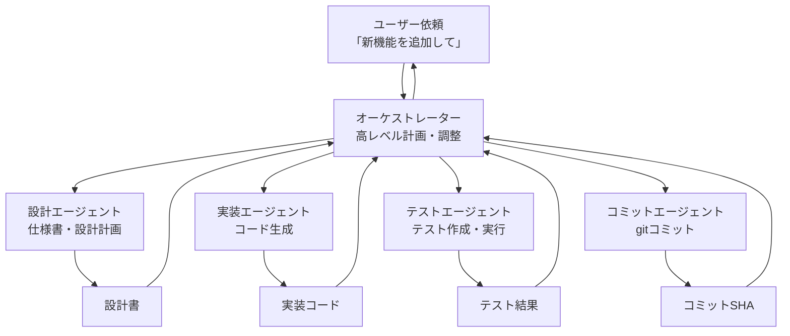

## 概要

オーケストレーターパターンでは、高レベルのAIが複雑なタスクを分解し、専門化されたサブエージェントに委任して実行します。各エージェントが独立した責任を持つことで、品質・並列実行・エラー回復が向上します。

## 本文

### オーケストレーターとサブエージェントの関係



### オーケストレータースキルの実装

```markdown
# ship スキル（オーケストレーター）

## 目的
PRDを読んで未完了の機能をすべて自律的に実装して完成させる

## トリガー
「完成させて」「全部作って」「shipして」など、
プロダクト全体の完成を求める依頼があれば使う

## 手順

### フェーズ1: 状況把握（5分）
1. docs/PRD.md を読んで全機能と完了状況を把握する
2. git status で現在の変更を確認する
3. 未完了タスクのリストを作成する
4. 実装順序（依存関係順）を決める

### フェーズ2: 並列実装
5. 独立した機能は並列サブエージェントに委任する
6. 各サブエージェントは develop スキルを使って実装する
7. すべてのサブエージェントの完了を待つ

### フェーズ3: 統合・検証
8. すべての実装を統合する
9. `npm run build` でビルドを確認
10. `npm test` で全テストを実行
11. 問題があれば修正する

### フェーズ4: 完了
12. docs/PRD.md のチェックボックスを更新する
13. /commit スキルでコミットする
14. 完了レポートをユーザーに提示する

## 制約
- ユーザーの確認なしに本番デプロイしない
- 実装した内容はすべてcommitする
- 失敗した場合は状況を正直に報告する
```

### PythonでのオーケストレーターAPI実装

```python
import anthropic
from dataclasses import dataclass
from enum import Enum

class SubAgentStatus(Enum):
    PENDING = "pending"
    RUNNING = "running"
    COMPLETED = "completed"
    FAILED = "failed"

@dataclass
class SubAgentTask:
    id: str
    name: str
    description: str
    status: SubAgentStatus = SubAgentStatus.PENDING
    result: str | None = None
    error: str | None = None

class OrchestratorAgent:
    """オーケストレーターエージェントの実装"""

    def __init__(self):
        self.client = anthropic.Anthropic()
        self.tasks: list[SubAgentTask] = []

    def plan_tasks(self, high_level_goal: str) -> list[SubAgentTask]:
        """高レベルのゴールをサブタスクに分解"""
        response = self.client.messages.create(
            model="claude-opus-4-5",
            max_tokens=1024,
            system="""タスクをサブタスクに分解してください。
各タスクは独立して実行できる小さな作業単位にしてください。
JSON形式で出力してください:
{"tasks": [{"id": "1", "name": "タスク名", "description": "詳細説明"}]}""",
            messages=[{"role": "user", "content": f"ゴール: {high_level_goal}"}]
        )

        import json
        import re

        # JSON部分を抽出
        content = response.content[0].text
        json_match = re.search(r'\{.*\}', content, re.DOTALL)
        if not json_match:
            return []

        try:
            data = json.loads(json_match.group())
            return [
                SubAgentTask(
                    id=t["id"],
                    name=t["name"],
                    description=t["description"]
                )
                for t in data.get("tasks", [])
            ]
        except (json.JSONDecodeError, KeyError):
            return []

    def execute_task(self, task: SubAgentTask) -> str:
        """サブエージェントとしてタスクを実行"""
        task.status = SubAgentStatus.RUNNING

        try:
            response = self.client.messages.create(
                model="claude-sonnet-4-5",
                max_tokens=2048,
                system="与えられたタスクを実行して、結果を詳細に報告してください。",
                messages=[{
                    "role": "user",
                    "content": f"タスク: {task.name}\n\n詳細: {task.description}"
                }]
            )
            task.result = response.content[0].text
            task.status = SubAgentStatus.COMPLETED
            return task.result

        except Exception as e:
            task.error = str(e)
            task.status = SubAgentStatus.FAILED
            raise

    def run(self, goal: str) -> dict:
        """オーケストレーターを実行"""
        print(f"ゴール: {goal}")

        # タスク分解
        print("タスクを分解中...")
        tasks = self.plan_tasks(goal)
        self.tasks = tasks

        if not tasks:
            return {"error": "タスクの分解に失敗しました"}

        print(f"{len(tasks)}個のサブタスクを特定:")
        for task in tasks:
            print(f"  - [{task.id}] {task.name}")

        # 各タスクを実行
        results = {}
        for task in tasks:
            print(f"\n実行中: {task.name}")
            try:
                result = self.execute_task(task)
                results[task.id] = {"status": "completed", "result": result[:100] + "..."}
                print(f"  完了: {task.name}")
            except Exception as e:
                results[task.id] = {"status": "failed", "error": str(e)}
                print(f"  失敗: {task.name} - {e}")

        completed = sum(1 for r in results.values() if r["status"] == "completed")
        return {
            "goal": goal,
            "total_tasks": len(tasks),
            "completed": completed,
            "failed": len(tasks) - completed,
            "results": results,
        }
```

### エラー回復の設計

```python
class ResilientOrchestrator(OrchestratorAgent):
    """エラー回復機能付きオーケストレーター"""

    MAX_RETRIES = 3

    def execute_task_with_retry(self, task: SubAgentTask) -> str:
        """リトライ付きタスク実行"""
        last_error = None

        for attempt in range(self.MAX_RETRIES):
            try:
                return self.execute_task(task)
            except Exception as e:
                last_error = e
                task.status = SubAgentStatus.PENDING  # リセット
                print(f"  試行{attempt+1}失敗: {e}")

                if attempt < self.MAX_RETRIES - 1:
                    # 失敗情報をプロンプトに追加してリトライ
                    task.description += f"\n\n前回の試行が失敗しました: {e}\nより単純なアプローチを試してください。"

        raise RuntimeError(f"タスク '{task.name}' が{self.MAX_RETRIES}回失敗: {last_error}")
```

## ハンズオン

簡単なオーケストレーターを実装してみましょう。

### ステップ1：タスク分解のデモ

```python
import anthropic
import json
import re

def demonstrate_task_decomposition(goal: str) -> list[dict]:
    """タスク分解のデモ（実際のAPI使用）"""
    client = anthropic.Anthropic()

    response = client.messages.create(
        model="claude-haiku-4-5",
        max_tokens=500,
        system="タスクを3〜5個のサブタスクに分解してJSON形式で返してください。形式: {\"tasks\": [{\"id\": \"1\", \"name\": \"タスク名\"}]}",
        messages=[{"role": "user", "content": f"ゴール: {goal}"}]
    )

    content = response.content[0].text
    json_match = re.search(r'\{.*\}', content, re.DOTALL)

    if json_match:
        try:
            data = json.loads(json_match.group())
            return data.get("tasks", [])
        except json.JSONDecodeError:
            pass

    return [{"id": "1", "name": "（JSONパース失敗）", "raw": content}]


# テスト
goal = "Pythonを使ったWebスクレイパーを作る"
print(f"ゴール: {goal}")
print("タスク分解:")

tasks = demonstrate_task_decomposition(goal)
for task in tasks:
    print(f"  [{task.get('id', '?')}] {task.get('name', task.get('raw', '?'))}")
```

## クイズ

<!-- QUIZ:START -->
**Q1. オーケストレーターとサブエージェントを分ける主な利点はどれですか？**

- A) APIコストが削減される
- B) オーケストレーターが高レベルの計画と調整に集中し、サブエージェントが専門的な作業を独立して実行することで、全体の品質と並列実行効率が向上する
- C) コードが短くなる
- D) セキュリティが向上する

**正解: B**
**解説:** 1つのAIがすべての作業を順番に行うと、各ステップでの専門性が失われます。「計画を担当するOrchestrator（全体最適を考える）」と「実行を担当するSubAgent（特定作業に特化）」に分けることで、複雑な作業を効率的に並列実行でき、各エージェントが責任範囲に集中できます。

**Q2. オーケストレーターのタスク分解で「独立して実行できる単位」にする理由はどれですか？**

- A) タスクを小さくするため
- B) タスク間の依存関係をなくすことで並列実行が可能になり、直列実行と比べて大幅に速度が向上するため
- C) エラーを防ぐため
- D) テストが容易になるため

**正解: B**
**解説:** 「AはBが完了しないと始められない」というタスクは直列実行が必要ですが、「AとBは独立している」なら並列実行できます。10個の独立したタスクを並列実行すると、直列の1/10の時間で完了できます。タスク分解の際に依存関係を最小化することが重要です。

**Q3. オーケストレーターに「失敗した場合は状況を正直に報告する」を制約として書く理由はどれですか？**

- A) ログを管理するため
- B) AIが失敗を隠蔽して問題を悪化させることを防ぎ、人間が適切に対処できるようにするため
- C) デバッグを容易にするため
- D) APIコストを削減するため

**正解: B**
**解説:** AIが「失敗を認めると怒られる」と思って問題を隠したり、不完全な状態で「完了しました」と報告するリスクがあります。スキルに明示的に「失敗時は正直に報告する」と定義することで、AIが問題発生時に適切に助けを求める行動を促します。
<!-- QUIZ:END -->

## まとめ

- オーケストレーターが高レベルのタスク分解と調整を行い、サブエージェントが専門的な作業を実行する
- タスクは独立した単位に分解することで並列実行効率が向上する
- エラー回復機能（リトライ・エスカレーション）を必ず実装する
- 失敗時の透明性をスキルの制約として明示する

## 次のレッスン

次のレッスンでは、複数のサブエージェントを並列実行する具体的な実装パターンを学びます。
