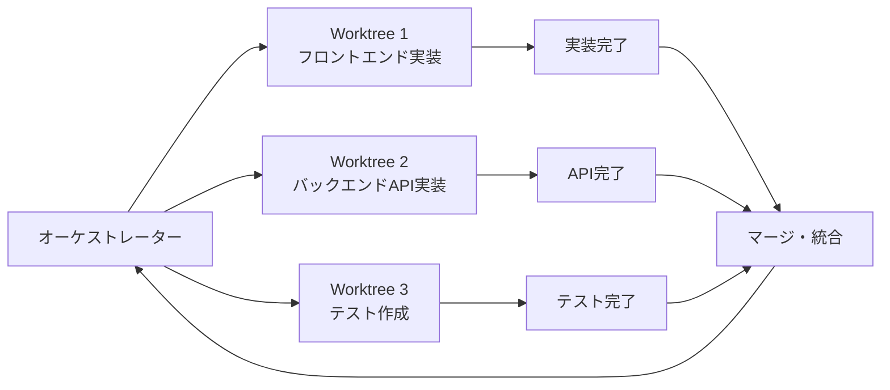

## 概要

並列サブエージェントは独立した作業を同時に実行して開発速度を向上させます。Anthropicのworktree機能・asyncioを使った並列実行・結果の集約パターンを学びます。

## 本文

### 並列実行の設計



### Worktreeを使った並列開発

Git Worktreeを使うと、同じリポジトリを複数のディレクトリにチェックアウトして並列作業できます。

```bash
# worktreeの作成
git worktree add ../feature-frontend feature/frontend
git worktree add ../feature-backend feature/backend

# 各ディレクトリで独立して作業
# worktree 1: フロントエンド
# worktree 2: バックエンドAPI

# 作業完了後に削除
git worktree remove ../feature-frontend
```

### asyncioを使った並列エージェント

```python
import asyncio
import anthropic
from dataclasses import dataclass
from typing import Callable

@dataclass
class AgentTask:
    name: str
    system_prompt: str
    user_prompt: str
    model: str = "claude-sonnet-4-5"
    max_tokens: int = 2048

@dataclass
class AgentResult:
    task_name: str
    result: str | None
    error: str | None
    duration_seconds: float

class ParallelAgentRunner:
    """並列エージェント実行エンジン"""

    def __init__(self, max_concurrency: int = 3):
        self.client = anthropic.Anthropic()
        self.semaphore = asyncio.Semaphore(max_concurrency)

    async def run_task(self, task: AgentTask) -> AgentResult:
        """単一タスクを非同期実行"""
        import time
        start = time.time()

        async with self.semaphore:
            try:
                loop = asyncio.get_event_loop()
                response = await loop.run_in_executor(
                    None,
                    lambda: self.client.messages.create(
                        model=task.model,
                        max_tokens=task.max_tokens,
                        system=task.system_prompt,
                        messages=[{"role": "user", "content": task.user_prompt}]
                    )
                )

                return AgentResult(
                    task_name=task.name,
                    result=response.content[0].text,
                    error=None,
                    duration_seconds=time.time() - start,
                )

            except Exception as e:
                return AgentResult(
                    task_name=task.name,
                    result=None,
                    error=str(e),
                    duration_seconds=time.time() - start,
                )

    async def run_parallel(self, tasks: list[AgentTask]) -> list[AgentResult]:
        """複数タスクを並列実行"""
        print(f"{len(tasks)}個のタスクを最大{self.semaphore._value}並列で実行中...")
        coroutines = [self.run_task(task) for task in tasks]
        results = await asyncio.gather(*coroutines)
        return list(results)


# 使用例: 複数の観点からコードをレビュー
async def multi_perspective_review(code: str) -> dict:
    """複数の観点でコードを並列レビュー"""
    runner = ParallelAgentRunner(max_concurrency=3)

    tasks = [
        AgentTask(
            name="security_review",
            system_prompt="セキュリティの専門家として、コードのセキュリティ問題を指摘してください。",
            user_prompt=f"以下のコードをレビューしてください:\n\n{code}",
            model="claude-haiku-4-5",
            max_tokens=500,
        ),
        AgentTask(
            name="performance_review",
            system_prompt="パフォーマンスエンジニアとして、コードの性能問題を指摘してください。",
            user_prompt=f"以下のコードをレビューしてください:\n\n{code}",
            model="claude-haiku-4-5",
            max_tokens=500,
        ),
        AgentTask(
            name="readability_review",
            system_prompt="コードレビュアーとして、可読性・保守性の改善点を指摘してください。",
            user_prompt=f"以下のコードをレビューしてください:\n\n{code}",
            model="claude-haiku-4-5",
            max_tokens=500,
        ),
    ]

    results = await runner.run_parallel(tasks)

    review = {}
    for result in results:
        if result.result:
            review[result.task_name] = {
                "feedback": result.result,
                "duration_s": round(result.duration_seconds, 2),
            }
        else:
            review[result.task_name] = {"error": result.error}

    return review
```

### 結果の集約パターン

```python
class ResultAggregator:
    """並列エージェントの結果を集約"""

    def aggregate_reviews(self, results: list[AgentResult]) -> str:
        """複数レビューを統合サマリーに集約"""
        client = anthropic.Anthropic()

        successful = [r for r in results if r.result]
        if not successful:
            return "すべてのレビューが失敗しました"

        combined = "\n\n".join([
            f"## {r.task_name}\n{r.result}"
            for r in successful
        ])

        response = client.messages.create(
            model="claude-sonnet-4-5",
            max_tokens=1024,
            system="複数の専門家のコードレビューを統合して、優先度順にまとめてください。",
            messages=[{
                "role": "user",
                "content": f"以下のレビュー結果を統合してください:\n\n{combined}"
            }]
        )

        return response.content[0].text
```

### 並列実行の監視

```python
import time

class ProgressTracker:
    """並列タスクの進捗追跡"""

    def __init__(self, total_tasks: int):
        self.total = total_tasks
        self.completed = 0
        self.failed = 0
        self.start_time = time.time()

    def update(self, result: AgentResult):
        if result.error:
            self.failed += 1
        else:
            self.completed += 1
        self._print_progress()

    def _print_progress(self):
        done = self.completed + self.failed
        elapsed = time.time() - self.start_time
        rate = done / elapsed if elapsed > 0 else 0
        remaining = (self.total - done) / rate if rate > 0 else 0

        print(
            f"\r進捗: {done}/{self.total} "
            f"(完了:{self.completed} 失敗:{self.failed}) "
            f"経過:{elapsed:.1f}s 残り推定:{remaining:.1f}s",
            end=""
        )

    def get_summary(self) -> dict:
        return {
            "total": self.total,
            "completed": self.completed,
            "failed": self.failed,
            "success_rate": self.completed / self.total if self.total > 0 else 0,
            "total_time_s": round(time.time() - self.start_time, 2),
        }
```

## ハンズオン

並列レビューシステムを実装してみましょう。

### ステップ1：並列コードレビュー

```python
import asyncio
import anthropic

async def run_parallel_review():
    """並列コードレビューのデモ"""
    sample_code = """
def get_user_data(user_id: str) -> dict:
    import sqlite3
    conn = sqlite3.connect("users.db")
    query = f"SELECT * FROM users WHERE id = {user_id}"  # SQLインジェクション脆弱性
    result = conn.execute(query).fetchone()
    conn.close()
    return result
"""

    print("並列コードレビューを実行中...")
    review = await multi_perspective_review(sample_code)

    print("\n=== レビュー結果 ===")
    for perspective, data in review.items():
        print(f"\n【{perspective}】")
        if "feedback" in data:
            print(data["feedback"][:200] + "...")
            print(f"  (所要時間: {data['duration_s']}秒)")
        else:
            print(f"  エラー: {data.get('error', '不明')}")


asyncio.run(run_parallel_review())
```

## クイズ

<!-- QUIZ:START -->
**Q1. 並列サブエージェントが直列実行より有利なケースはどれですか？**

- A) 各タスクが前のタスクの結果に依存している場合
- B) 独立した複数の作業（フロントエンド実装・バックエンド実装・テスト作成）を同時に行う場合
- C) 単一の複雑なタスクの場合
- D) APIのレートリミットが厳しい場合

**正解: B**
**解説:** 「Aが完了しないとBが始められない」依存関係がある場合は直列実行が必要です。しかし「フロントエンドとバックエンドは独立して実装できる」場合は並列実行で2倍以上速くなります。タスクの依存関係を分析して、独立したタスクを並列実行することが重要です。

**Q2. `asyncio.Semaphore`で並列実行数を制限する理由はどれですか？**

- A) 処理を遅くするため
- B) APIのレートリミットを超えないようにし、サーバーに過度な負荷をかけないように並列数を制御するため
- C) メモリを節約するため
- D) コードを複雑にするため

**正解: B**
**解説:** 制限なしで並列実行すると、100タスクあれば100の同時APIリクエストが発生します。LLM APIのRPM制限を超えてレートリミットエラーが大量発生します。Semaphore(3)なら最大3つのタスクのみ同時実行され、レートリミット内に収められます。

**Q3. Git Worktreeを使って並列開発する利点はどれですか？**

- A) コードが自動的に改善される
- B) 同じリポジトリを複数のディレクトリにチェックアウトして、ブランチ切り替えなしに異なる機能を同時に開発できる
- C) テストが自動化される
- D) デプロイが容易になる

**正解: B**
**解説:** 通常のGit操作では「ブランチ切り替え→作業→戻す」が必要ですが、Worktreeで複数のディレクトリを作ると、それぞれの作業ディレクトリが独立したブランチを持てます。「/worktree1でフロントエンド作業しながら、/worktree2でバックエンド作業する」が可能で、サブエージェントが干渉しません。
<!-- QUIZ:END -->

## まとめ

- 独立したタスクを並列サブエージェントに委任して開発速度を向上させる
- asyncio.Semaphoreで並列数を制限してAPIのレートリミット内に収める
- Git Worktreeで複数のブランチを同時に作業できる環境を提供する
- 結果の集約エージェントが並列実行結果を統合する

## 次のレッスン

次のレッスンでは、長時間の自律的な実行を管理するパターンを学びます。
