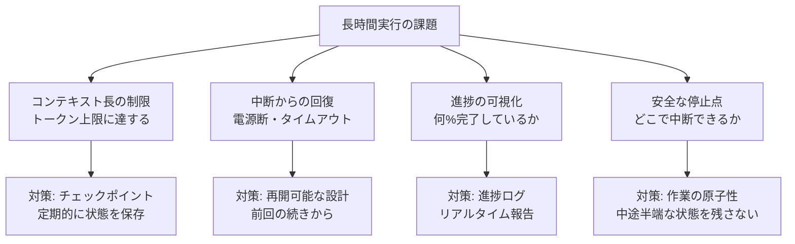

## 概要

長時間の自律的な作業では、進捗状況の記録・中断からの再開・作業境界の定義が重要です。コンテキスト管理・チェックポイント設計・安全な中断と再開のパターンを学びます。

## 本文

### 長時間実行の課題



### 進捗管理の実装

```python
import json
import os
from dataclasses import dataclass, field, asdict
from datetime import datetime
from pathlib import Path
from typing import Any
import anthropic

@dataclass
class CheckPoint:
    """チェックポイントデータ"""
    task_id: str
    timestamp: str
    phase: str
    completed_items: list[str]
    pending_items: list[str]
    context: dict[str, Any]
    progress_percent: float

class ProgressManager:
    """長時間タスクの進捗管理"""

    def __init__(self, checkpoint_dir: str = ".claude/checkpoints"):
        self.checkpoint_dir = Path(checkpoint_dir)
        self.checkpoint_dir.mkdir(parents=True, exist_ok=True)

    def save_checkpoint(self, checkpoint: CheckPoint):
        """チェックポイントを保存"""
        path = self.checkpoint_dir / f"{checkpoint.task_id}.json"
        with open(path, 'w', encoding='utf-8') as f:
            json.dump(asdict(checkpoint), f, ensure_ascii=False, indent=2)
        print(f"[チェックポイント] {checkpoint.phase} - {checkpoint.progress_percent:.0f}%完了")

    def load_checkpoint(self, task_id: str) -> CheckPoint | None:
        """チェックポイントを読み込む"""
        path = self.checkpoint_dir / f"{task_id}.json"
        if not path.exists():
            return None

        with open(path, 'r', encoding='utf-8') as f:
            data = json.load(f)
        return CheckPoint(**data)

    def delete_checkpoint(self, task_id: str):
        """完了後にチェックポイントを削除"""
        path = self.checkpoint_dir / f"{task_id}.json"
        if path.exists():
            path.unlink()


class ResumableTaskRunner:
    """再開可能なタスク実行エンジン"""

    def __init__(self):
        self.client = anthropic.Anthropic()
        self.progress = ProgressManager()

    def run_lesson_creation(
        self,
        task_id: str,
        all_lessons: list[dict],
        output_dir: str = "content/lessons"
    ) -> dict:
        """レッスン作成タスク（中断・再開対応）"""

        # チェックポイントから再開を確認
        checkpoint = self.progress.load_checkpoint(task_id)
        if checkpoint:
            print(f"前回の続きから再開: {checkpoint.phase}")
            pending = checkpoint.pending_items
            completed = set(checkpoint.completed_items)
        else:
            print(f"新規タスク開始: {len(all_lessons)}件のレッスン")
            pending = [l["slug"] for l in all_lessons]
            completed = set()

        output_path = Path(output_dir)
        output_path.mkdir(parents=True, exist_ok=True)

        for i, lesson_slug in enumerate(pending[:]):  # コピーしてから処理
            if lesson_slug in completed:
                continue

            lesson_info = next((l for l in all_lessons if l["slug"] == lesson_slug), None)
            if not lesson_info:
                continue

            print(f"\n[{len(completed)+1}/{len(all_lessons)}] {lesson_slug}を作成中...")

            try:
                # レッスンを生成
                content = self._generate_lesson(lesson_info)

                # ファイルに書き込み
                file_path = output_path / f"{lesson_slug}.md"
                file_path.write_text(content, encoding='utf-8')

                completed.add(lesson_slug)
                pending.remove(lesson_slug)

                # チェックポイントを保存（5件ごと）
                if len(completed) % 5 == 0:
                    self.progress.save_checkpoint(CheckPoint(
                        task_id=task_id,
                        timestamp=datetime.utcnow().isoformat(),
                        phase=f"lesson_creation_{len(completed)}",
                        completed_items=list(completed),
                        pending_items=pending,
                        context={"output_dir": str(output_dir)},
                        progress_percent=len(completed) / len(all_lessons) * 100,
                    ))

            except KeyboardInterrupt:
                print("\n\n中断されました。チェックポイントを保存中...")
                self.progress.save_checkpoint(CheckPoint(
                    task_id=task_id,
                    timestamp=datetime.utcnow().isoformat(),
                    phase="interrupted",
                    completed_items=list(completed),
                    pending_items=pending,
                    context={},
                    progress_percent=len(completed) / len(all_lessons) * 100,
                ))
                return {"status": "interrupted", "completed": len(completed)}

        # 完了
        self.progress.delete_checkpoint(task_id)
        print(f"\n全{len(all_lessons)}件のレッスンを作成完了!")
        return {"status": "completed", "completed": len(completed)}

    def _generate_lesson(self, lesson_info: dict) -> str:
        """レッスンコンテンツを生成"""
        response = self.client.messages.create(
            model="claude-sonnet-4-5",
            max_tokens=3000,
            messages=[{
                "role": "user",
                "content": f"以下のレッスンを作成してください: {lesson_info}"
            }]
        )
        return response.content[0].text
```

### コンテキスト長の管理

```python
class ContextManager:
    """長時間タスクでのコンテキスト管理"""

    MAX_CONTEXT_TOKENS = 150_000  # 保守的な上限

    def __init__(self):
        self.messages: list[dict] = []
        self.summary: str = ""

    def add_message(self, role: str, content: str):
        """メッセージを追加（コンテキスト長を監視）"""
        self.messages.append({"role": role, "content": content})

        # 概算トークン数
        total_chars = sum(len(m["content"]) for m in self.messages)
        estimated_tokens = total_chars // 4

        if estimated_tokens > self.MAX_CONTEXT_TOKENS * 0.8:
            self._compress_context()

    def _compress_context(self):
        """古いメッセージをサマリーに圧縮"""
        client = anthropic.Anthropic()

        # 古いメッセージの半分をサマリー化
        half = len(self.messages) // 2
        old_messages = self.messages[:half]
        self.messages = self.messages[half:]

        old_text = "\n".join([f"{m['role']}: {m['content'][:200]}..." for m in old_messages])

        response = client.messages.create(
            model="claude-haiku-4-5",
            max_tokens=500,
            messages=[{
                "role": "user",
                "content": f"以下の会話を3文で要約してください:\n{old_text}"
            }]
        )

        new_summary = response.content[0].text
        self.summary = f"{self.summary}\n[サマリー]: {new_summary}"
        print(f"[コンテキスト圧縮] {len(old_messages)}件のメッセージを圧縮しました")

    def get_messages_with_summary(self) -> list[dict]:
        """サマリー付きのメッセージリストを返す"""
        if not self.summary:
            return self.messages

        return [
            {"role": "user", "content": f"[以前の作業サマリー]: {self.summary}"},
            {"role": "assistant", "content": "了解しました。続きの作業を進めます。"},
            *self.messages
        ]
```

## ハンズオン

チェックポイント機能のデモを実装してみましょう。

### ステップ1：進捗追跡のシミュレーション

```python
import time
import json
from pathlib import Path

def simulate_long_running_task(items: list[str], checkpoint_file: str = "/tmp/checkpoint.json"):
    """長時間タスクのシミュレーション（中断・再開対応）"""

    # 前回のチェックポイントを確認
    checkpoint_path = Path(checkpoint_file)
    if checkpoint_path.exists():
        with open(checkpoint_file) as f:
            checkpoint = json.load(f)
        completed = set(checkpoint["completed"])
        print(f"前回から再開: {len(completed)}/{len(items)}完了済み")
    else:
        completed = set()
        print(f"新規開始: {len(items)}件を処理")

    pending = [item for item in items if item not in completed]

    for item in pending:
        print(f"  処理中: {item}...")
        time.sleep(0.1)  # 実際の処理をシミュレート
        completed.add(item)

        # 3件ごとにチェックポイントを保存
        if len(completed) % 3 == 0:
            with open(checkpoint_file, 'w') as f:
                json.dump({
                    "completed": list(completed),
                    "timestamp": time.strftime("%H:%M:%S"),
                }, f)
            print(f"  [チェックポイント保存] {len(completed)}/{len(items)}")

    # 完了
    if checkpoint_path.exists():
        checkpoint_path.unlink()
    print(f"\n全{len(items)}件の処理が完了!")


# テスト実行
items = [f"lesson_{i:02d}" for i in range(1, 11)]
simulate_long_running_task(items)
```

## クイズ

<!-- QUIZ:START -->
**Q1. 長時間タスクにチェックポイントを実装する主な理由はどれですか？**

- A) 処理を高速化するため
- B) 作業途中で中断が発生した際（電源断・タイムアウト・コンテキスト長超過）に最初からやり直さずに続きから再開できるようにするため
- C) APIコストを削減するため
- D) コードを整理するため

**正解: B**
**解説:** 100件のファイルを処理する作業で50件目で中断が発生した場合、チェックポイントがなければ最初から100件を処理し直す必要があります。5件ごとにチェックポイントを保存しておけば、最大4件の再処理で済みます。長時間タスクほどこの効果は大きくなります。

**Q2. コンテキスト長の管理で古いメッセージを「サマリー」に圧縮する理由はどれですか？**

- A) 会話履歴を削除するため
- B) LLMのコンテキスト長制限（例: 200Kトークン）を超えないようにしながら、重要な情報（「以前どんな作業をしたか」）を保持するため
- C) APIコストを削減するため
- D) セキュリティを向上させるため

**正解: B**
**解説:** 会話が長くなるとコンテキスト長を超えてしまいます。古いメッセージをすべて削除すると文脈が失われます。LLMを使って古いメッセージを要約してサマリーとして保持することで、コンテキスト長を制御しながら重要な文脈を維持できます。

**Q3. 長時間自律実行タスクで「安全な停止点」を設計する理由はどれですか？**

- A) 処理を効率化するため
- B) タスクを中途半端な状態（ファイルが半分しか作られていない・設定が一部しか変更されていないなど）で止めると復旧が困難になるため
- C) エラーを防ぐため
- D) テストを容易にするため

**正解: B**
**解説:** データベースのトランザクションと同様に、AIの作業も「原子的な単位」で区切ることが重要です。「1ファイルの書き込みが完了した後」「1機能のコミットが完了した後」などの明確な完了点を「安全な停止点」とすることで、中断が発生しても整合性のある状態を保てます。
<!-- QUIZ:END -->

## まとめ

- チェックポイントで定期的に進捗を保存し、中断からの再開を可能にする
- コンテキスト長が上限に近づいたら古いメッセージをサマリーに圧縮する
- 原子的な作業単位で「安全な停止点」を設計して中途半端な状態を避ける
- KeyboardInterruptをキャッチして安全にチェックポイントを保存してから終了する

## 次のレッスン

次のレッスンでは、PRD（製品要件文書）を起点とした自律開発のワークフローを学びます。
