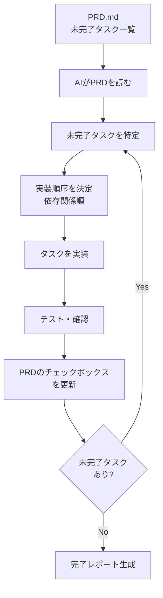

## 概要

PRD（Product Requirements Document）を起点にAIが自律的に開発を進めるパターンを学びます。PRDのチェックボックス管理・タスク優先度付け・進捗の可視化・完了報告の設計を扱います。

## 本文

### PRD駆動開発のフロー



### PRDのフォーマット設計

AIが読みやすいPRD構造を設計します。

```markdown
# PRD: AI学習プラットフォーム

## バージョン情報
- 作成日: 2026-01-01
- 最終更新: 2026-03-14
- ステータス: 開発中

## ビジョン
生成AIについて学びたいエンジニアが実践的なスキルを習得できるWebアプリ

## フェーズ1: MVP（優先度: 高）
- [x] プロジェクトセットアップ（Next.js 15）
- [x] ホームページ実装
- [ ] チャプター一覧ページ
- [ ] レッスン詳細ページ
- [ ] 進捗管理機能

## フェーズ2: コンテンツ（優先度: 中）
- [x] Chapter 1-5 レッスン作成
- [ ] Chapter 6 セキュリティレッスン（11件）
- [ ] Chapter 7 MCPレッスン（10件）
- [ ] クイズ機能の実装

## フェーズ3: 品質向上（優先度: 低）
- [ ] E2Eテスト追加
- [ ] パフォーマンス最適化
- [ ] アクセシビリティ対応
```

### PRDパーサーの実装

```python
import re
from dataclasses import dataclass
from enum import Enum

class TaskStatus(Enum):
    DONE = "done"
    PENDING = "pending"

class Priority(Enum):
    HIGH = "高"
    MEDIUM = "中"
    LOW = "低"

@dataclass
class PRDTask:
    phase: str
    description: str
    status: TaskStatus
    priority: Priority
    line_number: int

class PRDParser:
    """PRD.mdを解析してタスク一覧を取得"""

    CHECKBOX_DONE = re.compile(r'- \[x\] (.+)', re.IGNORECASE)
    CHECKBOX_PENDING = re.compile(r'- \[ \] (.+)')
    PHASE_HEADER = re.compile(r'## (.+?)\（優先度: (高|中|低)\）')

    def parse(self, prd_content: str) -> list[PRDTask]:
        """PRDを解析してタスクリストを返す"""
        tasks = []
        current_phase = "未分類"
        current_priority = Priority.MEDIUM

        for i, line in enumerate(prd_content.split('\n'), 1):
            phase_match = self.PHASE_HEADER.search(line)
            if phase_match:
                current_phase = phase_match.group(1)
                priority_text = phase_match.group(2)
                current_priority = {
                    "高": Priority.HIGH,
                    "中": Priority.MEDIUM,
                    "低": Priority.LOW,
                }.get(priority_text, Priority.MEDIUM)
                continue

            done_match = self.CHECKBOX_DONE.search(line)
            if done_match:
                tasks.append(PRDTask(
                    phase=current_phase,
                    description=done_match.group(1),
                    status=TaskStatus.DONE,
                    priority=current_priority,
                    line_number=i,
                ))
                continue

            pending_match = self.CHECKBOX_PENDING.search(line)
            if pending_match:
                tasks.append(PRDTask(
                    phase=current_phase,
                    description=pending_match.group(1),
                    status=TaskStatus.PENDING,
                    priority=current_priority,
                    line_number=i,
                ))

        return tasks

    def get_next_tasks(
        self,
        tasks: list[PRDTask],
        max_tasks: int = 5
    ) -> list[PRDTask]:
        """優先度順に未完了タスクを取得"""
        pending = [t for t in tasks if t.status == TaskStatus.PENDING]

        # 優先度順にソート
        priority_order = {Priority.HIGH: 0, Priority.MEDIUM: 1, Priority.LOW: 2}
        return sorted(pending, key=lambda t: priority_order[t.priority])[:max_tasks]

    def calculate_progress(self, tasks: list[PRDTask]) -> dict:
        """進捗を計算"""
        total = len(tasks)
        done = sum(1 for t in tasks if t.status == TaskStatus.DONE)

        by_phase: dict[str, dict] = {}
        for task in tasks:
            if task.phase not in by_phase:
                by_phase[task.phase] = {"total": 0, "done": 0}
            by_phase[task.phase]["total"] += 1
            if task.status == TaskStatus.DONE:
                by_phase[task.phase]["done"] += 1

        return {
            "overall": {"total": total, "done": done, "percent": done/total*100 if total else 0},
            "by_phase": {
                phase: {
                    **counts,
                    "percent": counts["done"]/counts["total"]*100 if counts["total"] else 0
                }
                for phase, counts in by_phase.items()
            }
        }


# テスト
sample_prd = """
## フェーズ1: MVP（優先度: 高）
- [x] プロジェクトセットアップ
- [x] ホームページ実装
- [ ] チャプター一覧ページ
- [ ] レッスン詳細ページ

## フェーズ2: コンテンツ（優先度: 中）
- [x] Chapter 1-5 レッスン作成
- [ ] Chapter 6 レッスン作成
"""

parser = PRDParser()
tasks = parser.parse(sample_prd)
progress = parser.calculate_progress(tasks)
next_tasks = parser.get_next_tasks(tasks)

print("=== PRD進捗サマリー ===")
overall = progress["overall"]
print(f"全体: {overall['done']}/{overall['total']} ({overall['percent']:.0f}%完了)")

for phase, counts in progress["by_phase"].items():
    print(f"  {phase}: {counts['done']}/{counts['total']} ({counts['percent']:.0f}%)")

print("\n次に着手するタスク（優先度順）:")
for task in next_tasks:
    print(f"  [{task.priority.value}] {task.description}")
```

### PRDチェックボックスの自動更新

```python
def update_prd_checkbox(
    prd_path: str,
    task_description: str,
    new_status: TaskStatus
) -> bool:
    """PRDのチェックボックスを更新"""
    with open(prd_path, 'r', encoding='utf-8') as f:
        content = f.read()

    # タスクを検索して状態を更新
    old_checkbox = "- [ ]" if new_status == TaskStatus.DONE else "- [x]"
    new_checkbox = "- [x]" if new_status == TaskStatus.DONE else "- [ ]"

    # タスク説明でマッチング
    pattern = rf'{re.escape(old_checkbox)} {re.escape(task_description)}'
    replacement = f"{new_checkbox} {task_description}"

    new_content = re.sub(pattern, replacement, content)

    if new_content == content:
        return False  # 変更なし

    with open(prd_path, 'w', encoding='utf-8') as f:
        f.write(new_content)

    return True
```

## ハンズオン

PRDパーサーを使って開発計画を立ててみましょう。

### ステップ1：PRD分析レポートの生成

```python
def generate_prd_report(prd_content: str) -> str:
    """PRDから開発レポートを生成"""
    parser = PRDParser()
    tasks = parser.parse(prd_content)
    progress = parser.calculate_progress(tasks)
    next_tasks = parser.get_next_tasks(tasks, max_tasks=3)

    overall = progress["overall"]
    lines = [
        "=== PRD開発進捗レポート ===",
        f"\n全体進捗: {overall['done']}/{overall['total']}タスク ({overall['percent']:.0f}%完了)",
        "\nフェーズ別:",
    ]

    for phase, counts in progress["by_phase"].items():
        bar = "█" * int(counts["percent"] / 10) + "░" * (10 - int(counts["percent"] / 10))
        lines.append(f"  {phase}: [{bar}] {counts['percent']:.0f}%")

    lines.append("\n次に実装すべきタスク（優先度順）:")
    for i, task in enumerate(next_tasks, 1):
        lines.append(f"  {i}. [{task.priority.value}優先度] {task.description}")

    return "\n".join(lines)


# テスト
print(generate_prd_report(sample_prd))
```

## クイズ

<!-- QUIZ:START -->
**Q1. PRD駆動開発でAIがチェックボックスを自動更新するメリットはどれですか？**

- A) PRDが自動的に改善される
- B) 完了したタスクが即座にPRDに反映され、進捗状況が常に最新に保たれ、次にすべき作業がAIも人間も把握できる
- C) テストが自動化される
- D) コードレビューが不要になる

**正解: B**
**解説:** 手動でPRDを更新するのを忘れると「どこまで実装したか」が分からなくなります。AIが実装完了後に自動でチェックボックスを更新することで、PRDが常に最新の状態になります。次の実行時にAIは「どこから始めるべきか」をPRDから即座に判断できます。

**Q2. PRDタスクを「優先度：高・中・低」に分類する理由はどれですか？**

- A) ファイルを整理するため
- B) 重要度の高いMVP機能から先に実装し、低優先度の機能は後回しにすることで早期にユーザー価値を提供するため
- C) コスト管理のため
- D) テストを効率化するため

**正解: B**
**解説:** すべてのタスクを同列に扱うと、E2Eテストのような「あると良いが必須でない」機能を実装している間に、コアのチャプター一覧ページが未実装のままになります。優先度を明示することで、AIが「今何を実装すべきか」を自律的に判断できます。

**Q3. PRDに「フェーズ1: MVP」「フェーズ2: コンテンツ」のようにフェーズを分ける理由はどれですか？**

- A) ドキュメントを美しくするため
- B) 依存関係（MVPが完成してからコンテンツを追加する）と優先順位を明確にし、段階的な開発を可能にするため
- C) AIの処理速度を向上させるため
- D) チームへの説明を簡単にするため

**正解: B**
**解説:** 「ページが存在しないのにコンテンツだけ作る」という無駄な作業を防ぐためにフェーズを分けます。フェーズ1のMVP（基本機能）が完成してからフェーズ2のコンテンツ追加に進む、という実装順序の依存関係を表現しています。AIはフェーズ1が完了していない場合にフェーズ2から始めません。
<!-- QUIZ:END -->

## まとめ

- PRDのチェックボックスをAIが読んで未完了タスクを自律的に特定・実装する
- タスクを優先度と依存関係で整理して、重要なものから順番に実装する
- 実装完了後にPRDのチェックボックスを自動更新して進捗を最新状態に保つ
- フェーズ分けで実装順序の依存関係を明確にする

## 次のレッスン

次のレッスンでは、MCPツールを使ってAIの能力を拡張する方法を学びます。
