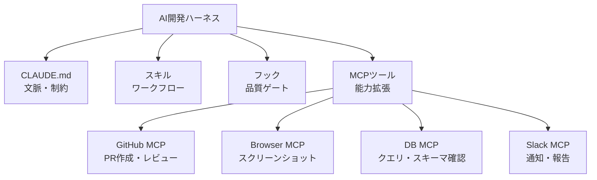

## 概要

MCPサーバーを自律開発ワークフローに統合することで、AIが外部サービス・データベース・ブラウザ操作などを直接実行できます。ハーネスエンジニアリングとMCPの組み合わせパターンを学びます。

## 本文

### ハーネスエンジニアリングにおけるMCPの役割



### 開発向けMCPサーバーの設定

```json
// .claude/claude_desktop_config.json
{
  "mcpServers": {
    "github": {
      "command": "npx",
      "args": ["-y", "@anthropic-ai/mcp-server-github"],
      "env": {
        "GITHUB_TOKEN": "${GITHUB_TOKEN}"
      }
    },
    "playwright": {
      "command": "npx",
      "args": ["-y", "@anthropic-ai/mcp-server-playwright"]
    },
    "filesystem": {
      "command": "npx",
      "args": [
        "-y",
        "@anthropic-ai/mcp-server-filesystem",
        "/Users/user/projects"  // アクセス許可するディレクトリ
      ]
    },
    "postgres": {
      "command": "npx",
      "args": ["-y", "@anthropic-ai/mcp-server-postgres"],
      "env": {
        "DATABASE_URL": "${DATABASE_URL}"
      }
    }
  }
}
```

### MCPを活用したスキル設計

MCPツールが利用可能な場合、スキルでツールを明示的に活用します。

```markdown
# visual-review スキル（PlaywrightMCP使用）

## 目的
実装完了後にスクリーンショットでデザインを確認する

## 前提条件
- Playwright MCPサーバーが起動していること
- 開発サーバーが起動していること (npm run dev)

## 手順

1. Playwright MCPを使ってブラウザを起動する
2. http://localhost:3000 を開く
3. 主要ページのスクリーンショットを撮影:
   - ホームページ
   - チャプター一覧
   - レッスン詳細ページ
4. 各スクリーンショットを確認して問題を検出:
   - レイアウト崩れ
   - テキストの切れ
   - ボタンのクリック可能領域
5. 問題がある場合はCSSを修正して再撮影

## 出力
スクリーンショットの結果と発見した問題点のサマリー
```

```markdown
# pr-review スキル（GitHub MCP使用）

## 目的
作成したプルリクエストのレビューコメントに対応する

## 手順

1. GitHub MCPを使って現在のPRのレビューコメントを取得する
2. 各コメントを分析して対応が必要かどうか判断する
3. 対応が必要なコメントに対して修正を実施する
4. 修正後にGitHub MCPを使って「Resolved」にする
5. 修正内容をまとめてコメントに返信する

## 制約
- 承認コメントには変更を加えない
- セキュリティに関するコメントは最優先で対応する
```

### カスタムMCPサーバーの作成

開発ワークフロー専用のMCPサーバーを作成できます。

```typescript
// dev-tools-server/index.ts
import { McpServer } from "@modelcontextprotocol/sdk/server/mcp.js";
import { StdioServerTransport } from "@modelcontextprotocol/sdk/server/stdio.js";
import { z } from "zod";
import { execSync } from "child_process";
import fs from "fs";

const server = new McpServer({
  name: "dev-tools",
  version: "1.0.0",
});

// ビルドツール
server.tool(
  "run_build",
  "プロジェクトをビルドしてエラーを取得",
  {},
  async () => {
    try {
      const output = execSync("npm run build 2>&1", {
        encoding: "utf-8",
        timeout: 60000,
      });
      return { content: [{ type: "text", text: `ビルド成功:\n${output}` }] };
    } catch (error: any) {
      return {
        content: [{ type: "text", text: `ビルドエラー:\n${error.stdout || error.message}` }],
        isError: true,
      };
    }
  }
);

// テストランナー
server.tool(
  "run_tests",
  "テストを実行して結果を返す",
  {
    pattern: z.string().optional().describe("テストファイルのパターン"),
  },
  async ({ pattern }) => {
    const cmd = pattern ? `npm test -- ${pattern}` : "npm test";
    try {
      const output = execSync(`${cmd} 2>&1`, {
        encoding: "utf-8",
        timeout: 120000,
      });
      return { content: [{ type: "text", text: output }] };
    } catch (error: any) {
      return {
        content: [{ type: "text", text: error.stdout || error.message }],
        isError: true,
      };
    }
  }
);

// PRD進捗確認
server.tool(
  "get_prd_progress",
  "PRDの進捗状況を取得",
  {
    prd_path: z.string().default("docs/PRD.md"),
  },
  async ({ prd_path }) => {
    if (!fs.existsSync(prd_path)) {
      return { content: [{ type: "text", text: `PRDファイルが見つかりません: ${prd_path}` }] };
    }

    const content = fs.readFileSync(prd_path, "utf-8");
    const done = (content.match(/- \[x\]/gi) || []).length;
    const pending = (content.match(/- \[ \]/g) || []).length;
    const total = done + pending;

    const summary = `PRD進捗: ${done}/${total} (${(done/total*100).toFixed(0)}%完了)\n未完了: ${pending}件`;
    return { content: [{ type: "text", text: summary }] };
  }
);

const transport = new StdioServerTransport();
await server.connect(transport);
```

### MCPセキュリティの考慮

```markdown
# MCPツール使用時の制約（CLAUDE.mdに追記）

## MCPツールのセキュリティルール

### GitHub MCP
- 本番ブランチ（main/master）への直接pushは禁止
- Force pushは禁止
- Protected branchへのpushはユーザー確認必須

### Playwright MCP
- 外部サービスへのログイン操作は禁止
- フォーム送信前にユーザーに確認する
- 個人情報を含む操作は禁止

### PostgreSQL MCP
- DELETE・DROP・TRUNCATEは禁止
- UPDATE時はWHERE句なしで実行しない
- 本番データベースへのスキーマ変更は禁止
```

## ハンズオン

開発ツールMCPサーバーを設計してみましょう。

### ステップ1：MCPツール仕様の設計

```python
from dataclasses import dataclass

@dataclass
class MCPToolSpec:
    name: str
    description: str
    parameters: dict
    security_level: str  # "safe" / "caution" / "dangerous"
    requires_confirmation: bool

# 開発ワークフロー向けMCPツール仕様
DEV_TOOLS = [
    MCPToolSpec(
        name="run_lint",
        description="ESLintを実行してコード品質を確認",
        parameters={"auto_fix": {"type": "boolean", "default": False}},
        security_level="safe",
        requires_confirmation=False,
    ),
    MCPToolSpec(
        name="run_tests",
        description="テストスイートを実行",
        parameters={"pattern": {"type": "string", "description": "テストファイルパターン"}},
        security_level="safe",
        requires_confirmation=False,
    ),
    MCPToolSpec(
        name="create_pr",
        description="GitHubにPull Requestを作成",
        parameters={
            "title": {"type": "string"},
            "body": {"type": "string"},
            "base": {"type": "string", "default": "main"},
        },
        security_level="caution",
        requires_confirmation=True,
    ),
    MCPToolSpec(
        name="deploy_production",
        description="本番環境にデプロイ",
        parameters={"version": {"type": "string"}},
        security_level="dangerous",
        requires_confirmation=True,
    ),
]

print("開発ツールMCPツール仕様:")
for tool in DEV_TOOLS:
    confirm_text = "要確認" if tool.requires_confirmation else "自動実行可"
    print(f"\n{tool.name} [{tool.security_level}] ({confirm_text})")
    print(f"  {tool.description}")
```

## クイズ

<!-- QUIZ:START -->
**Q1. ハーネスエンジニアリングでMCPツールを使う主なメリットはどれですか？**

- A) AIの回答精度が向上する
- B) AIがブラウザ操作・GitHub操作・データベースクエリなどを直接実行でき、人間の介入なしに作業を完結させる範囲が広がる
- C) APIコストが削減される
- D) コードの品質が向上する

**正解: B**
**解説:** MCPがなければ「スクリーンショットを撮って確認してください」とAIが指示を出して人間が確認する必要があります。Playwright MCPがあれば、AIが自分でブラウザを起動してスクリーンショットを撮り、デザインの問題を自律的に確認・修正できます。自律開発の範囲が大幅に拡大します。

**Q2. MCPのPostgreSQL接続で「DELETE・DROP・TRUNCATEを禁止」するCLAUDE.md設定の理由はどれですか？**

- A) クエリを高速化するため
- B) AIが誤って本番データを削除する取り返しのつかないミスを防ぐため
- C) データベースのパフォーマンスを保護するため
- D) セキュリティ監査のため

**正解: B**
**解説:** AIが「不要なデータを削除する」ために`DELETE FROM users WHERE created_at < '2020-01-01'`を実行して大量のユーザーデータを失うリスクがあります。CLAUDE.mdでDELETE/DROP/TRUNCATEを明示的に禁止し、代わりにSELECTのみ許可することで、データの安全性を保ちながらデータ確認ができます。

**Q3. 本番デプロイMCPツールに`requires_confirmation: true`を設定する理由はどれですか？**

- A) デプロイを遅くするため
- B) 本番環境への変更は取り返しがつかない可能性があるため、人間が最終確認・承認することを必須にするため
- C) ログを記録するため
- D) APIコストを削減するため

**正解: B**
**解説:** AIが自律的に「最適化のためにデプロイしておきました」と本番を更新するのは危険です。`requires_confirmation`でデプロイ前に必ず人間の承認を求めることで、最終的な判断権を人間が持つことを保証します。自律開発でも「最後の承認は人間」という原則を守ります。
<!-- QUIZ:END -->

## まとめ

- MCPサーバーをハーネスに統合することでAIの自律作業範囲が大幅に拡大する
- GitHub・Playwright・DB・Slackなどのサーバーをスキルから活用できる
- 危険な操作（削除・本番デプロイ）はCLAUDE.mdで禁止または要確認に設定する
- カスタムMCPサーバーで開発ワークフロー専用のツールを作成できる

## 次のレッスン

次のレッスンでは、エージェントによるコーディングのベストプラクティスを学びます。
