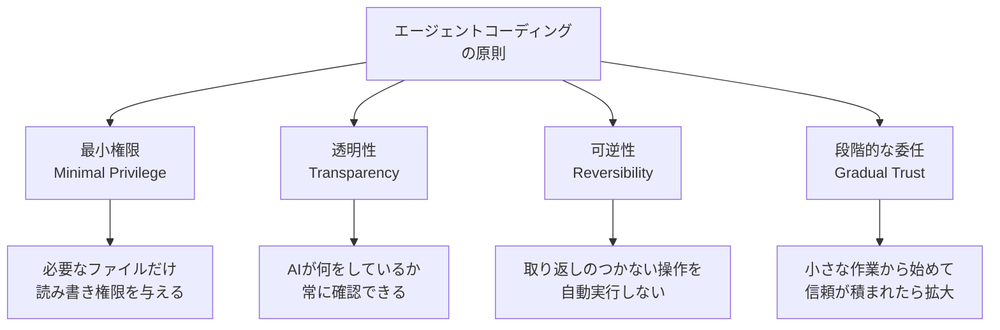

## 概要

AIエージェントが自律的にコードを書く際の品質・安全性・効率を最大化するベストプラクティスを学びます。人間とAIの適切な責任分担・確認ポイントの設計・コードレビューとの統合を扱います。

## 本文

### エージェントコーディングの原則



### 人間とAIの責任分担

```
AIに任せるべき作業:
  ✅ 定型コードの生成（CRUD API・コンポーネント骨格）
  ✅ リファクタリング・整理
  ✅ テストコードの作成
  ✅ ドキュメントの更新
  ✅ ビルド・lint・型チェックの実行
  ✅ エラーメッセージの修正

人間が判断すべき作業:
  ⚠ アーキテクチャの重要な設計決定
  ⚠ セキュリティの実装方針
  ⚠ 本番環境への変更
  ⚠ データベーススキーマの変更
  ⚠ 外部APIとの契約・統合

AIに委任すべきでない作業:
  ❌ 本番データの削除
  ❌ APIキー・パスワードの管理
  ❌ 法的・コンプライアンスに関する判断
```

### 確認ポイントの設計

```markdown
# 自律開発における確認ポイント（スキルに組み込む）

## 確認レベル1: 情報提供のみ（確認不要）
- ファイルの読み取り
- ビルド・テストの実行（変更なし）
- ログの確認

## 確認レベル2: 軽微な変更（自動実行可）
- 新規ファイルの作成（既存ファイルに影響なし）
- コメント・ドキュメントの更新
- テストコードの追加

## 確認レベル3: 要確認（実行前に確認）
- 既存ファイルの変更
- パッケージの追加・削除
- 設定ファイルの変更

## 確認レベル4: 必須確認（明示的な承認が必要）
- 本番環境への変更
- データベースのスキーマ変更
- セキュリティ設定の変更
- 大量のファイル削除
```

### コードレビューとの統合

```python
class HumanReviewCheckpoint:
    """人間のレビューが必要なポイントを管理"""

    REVIEW_TRIGGERS = [
        "新しいAPIエンドポイントの追加",
        "認証・認可ロジックの変更",
        "環境変数・設定の追加",
        "外部依存関係の追加",
        "データモデルの変更",
    ]

    def should_pause_for_review(self, change_description: str) -> bool:
        """レビューが必要か判断"""
        return any(
            trigger.lower() in change_description.lower()
            for trigger in self.REVIEW_TRIGGERS
        )

    def create_review_request(
        self,
        changes: list[str],
        reason: str
    ) -> str:
        """レビューリクエストを生成"""
        return f"""
## 人間によるレビューが必要です

**理由**: {reason}

**変更内容**:
{chr(10).join(f"  - {c}" for c in changes)}

**確認事項**:
1. この変更は意図通りですか？
2. セキュリティ上の問題はありませんか？
3. 続行してよろしいですか？ (y/n)
"""
```

### 失敗からの学習

```python
class LearningFromFailure:
    """失敗パターンを記録して再発防止"""

    def __init__(self):
        self.failure_log: list[dict] = []

    def record_failure(
        self,
        task: str,
        error: str,
        attempted_solution: str,
        actual_fix: str
    ):
        """失敗とその修正を記録"""
        self.failure_log.append({
            "task": task,
            "error": error,
            "attempted": attempted_solution,
            "fix": actual_fix,
            "pattern": self._categorize_error(error),
        })

    def _categorize_error(self, error: str) -> str:
        """エラーのパターンを分類"""
        patterns = {
            "TypeScript型エラー": ["Type", "is not assignable", "Property"],
            "インポートエラー": ["Cannot find module", "Import"],
            "ランタイムエラー": ["ReferenceError", "TypeError", "is not a function"],
        }
        for category, keywords in patterns.items():
            if any(kw in error for kw in keywords):
                return category
        return "その他"

    def get_hints_for_error(self, current_error: str) -> list[str]:
        """過去の失敗から解決ヒントを取得"""
        pattern = self._categorize_error(current_error)
        similar = [f for f in self.failure_log if f["pattern"] == pattern]

        return [
            f"類似エラーの解決策: {f['fix']}"
            for f in similar[-3:]  # 直近3件
        ]
```

### エージェントのセルフモニタリング

```python
from dataclasses import dataclass
import time

@dataclass
class AgentHealthMetrics:
    task_start_time: float
    actions_taken: int
    files_modified: list[str]
    errors_encountered: int
    user_interactions: int

class SelfMonitoringAgent:
    """自己監視機能付きエージェント"""

    MAX_ACTIONS = 50
    MAX_DURATION_MINUTES = 30
    MAX_FILES_MODIFIED = 20

    def __init__(self):
        self.metrics = AgentHealthMetrics(
            task_start_time=time.time(),
            actions_taken=0,
            files_modified=[],
            errors_encountered=0,
            user_interactions=0,
        )

    def check_health(self) -> dict:
        """エージェントの健全性を確認"""
        elapsed_minutes = (time.time() - self.metrics.task_start_time) / 60
        warnings = []
        should_pause = False

        if self.metrics.actions_taken > self.MAX_ACTIONS:
            warnings.append(f"アクション数が多い: {self.metrics.actions_taken}/{self.MAX_ACTIONS}")
            should_pause = True

        if elapsed_minutes > self.MAX_DURATION_MINUTES:
            warnings.append(f"実行時間が長い: {elapsed_minutes:.0f}分/{self.MAX_DURATION_MINUTES}分")
            should_pause = True

        if len(self.metrics.files_modified) > self.MAX_FILES_MODIFIED:
            warnings.append(f"変更ファイルが多い: {len(self.metrics.files_modified)}/{self.MAX_FILES_MODIFIED}")
            should_pause = True

        if self.metrics.errors_encountered >= 5:
            warnings.append(f"エラーが多発: {self.metrics.errors_encountered}件")
            should_pause = True

        return {
            "healthy": not should_pause,
            "warnings": warnings,
            "recommendation": "ユーザーに状況を報告して確認を取ってください" if should_pause else "続行できます",
            "metrics": {
                "actions": self.metrics.actions_taken,
                "files_modified": len(self.metrics.files_modified),
                "elapsed_minutes": round(elapsed_minutes, 1),
                "errors": self.metrics.errors_encountered,
            }
        }
```

## クイズ

<!-- QUIZ:START -->
**Q1. エージェントコーディングで「最小権限の原則」を守る理由はどれですか？**

- A) 処理を高速化するため
- B) AIが必要以上のファイルやシステムにアクセスしないようにして、誤操作や意図しない変更の影響範囲を最小限に抑えるため
- C) コードの品質を向上させるため
- D) APIコストを削減するため

**正解: B**
**解説:** AIが全ファイルへの読み書き権限を持つと、誤って無関係なファイルを変更するリスクがあります。「srcディレクトリのみ」「特定のファイルタイプのみ」のように権限を絞ることで、AIが誤操作しても影響範囲を限定できます。セキュリティの基本原則「最小権限」はAIにも適用されます。

**Q2. エージェントに「セルフモニタリング」機能を持たせる理由はどれですか？**

- A) コードの品質を向上させるため
- B) AIが「アクション数が多すぎる・時間がかかりすぎる・エラーが多発」などの異常状態を自分で検出して、適切なタイミングで人間に報告できるようにするため
- C) APIコストを削減するため
- D) デバッグを容易にするため

**正解: B**
**解説:** 自己監視なしのエージェントは、無限ループに陥ったり50回以上のファイル変更をしたりしても気づかずに続ける可能性があります。「30分以上実行中」「50回以上アクションした」などの異常を自分で検出して「このタスクは手に負えなくなってきました。確認してください」と報告できることが重要です。

**Q3. 本番環境の変更で「段階的な委任（Gradual Trust）」が重要な理由はどれですか？**

- A) 開発速度が向上するため
- B) まず小さな安全なタスクでAIの動作を確認し、信頼性が確認できた段階でより重要なタスクを委任することでリスクを管理するため
- C) APIコストが削減されるため
- D) ドキュメントが充実するため

**正解: B**
**解説:** 最初から「本番サーバーのデプロイを自動化する」ことは高リスクです。まず「テストの追加」→「ドキュメント更新」→「バグ修正」→「機能追加」→「本番デプロイ」と段階的に委任範囲を広げることで、各段階でAIの動作パターンを確認しながら安全に自律化を進められます。
<!-- QUIZ:END -->

## まとめ

- 定型的・反復的な作業はAIに委任し、設計・セキュリティ・本番変更は人間が判断する
- 確認ポイントを4段階（自動→軽微→要確認→必須確認）で設計する
- エージェントにセルフモニタリングを持たせて異常状態を自動検出する
- 小さな作業から始めて段階的に委任範囲を広げることで安全に自律化を進める

## 次のレッスン

最後のレッスンでは、ハーネスエンジニアリングの実際のケーススタディを学びます。
