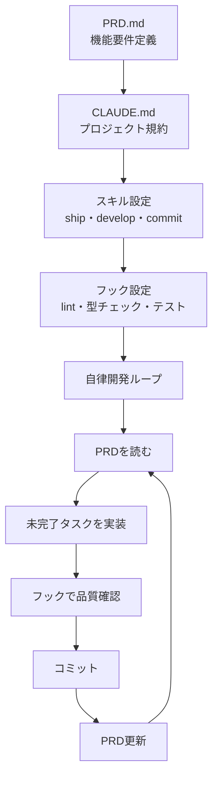

## 概要

このコースで学んだ生成AIプラットフォーム自体を、ハーネスエンジニアリングで自律的に開発したケーススタディを学びます。CLAUDE.md・スキル・フック・PRD駆動開発が実際にどう機能するかを具体的に振り返ります。

## 本文

### プロジェクト概要

このAI学習プラットフォームは、ハーネスエンジニアリングを使って自律的に開発されました。



### CLAUDE.mdの実際の設定

```markdown
# CLAUDE.md（実際のファイル）

This file provides guidance to Claude Code (claude.ai/code).

## プロジェクト概要

生成AIについてユーザーが学習するためのWebアプリケーション。

## 技術スタック

- **Next.js 15** (App Router) + TypeScript
- **Tailwind CSS v4**（tailwind.config.js不要）
- **Turbopack**（開発サーバー高速化）

## コマンド

```bash
npm run dev     # 開発サーバー起動
npm run build   # プロダクションビルド
npm run lint    # ESLintチェック
npx tsc --noEmit # 型チェック
```

## ディレクトリ構成

```
src/
  app/              # ページ・レイアウト
  components/
    ui/             # 汎用コンポーネント
    layout/         # ヘッダー・ナビゲーション
    features/       # 機能固有コンポーネント
  lib/              # 型定義・定数・ユーティリティ
docs/specs/         # 機能仕様書
```

## App Router規約

- Server Componentsがデフォルト
- インタラクション必要時のみ "use client"
```

### 自律開発で発見した効果的なパターン

**パターン1: 仕様書先行**

```markdown
# 効果的なワークフロー

1. docs/specs/ に仕様書を書く
2. スキルが仕様書を読んで実装する
3. 実装と仕様が整合していることを確認

## 仕様書のフォーマット例（chapter-page.md）

### 概要
チャプター一覧を表示するページ

### URL
/chapters

### 表示内容
- チャプターカード（タイトル・説明・進捗）
- 完了したレッスン数 / 総レッスン数

### データ
`lib/data/chapters.ts` からインポート

### コンポーネント
- `ChapterCard` - 各チャプターのカード
- `ProgressBar` - 進捗バー
```

**パターン2: フォールバックを持つスキル設計**

```markdown
# 実際のdevelopスキルから抜粋

## エラー時の対応（重要）

ビルドエラー・型エラーが発生した場合:
1. エラーメッセージを完全に読む
2. 最もシンプルな修正を試みる
3. 3回試行しても解決しない場合:
   - 現在の状態を正直にユーザーに報告する
   - どこで詰まっているかを具体的に説明する
   - ユーザーのアドバイスを待つ
   - 絶対に問題を隠したり完了したと嘘をつかない
```

### 実際に機能した品質ゲート

```python
# 自律開発で最も効果があったチェック

QUALITY_GATES = {
    "pre_commit": [
        {
            "name": "TypeScript型チェック",
            "command": "npx tsc --noEmit",
            "impact": "型エラーを含むコミットを0件に削減",
        },
        {
            "name": "ESLint",
            "command": "npm run lint",
            "impact": "コードスタイルの一貫性を保持",
        },
    ],
    "post_edit": [
        {
            "name": "ビルド確認",
            "command": "npm run build",
            "impact": "ビルドエラーをコミット前に発見",
        },
    ],
}

print("=== 最も効果的な品質ゲート ===")
for phase, gates in QUALITY_GATES.items():
    print(f"\n{phase}:")
    for gate in gates:
        print(f"  {gate['name']}")
        print(f"    コマンド: {gate['command']}")
        print(f"    効果: {gate['impact']}")
```

### 学んだ教訓

**うまくいったこと:**

1. **CLAUDE.mdの禁止事項** - `console.log`を残さない・`any`型を使わないを明記することで、AIが規約から外れるケースが大幅に減少した

2. **スキルのエラー対応定義** - 「3回失敗したらユーザーに正直に報告する」の定義で、AIが無限ループすることなく適切に助けを求めるようになった

3. **PRDのチェックボックス管理** - AIが実装完了後に自動更新することで、進捗が常に最新状態になった

**改善が必要だったこと:**

1. **最初のスキルが大きすぎた** - developスキルに設計・実装・テスト・コミットを詰め込みすぎた。分割することで信頼性が向上した

2. **フックが厳しすぎた** - 全エラーをabortにすると細かいlintエラーで作業が止まりすぎた。warnとabortの適切な使い分けが重要

3. **コンテキスト管理が後手に** - 長時間の自律開発でコンテキスト長が問題になった。最初からチェックポイント設計が必要

### ハーネスエンジニアリングの成熟度モデル

```
レベル1: 基本（入門）
  - CLAUDE.mdでプロジェクト概要・コマンドを定義
  - 基本的なスキル（commit・develop）を用意

レベル2: 品質保証（中級）
  - フックでlint・型チェック・テストを自動化
  - スキルにエラー対応を定義

レベル3: 自律開発（上級）
  - PRD駆動開発（チェックボックス自動更新）
  - 並列サブエージェントの活用
  - チェックポイントによる長時間実行

レベル4: 最適化（エキスパート）
  - カスタムMCPサーバーの作成
  - コスト・レイテンシの継続的な最適化
  - セルフモニタリングエージェント
```

## ハンズオン

自分のプロジェクトのハーネス設計を評価してみましょう。

### ステップ1：ハーネス成熟度の自己評価

```python
from dataclasses import dataclass

@dataclass
class HarnessEvaluation:
    item: str
    level: int  # 1-4
    has_it: bool
    notes: str

def evaluate_harness(project_config: dict) -> dict:
    """プロジェクトのハーネス成熟度を評価"""

    evaluations = [
        HarnessEvaluation(
            "CLAUDE.md（プロジェクト概要・コマンド）",
            1,
            project_config.get("has_claude_md", False),
            "最も基本的な設定"
        ),
        HarnessEvaluation(
            "commitスキル",
            1,
            project_config.get("has_commit_skill", False),
            "自律コミットの基礎"
        ),
        HarnessEvaluation(
            "pre-commitフック（lint・型チェック）",
            2,
            project_config.get("has_pre_commit_hook", False),
            "品質ゲートの基本"
        ),
        HarnessEvaluation(
            "PRD.mdのチェックボックス管理",
            3,
            project_config.get("has_prd_driven", False),
            "自律開発の核心"
        ),
        HarnessEvaluation(
            "並列サブエージェント",
            3,
            project_config.get("has_parallel_agents", False),
            "速度向上"
        ),
        HarnessEvaluation(
            "カスタムMCPサーバー",
            4,
            project_config.get("has_custom_mcp", False),
            "能力拡張"
        ),
    ]

    by_level = {}
    for eval_item in evaluations:
        level = eval_item.level
        if level not in by_level:
            by_level[level] = {"total": 0, "done": 0}
        by_level[level]["total"] += 1
        if eval_item.has_it:
            by_level[level]["done"] += 1

    # 現在のレベルを計算
    current_level = 0
    for level in sorted(by_level.keys()):
        counts = by_level[level]
        if counts["done"] >= counts["total"] * 0.7:  # 70%以上達成でレベルアップ
            current_level = level

    return {
        "current_level": current_level,
        "evaluations": evaluations,
        "by_level": by_level,
        "next_steps": [
            e.item for e in evaluations
            if not e.has_it and e.level == current_level + 1
        ][:3],
    }


# サンプル評価
my_project = {
    "has_claude_md": True,
    "has_commit_skill": True,
    "has_pre_commit_hook": True,
    "has_prd_driven": False,
    "has_parallel_agents": False,
    "has_custom_mcp": False,
}

result = evaluate_harness(my_project)
print(f"現在のハーネス成熟度: レベル{result['current_level']}")
print("\n次のステップ:")
for step in result['next_steps']:
    print(f"  → {step}")
```

## クイズ

<!-- QUIZ:START -->
**Q1. このコースで学んだハーネスエンジニアリングの最も重要な価値はどれですか？**

- A) AIのAPIコストを削減する
- B) AIが自律的に高品質な作業を完結できる環境を整備し、人間が繰り返しの監視・指示から解放されてより創造的な作業に集中できる
- C) コードを自動的に最適化する
- D) テストを不要にする

**正解: B**
**解説:** ハーネスエンジニアリングの本質は「AIが一人でできることを増やす」ことです。CLAUDE.md・スキル・フック・MCPを整備することで、AIが「設計→実装→テスト→コミット→PRD更新」を自律的に品質保証しながら完結できます。人間はより高レベルの判断・設計・検証に集中できます。

**Q2. 「スキルにエラー対応を明示的に定義する」ことの最大の効果はどれですか？**

- A) エラーがなくなる
- B) AIが解決できない問題で無限ループする代わりに、適切なタイミングで「何で詰まっているか」を正直に報告して人間の支援を求めるようになる
- C) デバッグが容易になる
- D) APIコストが削減される

**正解: B**
**解説:** エラー対応なしのAIは「とにかく続けよう」とするか、問題を隠したりします。「3回試行して失敗した場合はユーザーに正直に報告する」の定義で、AIが「限界を認識してヘルプを求める」という健全な行動パターンを示します。これがAIと人間の適切な協働を実現します。

**Q3. ハーネスエンジニアリングの成熟度をレベル1から段階的に上げていく理由はどれですか？**

- A) 技術的な制約があるため
- B) 各レベルの設定が安定して機能することを確認してから次の複雑な機能を追加することで、問題が発生した際に原因を特定しやすくするため
- C) コストを段階的に増やすため
- D) チームへの説明を簡単にするため

**正解: B**
**解説:** 最初からすべての設定（カスタムMCP・並列エージェント・チェックポイント）を一度に追加すると、問題が発生した際にどの設定が原因か分かりません。レベル1（基本設定）が安定したらレベル2（フック）を追加し、安定したらレベル3と段階的に追加することで、各追加の効果と問題を明確に把握できます。
<!-- QUIZ:END -->

## まとめ

- CLAUDE.md・スキル・フック・PRD駆動開発の4つを組み合わせて自律開発環境を構築した
- 最も効果的だったのは「禁止事項の明記」と「エラー対応の定義」
- スキルは小さく分割し、フックはwarn/abortを適切に使い分ける
- 成熟度レベル1から段階的に設定を追加して、各段階で動作を確認することが重要

## コースを修了して

このコースでは、生成AIの基礎からプロンプトエンジニアリング・RAG・エージェント・セキュリティ・評価・アーキテクチャ・ハーネスエンジニアリングまで体系的に学びました。AIを「使う」から「AIと協働して開発する」レベルへの移行を目指して、ぜひ実践で活かしてください。
